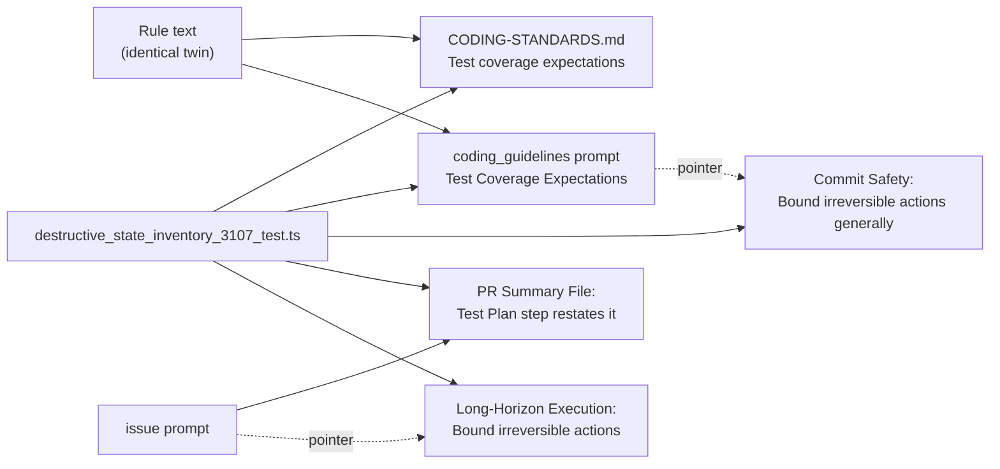

## Summary

Adds the rule **Code that deletes or replaces state proves everything it
destroys is safe to lose**. Fleet PRs (GRQ#5153, GRQ#5152) wrote clone swaps
and `rm -rf`s that checked only that the current branch matched origin. They
then destroyed other local branches with unpushed commits, the stash and the
reflogs. The rule sits beside the #3087 rule in `CODING-STANDARDS.md` and in
the coding-guidelines prompt, with identical text on both. Both **Bound
irreversible actions** bullets now point to it, to separate code the agent
writes from commands it runs. The issue prompt's Test Plan step restates it,
and a documentation-drift test pins it. Closes #3107. Two of the issue's
"How to verify" items are about future fleet PRs, so this diff alone cannot
show them; they are recorded as `partial` below.

## Spec

### Intent and Rationale

- The existing rules covered the agent's own destructive commands and guards on a sibling path to the same outcome. Neither covered destructive code with no sibling path yet (GRQ#5153's first promisor path).
- The rule sits beside #3087 under Test Coverage Expectations because it also ends in a refusal test per guarded item. "Bound irreversible actions" points to it rather than holding a second copy.

### Essential Design Decisions

- The paragraph is identical on `CODING-STANDARDS.md` and `prompts/coding_guidelines/prompt.md`. The new test asserts that they are equal, matching the twin pattern from #3087.
- The issue prompt's Test Plan item keeps its "no trailing period" list style. Its "Bound irreversible actions" bullet keeps "Bypassing the pre-commit gate is" on one line because `no_verify_ban_test.ts` pins that raw string.

### Undiscoverable Facts

- The GRQ examples, `_grq_shallow_history_reclone_unfiltered` and `feed_repo_compaction.sh`, live in `stSoftwareAU/GRQ`, not in this repository. They are cited as the issue reports them.

## Evidence

Prompt and documentation change only: no runtime code and no UI. The new
drift test verifies the change, and the full `./quality.sh` passed on the head
(config integration SKIPPED, as on every local run).

**Docs sweep** — grep: `Bound irreversible`, `rm -rf`, `git reset --hard`, `git clean`, `destructive`, `irreversible`, `keeps that outcome's guards`; section: `docs/workflows/issue-processing.md` (the #3087 entry and its siblings); updated: `docs/workflows/issue-processing.md`, `CODING-STANDARDS.md`, `prompts/coding_guidelines/prompt.md`, `prompts/issue/prompt.md`

**Related existing rules checked**: the issue prompt and pr_feedback
**Bound irreversible actions** bullets, the coding-guidelines **Bound
irreversible actions generally** bullet, the merge_conflict ban on
`git reset --hard`, ci_fix's ban on destructive history rewrites, the
spelling_fix reversibility line, **A new path to an existing outcome keeps
that outcome's guards** (#3087) and **A negative test must be able to fail**.
All of them govern commands the agent runs or guards on a sibling path, so
none conflicts with a rule on destructive code the agent writes. The two
bullets the issue names now point to the new rule.

## Acceptance Criteria

<!-- vibe-spec-review inputs="diff+issue-body" -->

- **met** — `CODING-STANDARDS.md` carries the rule next to the #3087 rule — evidence: `worker/deno/tests/destructive_state_inventory_3107_test.ts::both surfaces carry the destructive-state rule (Issue #3107)` — reviewer: met
- **met** — the coding-guidelines prompt extends **Bound irreversible actions generally** with a sibling rule for code the agent writes — evidence: `worker/deno/tests/destructive_state_inventory_3107_test.ts::Bound irreversible actions points at the destructive-state rule (Issue #3107)` — reviewer: met
- **met** — the issue prompt's self-review list restates the rule, as it does the #3087 rule — evidence: `worker/deno/tests/destructive_state_inventory_3107_test.ts::issue prompt Test Plan step restates the destructive-state rule (Issue #3107)` — reviewer: met
- **met** — a test in `worker/deno/tests/` pins the rule's key phrases on both surfaces — evidence: `worker/deno/tests/destructive_state_inventory_3107_test.ts` — reviewer: met
- **partial** — new PRs that add a re-clone, swap or `rm -rf` path include the inventory and a refusal test per guarded item — evidence: `prompts/issue/prompt.md` (PR Summary File, Test Plan step) — reviewer: partial — reason: this diff puts the requirement in place; whether later PRs follow it can only be seen on those PRs
- **partial** — blocking findings of this kind stop recurring in `review-fleet-prs`' `log.jsonl` — evidence: `CODING-STANDARDS.md`, `prompts/coding_guidelines/prompt.md` — reviewer: partial — reason: the reviewer called this "N/A to this diff", a future-outcome criterion that only later fleet reviews can show
- **unrequested** — a paragraph for #3107 in `docs/workflows/issue-processing.md` — reviewer: unrequested — reason: the reviewer called it "traceable-by-convention"; the file has the same entry for #3087 and #3093, and the docs-change rule requires it
- **unrequested** — a pointer to the rule in the issue prompt's Long-Horizon **Bound irreversible actions** bullet — reviewer: unrequested — reason: the issue names this bullet as covering only commands run; the pointer makes that distinction visible where the bullet appears

## Standards Review

<!-- vibe-standards-review inputs="diff+CODING-STANDARDS.md" -->

- **clean** — Australian English; documentation-drift test conditions 1–4 (section-scoped through `section()`, pins prose no module holds, no retyped code values, and pinned phrases absent from the base sections); no hidden paths staged; no workflow or stub changes; rule placed under Test coverage expectations. Optional, not chased: the rule's text is restated across surfaces, the repository's existing twin pattern

## Test Plan

- Added `worker/deno/tests/destructive_state_inventory_3107_test.ts` (4 tests): identical rule paragraph with key phrases on both surfaces; the Commit Safety pointer; the issue prompt's Test Plan restatement; the issue prompt's Long-Horizon pointer. Red check: each of the four added texts was removed in turn and the matching test went red, then the text was restored.
- No existing test was edited. `no_verify_ban_test.ts` (#783) went red on a first rewrap that split "Bypassing the pre-commit gate is" across two lines. The bullet was rewrapped to keep the phrase whole, and that test passes.
- Ran `deno task test:unit` on the new test plus the related prompt-drift suites (3087, 3069, 3060, 3067, 3093, 3082, 3021, 2924, 2574, twin drift, kept-assertions, issue-prompt spec section, no-verify ban): all pass. Full `./quality.sh`: PASSED.

🤖 Generated with [Claude Code](https://claude.com/claude-code)
