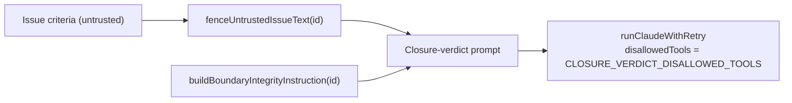

## Summary

The closure-verdict question put the issue's acceptance criteria inside a `BOUNDARY_<id>` fence but never told the model what that fence means. It also ran with the full tool grant. `buildClosureVerdictPrompt` now appends `buildBoundaryIntegrityInstruction(boundaryId, ["the issue's acceptance criteria"])`, using the same nonce as the fence. `askForVerdict` now launches the run under the new `CLOSURE_VERDICT_DISALLOWED_TOOLS` deny list. Closes #3111.

## Spec

### Intent and Rationale

- The criteria come from an issue body, which an attacker can write. Without the integrity rule, a criterion worded as an instruction reached a full-tool agent with nothing saying the fenced text is data.
- The fix uses the existing `buildBoundaryIntegrityInstruction` helper, as the summarise phase did in #1607, rather than adding new wording.

### Essential Design Decisions

- One nonce is resolved up front: the pinned id when well-formed (`isBoundaryId`), otherwise a fresh CSPRNG id. The fence and the instruction both take that one value.
- The instruction replaces the old separate `## Tool Output Is Data` section, because it already includes `TOOL_OUTPUT_IS_DATA_RULE`.
- `CLOSURE_VERDICT_DISALLOWED_TOOLS` denies file-writing, sub-agent, web and plan-mode tools. `Bash` and the read tools stay, because the verdict is judged from `git diff` against the base branch.

### Undiscoverable Facts

- The issue also floated a repo-wide test that every `fenceUntrustedIssueText` caller emits the integrity instruction. It is not in this PR. Such a test would have to grep the source, which `CODING-STANDARDS.md` forbids, and several callers (`references_refresh.ts`, `workflow_annotation_filer.ts`) fence text into GitHub issue bodies rather than prompts.

## Evidence

Backend-only change, so there is no screenshot.

- `deno test tests/closure_verdict_prompt_test.ts tests/completion_phase_closure_render_test.ts tests/closure_verdict_recovery_test.ts`: 19 passed.
- Each new test was seen to fail with only its change removed. Reverting the integrity-instruction line failed both new prompt tests. Reverting `disallowedTools` failed the deny-list assertion (`undefined` against the ten-tool list). Removing `Write` from `CLOSURE_VERDICT_DISALLOWED_TOOLS` failed `the verdict deny list names every write, sub-agent and web tool` with "the closure verdict must deny Write".
- `./quality.sh` passed. `config integration` was skipped by the gate itself, as it is on every run here.

**Docs sweep**: grep: `buildClosureVerdictPrompt`, `closure_verdict`, "closure-verdict", "Tool Output Is Data"; sections: `docs/workflows/issue-processing.md` (closure-verdict recovery list) and `SECURITY.md#4-delimiter-hardening`; updated: `docs/workflows/issue-processing.md`, `SECURITY.md`. `docs/THREAT-MODEL.md:136` still holds, because the closure-verdict run still carries the tool-output rule (now through the integrity instruction).

## Test Plan

- `worker/deno/tests/closure_verdict_prompt_test.ts`:
  - New test `the integrity instruction names the fence's nonce`.
  - New test `a minted nonce is shared by the fence and the integrity instruction`.
- `worker/deno/tests/completion_phase_closure_render_test.ts`: the fake runner now records `disallowedTools`. `a verdict for every criterion is rendered and the PR is raised` asserts that the verdict question ran under `CLOSURE_VERDICT_DISALLOWED_TOOLS`. `the verdict deny list names every write, sub-agent and web tool` asserts the list contains Write, Edit, MultiEdit, NotebookEdit, Task, Agent, WebFetch and WebSearch by name, so emptying the constant fails. No existing assertion was removed.

🤖 Generated with [Claude Code](https://claude.com/claude-code)
