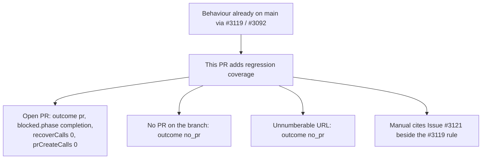

## Summary

Main already names the live PR when the degraded-run guard cannot file its
follow-up. That behaviour landed through #3119 (Issue #3092): `completionBody`
calls `lookupBlockedGatePr` and records `state.prUrl` / `state.prNumber`, and
`completion_phase.ts` is unchanged against main in this pull request. What
this pull request adds is regression coverage for that path, plus two
cross-references in the operator manual. Closes #3121.

## Spec

### Intent and Rationale

- Issue #3121 asked for the outcome to name the branch's open PR when the
  guard's follow-up cannot be filed. Issue #3092 shipped that lookup on main.
  A later edit can still drop the "do not recover, do not create" counts, the
  block's phase, the no-PR case, or the unnumberable-URL case without a test
  that names them. These tests pin those four.

### Essential Design Decisions

- No second implementation. The new tests call the completion path that is
  already on main. They do not add a lookup, a log line, or a flowchart node.
- The harness counts `recoverExistingPr` and `gh pr create`, and derives the
  run outcome the way `workOnIssue` does (`success: false`, phase
  `completion`). An optional `prUrl` overrides the URL
  `findExistingPrForBranch` reports, so the unnumberable case does not need a
  new lookup.
- The manual additions point at that existing rule and cite Issue #3121. They
  do not rename the flowchart. The node still reads "Run fails, no PR raised",
  with the "Branch already has an open PR?" split from #3119.
- The failure log is unchanged. It still reads "failing the run without
  finalising a PR" and carries `error` only.

### Undiscoverable Facts

- None. `git diff origin/main...HEAD` is the summary file, the two manual
  paragraphs, and the test harness plus three tests.

## Evidence

**Docs sweep**: grep: `Issue #3121`, `the outcome names a live`, `never no_pr`;
section: `docs/workflows/issue-processing.md` ("A degraded run never closes an
issue as complete", and "An exception still has to report the PR it blocked");
updated: `docs/workflows/issue-processing.md`. Each section gains a paragraph
that cites Issue #3121 and restates the rule #3119 already documents. The
flowchart node is not renamed.

The open-PR naming itself is already asserted on main by "completion - a
degraded run that passes every summary gate still names an existing PR when
the follow-up cannot be filed (Issue #3092)". This pull request's open-PR test
adds `blocked.phase`, `recoverCalls` and `prCreateCalls`. The no-PR test and
the unnumberable-URL test are the extra cases.

## Test Plan

- `worker/deno/tests/completion_phase_degraded_delivery_test.ts`. The harness
  records `recoverCalls` and `prCreateCalls`, accepts a `prUrl` override, and
  returns `outcome` from `deriveRunOutcome`. Three tests:
  - "completion - a degraded run whose follow-up cannot be filed names the
    branch's open PR (Issue #3121)": `failure`, `outcome.kind` `pr`,
    `prNumber` 777, `blocked.phase` `completion`, `blocked.reason` includes
    "follow-up", `recoverCalls` 0, `prBodies` empty, `prCreateCalls` 0.
  - "completion - a degraded run whose follow-up cannot be filed on a branch
    with no PR raises no PR (Issue #3121)": `failure`, `outcome.kind`
    `no_pr`, `recoverCalls` 0.
  - "completion - a degraded run whose follow-up cannot be filed names no PR
    for an unnumberable PR URL (Issue #3121)": the stub URL ends in
    `pull/not-a-number`; `failure`, `outcome.kind` `no_pr`.
- The Issue #3092 test on main already expects outcome `pr` for the open-PR
  filing failure, so that outcome is not a red-on-base claim for this pull
  request.
- `deno test --filter "Issue #3121"`: 3 passed.

## Changes

| File | Change |
| --- | --- |
| `worker/deno/tests/completion_phase_degraded_delivery_test.ts` | Harness counts and outcome derivation; three Issue #3121 tests |
| `docs/workflows/issue-processing.md` | Two cross-references citing Issue #3121 |
| `docs/archive/pr-summaries/pr-summary-3121.md` | This summary |
