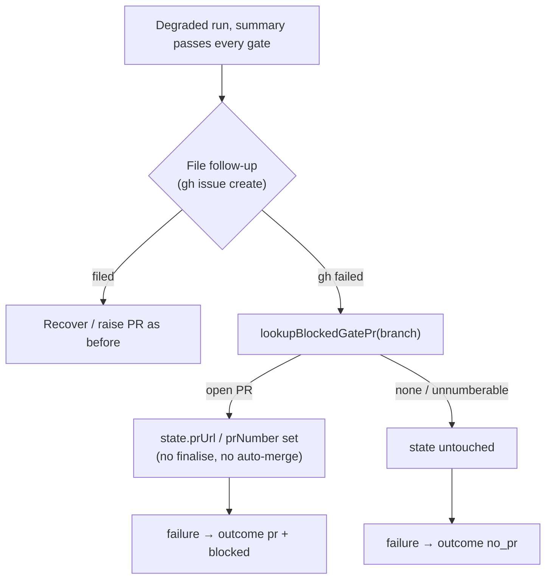

## Summary

When the degraded-run guard (#2562) cannot file the follow-up that records a
degraded run's undelivered scope, it still fails the run. If the run's branch
already has an open PR, the guard now looks that PR up with
`lookupBlockedGatePr` and records it on `state.prUrl` / `state.prNumber`.
Before this change the outcome said `no_pr`; now it is `pr` + `blocked`,
naming that PR. The PR is still neither finalised nor auto-merged. Closes #3121.

## Spec

### Intent and Rationale

- A failing `gh issue create` (for example a 502) in the guard's follow-up
  step used to give `no_pr`, even when the agent had already raised the
  branch's PR. Health reporting then counted "delivered, one block
  outstanding" as "delivered nothing". The changed-workflow gate already
  avoided this (Issue #2044), and this change applies the same rule here.

### Essential Design Decisions

- The guard reuses `lookupBlockedGatePr` instead of a second lookup. An
  unnumberable URL or a failed lookup therefore names no PR, never `#0`.
- The guard only records the PR. It never calls `recoverExistingPr`,
  `gh pr create` or auto-merge, because finalising would close the issue
  with the residue recorded nowhere. That silent loss is what the guard
  exists to prevent.
- The failure reason text is unchanged. The log now says "PR not raised or
  finalised" and carries `prNumber` when a PR is known.

### Undiscoverable Facts

- None. The defect and the fix are both inside `completionBody`.

## Evidence

**Docs sweep**: grep: `no PR raised`, `could not file the follow-up`,
`An exception still has to report the PR it blocked`, `lookupBlockedGatePr`;
section: `docs/workflows/issue-processing.md` (the "A degraded run never closes
an issue as complete" section and the "An exception still has to report the PR
it blocked" section); updated: `docs/workflows/issue-processing.md`. The mermaid
node "Run fails, no PR" is now "Run fails". There is a new bullet in the degraded
section, and a new paragraph in the exception section.

**Guards on the new path (#3087).** The new path reaches a `failure` result
that records a PR. It keeps these guards:

- **The run fails**, so no finalise and no issue close. This is tested by
  `outcome.status === "failure"`.
- **No `recoverExistingPr`**. This is tested by `recoverCalls === 0`, and that
  assertion went red with the call injected.
- **No `gh pr create`**. This is tested by `prCreateCalls === 0`.
- **Unnumberable URLs are refused**, through the shared `lookupBlockedGatePr`.
  This is tested by test (c).

Auto-merge, the follow-up body and the PR-body degraded section are excluded:
they apply only on the "filed" path, which this change does not touch.

**Related existing rules checked**: the changed-workflow gate's
"An exception still has to report the PR it blocked" (Issue #2044), and the
degraded-run guard's "never closes an issue as complete" (#2562). The new
paragraph extends the first rule to the guard, and leaves the second rule's
"no finalise" promise intact.

Full `./quality.sh`: PASSED (config integration SKIPPED, as on every local
run: no `.config.json`).

## Test Plan

- `worker/deno/tests/completion_phase_degraded_delivery_test.ts`: the harness
  now derives the run outcome the way `workOnIssue` does, and counts the calls
  to `recoverExistingPr` and `gh pr create`. Three new tests:
  - (a) A degraded partial run whose summary passes every gate,
    `prExistsForBranch: true`, and a failing `gh issue create`. Expected:
    `failure`, outcome `pr` #777 with `blocked.phase` `completion`, and no
    recover or create calls. **Red on base**: `AssertionError: Values are not
    equal. - no_pr + pr`.
  - (b) The same run with no PR on the branch. Expected: `no_pr`.
  - (c) An unnumberable PR URL. Expected: `no_pr`.
  - (b) and (c) pin the current behaviour, so they are green on base.
- Break checks:
  - Injecting `deps.pr.recoverExistingPr(...)` into the new branch turned (a)
    red ("the PR must not be recovered -1 +0").
  - Deleting the `state.prUrl` assignment turned (a) red (`no_pr`).
  - Both changes were restored afterwards.
- `deno task test:unit` on the degraded-delivery, workflow-gate-PR,
  summary-rule-retry and summary-incomplete suites, plus `docs_sweep_gate_test`,
  `markdown_anchors_test` and `workflow_validator_contract_3021_test`: all
  pass.

🤖 Generated with [Claude Code](https://claude.com/claude-code)
