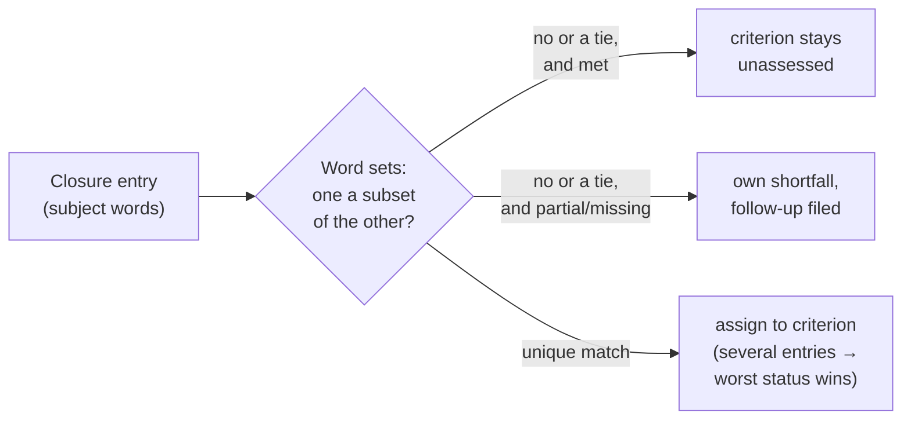

# PR Summary — Issue #3128

## Summary

The degraded-run guard (`assessDegradedDelivery`) read each closure-block
entry's status by **position** (`assessments[index]?.status`). If the closure
block listed criteria in a different order, or split one criterion across two
entries, it attributed statuses to the wrong criteria and could record an
undelivered criterion as delivered. This PR matches entries to criteria by
**content** instead.

Closes #3128

## Spec

- New `worker/deno/lib/closure_criterion_match.ts` exports
  `matchClosureStatuses(criteria, entries)`:
  - Each entry's subject is its text with the leading `**status**` removed,
    cut off before any `Evidence:` / `Reviewer:` / `Reason:` label. The
    subject is reduced to a set of lowercase words.
  - An entry is a candidate for a criterion when either word set contains the
    other. That covers abbreviated entries and entries with extra words.
  - The entry goes to the criterion with the strictly highest Jaccard score.
    A tie leaves the entry unassigned.
  - `unrequested` entries are ignored. An empty-subject `met` entry matches
    nothing. An empty-subject `partial` or `missing` entry is kept in
    `unassignedGaps`, named by its `reason:`.
  - When several entries match one criterion, the worst status wins
    (`missing` > `partial` > `met`).
  - A criterion that no entry matches returns `undefined`, so it stays
    `unassessed`.
  - A `partial` or `missing` entry that matches nothing, or ties, is not
    dropped. `matchClosureEntries` returns it in `unassignedGaps`, and the
    guard records that subject — or its `reason:` when the subject has no
    words — as its own shortfall, so the follow-up is still filed.
- `worker/deno/lib/degraded_delivery.ts` now uses `matchClosureEntries` in
  place of the positional read, and its module doc is updated to match.

## Evidence

- **Red on base:** with the positional read restored, these
  `degraded_delivery_test.ts` tests fail:
  - `assessDegradedDelivery - #3128: closure entries out of order are matched
    by content, not position`. On its own that case was 28 passed, 1 failed,
    with `delivered` holding the docs and floor criteria instead of router
    and docs.
  - `assessDegradedDelivery - #3128: a criterion split across a met and a
    missing entry reads missing`.
  - `degradedNeedsFollowUp - a reworded in-order missing entry still files a
    follow-up (Issue #3128)`.
  - `degradedNeedsFollowUp - a missing entry with no subject still files a
    follow-up (Issue #3128)`.
- **Green:** `deno task test:unit tests/degraded_delivery_test.ts
  tests/closure_criterion_match_test.ts` passes.
- **Gate:** `./quality.sh < /dev/null` returned `Result: PASSED (with skipped
  checks)`. The only skip was config integration (no `.config.json` in the
  worktree). All of these passed: deno tests, lint, fmt, type check,
  completeness checks, markdownlint, semgrep and mermaid.
- **Sweep coverage:** the new module is registered as a `claimed` slice,
  `top-up-3128`, in `docs/audits/lib-sweep-coverage.json`, following the
  `top-up-2998` and `top-up-2999` precedent.
- **Docs sweep:** I grepped for `assessDegradedDelivery`, `closure block` and
  `unassessed` and updated four places:
  - `docs/workflows/issue-processing.md`: the degraded-run "Delivered" bullet
    now describes word matching, `unassessed` for unmatched or ambiguous
    entries, and worst-status-wins for a split criterion.
  - `prompts/issue/prompt.md`: the closure-block guidance now says to write
    each criterion in the issue's own words.
  - The module doc in `degraded_delivery.ts`.
  - `docs/audits/security-sweep-2562-degraded-delivery.md`: the PR-summary
    trust row now says an unmatched or subjectless `partial`/`missing` gap's
    subject or `reason:` text is copied into the follow-up and the PR body
    after `neutraliseAgentMarkers`.
- **Related rules checked:** two existing rules in `prompts/issue/prompt.md`
  cover this:
  - "Every stated criterion gets an entry".
  - The closure-block shape ("one entry per stated criterion").

  Neither conflicts with this change. The new sentence extends them by asking
  for the issue's own wording, because matching is now by words.

## Test Plan

- `worker/deno/tests/degraded_delivery_test.ts`:
  - `assessDegradedDelivery - #3128: closure entries out of order are matched
    by content, not position` — the required test. It also checks that the
    follow-up body names the criterion that is actually missing, and leaves
    it out of "Already delivered".
  - `#3128: a criterion split across a met and a missing entry reads missing`.
  - `degradedNeedsFollowUp - a reworded in-order missing entry still files a
    follow-up (Issue #3128)` — an in-order `missing` entry that paraphrases
    its criterion still makes `degradedNeedsFollowUp` true, and the follow-up
    names that subject.
  - `degradedNeedsFollowUp - a missing entry with no subject still files a
    follow-up (Issue #3128)` — `**missing** — reviewer: missing — reason: …`
    has no subject words and is still a shortfall, named by that reason.
- `worker/deno/tests/closure_criterion_match_test.ts` (12 tests):
  - Matching: out of order; abbreviated subset; superset with extra words.
  - Rejection: no match and an ambiguous tie both leave the criterion
    unassessed. The tie case there is a `met` entry.
  - Split criteria: met plus missing reads `missing`; met plus partial reads
    `partial`.
  - Ignored entries: `unrequested` entries, and a `met` entry with an empty
    subject.
  - `matchClosureEntries - an empty-subject partial or missing entry is a gap
    named by its reason` — each lands in `unassignedGaps`, with `subject`
    equal to the `reason:` text.
  - `matchClosureEntries - a missing entry tied between two criteria is kept
    as a gap` — `ship the update` against `Ship the router update.` /
    `Ship the docs update.` leaves both statuses undefined and is returned
    in `unassignedGaps`.
  - Markdown, punctuation and case do not affect matching.
