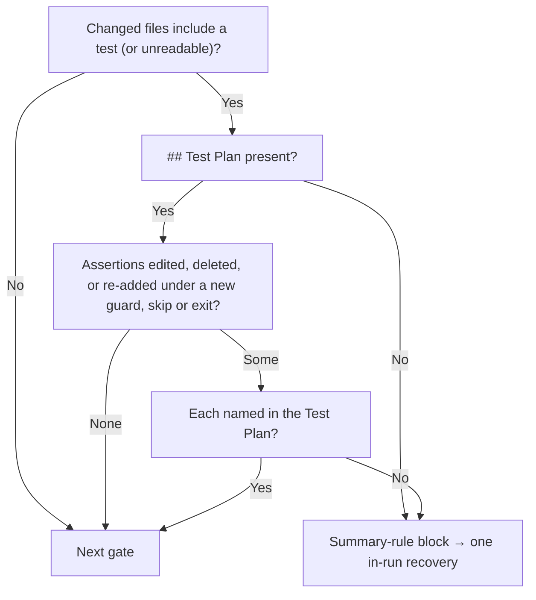

## Summary

The #3061 rule (list every assertion the diff removes from an existing test in
the PR summary's Test Plan, with the issue requirement that makes it untrue) was
prose only. The PR summary for GRQ-AutoTrader#2370 had no `## Test Plan`, and its
rewrite dropped a still-true per-day `BBB` check. That change then reached
milestone PR #2376. This PR adds a deterministic gate for the rule and asks the
Standards reviewer to check it explicitly. Closes #3131.

- New `worker/deno/lib/removed_assertion_gate.ts`. When the branch's changed
  files include a test file, or the list cannot be read (fail closed), the summary
  must carry a `## Test Plan`. Every assertion statement removed from a test file
  must also be named in that Test Plan, unless it moved: the new side of the
  diff holds a copy with the same text (whitespace ignored, so a re-wrap or
  re-indent counts) and the same guards, skips and early exits around it.
  The patch is read with whole-file context, so an edit to any line of a
  multi-line assertion is seen, and a copy re-added under a new `if`, loop or
  callback, into a skipped test or after a new `return` is a removal. So is an
  unchanged assertion in an `else`/`elif` branch whose leading `if` changed.
- `phases/completion_phase.ts` runs it as a summary-rule gate. It is computed
  early and folded into the closure, independent-review and reproduction gate
  notices. Its standalone block runs between the docs-sweep and
  result-placeholder blocks. It uses the existing single in-run recovery
  (`reportSummaryRuleBlock`). The fold logic is now one ordered list
  (`lateSummaryVerdicts`) rather than per-gate copies.
- `prompts/issue/prompt.md` changes:
  - The Standards reviewer brief now asks it to list every removed assertion and
    return a `violation` for any that no issue requirement makes untrue.
  - Instructions step 2 and the Test Plan item say the worker checks the rule.
  - The Test Plan item also says to copy each removed assertion as it appears in
    the diff.

## Spec

### Intent and Rationale

- The issue asked for enforcement, not new wording. The gate makes "no Test Plan" and "removed assertion not listed" block the PR mechanically.
- Matching on the removed statement's text (whitespace-stripped) is deterministic and needs no LLM. Whether the stated requirement really makes the assertion untrue is a judgement, so it stays with the Standards reviewer.

### Essential Design Decisions

- The patch is read with `--unified=4000000`, so each test file is one hunk holding its whole old and new side. Every assertion on each side is found whole (brackets tracked until they close, 200-line cap) after comments, string contents and, in C-like files, regex literals are blanked by a small per-language lexer. A `/` opens a one-line regex only where an expression can begin (start of file, after `(` `,` `=` `:` `[` `{` `}` `;`, after any operator including the `>` of `=>`, or after `return`/`typeof` and similar keywords), so a backtick inside `` /[*_`>]/g `` or `` => /`/ `` no longer opens a phantom template literal. A template literal's `${…}` substitutions are lexed as code, with a stack of brace depths that resumes the template at the matching `}`, so a nested template inside a substitution does not close the outer one early.
- An old assertion is kept or moved only if some new side holds a copy with the same whitespace-free text and the same context. Context means every enclosing line that does not just name a test, test group, test function or type (found by indentation and by open `{`), skip markers on the enclosing test, and early exits before it in its function. A helper function that may never be called is context too. A head wrapped over several lines (`deno fmt`'s `if (`…`) {`, black's `if (`…`):`, rustfmt's `if a` / `&& b` / `{`, Allman's `{`, a multi-line `for (` array) is keyed whole, as one logical line, so loosening any line of its condition is a removal. Early exits are counted from the innermost function, but not exits inside a function or closure body (`=> {`, `function`, `|x|`, a method shorthand, a nested `def`) that closed before the assertion. When an enclosing line continues a chain (`else`, `elif`, `} else if`, `except`, `catch`, `finally`, a `case` or match arm), the earlier heads back to the opening `if`/`try`/`match` are context as well, found by brace and by indentation. Copies are counted. A re-wrap, re-indent or unguarded move to another test or file still counts as moved.
- When the gate cannot tell, it reports. That covers an assertion whose brackets never close when the file changes after it, a removed assertion line the lexer entered inside a carried-over string or comment (even when the same text is re-added elsewhere), a branch whose walk back to its chain's head passes 400 lines with no brace linking them, and a wrapped head longer than 200 lines. When either side's lexer reaches the end of a file still inside a string, template, substitution or block comment, it has lost its place: if the file changes at or after the line where that literal opened, every assertion-shaped old line from there on is reported, and no new-side copy from there on can vouch for a move.
- An unreadable test-file patch logs a warning and still enforces the heading rule. An unreadable changed-files list makes the gate apply (fail closed), as the docs-sweep gate does.
- `// SIMPLE-ON-PURPOSE:` the gate checks that each assertion is named, not that the reason given is true.

### Undiscoverable Facts

- Test-file detection reuses `isTestFilePath`, so assertions in Rust inline `#[cfg(test)]` modules under `src/` are not covered. Only test-path files are.
- Editing a guard, a wrapper helper's arguments or signature, or an early exit makes every assertion under or after it a removal, even though its text is unchanged. That is deliberate: the conditions it runs under changed, so the Test Plan must say why. A `return` inside a mock or callback that closed before the assertion is not such an exit.
- Bash `[ … ]` checks and `require.*` (Go testify) are not recognised as assertions.

## Evidence

Backend/CLI change, so no UI. Verified by tests:

- `worker/deno/tests/removed_assertion_gate_test.ts`: 36 tests, passed. They cover:
  - The issue's verification case: removing `assert_eq!(record.score.to_string(), "-0.5")` with no Test Plan entry fails, and passes once an entry names it.
  - The heading rule, and an unknown changed-files list or test diff.
  - Multi-line assertions, and assertions moved or re-wrapped elsewhere in the diff.
  - Exclusions: non-test files, `debug_assert!`, `.expect(`, commented-out asserts, and a `--- comment` content line inside a hunk.
  - Detection of Jest, Python and unittest assertions.
  - Fence sizing in the comment.
- `worker/deno/tests/removed_assertion_gate_context_test.ts`: 68 tests, passed. Each builds a real git repo and reads the patch with the gate's own diff args. They cover:
  - The reviewer's cases, each blocking: Rust `if false { … }` (multi-line), `if rows.len() > 1 { … }`, Python `if False:`, and a Jest `it.skip(`.
  - Further guards and skips: an unindented brace guard, a `.forEach(` callback, `#[ignore]`, `@pytest.mark.skip`, `ignore: true`, an early `return`, a block comment, a helper function that is not a test, and one of two identical copies deleted.
  - Multi-line edits: a Rust `assert!(` whose `.any(` predicate loses `row["symbol"] == "BBB" &&`, and a `deno fmt`-wrapped `assertEquals(` whose expected value changes.
  - Must not fire: an unguarded move to another test or file (including between `#[tokio::test]` and `test_` functions), an unchanged multi-line assertion beside an edit, an assertion in an unchanged guard, a re-wrap with the test renamed, a same-line closure's `return`, and assertion text in a string.
  - A regex literal holding a backtick (`` /[*_`>]/g ``) above the test: a multi-line `if (false) { }` wrap, an inner-line edit of a wrapped `assertEquals(`, and a move into `Deno.test.ignore(` each block. A plain move to another file below the same regex, and a division, do not fire.
  - Chains: a TS `} else {`, a TS `} else if (…) {`, an unindented brace `} else {`, a Python `elif` and a Python `else:` whose leading `if` condition changes, and a Rust match arm whose earlier arm becomes `_`, each block. An edit inside the `if` branch's body does not fire, and a one-line `if … else` still blocks.
  - Fail loud: an unclosed assertion, the raw-line backstop, an assertion line inside a multi-line template literal moved verbatim to another file, and a Python `else:` assertion more than 400 lines below its `if`. A TS `} else {` that far below its `if (…) {` is still linked by brace and does not fire.
  - Wrapped heads, each blocking: a `deno fmt` multi-line `if (` condition loosened, the same head above an `} else {` assertion changed, a rustfmt `if a` / `&& b` / `{` changed, a black `if (`…`):` changed, an Allman `{` head changed, and an id dropped from a multi-line `for (const id of [ … ]) {`. An unchanged wrapped head and a fixture added to a wrapped `def test_…(` signature do not fire.
  - Lexer traps: below the `first_run_script_test.ts:251` nested-template helper and below a `` => /`/ `` helper, a `Deno.test.ignore(` rename, an inserted `return;` and a guard change around an unchanged assertion each block, and a plain move to another file does not fire. A side whose lexer ends inside a string blocks a guard change below that point and ignores a change above it.
  - Closures: a changed `return` in a multi-line mock closure, an object method shorthand or a nested Python `def` above unchanged assertions does not fire. A `return` added in a closed `if` block, or after a closure closes on the same line (`}); return;`), still blocks.
  - Linear growth on deep nesting, a long bracket line, many exits, and a long wrapped head with many template substitutions.
- `worker/deno/tests/completion_phase_removed_assertion_test.ts`: 11 tests, passed. They drive `workOnIssueCompletion` through:
  - A block with no PR raised.
  - In-run recovery that then raises the PR.
  - An already-named assertion.
  - A missing heading.
  - An unreadable patch.
  - A fold into the closure gate's notice and a fold with the docs-sweep gate.
  - An assertion re-added inside a new `if false { }`, which blocks with no PR raised.
- `./quality.sh < /dev/null` was run on the final code and passed. `config integration` was SKIPPED because there is no `.config.json` in the checkout.
- Self-check: `findRemovedAssertions` over this PR's own diff against its merge base with `main`, read with `removedAssertionDiffArgs`, returns `[]`.

**Docs sweep** — grep: `Test Plan`, `removes from`, "summary-rule gate", "five summary gates", `foldInDocsSweep`; section: `docs/workflows/issue-processing.md#-docs-sweep-on-a-code-change` and the sections that list the summary gates; updated:
- `docs/workflows/issue-processing.md`: new section "🧪 Removed test assertions must be accounted for", and every "five summary gates" now reads "six".
- `docs/PROMPTS.md` (issue row).
- `CODING-STANDARDS.md` (TDD step 3).
- `prompts/issue/prompt.md`.

Related existing rules checked: `CODING-STANDARDS.md` TDD step 3, and `prompts/issue/prompt.md` Instructions step 2 plus the PR Summary File Test Plan item, all from #3061. The new wording extends them and contradicts none. The `pr_feedback` and `coding_guidelines` prompts carry no removed-assertion rule.

## Test Plan

- Added `worker/deno/tests/removed_assertion_gate_test.ts` (36 tests), passed.
- A later review: the pathspec is both sides of a rename (`git diff --name-only -z --no-renames`), and a real git test renames a test file, drops `assert_eq!(rows[0].name, "BBB")`, and checks the gate blocks. Only the new path hides that assertion.
- A later review: applicability follows `git diff --name-status -z --find-renames`, not the rename-collapsed `--name-only` list. A test file renamed to `src/moved.rs` that drops an assertion, with no `## Test Plan`, blocks and raises no PR. Both sides are in the pathspec. An unquoted `tests/café_test.rs` stays a test path.
- A later review: an assertion re-added under a guard or skip counted as moved, and a `--unified=0` patch hid an edit to an inner line of a multi-line assertion. Added `worker/deno/tests/removed_assertion_gate_context_test.ts` (28 tests then, 44 now), passed. Red-checks:
  - With the context left out of the comparison key, all 11 guard, skip, exit and helper-function tests and the completion-phase `if false` test went red.
  - With the context lines set to 0, the two multi-line tests, the unclosed-assertion test and 7 guard, skip, exit and comment tests went red.
  - Both changes were restored afterwards.
- Corpus run over the last 60 non-merge commits on this branch (58 touch tests). The old gate reported 82 removed assertions and the new gate 122. Every new-only report sampled was a real removal the old gate missed: an inner-line edit (`repeats: 1` to `3`, an expected `1` to `2`, `skipReason(` to `await skipReason(`), or one of two identical `assertEquals(stall.stalledMs, 12 * HOUR)` copies dropped. No assertion the old gate reported was lost.
- A later review: a backtick inside a regex literal opened a phantom template literal that hid guards, skips and inner-line edits below it, the backstop accepted any verbatim re-add, and an `else`/`elif` assertion was not tied to its `if` condition. Added 16 tests to `worker/deno/tests/removed_assertion_gate_context_test.ts`. Red-checks:
  - Against the previous gate, 11 of them went red: the three regex evasions, the six chain cases, the template-literal backstop case and the 400-line Python `else:` case.
  - With regex lexing alone switched off, the inner-line edit, the `Deno.test.ignore(` move and the plain move to another file went red. The multi-line `if (false)` wrap was still caught by the fail-closed backstop.
  - With the chain walk alone switched off, all six chain tests went red.
  - With the 400-line walk cut no longer reported, the Python `else:` 400-line test went red.
  - All changes were restored afterwards.
- Corpus run (the reviewer's measurement): every single-line assertion in `worker/deno/tests/*_test.ts` was wrapped in `if (false) { }` and the patch fed to `findRemovedAssertions`. In the 62 files holding a regex literal with a backtick, the previous gate missed 149 of 1,995 wrapped assertions and this gate misses 0. In the other 1,750 files, the previous gate missed 34 of 55,248 (in `coding_guidelines_twin_drift_test.ts` and `setup_prerequisite_install_plan_test.ts`, among others) and this gate misses 0.
- Corpus run over the last 70 first-parent commits on `main`: the previous gate and this gate both report 202 removed assertions, so the regex lexing, the chain heads and the fail-closed backstop add no reports there.
- A later review: a wrapped guard, loop or chain head keyed only its last line, a `${…}` substitution holding a nested template (`first_run_script_test.ts:251`) or a `` => /`/ `` regex hid the rest of a file, and a `return` inside a closed mock closure marked later untouched assertions removed. Added 24 tests to `worker/deno/tests/removed_assertion_gate_context_test.ts`. Red-checks:
  - Against the previous gate (865c205), 18 of them went red: the six wrapped-head cases, the six lexer-trap evasions, both lexer-trap moves, the unterminated-lexer case and the three closure cases. The other six (an unchanged wrapped head, the wrapped `def test_…(` signature, a change above an unterminated literal, the closed-`if` and `}); return;` exits, and the growth test) guard against overreach and pass on both.
  - With logical lines switched off, the six wrapped-head tests went red. With closure tracking off, the three closure tests went red. With `${…}` lexing off, the nested-template move went red (the three evasions were still caught by the end-of-file fail-closed rule). With `>`/`<` removed from the regex preceders, the `` => /`/ `` move went red. With the end-of-file rule off, the unterminated-lexer test went red. All changes were restored afterwards.
- Corpus run (the reviewer's lexer case): each top-level `Deno.test(` in `worker/deno/tests/*_test.ts` holding an assertion was renamed to `Deno.test.ignore(`, one per patch. The previous gate missed 12 of 25,614, all in `first_run_script_test.ts` below line 251; this gate misses 0. The `if (false) { }` wrap run still misses 0 of 57,258 with both gates.
- False positives: on 09d3f3d7, 26abc590, a2e532d8 and 24b4b906 the previous gate reported 11 assertions, none with a removed line; this gate reports 1, a genuine edit of an `assertStringIncludes(` expected value in 24b4b906. Over the last 200 test-touching non-merge commits on `main` the count drops from 1,248 to 1,226; over the last 70 first-parent commits from 243 to 242. The few new reports are by design: strings dropped from a `for (const required of [ … ])` list (9064762c) and a helper whose wrapped signature changed (82a54885, 38eb484e).
- `removedAssertionDiffArgs` expectations in `worker/deno/tests/removed_assertion_gate_test.ts` changed from `--unified=0` to the context constant. That file is new in this PR, so no assertion on `main` is removed. The completion-phase harness now matches the patch read by `--diff-filter=AMRD` alone.
- Added `worker/deno/tests/completion_phase_removed_assertion_test.ts` (11 tests), passed. Red-checks:
  - With the standalone gate block disabled, the block, recovery and missing-heading tests went red.
  - With the removed-assertion verdict dropped from the closure fold, the fold test went red.
  - Both changes were restored afterwards.
- Edited `worker/deno/tests/kept_assertions_3061_docs_test.ts`: added one test for the Standards reviewer sentence. It went red with the sentence removed. No assertion removed.
- Edited fixtures in `worker/deno/tests/completion_phase_head_reconcile_test.ts` and `worker/deno/tests/completion_phase_security_gate_test.ts`. Each summary fixture got a `## Test Plan` section, because their harnesses leave the changed-files list unknown and the new gate fails closed on that. No assertion removed.
- The completion-phase family plus the summary-rule and `workOnIssueCompletion` callers ran 344 tests, passed.
- `./quality.sh < /dev/null` passed.

🤖 Generated with [Claude Code](https://claude.com/claude-code)
