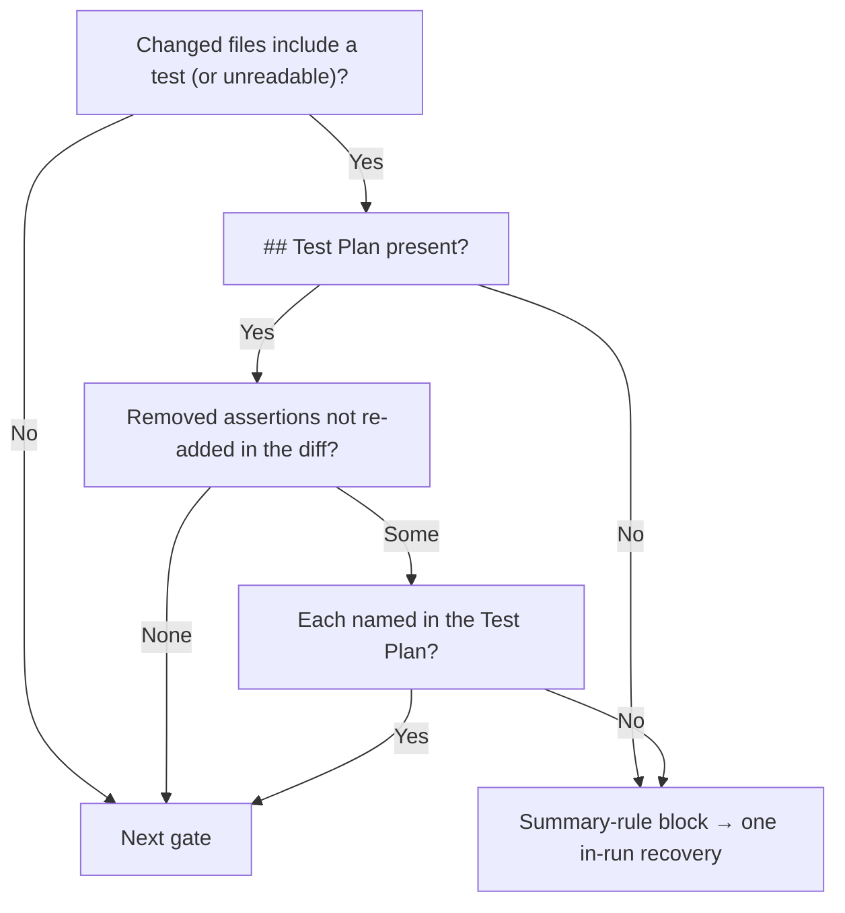

## Summary

The #3061 rule (list every assertion the diff removes from an existing test in
the PR summary's Test Plan, with the issue requirement that makes it untrue) was
prose only. The PR summary for GRQ-AutoTrader#2370 had no `## Test Plan`, and its
rewrite dropped a still-true per-day `BBB` check. That change then reached
milestone PR #2376. This PR adds a deterministic gate for the rule and asks the
Standards reviewer to check it explicitly. Closes #3131.

- New `worker/deno/lib/removed_assertion_gate.ts`. When the branch's changed
  files include a test file, or the list cannot be read (fail closed), the summary
  must carry a `## Test Plan`. Every assertion statement removed from a test file
  must also be named in that Test Plan, unless it is re-added somewhere in the
  same diff. Whitespace is ignored when matching, so a re-wrap or re-indent
  counts as moved.
- `phases/completion_phase.ts` runs it as a summary-rule gate. It is computed
  early and folded into the closure, independent-review and reproduction gate
  notices. Its standalone block runs between the docs-sweep and
  result-placeholder blocks. It uses the existing single in-run recovery
  (`reportSummaryRuleBlock`). The fold logic is now one ordered list
  (`lateSummaryVerdicts`) rather than per-gate copies.
- `prompts/issue/prompt.md` changes:
  - The Standards reviewer brief now asks it to list every removed assertion and
    return a `violation` for any that no issue requirement makes untrue.
  - Instructions step 2 and the Test Plan item say the worker checks the rule.
  - The Test Plan item also says to copy each removed assertion as it appears in
    the diff.

## Spec

### Intent and Rationale

- The issue asked for enforcement, not new wording. The gate makes "no Test Plan" and "removed assertion not listed" block the PR mechanically.
- Matching on the removed statement's text (whitespace-stripped) is deterministic and needs no LLM. Whether the stated requirement really makes the assertion untrue is a judgement, so it stays with the Standards reviewer.

### Essential Design Decisions

- A removed assertion re-added verbatim in any test file of the same diff counts as moved, not removed. This keeps `deno fmt` re-wraps and relocations from creating noise.
- A statement extends over the following removed lines until its parentheses close (12-line cap). Multi-line `assertEquals(` calls are therefore matched whole, not by their opening line alone.
- An unreadable test-file patch logs a warning and still enforces the heading rule. An unreadable changed-files list makes the gate apply (fail closed), as the docs-sweep gate does.
- `// SIMPLE-ON-PURPOSE:` the gate checks that each assertion is named, not that the reason given is true.

### Undiscoverable Facts

- Test-file detection reuses `isTestFilePath`, so assertions in Rust inline `#[cfg(test)]` modules under `src/` are not covered. Only test-path files are.
- Bash `[ … ]` checks and `require.*` (Go testify) are not recognised as assertions.

## Evidence

Backend/CLI change, so no UI. Verified by tests:

- `worker/deno/tests/removed_assertion_gate_test.ts`: 21 tests, passed. They cover:
  - The issue's verification case: removing `assert_eq!(record.score.to_string(), "-0.5")` with no Test Plan entry fails, and passes once an entry names it.
  - The heading rule, and an unknown changed-files list or test diff.
  - Multi-line assertions, and assertions moved or re-wrapped elsewhere in the diff.
  - Exclusions: non-test files, `debug_assert!`, `.expect(`, commented-out asserts, and a `--- comment` content line inside a hunk.
  - Detection of Jest, Python and unittest assertions.
  - Fence sizing in the comment.
- `worker/deno/tests/completion_phase_removed_assertion_test.ts`: 7 tests, passed. They drive `workOnIssueCompletion` through:
  - A block with no PR raised.
  - In-run recovery that then raises the PR.
  - An already-named assertion.
  - A missing heading.
  - An unreadable patch.
  - A fold into the closure gate's notice and a fold with the docs-sweep gate.
- `./quality.sh < /dev/null` was run on the final code and passed. `config integration` was SKIPPED because there is no `.config.json` in the checkout.
- Self-check: `findRemovedAssertions` over this PR's own `git diff origin/main...HEAD` returns `[]`.

**Docs sweep** — grep: `Test Plan`, `removes from`, "summary-rule gate", "five summary gates", `foldInDocsSweep`; section: `docs/workflows/issue-processing.md#-docs-sweep-on-a-code-change` and the sections that list the summary gates; updated:
- `docs/workflows/issue-processing.md`: new section "🧪 Removed test assertions must be accounted for", and every "five summary gates" now reads "six".
- `docs/PROMPTS.md` (issue row).
- `CODING-STANDARDS.md` (TDD step 3).
- `prompts/issue/prompt.md`.

Related existing rules checked: `CODING-STANDARDS.md` TDD step 3, and `prompts/issue/prompt.md` Instructions step 2 plus the PR Summary File Test Plan item, all from #3061. The new wording extends them and contradicts none. The `pr_feedback` and `coding_guidelines` prompts carry no removed-assertion rule.

## Test Plan

- Added `worker/deno/tests/removed_assertion_gate_test.ts` (21 tests), passed.
- A later review: the pathspec is both sides of a rename (`git diff --name-only -z --no-renames`), and a real git test renames a test file, drops `assert_eq!(rows[0].name, "BBB")`, and checks the gate blocks. Only the new path hides that assertion.
- A later review: applicability follows `git diff --name-status -z --find-renames`, not the rename-collapsed `--name-only` list. A test file renamed to `src/moved.rs` that drops an assertion, with no `## Test Plan`, blocks and raises no PR. Both sides are in the pathspec. An unquoted `tests/café_test.rs` stays a test path.
- Added `worker/deno/tests/completion_phase_removed_assertion_test.ts` (7 tests), passed. Red-checks:
  - With the standalone gate block disabled, the block, recovery and missing-heading tests went red.
  - With the removed-assertion verdict dropped from the closure fold, the fold test went red.
  - Both changes were restored afterwards.
- Edited `worker/deno/tests/kept_assertions_3061_docs_test.ts`: added one test for the Standards reviewer sentence. It went red with the sentence removed. No assertion removed.
- Edited fixtures in `worker/deno/tests/completion_phase_head_reconcile_test.ts` and `worker/deno/tests/completion_phase_security_gate_test.ts`. Each summary fixture got a `## Test Plan` section, because their harnesses leave the changed-files list unknown and the new gate fails closed on that. No assertion removed.
- The completion-phase family plus the summary-rule and `workOnIssueCompletion` callers ran 344 tests, passed.
- `./quality.sh < /dev/null` passed.

🤖 Generated with [Claude Code](https://claude.com/claude-code)
