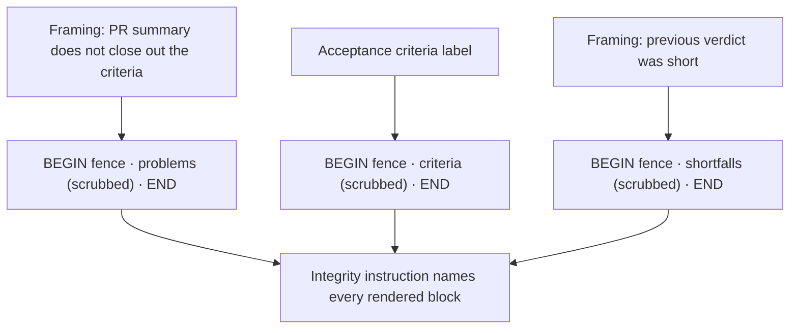

## Summary

`buildClosureVerdictPrompt` wrote the gate's problems and the re-ask's shortfalls as bare `- …` bullets outside the run's untrusted fence. Both quote the issue's own acceptance criteria, so a forged delimiter inside a criterion could reach the model unfenced. Both lists now go through `fenceUntrustedIssueText` with the run's `boundaryId`, which scrubs any forged delimiter. The worker's framing line stays outside each fence. The boundary-integrity instruction now names both blocks, and names the shortfalls block only when there is a re-ask. Closes #3133.

## Spec

### Intent and Rationale

- Every list in this prompt that can carry issue text belongs in the same fence as the criteria (#3111). Leaving the lists that quote that text outside the fence weakened the #3111 fix.

### Essential Design Decisions

- Each list keeps its own label, so the model still sees which block is the gate's problems, which is the criteria and which is the shortfalls.
- `CLOSURE_VERDICT_PROBLEMS_BLOCK` and `CLOSURE_VERDICT_SHORTFALLS_BLOCK` sit beside `CLOSURE_VERDICT_UNTRUSTED_BLOCK`, so the block names live in one place.
- The shortfalls block is named in the integrity instruction only when a re-ask is rendered. The model is never told about a block that is not there.

### Undiscoverable Facts

- None.

## Evidence

Backend-only change, so there is no screenshot.

- `deno test tests/closure_verdict_prompt_test.ts`: 10 passed.
- Red on base: with only `worker/deno/lib/closure_verdict_recovery.ts` restored from `origin/main`, the test file failed with 4 failed and 6 passed. The failures were the three new tests plus the existing forged-delimiter test, which now expects one END marker per fence. All 10 passed once the fix was restored.
- `./quality.sh` passed. `config integration` was skipped by the gate itself, as it is on every run here.

**Docs sweep**: grep: `buildClosureVerdictPrompt`, `closure verdict`, `#3111`, `untrusted fence`; sections: `SECURITY.md` (prompt-boundary bullets), `docs/workflows/issue-processing.md` (closure-verdict recovery), `docs/THREAT-MODEL.md`; updated: `SECURITY.md` and `docs/workflows/issue-processing.md`. `docs/THREAT-MODEL.md` describes the fence at a level this change does not alter.

## Acceptance Criteria

- [x] Problems and shortfalls are rendered inside the run's untrusted fence with the same `boundaryId`.
- [x] The worker's framing lines stay outside the fence.
- [x] Both blocks are named in the `untrustedBlocks` passed to `buildBoundaryIntegrityInstruction`.
- [x] A forged delimiter in a problem and in a shortfall is scrubbed and lies between the run's BEGIN and END markers.

## Standards Review

- An independent spec review judged all four criteria met.
- An independent standards review against `CODING-STANDARDS.md` found no departures.
- Semgrep `detect-non-literal-regexp` flagged the first draft of the test helper. The helper now uses plain string search.

## Test Plan

- `worker/deno/tests/closure_verdict_prompt_test.ts`:
  - `a delimiter forged in a gate problem is scrubbed and fenced`
  - `a delimiter forged in a re-ask shortfall is scrubbed and fenced`
  - `the integrity instruction names the problems and shortfalls blocks`: the shortfalls name must be absent without a re-ask and present with one.
  - The existing `a delimiter forged in the issue body is scrubbed` now expects two END markers, one for the problems fence and one for the criteria fence.

🤖 Generated with [Claude Code](https://claude.com/claude-code)
