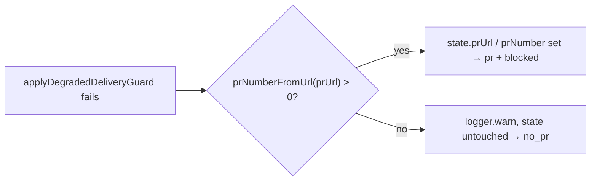

## Summary

In `reportSummaryRuleBlock`, when the degraded-run guard could not file its follow-up, the code named the PR without checking its number. A PR URL with no `/pull/N` was recorded as `prNumber: 0`. `deriveRunOutcome` then returned `pr` and the release comment read `pr:#0:blocked:…`. The branch now names the PR only when `prNumberFromUrl` returns a positive number. Otherwise it logs a warning and leaves `state.prUrl` and `state.prNumber` unset, so the outcome is `no_pr`. This matches `lookupBlockedGatePr`. Closes #3136.

## Spec

### Intent and Rationale

- Naming `#0` is worse than naming no PR. `completionBody`'s own guard path (`lookupBlockedGatePr`, #3121) already refuses an unnumberable URL. Its doc comment already said `reportSummaryRuleBlock` refuses one too, but the guard-failure branch did not.

### Essential Design Decisions

- The run still fails with the guard's own result (the follow-up could not be filed). Only the PR fields on state change. The success path after recovery already fails loud on `prNumber <= 0`, so that path is unchanged.

### Undiscoverable Facts

- None.

## Evidence

Backend-only change, so there is no screenshot.

- `deno test tests/completion_phase_degraded_delivery_test.ts`: 20 passed.
- Red on base: with only the production change reverted (the two unconditional assignments restored), the new test failed at `assertEquals(outcome.outcome.kind, "no_pr")` with actual `pr`. It passed again once the fix was restored.
- `./quality.sh` passed. `config integration` was skipped by the gate itself, as it is on every run here.

**Docs sweep**: grep: `reportSummaryRuleBlock`, "number check", "#0"; sections: `docs/workflows/issue-processing.md` (the degraded-run "gh failed" bullet, and "An exception still has to report the PR it blocked"); updated: `docs/workflows/issue-processing.md`. The doc comment above `lookupBlockedGatePr` already described the new behaviour and is now true.

## Test Plan

- `worker/deno/tests/completion_phase_degraded_delivery_test.ts`: new test `a degraded run blocked by the independent-review gate whose follow-up cannot be filed names no PR for an unnumberable PR URL (Issue #3136)`. The setup is a degraded partial run, the independent-review summary gate blocking, an existing branch PR at `…/pull/not-a-number`, and a failing `gh issue create`. It asserts:
  - status `failure`, with a reason that mentions the follow-up;
  - outcome `no_pr`;
  - no PR URL or number on state;
  - no recovery and no PR body written.
- The existing test `…whose follow-up cannot be filed fails the run without finalising the PR` still pins the numbered case (`pr`, `#777`, blocked).

🤖 Generated with [Claude Code](https://claude.com/claude-code)
