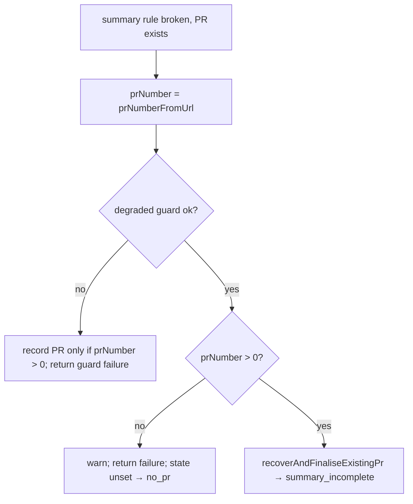

# PR Summary — Issue #3139

## Summary

When a summary rule is broken on a branch that already has a PR, but that PR's
URL cannot be numbered, `reportSummaryRuleBlock` now fails the run **before**
calling `recoverAndFinaliseExistingPr`. The PR body is not rewritten, the PR is
not linked, and `state.prUrl`/`state.prNumber` stay unset, so the run records
`no_pr` instead of `pr:#0:blocked`.

Closes #3139

- [x] Number the PR URL once, straight after the branch lookup
- [x] Refuse an unnumberable URL before recovery (log a warning, return `failure`)
- [x] Extend the regression test to derive the outcome from state and assert `no_pr`
- [x] Docs sweep

## Spec

### Intent and Rationale

Before this change, recovery wrote `state.prNumber = 0` and changed the PR
(body, link, duplicate close). Only after that did the gate notice that the
number was `0` and fail. The run outcome then named `#0`, and the issue's PR
had already been changed for a run that was being reported as failed.

### Essential Design Decisions

- The degraded-run guard still runs **before** the number check. The #3136
  test (`completion_phase_degraded_delivery_test.ts`, "independent-review gate
  … unnumberable PR URL") asserts the guard's `follow-up` failure reason when
  the guard fails. Moving the check ahead of the guard would change that
  reason.
- The number is computed once, and both the guard-failed branch and the new
  check use it. The old check after recovery is gone.

### Undiscoverable Facts

None.

## Evidence

- **Red on base:** with only `completion_phase.ts` restored to `HEAD`, the
  extended test fails at `assertEquals(observed.prUrl, undefined)`. The actual
  value was `"https://github.com/stSoftwareAU/VibeCoder/pull/not-a-number"`,
  set by recovery. It passes with the fix.
- `./quality.sh` passed. The `config integration` check was skipped, as it is
  on every run.
- **Docs sweep:** grepped `reportSummaryRuleBlock`, `unnumberable`, `#0` and
  `summary_incomplete` across `docs/` and `DESIGN-PRINCIPLES.md`. Added one
  paragraph to `docs/workflows/issue-processing.md`. Updated the JSDoc on
  `reportSummaryRuleBlock` and moved the fail-loud comment onto the new check.
  The doc comment on `lookupBlockedGatePr` is accurate again and needed no
  edit.

## Test Plan

- `completion - a summary rule with an unnumberable PR URL fails without
  recovering the PR or naming #0 (Issue #3139)` in
  `worker/deno/tests/completion_phase_summary_incomplete_test.ts`. It was
  renamed and extended, and now asserts:
  - `prUrl` and `prNumber` are unset;
  - `recoverCalls === 0`;
  - `deriveRunOutcome(...)` gives `no_pr`.
- No existing assertions were removed.
- `completion_phase_degraded_delivery_test.ts` and
  `completion_phase_workflow_gate_pr_test.ts` still pass.

🤖 Generated with [Claude Code](https://claude.com/claude-code)
