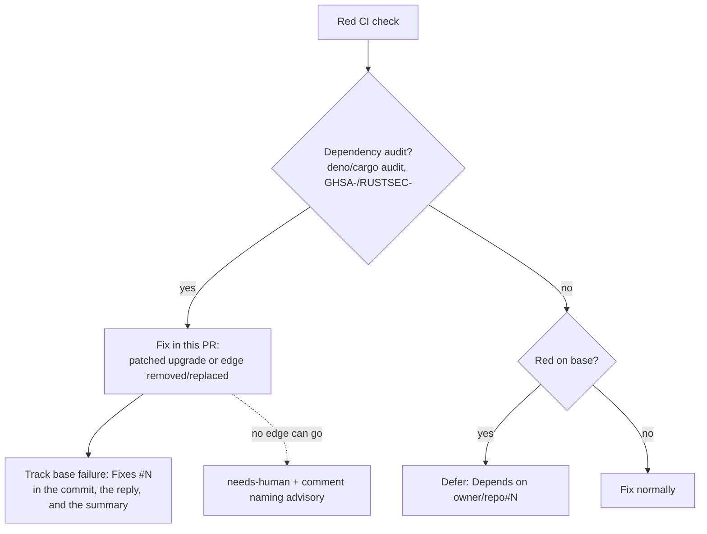

## Summary

Closes #3140

The CI-fix prompt now fixes a red dependency audit in the PR, even when the base branch is red, instead of deferring it with `Depends on`. "Base-branch failures" excludes audits; `prompts/coding_guidelines/prompt.md` and `CODING-STANDARDS.md` carry the matching CI-fix carve-out. A new drift test pins every phrase.

## Spec

<!-- vibe-spec-review inputs="diff+issue-body" -->

### Intent and Rationale

A red audit blocks every PR in the repo until one PR fixes it. If every PR defers with `Depends on`, none of them fixes it. An advisory fix is a dependency change, so it belongs in whichever PR first sees it red.

### Essential Design Decisions

- "Fixed" means a patched upgrade, or removing or replacing the dependency edge that pulls in the vulnerable package (the stSoftwareAU/GRQ#5157 precedent). `--ignore`/allow-list entries and audit workflow or command edits never count.
- `needs-human` is limited to the case where no edge can be upgraded, removed or replaced. It is applied together with a reply that names the advisory ID.
- The tracking-issue search (`--state open`, descriptive labels only) is kept, so the base-branch failure stays visible. `Fixes #N` (same-repo) goes in the fixing commit message, the reply, and the committed PR summary. The sweep reads the pull request body only, and only that form.
- Every other check that is already red on the base branch still defers. The "Base-branch failures" text for those checks is unchanged apart from the new leading exclusion.

### Undiscoverable Facts

- `worker/deno/tests/pr_claims_verified_3058_test.ts` pins "A CI-fix run is the exception", so the carve-out is appended after that phrase rather than rewriting it.
- The test file is named `ci_fix_audit_in_pr_3116_test.ts` because the issue specifies that exact path.

## Evidence

- **Red run against unchanged docs:** run in an `origin/main` worktree with only the new test added, `deno test tests/ci_fix_audit_in_pr_3116_test.ts` gave **7/7 FAILED**. The same test (now 10 cases) passes 10/10 on this branch.
- **Docs sweep:** grepped for "Dependency audit failures", "Base-branch failures", "A CI-fix run is the exception", `RUSTSEC` and `Depends on`. Updated `prompts/ci_fix/prompt.md`, `prompts/coding_guidelines/prompt.md`, `CODING-STANDARDS.md`, `docs/security-advisory-triage.md`, `docs/workflows/ci-fix.md` (section: Base-branch failure) and `docs/PROMPTS.md` (the ci_fix row). All three manuals (`docs/workflows/ci-fix.md`, `docs/PROMPTS.md`, `docs/security-advisory-triage.md`) now link the prompt's Dependency audit failures section and describe the audit exception as the prompt's own instruction to the agent — the worker itself does not yet enforce it, pending stSoftwareAU/VibeCoder#3141.

## Acceptance Criteria

1. "Dependency audit failures" fixes in the PR even when base is red, never `Depends on`: reviewer: met
2. Lists `deno audit`, `cargo audit`, and any `GHSA-`/`RUSTSEC-` advisory check: reviewer: met
3. "Fixed" = patched upgrade, or removed or replaced dependency edge: reviewer: met
4. Rules out `--ignore`/allow-list entries and audit-workflow edits: reviewer: met
5. `needs-human` with advisory-naming comment only when no edge can go: reviewer: met
6. Tracking-issue search-or-file kept; `Fixes #N` is in the commit message, the reply, and the PR summary: reviewer: met
7. "Base-branch failures" excludes audits; other deferral text unchanged: reviewer: met
8. coding_guidelines and CODING-STANDARDS carry the carve-out, scoped to CI-fix runs: reviewer: met
9. "A CI-fix run is the exception" preserved: reviewer: met
10. Drift test fails when a pinned phrase is removed; shown red against unchanged docs: reviewer: met
11. `deno task test` and the quality gate pass: reviewer: met
- `docs/security-advisory-triage.md` paragraph: reviewer: unrequested. reason: the doc already described CI-fix audit handling, so "A Code Change Owes a Docs Change" required updating it in the same change.

## Standards Review

<!-- vibe-standards-review inputs="diff+CODING-STANDARDS.md" -->

No material departures found. Checked: rule consistency across prompts, pairing `needs-human` with a comment, search-before-file, reserved labels, Australian English, drift-test quality, and docs owed. The reviewer's optional suggestion to rename the `3116` test file was declined, because the issue names that path.

## Related existing rules checked

- `prompts/ci_fix/prompt.md` "Base-branch failures" deferral: now excludes audits; text for other checks unchanged.
- "Blocked on another issue → say so; the worker defers" in `prompts/coding_guidelines/prompt.md` and `CODING-STANDARDS.md`: the carve-out is appended after "A CI-fix run is the exception".
- Human Escalation (`needs-human` label plus comment pairing): the new escalation pairs the label with an advisory-naming reply.
- Search-before-file / one follow-up per root cause, and the Escape Hatch rule that follow-ups carry no reserved labels: the tracking step keeps `--state open` and descriptive labels only.
- `docs/security-advisory-triage.md` CI-fix publish-age bypass paragraph: extended to match.

## Test Plan

- [x] `deno task test:unit tests/ci_fix_audit_in_pr_3116_test.ts`: 10 passed. The extra three pin the audit exception in `docs/workflows/ci-fix.md`, `docs/PROMPTS.md` and `docs/security-advisory-triage.md`, and the tracking test now requires the commit message and the summary path.
- [x] Related tests (`pr_claims_verified_3058`, `2574`, `ci_fix_prompt_v4`): 26 passed
- [x] `./quality.sh < /dev/null`: exit 0, PASSED (deno tests, lint, type check, fmt, markdownlint, mermaid, semgrep). The config integration step was skipped with "deno or .config.json not available".
- [x] New test shown red (7/7) against `origin/main` docs

## Pre-PR Security Self-Check

Docs and test change only. No new input handling, shell, SQL, filesystem or HTTP surface; no secrets or hidden files staged; no dependencies added.
