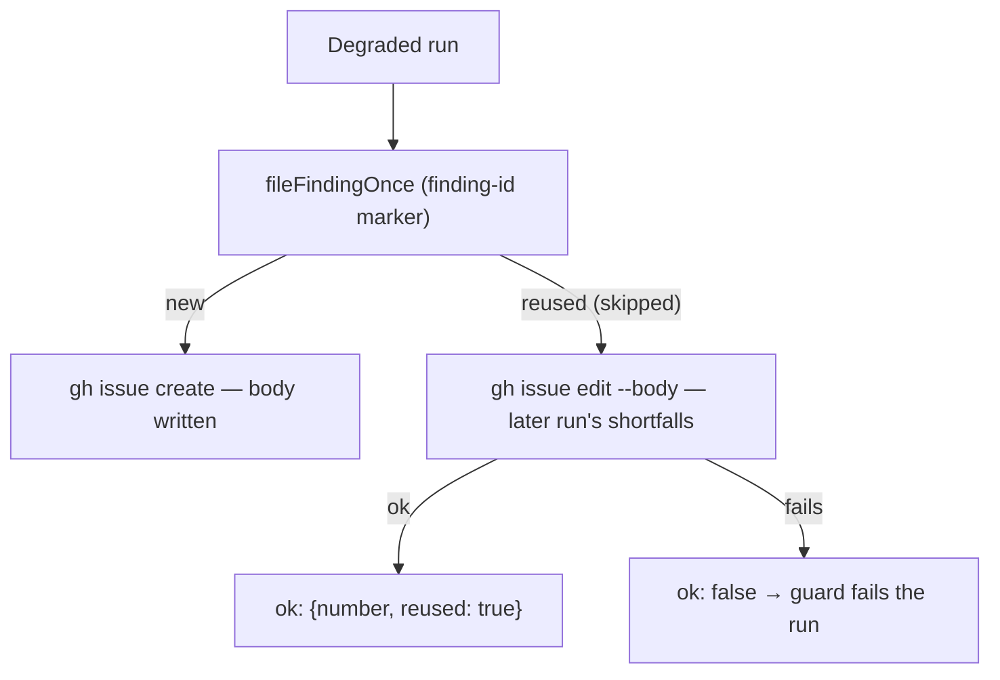

## Summary

Before this change, when a later degraded run reused an open follow-up, `fileDegradedFollowUp` returned that follow-up's number and left its body untouched. The later run's shortfalls were never recorded. A reused follow-up now has its body rewritten with `gh issue edit --body`, using the same `buildDegradedFollowUpIssue` body a fresh filing would get. The finding-id marker stays in the body, so the next run still finds and reuses this issue. If the update fails, `fileDegradedFollowUp` returns an error. `applyDegradedDeliveryGuard` handles that error on its existing `!followUp.ok` path, so the run fails exactly as it does when filing fails. Closes #3145.

## Spec

### Intent and Rationale

- A follow-up is how a degraded run hands its unfinished criteria on to the next run. A reused follow-up that still lists the first run's shortfalls points the next run at the wrong work.
- A failed update must fail loud. Treating a stale follow-up as "reused" would hide the fault behind a green result.

### Essential Design Decisions

- The rewritten body is the complete `buildDegradedFollowUpIssue` body. That gives one source of truth for the format and keeps the finding-id marker and run id.
- The title is left alone. It derives from the parent issue, so it does not change between runs.
- An update failure is returned as `ok: false` rather than thrown. It therefore goes through the guard's existing fail path, and the failure reason now reads "could not be filed or brought up to date".

### Undiscoverable Facts

- `fileFindingOnce` marks a reused match with `skipped: true`. That flag is the only signal that the body was not just written.

## Evidence

This is a backend-only change, so there is no screenshot.

- **Red on base:** the two new tests failed against the unfixed `degraded_delivery.ts` (`FAILED | 33 passed | 2 failed`).
- **Revert check:** with only the new edit block disabled, both tests failed again:
  - `Values are not equal: 0 vs 1` (no edit call was made).
  - `true vs false` (an update failure was reported as success).
- **Green:** `deno test -A tests/degraded_delivery_test.ts tests/completion_phase_degraded_delivery_test.ts` gave `ok | 55 passed | 0 failed`.
- `./quality.sh < /dev/null` gave `Result: PASSED (with skipped checks)`. Only `config integration` was skipped, because there is no `.config.json` in this checkout.

**Docs sweep**: I grepped for `fileDegradedFollowUp`, `degraded`, `follow-up` and `reuse`. I checked `README.md`, `DESIGN-PRINCIPLES.md`, `SECURITY.md`, `docs/THREAT-MODEL.md`, `docs/IDLE-TASK-FRAMEWORK.md` and `docs/workflows/issue-processing.md`. I updated `docs/workflows/issue-processing.md` (the Mermaid node and "The follow-up" bullet) and the module and function JSDoc in `degraded_delivery.ts`. The other "degraded" hits, the `degraded-model` label and the degraded shim, are unrelated.

**Related rules checked:** none in the prompt templates or `CODING-STANDARDS.md` govern follow-up reuse. The only overlapping text was the `issue-processing.md` paragraph, which is now updated.

**Guards:** the new failure outcome takes the existing `!followUp.ok` path in `applyDegradedDeliveryGuard`. It adds no new route to an outcome.

## Test Plan

- `worker/deno/tests/degraded_delivery_test.ts`:
  - `fileDegradedFollowUp - #3145: a reused follow-up is brought up to date with the later run's shortfalls`:
    - There is exactly one `issue edit 70 --repo o/r --body` call, and no create call.
    - The body equals the built body: it keeps the marker and the new run id, and drops the old criterion.
  - `fileDegradedFollowUp - #3145: a reused follow-up that cannot be updated is an error, not a silent pass`: the edit fails with HTTP 502, the result is `ok: false`, and the message names `#70`.
- The existing `completion_phase_degraded_delivery_test.ts` suite passes unchanged.

🤖 Generated with [Claude Code](https://claude.com/claude-code)
