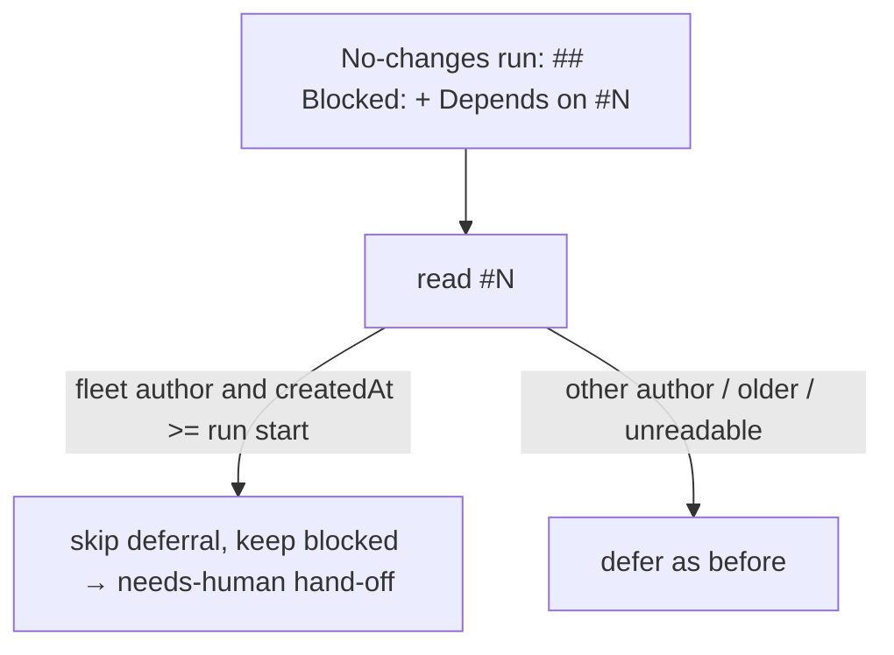

# PR Summary — Issue #3146

## Summary

A no-changes run that files its own follow-up and then ends with
`## Blocked:` / `Depends on <that follow-up>` no longer defers. It now falls
through to the analysis-only hand-off, which adds `needs-human`. Closes #3146.

- [x] Red-first regression test
- [x] Fix in `handOffDeclaredOutcome`
- [x] Docs and prompt sweep
- [x] `./quality.sh` green

## Spec

### Intent and Rationale

If a run defers on an issue it filed itself, a human-only decision ends up
parked on an issue nothing picks up. #3088 closed this gap for committed runs
only; the no-changes path still deferred.

### Essential Design Decisions

- The same `readDeclaredDependency` + `dependencyFiledDuringThisRun` check now
  runs on the no-changes path too, with the run start taken as
  `state.runStartTime ?? state.executeStartTime`.
- On a self-filed match, `blocked` stays set and only the deferral is
  skipped, exactly as for a repeat deferral. That means:
  - the already-resolved close stays excluded;
  - the time-deferral and planning checks stay skipped;
  - the caller's existing Partial Answer + `handOffAnalysisOnly` path runs.
- The no-changes path still never consults the dependency's open/closed
  state. An unreadable dependency, a non-fleet author, or a dependency created
  before the run started all still defer, as before.

### Undiscoverable Facts

The issue cites `handle_no_changes_phase.ts:182/211`, but that logic moved into
`declared_handoff.ts` in #3088, so the fix belongs there.

## Evidence

- **Guards on the new path.** It reaches the existing
  `analysis_only_handed_off` outcome through the same route a repeat deferral
  takes, so every guard in the no-changes phase still applies before that
  outcome:
  - the retryable-failure (usage-limit / interrupted) returns;
  - the structured-output wrapper skip;
  - the described-code-change retry;
  - the already-resolved exclusion, pinned by test (e).

  None is excluded.
- **Mutation checks.** Each new test went red with its guard removed, then
  passed once the guard was restored:

  | Mutation | Tests that went red |
  | --- | --- |
  | Drop `dependencyFiledDuringThisRun` | (b), (d) |
  | Treat an unreadable dependency as self-filed | (c) |
  | Clear `blocked` instead of keeping it | (e) |
- **Docs sweep.** Grepped for "filed during" / "this run filed" / "After a
  commit, a". Updated:
  - `DESIGN-PRINCIPLES.md`
  - `prompts/issue/prompt.md` (the "Blocked" bullet; the later passage is
    scoped to committed work and stays accurate)
  - `prompts/coding_guidelines/prompt.md`

  `CODING-STANDARDS.md` holds no copy of this rule. The related rules checked
  were the #3088 committed-run deferral rules and the escape-hatch rule; they
  now agree.

  Review follow-up: the sweep missed the manual's own description of the
  no-changes deferral — the "Blocked on a dependency — deferral" bullet
  under "Decision points and exceptions" in
  `docs/workflows/issue-processing.md:703` — which still said the deferral
  applied with no exception but the repeat-deferral one. Added the
  self-filed exception there, next to the repeat-deferral one it already
  named.

## Test Plan

New tests in `worker/deno/tests/handle_no_changes_blocked_deferral_test.ts`:

- **(a) Self-filed dependency:** hands off with `needs-human`, no
  `Depends on` edit, no close. It failed on base with
  `deferred: depends on stSoftwareAU/NEAT-AI-core#560` ≠
  `analysis_only_handed_off`.
- **(b) Fleet-authored dependency created before the run:** still defers.
- **(c) Unreadable dependency:** still defers.
- **(d) Non-fleet author:** still defers.
- **(e) Self-filed dependency plus cited "already fixed" evidence:** not
  closed.

Results:

- `deno task test:unit` on the five no-changes / declared-handoff test files:
  82 passed, 0 failed.
- `./quality.sh`: PASSED (only `config integration` was skipped).
