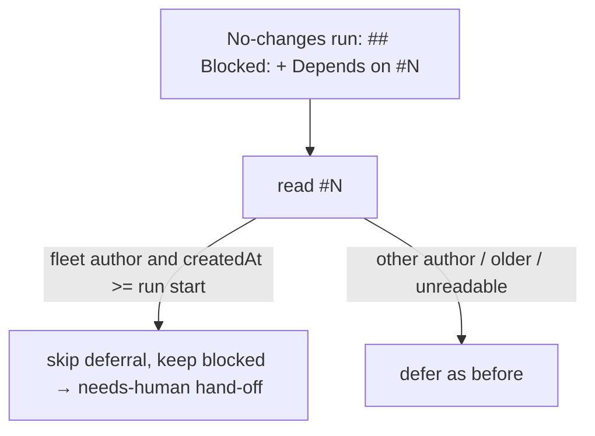

# PR Summary — Issue #3146

## Summary

A no-changes run that files its own follow-up and then ends with
`## Blocked:` / `Depends on <that follow-up>` no longer defers. It now hands
off straight to the analysis-only hand-off, which adds `needs-human` —
unconditionally, even when the same output also names a file to change, so a
self-filed match can never fall through to the described-code-change retry or
the short-output failure (both return a `failure` with no `needs-human`, and
the *next* run would see the follow-up's `createdAt` fall outside the
run-scoped self-filed window and defer onto it instead — Issue #3146 review
of PR #3159). Closes #3146.

- [x] Red-first regression test
- [x] Fix in `handOffDeclaredOutcome`
- [x] Docs and prompt sweep
- [x] `./quality.sh` green

## Spec

### Intent and Rationale

If a run defers on an issue it filed itself, a human-only decision ends up
parked on an issue nothing picks up. #3088 closed this gap for committed runs
only; the no-changes path still deferred.

### Essential Design Decisions

- The same `readDeclaredDependency` + `dependencyFiledDuringThisRun` check now
  runs on the no-changes path too, with the run start taken as
  `state.runStartTime ?? state.executeStartTime`.
- On a self-filed match, `blocked` stays set and only the deferral is
  skipped, exactly as for a repeat deferral. That means:
  - the already-resolved close stays excluded;
  - the time-deferral and planning checks stay skipped.
- The no-changes path still never consults the dependency's open/closed
  state. An unreadable dependency, a non-fleet author, or a dependency created
  before the run started all still defer, as before.
- **Review fix (Issue #3146, review of PR #3159):** `handOffDeclaredOutcome`
  only set a local `selfFiledDependency` flag and returned no result, relying
  on the caller to reach the hand-off through its own length/shape-dependent
  fall-through. `DeclaredOutcomeHandoff` now exposes `selfFiledDependency`, and
  `workOnIssueHandleNoChanges` checks it immediately after the
  usage-limit/interrupted retries and *before* the length check, calling the
  same `postPartialAnswerAndHandOff` helper the normal textual-output path
  uses (extracted so both call sites share it). This skips the
  described-code-change retry and the short-output failure entirely for a
  self-filed match, regardless of what the output otherwise looks like.

### Undiscoverable Facts

The issue cites `handle_no_changes_phase.ts:182/211`, but that logic moved into
`declared_handoff.ts` in #3088, so the fix belongs there.

## Evidence

- **Guards kept vs. excluded on the self-filed short-circuit.** It reaches
  `analysis_only_handed_off` via a dedicated check placed after the
  retryable-failure returns but before everything else:
  - **Kept:** the retryable-failure (usage-limit / interrupted) returns —
    genuine infrastructure retries still take priority; the already-resolved
    exclusion, pinned by test (e), since `blocked` stays set regardless of
    which branch applies it.
  - **Excluded, with reason:** the structured-output-wrapper skip, the
    described-code-change retry, and the short-output failure. A self-filed
    match must hand off on *this* run — reaching any of those three would
    return a `failure` with no `needs-human`, and the next run's
    `createdAt >= runStartTime` check no longer treats the same follow-up as
    self-filed, so the issue would defer onto it instead (test (f) pins this).
- **Mutation checks.** Each new test went red with its guard removed, then
  passed once the guard was restored:

  | Mutation | Tests that went red |
  | --- | --- |
  | Drop `dependencyFiledDuringThisRun` | (b), (d) |
  | Treat an unreadable dependency as self-filed | (c) |
  | Clear `blocked` instead of keeping it | (e) |
  | Drop the `selfFiledDependency` short-circuit (let it fall through to the length check) | (f) only — (a)'s output has no described file, so it still reaches the same outcome through the ordinary fall-through either way |
- **Docs sweep.** Grepped for "filed during" / "this run filed" / "After a
  commit, a". Updated:
  - `DESIGN-PRINCIPLES.md`
  - `prompts/issue/prompt.md` (the "Blocked" bullet; the later passage is
    scoped to committed work and stays accurate)
  - `prompts/coding_guidelines/prompt.md`

  `CODING-STANDARDS.md` holds no copy of this rule. The related rules checked
  were the #3088 committed-run deferral rules and the escape-hatch rule; they
  now agree.

  Review follow-up (round 1): the sweep missed the manual's own description
  of the no-changes deferral — the "Blocked on a dependency — deferral"
  bullet under "Decision points and exceptions" in
  `docs/workflows/issue-processing.md:703` — which still said the deferral
  applied with no exception but the repeat-deferral one. Added the
  self-filed exception there, next to the repeat-deferral one it already
  named.

  Review follow-up (round 2, this round): that round-1 wording — "falls
  through to the same analysis-only hand-off" — was itself inaccurate once
  the output also described a code change (see the round-2 fix above).
  Reread `docs/workflows/issue-processing.md:703` and `:793` and
  `DESIGN-PRINCIPLES.md:2762` against `workOnIssueHandleNoChanges` and
  `handOffDeclaredOutcome` (this file) and reworded all three to say the
  hand-off is unconditional — it bypasses the described-code-change retry and
  short-output failure — rather than merely "falling through".

## Test Plan

New tests in `worker/deno/tests/handle_no_changes_blocked_deferral_test.ts`:

- **(a) Self-filed dependency:** hands off with `needs-human`, no
  `Depends on` edit, no close. It failed on base with
  `deferred: depends on stSoftwareAU/NEAT-AI-core#560` ≠
  `analysis_only_handed_off`.
- **(b) Fleet-authored dependency created before the run:** still defers.
- **(c) Unreadable dependency:** still defers.
- **(d) Non-fleet author:** still defers.
- **(e) Self-filed dependency plus cited "already fixed" evidence:** not
  closed.
- **(f, this round) Self-filed dependency whose output also describes a code
  change:** hands off with `needs-human`, `analysis_only_handed_off`, no
  `Depends on` edit — rather than retrying through
  `retryDescribedCodeChange`. Reverting the `selfFiledDependency`
  short-circuit in `handle_no_changes_phase.ts` and re-running this test gave
  `AssertionError: Values are not equal. - failure / + early_exit`, confirming
  it goes red without the fix; restoring the fix made it pass again.

Results:

- `deno task test:unit` on the five no-changes / declared-handoff test files:
  83 passed, 0 failed (82 before this round's test (f) was added).
- `./quality.sh`: PASSED (`config integration` skipped, as before). The first
  run this round caught a `no-unused-vars` lint failure on the `config`
  destructure in `workOnIssueHandleNoChanges` left over from extracting
  `postPartialAnswerAndHandOff`; removed it and `deno lint` passed clean on
  the re-run.
