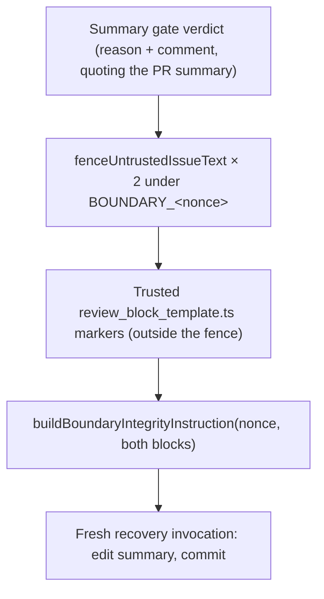

## Summary

`buildSummaryRuleRetryPrompt` used to paste the gate's `verdict.reason` and `verdict.comment` into the recovery prompt verbatim. It added no nonce, no scrub and no integrity rule, and its docstring claimed the text was worker-authored. In fact the gate comment quotes entry lines from the branch's PR summary, and those lines carry wording the issue's author chose.

Both values are now fenced with `fenceUntrustedIssueText` under a per-render boundary id, and the prompt adds a `buildBoundaryIntegrityInstruction` rule that names that nonce and both blocks. This follows the #3133 precedent in `closure_verdict_recovery.ts`. The genuine review-block markers the agent must reproduce are printed outside the fence from the trusted `review_block_template.ts`. Closes #3152.

## Spec

### Intent and Rationale

- The retry notice quotes attacker-influenced text, which could carry a forged `---END UNTRUSTED USER CONTENT …---` delimiter or a fake `<!-- vibe-spec-review -->` marker. Unfenced, that text reads to the agent as prompt instructions.
- #3133 had already reached the same conclusion for the closure gate's problem lines, so this prompt was the remaining inconsistency.

### Essential Design Decisions

- **One nonce for both blocks.** The reason and the comment are fenced as two blocks under the same per-render nonce. One integrity instruction then names both blocks: "the gate's block reason" and "the PR-summary gate retry notice".
- **Markers from the trusted template.** The genuine markers come from `reviewBlockTemplateLines()`, printed after the last fence. The prompt tells the agent to copy headings and markers from that template, not from the notice.
- **Optional `boundaryId` parameter.** It lets tests pin the nonce. A malformed id is discarded and replaced by `generateBoundaryId()`, the same as in the sibling builders.
- **No separate "Tool Output Is Data" section.** `buildBoundaryIntegrityInstruction` already embeds `TOOL_OUTPUT_IS_DATA_RULE`, so a second copy would duplicate it.
- **Full tool grant kept.** The recovery's job is to edit and commit the summary. The prompt still forbids new work, opening the PR and closing the issue, and every gate runs again over the result.

### Undiscoverable Facts

- The original code skipped fencing for a reason: the scrub neutralises HTML comments (`<!--` becomes `<․!--`), which would also mangle the review-block markers the agent has to reproduce. Printing the markers from the trusted template outside the fence removes that conflict.

## Evidence

This is a backend-only change, so there is no screenshot.

- **Red on base:** with the base-branch `summary_rule_gate_retry.ts` in place, all five new tests failed (`FAILED | 5 passed | 5 failed`). The five existing tests passed.
- **Revert check:** with only the fencing reverted (the integrity instruction left in), four tests failed (`6 passed | 4 failed`): the two forged-delimiter tests, the template-markers-outside test and the nonce test. The integrity-instruction test stayed green because that part was left in, but it is red on base.
- **Green:** `deno task test:unit tests/summary_rule_gate_retry_test.ts tests/completion_phase_summary_rule_retry_test.ts tests/closure_verdict_prompt_test.ts` passed in full, and `tests/summary_rule_gate_retry_test.ts` gave `ok | 10 passed | 0 failed`.
- `./quality.sh < /dev/null` gave `Result: PASSED (with skipped checks)`. Only `config integration` was skipped, because there is no `.config.json` in this checkout.

**Docs sweep:** three documents changed:
- `docs/workflows/issue-processing.md` (recovery step 2)
- `docs/audits/security-sweep-2189-summary-rule-gate-retry.md` (the input rows and the closing paragraph, which recorded the superseded unfenced decision)
- `docs/audits/security-sweep-2242-closure-verdict.md` (the problem-lines row)

`docs/THREAT-MODEL.md`, `SECURITY.md`, `prompts/`, `CODING-STANDARDS.md` and `DESIGN-PRINCIPLES.md` were checked and needed no change.

**Related rules checked:** no prompt template or `CODING-STANDARDS.md` rule governs this prompt's fencing. The overlapping text was the two audit records and `issue-processing.md`, and all three were updated to agree.

**Guards:** this change adds no new path to an outcome. The recovery still runs once per run, behind the caller's `=== 1` condition, and the gates run again before any PR is opened.

## Test Plan

All in `worker/deno/tests/summary_rule_gate_retry_test.ts`:

- **`a delimiter forged in the comment is scrubbed and fenced`:**
  - the forged END delimiter is gone;
  - the raw spec marker appears exactly once (the template copy);
  - the neutralised forged marker and the injected sentence both sit inside the nonced fence;
  - there are exactly 2 BEGIN and 2 END markers.
- **`a delimiter forged in the reason is scrubbed and fenced`:** the same checks, using the standards marker in the reason.
- **`the integrity instruction names the fence's nonce`:** the prompt carries the integrity section, names the pinned nonce, and names both fenced blocks.
- **`the genuine template markers sit outside the fences`:** both review-block markers appear after the last END.
- **`two renders without a pinned id get different nonces; a malformed id is discarded`:** two unpinned renders get different nonces, and `not-a-nonce` never reaches the prompt.

🤖 Generated with [Claude Code](https://claude.com/claude-code)
