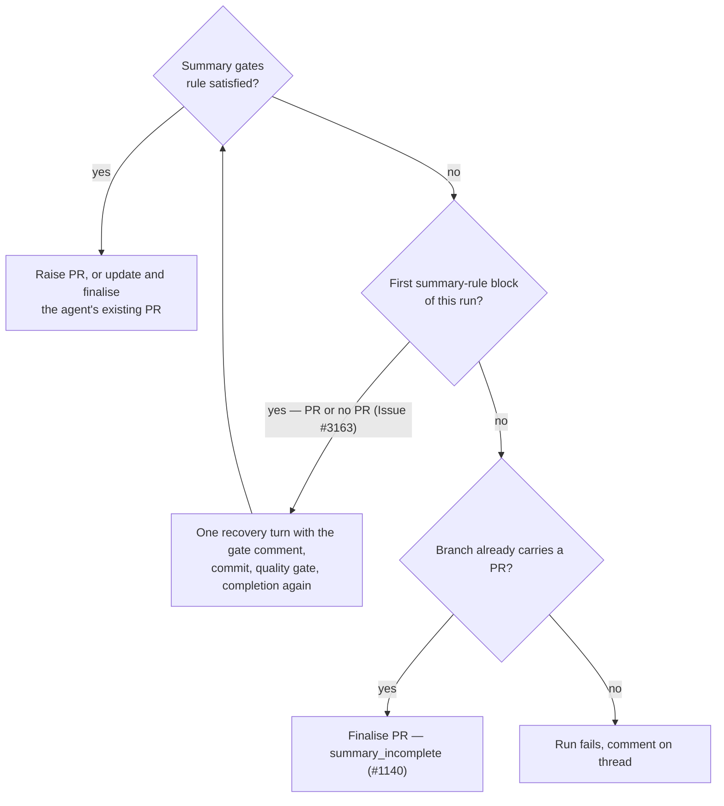

## Summary

The docs-sweep gate did fire on VibeCoder#3155, #3158 and #3159. Each issue
got its "Docs sweep missing" comment 13–15 seconds after its PR existed. The
agent had raised the PR itself during the execute phase: #3159's first body
revision (14:52:36 UTC) ends with the agent's own "Generated with Claude
Code" footer, and the worker's footer replaced it at 14:52:51.

`reportSummaryRuleBlock` then took its existing-PR branch, which never recorded
the verdict in `state.summaryRuleBlocks`. As a result `recoverFromSummaryRuleBlock`
never ran, and the PR was finalised (auto-merge armed) as `summary_incomplete`
with no recovery turn.

The run's first summary-rule block now gets the one in-run recovery turn
whether or not a PR already exists. The existing PR is not recovered,
finalised or auto-merged until after that turn. Closes #3163.

- [x] Reproduce #3159's completion phase and find the bypass
- [x] Fix: first block defers to the recovery turn on an existing-PR branch
- [x] Regression tests driving `workOnIssueCompletion` with #3159's summary and file list
- [x] Audit the other summary-rule gates
- [x] Docs: `docs/workflows/issue-processing.md`, `DESIGN-PRINCIPLES.md`
- [x] `./quality.sh`

## Spec

### Intent and Rationale

- The gate was correct and wired correctly; the bypass was the existing-PR branch of `reportSummaryRuleBlock` (Issue #1140), which finalised an agent-raised PR without the recovery turn a no-PR run gets.
- Giving that branch the same single recovery turn lets the gate's comment reach the agent before auto-merge is armed. The alternative, refusing `gh pr create` to the agent, changes a guard every phase shares and is a bigger change than this issue asks for.

### Essential Design Decisions

- The run is still capped at one recovery turn. Only the run's first block defers. A second block on an existing-PR branch takes the unchanged #1140 path: degraded-run guard, unnumberable-URL check, finalise, `summary_incomplete`.
- If the recovery invocation cannot be launched on an existing-PR branch, `recoverFromSummaryRuleBlock` re-runs completion so the PR is finalised as `summary_incomplete`. It does not fail the run, which would release a live PR back to the pool and regress #1140.
- The deferral names the open PR on `state.prUrl`/`state.prNumber` when its URL yields a number. That way a quality-gate failure after the recovery reports `pr` + `blocked`, not `no_pr` (Issue #2044). An unnumberable URL names nothing (Issues #3136/#3139).
- The recovery prompt's opening line says a PR is already open and will not be finalised until the summary passes. It does not interpolate the URL.

### Undiscoverable Facts

- Evidence of who raised the PR comes from GitHub, not the repo. The issues' comment timestamps (gate comment after PR creation) and #3159's `userContentEdits` history (first revision carries the agent footer) show the agent raised it.
- `prompts/coding_guidelines/prompt.md` ("Nor is your own pull request") tells agents to "finish by creating the PR and leave it open". That is why agent-raised PRs are routine on issue runs. This PR does not change that text: with this fix, an agent-raised PR goes through the same gates as one the worker raises.

## Evidence

Backend-only change; no UI files touched.

**Gate audit (proposed-fix step 3).**

- The closure (#518), independent-review (#663), reproduction-status (#521), docs-sweep (#3073) and result-placeholder (#3124) gates all block through `reportSummaryRuleBlock`, so this one fix covers all five.
- The security-fix and changed-workflow gates do not use that existing-PR branch: they fail the run PR or no PR.
- The screenshot gate sets `state.screenshotGateBlock` and recovers through `recoverFromScreenshotGateBlock` before any PR lookup. None of these three has the bypass.
- The new tests drive the docs-sweep gate (#3159 fixture) and the closure gate (`completion_phase_summary_rule_retry_test.ts`) over an existing PR.

**Docs sweep** — grep: `summary_incomplete`, `reportSummaryRuleBlock`, "already carries a PR", "With **no** PR", "could not launch"; section: `docs/workflows/issue-processing.md#-the-in-run-recovery-from-a-summary-rule-block` (also its docs-sweep gate section and the Issue #1140 outcome table and flowchart), `DESIGN-PRINCIPLES.md` (the `summary_incomplete` principle); updated: `docs/workflows/issue-processing.md`, `DESIGN-PRINCIPLES.md`

Related existing rules checked: `prompts/issue/prompt.md` step 3 ("the worker will not raise the PR without that line: it asks for it once more, and a second miss fails the run") still holds. The recovery prompt's "Do not create the PR yourself" is kept on both wordings. No prompt rule was changed.

## Test Plan

New and changed tests, all calling `workOnIssueCompletion` or `buildSummaryRuleRetryPrompt`:

- `worker/deno/tests/completion_phase_docs_sweep_test.ts`
  - "a run whose agent already raised its PR (VibeCoder#3159) gets the one recovery turn before that PR is finalised, then raises nothing new". Uses #3159's real Summary and Docs sweep bullet from `pr-summary-3146.md` and its 9 changed files. Asserts that the single recovery prompt carries "Docs sweep missing", that the agent invocation precedes `recoverExistingPr`, and that `gh pr create` never runs.
  - "the VibeCoder#3159 fixture with no fix from the recovery ends as summary_incomplete, not a silent finalise". Asserts that recovery is entered once and that `finalisePr` (auto-merge) runs only after the agent invocation.
- `worker/deno/tests/completion_phase_summary_rule_retry_test.ts`
  - Replaced "a block on a run that already has a PR is not re-invoked", which pinned the bypass. Its removed assertions were `status === "early_exit"`, `claudeCalls === 0` and `qualityGateRuns === 0`. All three are made untrue by the issue's requirement that a recovery turn runs before the PR is finalised. It is now three tests:
    - first block over an existing PR recovers: `continue`, one agent call, quality gate re-run, no `gh pr create`;
    - no fix from the recovery: `summary_incomplete`;
    - recovery cannot be launched over an existing PR: still `summary_incomplete` (#1140), one comment.
- `worker/deno/tests/summary_rule_gate_retry_test.ts`: the prompt wording for the no-PR and existing-PR cases, and the URL is not interpolated.

Red runs:

- With only `completion_phase.ts` restored to the base commit, both #3159 tests and the three new retry tests fail. For example, the #3159 recovery test got `early_exit`, not `continue`, and the recovery count was `0`, not `1`.
- With the `rerunCompletion()` fallback removed, only the unlaunchable-recovery test fails (`failure`, not `early_exit`).

Results on the final head:

- `deno task test:unit` over `completion_phase_docs_sweep_test.ts`, `completion_phase_summary_rule_retry_test.ts`, `completion_phase_summary_incomplete_test.ts`, `summary_rule_gate_retry_test.ts`, `completion_phase_degraded_delivery_test.ts`, `new_path_keeps_guards_3087_test.ts` and `tool_output_treat_as_data_3046_test.ts`: 71 passed, 0 failed. `completion_phase_summary_incomplete_test.ts` is unchanged and still passes: its existing-PR cases now take one recovery turn before finalising.
- `./quality.sh`: PASSED. Only `config integration` was skipped.

Guards on the new path (first block, existing PR → failure → recovery):

- The degraded-run guard and the unnumberable-URL check still run before any finalise. The deferral returns before either, and the re-run reaches them on the #1140 path or the normal `completionBody` path.
- The comment dedup is kept, so one comment is posted per verdict. The recovery-unlaunchable test asserts `comments.length === 1`.
