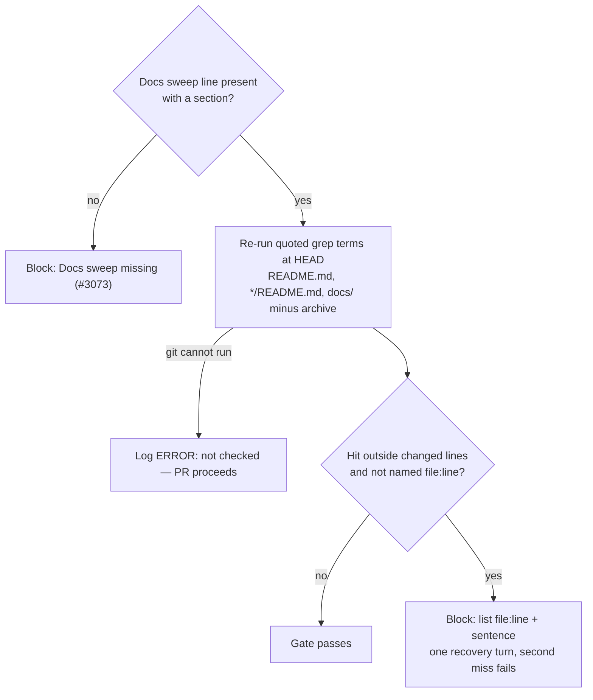

## Summary

The docs-sweep gate (#3073) required a **Docs sweep** line and a `section:`,
but nothing ran the line's own grep terms against the head. Fleet PRs passed
with hits of their declared terms still stating removed behaviour, often in a
file the line listed as updated (GRQ-AutoTrader#2413 missed
`configuration-and-backtesting.md:320` and `:559`; #2405 was sent back three
times, once for "replaced or removed" against a grep for "replaces or
removes"). Closes #3172.

- [x] Worker check: once the line passes the gate, re-run each quoted term at
  `HEAD` over `README.md`, `*/README.md` and `docs/` (minus `docs/archive/`);
  a hit outside the diff's changed lines and not named as `file:line` blocks
  through the existing single recovery turn
- [x] Prompt (`prompts/issue/prompt.md` step 3 and the Evidence example):
  stem greps, re-run on the final head, every passage in an updated file,
  remaining hits as `file:line — still true because …`
- [x] `CODING-STANDARDS.md` (A Code Change Owes a Docs Change, PR Summary and
  Evidence) and its `prompts/coding_guidelines/prompt.md` restatement
- [x] Manuals: `docs/workflows/issue-processing.md`, `docs/PROMPTS.md`

## Spec

### Intent and Rationale

- Both incidents are mechanical misses: the agent's own term, or an
  inflection of it, still hits a stale sentence at the head. Re-running the
  terms needs no judgement, so the worker does it instead of the reviewer.
- The check reuses the docs-sweep gate's block path (`reportSummaryRuleBlock`),
  so the agent gets one recovery turn and a second miss fails the run, as
  the issue asks.

### Essential Design Decisions

- New module `worker/deno/lib/docs_sweep_hits.ts`. `parseDocsSweepLine` now
  also returns `rawBody` (backticks, quotes and underscores intact), because
  the existing `body` strips them and so cannot yield terms like `min_buy`.
- Terms are literal: every ERE metacharacter is escaped before `git grep -E`,
  except a `\w*` / `\w+` stem marker, which becomes `[[:alnum:]_]*` / `+`.
  That lets the prompt's new stem advice (`replac\w* or remov\w*`) be
  checked by the worker too. No JavaScript `RegExp` is built from the summary.
- A hit is cleared when it sits on a line `git diff --unified=0
  <base>...HEAD` added or changed, or when the line names it as `file:line` or
  `file:start-end`. No context lines: a stale sentence next to an edit is the
  #2405 shape.
- **Departure from the issue text:** a grep or diff that cannot run (or an
  unresolvable base) is logged at ERROR as "not checked" and does **not**
  block. The issue says "fail closed with a logged 'not checked'"; blocking
  would hand the agent a recovery turn it cannot act on, so this follows
  CODING-STANDARDS "Writing a gate over text" item 3's other branch (logged
  and reported as not checked) and the changed-workflow gate's precedent for
  an unresolvable base. The line itself is still required, fail closed, as
  before.
- **Broad terms.** A term with more than 10 stale hits in doc files the diff
  did not touch is a locator word ("refused", "sibling"), not a removed
  claim: those hits are set aside and the term is logged at WARN as not
  checked line by line. Its hits in files the diff touched (where both
  incidents sat) are always listed. The comment lists at most 20 hits, then
  "and N more".

### Undiscoverable Facts

- `git grep -n -z <rev>` prints `<rev>:<path>\0<line>\0<text>`; `-z` keeps
  paths unquoted. A plain pathspec `*/README.md` matches nested READMEs
  because git's default pathspec `*` crosses `/`. Both are pinned by a
  real-git test.

## Evidence

Backend and prompt change; no UI files touched.

**Replay of GRQ-AutoTrader#2413.** The issue asks that a replay of #2413's
summary and diff at 27bbb100 return the two `configuration-and-backtesting.md`
lines. That repository is not reachable from this session, so the replay is
the unit test "replay of GRQ-AutoTrader#2413 returns the two missed lines".
It uses #2413's sweep shape (term `"maximum trade"`, `:143` and `:218` named,
lines 205-212 edited) and returns exactly `:320` and `:559`.

**Corpus run** (CODING-STANDARDS "Writing a gate over text" item 2) over
`docs/archive/pr-summaries/` (848 files): 56 carry a Docs sweep line, 32 have
a `grep:` field, and term extraction reads quoted terms from 31 of them (125
terms). The one miss, `pr-summary-3092.md`, lists its terms unquoted, so it
is `skipped` (logged at INFO), not read as clean. Re-running those 31
summaries' terms against today's `HEAD` with no diff gives an upper bound of
0-35 hits per summary once broad terms are set aside. A real diff clears its
own edited lines.

**Related existing rules checked:** `prompts/issue/prompt.md` step 3 ("A grep
hit is cleared only after reading the sentence it is in", "a second miss
fails the run") still holds; `prompts/pr_feedback/prompt.md` defers to
CODING-STANDARDS, which now carries the stem/re-run bullet. No rule was
contradicted.

**Docs sweep** — grep: `docs_sweep_gate.ts`, "no such line", "fix every hit"; section: `docs/workflows/issue-processing.md#-docs-sweep-on-a-code-change`; updated: `docs/workflows/issue-processing.md`, `docs/PROMPTS.md`, `CODING-STANDARDS.md`, `prompts/issue/prompt.md`, `prompts/coding_guidelines/prompt.md`

## Test Plan

- `worker/deno/tests/docs_sweep_hits_test.ts` (new, 40 tests): term
  extraction (backticks, straight and curly quotes, `;` inside a term, stop at
  the next field, dedupe, unclosed quote); `rawBody` keeping underscores
  across a wrapped line; `file:line` / range naming; ERE escaping and the
  `\w*` stem; `git grep -z` and `--unified=0` parsing, including a deleted
  file, a deletion-only hunk, and an added `++` line that is not a header;
  the #2413 replay; adjacent-line hits still stale; named ranges cleared;
  broad-term split at and over the limit; `not_checked` for a grep error, a
  diff error, a thrown spawn and malformed output; comment rendering and
  cap; and a real-git test (temp repo) that finds an untouched hit and an
  inflected `*/README.md` hit while clearing the edited line and
  `docs/archive/`.
- `worker/deno/tests/completion_phase_docs_sweep_test.ts` (4 new tests,
  through `workOnIssueCompletion`): a stale hit gets one recovery turn and
  the PR is raised once the hit is named; a stale hit the recovery leaves
  fails with no PR; a grep that cannot run does not block; a docs-only diff
  never re-runs the terms. The two blocking tests were run red before the
  wiring was added (2 failed, 9 passed).
- `worker/deno/tests/prompt_docs_sweep_3172_test.ts` (new, 4 tests): pins the
  new prompt rules.
- `docs/audits/lib-sweep-coverage.json`: `docs_sweep_hits.ts` claimed by a
  `top-up-3172` slice (the completeness check required it).
- Quality gate: QUALITY_RESULT
