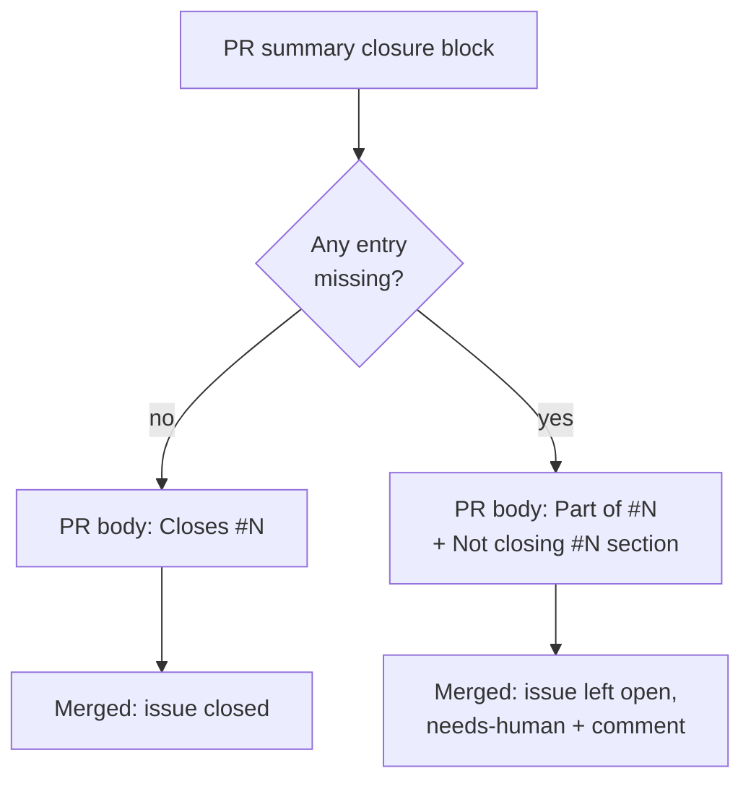

## Summary

"A missing core deliverable is not a PR" was a prose rule that only a reviewer
enforced, and a PR into a milestone branch has no reviewer: it merges on green
CI. GRQ-AutoTrader#2459, #2307 and #2370 each marked their core criterion
`missing` in their own `## Acceptance Criteria` block, merged into their
milestone, and the worker closed the issue as completed.

The worker now reads that signal in two places. Closes #3177.

- **PR creation (`assemblePrBody`).** A summary with any `missing` closure
  entry has its closing keywords for the issue rewritten to `Part of #N`. A
  `## Not closing #N` section names the missing criteria, and no `Closes #N`
  is appended. The PR-body re-sync uses the same assembly, so a later commit
  that marks the criteria `met` brings the keyword back.
- **Merge (belt and braces).** A fleet PR's title still names its issue, so
  the body alone cannot hold the issue open. Both closers now read the merged
  PR's closure block: `closeIssuesForMergedPrs` (priority 1.67, which posts the
  "Closed automatically … merged into `milestone/…`" comment) and
  `ensureIssueClosedIfPrMerged` (used by the housekeeping sweep and the
  recovery path). With a `missing` entry they leave the issue open, label it
  `needs-human`, and comment naming each missing criterion. An issue that
  already has `needs-human` is skipped, so the comment is posted once.

- [x] Failing tests first (5 red against `origin/main`)
- [x] `missing_criterion_close_guard.ts` and wiring into PR-body assembly and both closers
- [x] Prompt, `CODING-STANDARDS.md` and manuals updated
- [x] `docs/audits/lib-sweep-coverage.json`: `top-up-3177` slice claims the new module
- [x] `./quality.sh` (non-test steps; full suite left to CI)

## Spec

### Intent and Rationale

- The issue offered (a) sending the run back to finish, or (b) raising the PR
  as `Part of #N` and leaving the issue for a human. Option (b) was taken. The
  only in-run retry is the summary-rule recovery turn, and its prompt says
  "do not change the code". Reusing it for unfinished work would invite the
  agent to relabel `missing` as `partial` instead of finishing.
- The closer check is what actually holds the issue open, because closers
  also match the `(Issue #N)` in the PR title.

### Essential Design Decisions

- Any `missing` entry counts, not just a "core" one. The worker cannot tell
  core from lesser criteria. The prompt now says a lesser gap that still lets
  the issue close is `partial`.
- The label goes on before the comment. If labelling fails, the closer throws,
  posts no comment, and retries next cycle. The issue is never closed in the
  meantime.
- `MergedPR.missingCriteria` is set only when non-empty, so existing listing
  fixtures and cached entries are unchanged. A cache entry written before this
  field existed reads as "none" for at most one cache TTL.
- The PR note says "leaves #N open". The wording "does not close #N" would
  itself match GitHub's closing-keyword pattern (a test caught this).

### Undiscoverable Facts

- `pr_maintenance.closeIssuesForMergedPrs` has the same name but is not wired
  into production (`run_core_production_deps.ts` imports the
  `pr_issue_linking` one), so it is unchanged.
- The housekeeping merged-PR sweep already skips `needs-human` issues, so once
  the closer labels an issue the sweep cannot close it either.

## Acceptance Criteria

The issue states no `## Acceptance Criteria` section; its "Proposed
guardrail" bullets are tracked in the checklist above.

## Evidence

Backend-only change; no UI files touched.

**Docs sweep** — grep: `core deliverable`, `Closes #`, `closeIssuesForMergedPrs`, `merged-PR closers`; section: `docs/workflows/issue-processing.md#a-missing-criterion-does-not-close-the-issue` (and the degraded-run "PR is still raised" bullet), `docs/INTERNALS.md` (merged-PR closers paragraph, flowchart and module table); updated: `prompts/issue/prompt.md`, `CODING-STANDARDS.md`, `docs/workflows/issue-processing.md`, `docs/INTERNALS.md`

## Test Plan

`worker/deno/tests/missing_criterion_close_guard_3177_test.ts` (11 tests):

- `findMissingCriteria` and `withholdIssueClose` (only this issue's keywords
  are rewritten).
- `assemblePrBody`: a `missing` summary produces no `Closes #N`, with or
  without its own keyword. An all-`met` summary still closes.
- `closeIssuesForMergedPrs` on a milestone landing: a `missing` body leaves
  the issue open with `needs-human` and one comment naming the criteria. An
  issue already labelled is untouched. All `met` still closes.
- `ensureIssueClosedIfPrMerged`: `missing` returns `closed: false` and
  labels/comments. All `met` still closes.

Red run: with `pr_issue_linking.ts`, `issue_lifecycle.ts`, `pr_body_sync.ts`
and `issue_query.ts` restored to `origin/main`, 5 negative-path tests fail and
the 6 positive-path and pure tests pass.

Results on the final head:

- The new test file plus `pr_claims_verified_3058_test.ts`: 16 passed.
- The closer, PR-body, issue-query and acceptance-gate suites (18 files): 349
  passed, 0 failed.
- The completion-phase, sweep, lifecycle, PR-body-sync and sweep-coverage
  suites plus the new tests (17 files): 205 passed, 0 failed.
- `./quality.sh --sequential`: every non-test step PASSED (completeness
  checks, source targets, deno fmt, deno lint, deno type check, mermaid,
  release-tag ruleset and the chokepoint scans). `config integration`,
  `markdownlint` and `semgrep` were skipped because the tools are not
  installed. The full `deno test` step was stopped and left to CI: eight
  agents share this container's memory, and the first (parallel) run's test
  and type-check steps failed with no test failure reported. The type check
  then passed on its own (`deno task check`).
