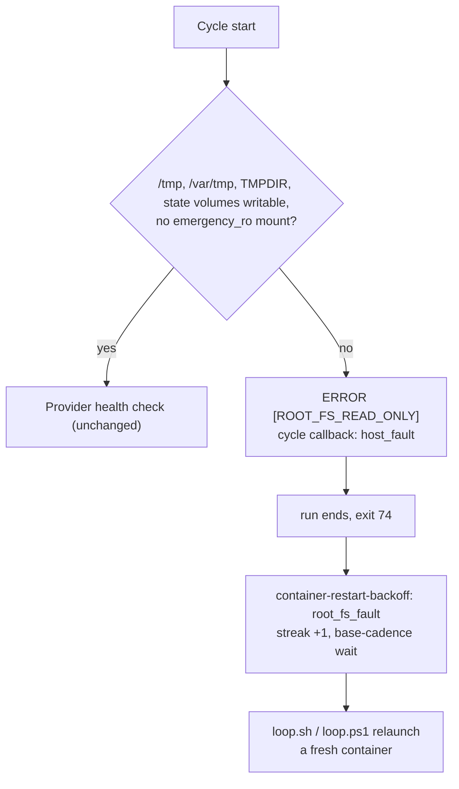

## Summary

On GRQ-23 (2026-10-03) ext4 remounted the container root `emergency_ro` after
guest write errors. The worker kept cycling and logged `Claude health check
failed — skipping cycle` every two minutes until a human stopped the
container. A fresh container is the only repair, so the worker now detects
the fault, names it, and ends the run. The supervisors then relaunch it
promptly. Closes #3179.

- **Detect.** New `worker/deno/lib/root_filesystem_fault.ts`. At the top of
  every cycle, before the provider health check, `runCoreLoop` calls
  `checkRootFilesystem`. It creates and deletes a file in `/tmp`, `/var/tmp`,
  `TMPDIR` and both state volumes (`…-agent-state`, `…-approval-state`), and
  reads `/proc/mounts` for `emergency_ro`. A write refused with an I/O-class
  error (the `work_volume_fault.ts` patterns: `Read-only file system`,
  `Input/output error`, `Structure needs cleaning`, …) is a fault. A missing
  directory is skipped. Any other refusal is warned about once per message
  and is not a fault. A plain `ro` root is not a fault either: Issue #516's
  `--read-only` sets it on purpose.
- **Name.** One `ERROR: [ROOT_FS_READ_ONLY] <path> is not writable: <detail>`
  line, a `host_fault` cycle callback, and `rootFilesystemFault` on the
  run-core result. The health check is never reached, so this is not
  recorded as a provider failure.
- **Exit.** `runWorker` returns outcome `root-fs-fault` with exit **74**
  (`ROOT_FS_FAULT_EXIT_STATUS`, `EX_IOERR`).
- **Relaunch.** `container-restart-backoff` classifies 74 as `root_fs_fault`.
  It waits the base cadence, never the grown backoff, and emits a
  `root_fs_fault` self-heal event. It still counts on the failure streak
  (phase `worker_run`), so a host that keeps faulting escalates to its
  `callbacks.host_failure` hook. The escalation's exit-status line names it
  as a root-filesystem host fault. `loop.sh` and `loop.ps1` both define the
  status and log a named line, and `loop_contract.ts` adds it to
  `SHARED_EXIT_STATUSES` so the parity gate holds both to it.

## Spec

### Intent and Rationale

- A read-only root cannot recover inside the launch. Each further cycle only
  burns the slot until the 3 h cap, so the run should end at once with its
  own status.
- The issue asks for "relaunch-now, with a short sleep" and for a host-fault
  record. Both are met: the backoff is fixed at the base cadence and the
  streak counts the fault.

### Essential Design Decisions

- Only `emergency_ro` in `/proc/mounts` counts as a mount fault. A plain `ro`
  root is normal on Docker and Podman (`--read-only`, Issue #516).
- The fault still counts on the failure streak, with the base-cadence wait,
  so a host whose disk keeps faulting is escalated rather than relaunched
  quietly for ever. A clean run afterwards is reported as a recovery.
- The declaration is carried by the exit status only, with no marker file:
  the host log directory may sit on the same failing disk. The recorder
  already reads the launcher's status 4 the same way, from the status alone.
- The detection runs at the top of each cycle, not on every EROFS anywhere.
  The gh-shim `makeTempDir` failure from the incident is caught by the next
  cycle's probe, which is within the "one cycle" acceptance bound. That
  avoids threading a new signal through every write site.

### Undiscoverable Facts

- The incident's mount line was `/dev/vdb on / type ext4
  (rw,relatime,emergency_ro)`: the option list still says `rw`. That is why
  the scan looks for `emergency_ro` rather than `ro`.
- The `ERROR` log line's own wording is tracked in #3180. This PR adds the
  single named line the issue asks for.

## Evidence

Backend-only change; no UI files touched.

**Docs sweep**: grep `QUOTA_PAUSE_EXIT`, `quota_paused`, `another_worker_running`,
`TOOLCHAIN_SELFCHECK_EXIT`, `no_eligible_work`, `work_volume_fault`,
`Structure needs cleaning`; section:
`docs/workflows/resilience-and-concurrency.md` (the launcher self-heal list and
its flowchart), `docs/DEPLOYMENT.md` (the restart-backoff bullets),
`docs/CALLBACKS.md` (cycle hook `VIBECODER_CYCLE_END_REASON`); updated:
`docs/workflows/resilience-and-concurrency.md`, `docs/DEPLOYMENT.md`,
`docs/CALLBACKS.md`.

## Test Plan

New tests:

- `worker/deno/tests/root_filesystem_fault_test.ts` covers the detector both
  ways: writable gives no fault (stubbed and a real temp directory), EROFS
  and EIO give a fault naming the path, `emergency_ro` is a fault, and a
  deliberate `ro` root is not. Also: a missing directory is skipped, a
  permission error is warned about but is not a fault, the probe set and its
  de-duplication, and the formatted line.
- `worker/deno/tests/run_core_root_filesystem_fault_test.ts` drives the real
  `runCoreLoop`. A faulted filesystem ends the run on the first cycle, with
  no health check, one `[ROOT_FS_READ_ONLY]` line, a `host_fault` callback
  and the fault on the result. A healthy filesystem with a failing health
  check still logs `Claude health check failed — skipping cycle` and keeps
  cycling.
- `run_worker_test.ts`: a fault exits 74 with outcome `root-fs-fault`, not
  `completed`.
- `container_restart_backoff_test.ts`: 74 classifies as `root_fs_fault`, and
  a declared quota pause still wins. After two crashes it waits the base
  cadence rather than the grown backoff, counts on the streak, escalates at
  the threshold, and names the fault in the self-heal log and the
  escalation. A single fault does not escalate, and a clean run afterwards
  is a recovery.
- `launcher_failure_evidence_test.ts`: 74 is in the known-status table and
  explained as a root-filesystem fault.
- `loop_supervisor_test.ts`: `loop.sh` given exit 74 names the fault, does
  not log "backing off", and relaunches.

Changed tests:

- `loop_parity_test.ts`: the synthetic sound supervisors gain the new
  status, and the expected `distinguishedExitStatuses` lists gain
  `root-fs-fault`. The bare-loop fault count goes from 13 to 14 because it
  reports one fault per shared status, and the issue adds one. No assertion
  was removed. The real-script test ("both tell every shared launcher exit
  status apart") is the `.sh`/`.ps1` launcher coverage the issue asks for.

Results: the targeted suites (the new tests, all `run_core_*`, `run_worker`,
`run_entrypoint`, restart backoff, escalation streak, launcher evidence, loop
parity, callbacks, self-heal and docs tests) gave 967 passed, 0 failed.
`deno task check:manifests` passed (687), as did `deno fmt --check`,
`deno lint` and `deno check '**/*.ts'`. The full unit suite was left to CI
because the shared container cannot hold it in memory.
