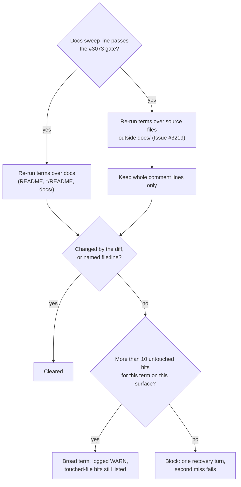

## Summary

Fleet PRs fixed the manuals and the comment directly above the code they
edited, then stopped. Doc comments in other source files still described the
removed behaviour: a shared constant's definition, a reader's safety argument,
a helper's list of callers (stSoftwareAU/VibeCoder#3215,
GRQ-AutoTrader#2460, #2393). The docs sweep named only manuals, so nothing
sent the agent to those comments, and the worker's #3172 re-run read only
docs. Closes #3219.

- [x] Prompt guidance (issue item 1): `prompts/issue/prompt.md` step 3 and the
      `prompts/pr_feedback/prompt.md` sweep now grep source files too. For
      each removed or changed name, and for the shared constants, types and
      helpers the changed code defines or calls, the agent reads every doc
      comment and module doc a hit lands in and fixes any sentence the change
      makes false, including in a file the diff does not otherwise touch.
- [x] Standards (issue item 2): `CODING-STANDARDS.md` → *A Code Change Owes a
      Docs Change* widens the "unchanged name" bullet to "the doc comments on
      the definitions and callers of what changed, wherever they live", and
      adds a **Doc comments outside the diff go stale too** bullet.
      `prompts/coding_guidelines/prompt.md` carries both word for word.
- [x] Worker check (issue item 3, optional, done): `checkDocsSweepTerms` in
      `worker/deno/lib/docs_sweep_hits.ts` re-runs the Docs sweep line's terms
      over source files outside `docs/` and keeps hits on whole comment lines.
      An uncleared hit blocks through the same single recovery turn as a
      manual hit.
- [x] Manuals: `docs/workflows/issue-processing.md` (Docs sweep on a code
      change), `docs/PROMPTS.md` (issue and pr_feedback rows).

## Spec

### Intent and Rationale

- All three incidents were greppable: the removed name (`park`,
  `query_exhausted`) hit the stale comment. Sending the agent's grep to source
  files fixes the cause; the worker re-run catches the agent who greps and
  still skips a hit.
- Item 3 fits the #3172 module without new machinery. It reuses the grep
  runner, the `git diff --unified=0` clearance, `file:line` naming, the
  broad-term cap of 10, the 20-hit report cap and the block path.

### Essential Design Decisions

- **Only whole comment lines are read** (`isSourceCommentLine`: `//`, `///`,
  `//!`, `/*`, a `*` continuation, or `#` followed by a space or end of line).
  A code line, or a comment trailing code, is not read: a term's own
  definition and its call sites are not prose to clear, and including them
  would block every PR whose terms are live identifiers. `#[…]`, `#!` and
  `#include` are excluded. Python docstrings are not read (no reliable
  line-local marker); that is a known gap.
- **Source pathspecs** (`SOURCE_COMMENT_PATHSPECS`): `*.ts`, `*.tsx`, `*.js`,
  `*.jsx`, `*.mjs`, `*.cjs`, `*.rs`, `*.py`, `*.go`, `*.java`, `*.kt`,
  `*.swift`, `*.c`, `*.h`, `*.cc`, `*.cpp`, `*.cs`, `*.rb`, `*.sh`, `*.ps1`,
  `*.psm1`, excluding `docs/` (the docs pass already reads it). Test files are
  included: a test's comment describing removed behaviour is stale too.
- **The broad-term cap is counted per surface.** A term with more than 10
  untouched source-comment hits is set aside for source only, so a term common
  in comments can never hide its doc hits (and the reverse). Hits in files the
  diff touched are always listed, as before.
- The diff is now taken over docs and source files together, so a source
  comment the PR edited is cleared like an edited doc line.

### Undiscoverable Facts

- Git's default pathspec `*` crosses `/`, so `*.ts` matches at any depth (the
  same fact #3172 relied on for `*/README.md`); the real-git test pins it with
  `web/helper.ts`.

## Evidence

Backend and prompt change; no UI files touched.

**Replay of stSoftwareAU/VibeCoder#3215.** The unit test "replay of
VibeCoder#3215" feeds the module the shape of that PR: term `park`; hits on
`merge_conflict_markers.ts:220` and `:307` (doc comments), `:234` (the
`CONFLICT_PARKED_MARKER` definition, a code line),
`merge_conflict_stall_watchdog.ts:17` (a line comment), and one comment line
the diff itself changed. It returns exactly `:220`, `:307` and
`merge_conflict_stall_watchdog.ts:17`.

**Related existing rules checked:** `CODING-STANDARDS.md` *A Code Change Owes
a Docs Change* ("the doc comment directly above the changed code", now
widened rather than contradicted; "Adding a member owes a docs change too",
which already names doc comments and module docs for set members; the stem
and re-run bullet, whose `file:line` clearance now covers source hits); the
PR Summary *Evidence* item ("re-runs the line's quoted terms over the head's
docs", updated to name source comment lines); `prompts/issue/prompt.md` step 3
(manual-only grep scope, extended). No rule was contradicted.

**Docs sweep** — grep: "over the head's docs", "directly above the changed
code", `DOCS_SWEEP_PATHSPECS`, "doc line"; section:
`docs/workflows/issue-processing.md#-docs-sweep-on-a-code-change`; updated:
`docs/workflows/issue-processing.md`, `docs/PROMPTS.md`,
`CODING-STANDARDS.md`, `prompts/issue/prompt.md`, `prompts/pr_feedback/prompt.md`,
`prompts/coding_guidelines/prompt.md`, `worker/deno/lib/docs_sweep_hits.ts`,
`worker/deno/lib/phases/completion_phase.ts`; re-run on the final head with
this PR's own `checkDocsSweepTerms` (which found the second hit, a source
comment), remaining hits:
`docs/audits/security-sweep-2184-commands-setup-delta.md:115` — still true
because it is about a JSDoc line in another module, not the Docs sweep;
`worker/deno/tests/completion_phase_docs_sweep_test.ts:92` — still true
because `grepOutput` is the docs pass's answer and the source pass now has its
own `sourceGrepOutput`

## Test Plan

- `worker/deno/tests/docs_sweep_hits_test.ts` (8 new tests, 49 in the file):
  `isSourceCommentLine` accepts line, block, doc and hash comments and rejects
  code, a trailing comment, `#[derive]`, `#!`, `#include` and `*ptr`; the
  source pass greps `SOURCE_COMMENT_PATHSPECS` at `HEAD` case-insensitively;
  the VibeCoder#3215 replay; a source hit named as `file:line` is cleared; the
  broad-term cap counted per surface; the diff spans docs and source; the
  comment names source comment lines. The real-git test now also finds an
  untouched `web/helper.ts` comment and ignores its trailing comment. Run red
  first (the new exports did not exist), then green.
- `worker/deno/tests/completion_phase_docs_sweep_test.ts` (2 new tests, 13 in
  the file, through `workOnIssueCompletion`): a stale doc comment in an
  untouched source file fails the run with no PR; a source hit on a code line
  does not block. The blocking test was run against the unchanged module
  first: 12 passed, 1 failed (that test).
- `worker/deno/tests/source_doc_comments_3219_docs_test.ts` (new, 3 tests):
  the rule is in both `CODING-STANDARDS.md` and
  `prompts/coding_guidelines/prompt.md`, word for word, with the widened
  "unchanged name" bullet; the issue prompt's step 3 and the pr_feedback
  sweep carry the source-file guidance. Every pinned phrase reported
  `absent on base` from `deno task drift-pins-on-base origin/main` for each of
  the four docs.
- Targeted run (every test file that reads a doc or prompt this PR edits, or
  the docs-sweep and completion-phase suites, plus
  `prompt_house_vocabulary_drift_test.ts`; 437 files, `DENO_JOBS=4
  --parallel`): 7226 passed, 1 failed. The failure,
  `planning_processor_test.ts` "drafts, self-critiques, revises, then
  publishes (Issue #2652)", fails alone too; it reads no file this PR changes
  and imports neither changed module.
- `deno fmt --check`, `deno lint`, `deno task check` and
  `deno task check:manifests` (665 passed, 0 failed, 1 ignored): passed.
  `npx -y markdownlint-cli2`: 0 issues. The full `deno test` suite and
  `./quality.sh` were not run here, because the shared container OOM-kills
  them; CI runs the full suite.
