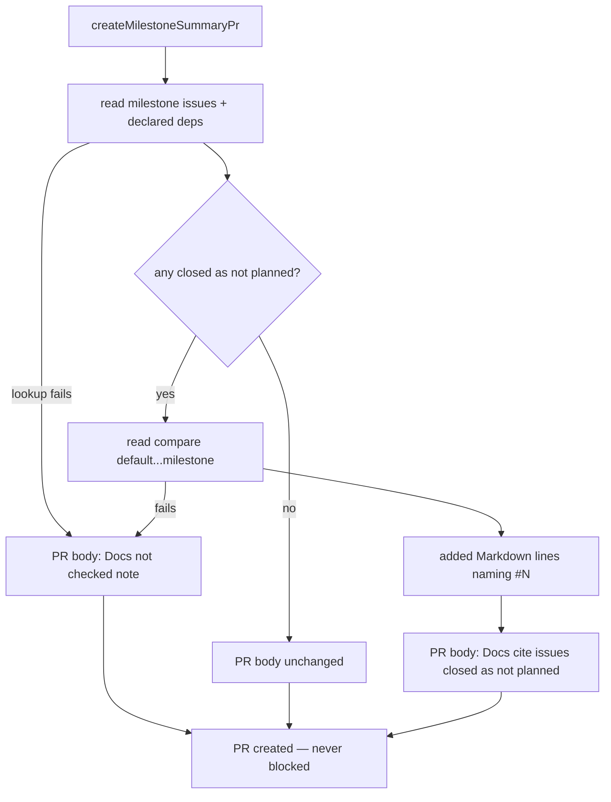

# PR summary: flag forward references to another issue's unbuilt work (Issue #3223)

## Summary

Closes #3223.

Fleet PRs added docs that describe work owned by **another issue** as if it
already ships. That issue was a sibling sub-issue, a milestone's planned issue
or a follow-up, and its code was not on the branch (GRQ-AutoTrader#2464,
GRQ-AutoTrader#2506, VibeCoder#3156).

- [x] `CODING-STANDARDS.md` has a new paragraph, **Behaviour another issue
      delivers is not described as present**, after **Prose about the PR's own
      change**. Such work may be named only as planned ("not yet: #N will …")
      and only while #N is open. Before writing the sentence, run
      `gh issue view N` and grep the head for the deliverable. When the issue's
      plan names a sibling, grep the touched docs for that sibling's `#N`. The
      paragraph adds to the docs-must-match-head rule and does not relax it.
- [x] Step 3 (docs) of `prompts/issue/prompt.md` carries the same rule and
      points to the `CODING-STANDARDS.md` paragraph.
- [x] Milestone guardrail: when `createMilestoneSummaryPr()` raises the
      summary PR into the default branch, `findNotPlannedDocReferences()`
      (new `worker/deno/lib/milestone_not_planned_refs.ts`) finds the
      milestone's issues, and the issues they declare with `Depends on` or
      `Blocked by`, that were closed as not planned. It then reads the compare
      diff and lists in the PR body each added Markdown line that names one of
      those issues. Markdown files with no diff text, and the compare API's
      300-file cap, are reported as not checked. If a lookup fails, a "not
      checked" note goes in instead. The check never blocks PR creation.
- [x] The optional fifth parameter of `buildMilestoneSummaryBody()` is renamed
      from `dependencyNote` to `extraSections`. It now carries the #3014
      pending-dependencies hold and the new not-planned section, joined with a
      blank line.
- [x] `docs/workflows/milestones.md` documents the guardrail in a new section,
      **Docs citing issues closed as not planned (Issue #3223)**.

## Spec

### Intent and Rationale

- The rule stops the agent writing a plan as present tense. The milestone
  guardrail catches what slips through after a sibling is dropped later,
  because milestone sub-PRs merge on green CI without review (Issue #3177).
- The issue allows listing hits in the PR body for the reviewer instead of
  blocking. Listing was chosen so a stale doc line cannot strand a finished
  milestone.

### Essential Design Decisions

- Fail open, never silent: a scan failure puts the "not checked" note in the
  PR body and never presents a clean result. Patch-less Markdown files and the
  300-file cap are named as not checked.
- The compare diff is read only when a not-planned candidate exists, so a
  milestone with no dropped issue costs one extra API call.
- Only `#N` and this repo's `owner/repo#N` count. Hex colours, HTML entities
  and other repos' references are rejected by a bounded backward walk, not a
  backtracking regex.

### Undiscoverable Facts

- "Referenced by" the milestone is read as declared `Depends on` / `Blocked by`
  references (`extractDependencyReferences`), the same set the #3014 hold
  uses. Not every `#N` in a body counts.

## Evidence

Backend and docs only, with no UI file. The scan runs once, when the summary PR
is created:

**Docs sweep** — grep: `dependencyNote`, `buildMilestoneSummaryBody`, `createMilestoneSummaryPr`, `findNotPlannedDocReferences`, `milestone_not_planned_refs`, "closed as not planned", "Held: pending dependencies" over `README.md`, `*/README.md`, `docs/` (excluding `docs/archive/`) and `*.ts`; section: `docs/workflows/milestones.md#️-pending-dependencies-hold-the-summary-pr-issue-3014`; updated: `docs/workflows/milestones.md`, `worker/deno/tests/milestone_completion_test.ts` (stale `dependencyNote` comment and test names); `docs/workflows/milestones.md:273` — still true because `createMilestoneSummaryPr()` still runs the #3014 check; `docs/workflows/milestones.md:274` — still true because the body still gains the hold section; `worker/deno/lib/milestone_completion.ts:639` — still true because it is the section banner of the unchanged function name; `worker/deno/lib/milestone_completion.ts:788` — still true because it is the section banner of `createMilestoneSummaryPr`; `worker/deno/tests/milestone_completion_test.ts:419` — still true because it is the test-section banner; `worker/deno/lib/milestone_completion.ts:974` — still true because the local `dependencyNote` still holds only the #3014 note; `worker/deno/lib/milestone_dependency_hold.ts:261` — still true because the hold heading is unchanged; `docs/workflows/milestones.md:671` — still true because it only links the user docs, and this change adds no new user doc; `worker/deno/lib/docs_sweep_hits.ts:81` — still true because it describes git pathspec matching, which this change does not touch; `worker/deno/lib/git_base_ref.ts:22` — still true because it cites a past diff-base incident unrelated to milestone summary PRs; `worker/deno/lib/lib_sweep_coverage.ts:682` — still true because it describes the lib sweep, which this change does not touch; `worker/deno/lib/milestone_merge_gate.ts:12` — still true because this change does not alter the milestone merge gate's check command; `worker/deno/lib/phases/completion_phase.ts:1776` — still true because it cites a past diff-base incident unrelated to this change; `worker/deno/lib/unit_test_passes.ts:272` — still true because the quality gate's type-check stage is unchanged; `worker/deno/tests/completion_phase_diff_base_2147_test.ts:7` — still true because it cites a past diff-base incident unrelated to this change; `worker/deno/tests/quality_gate_test.ts:463` — still true because this change adds no standalone entrypoint; `worker/deno/tests/unit_test_passes_test.ts:201` — still true because the quality gate's type-check stage is unchanged

Other hits not in the diff are code, not comments. They are the calls and
imports of `buildMilestoneSummaryBody` and `createMilestoneSummaryPr`, the
`dependencyNote` assignments at `worker/deno/lib/milestone_completion.ts:988`
and `:996`, and test strings asserting the unchanged hold heading. None of them
describes behaviour this change alters.

Code each new claim rests on: the `Depends on`/`Blocked by` set is
`extractDependencyReferences` in `worker/deno/lib/issue_dependencies.ts`. The
claim that the scan is not re-checked at merge time holds because
`findNotPlannedDocReferences` has one caller, `createMilestoneSummaryPr`
(`worker/deno/lib/milestone_completion.ts:1006`).

Related existing rules checked: **Prose about the PR's own change** and the
docs-must-match-head paragraph in `CODING-STANDARDS.md` (#3058, #3120),
**A Code Change Owes a Docs Change**, and step 3 of `prompts/issue/prompt.md`.
The new rule only adds a procedure for forward references, and none of these
rules conflicts with it.

## Test Plan

- No assertion was removed from an existing test.
  `worker/deno/tests/milestone_completion_test.ts` only gains tests. Two
  existing test names and one comment are reworded from `dependencyNote` to
  `extraSections`, and none of their assertion lines changed. The other two
  test files are new.
- Added `worker/deno/tests/milestone_not_planned_refs_test.ts` (38 tests).
- Added five `checkAndHandleMilestoneCompletions` tests to
  `worker/deno/tests/milestone_completion_test.ts`. They cover a not-planned
  hit, a compare failure, a patch-less Markdown file, a clean scan (no section
  and no compare call), and the hold and not-planned sections joined by one
  blank line.
- Added `worker/deno/tests/forward_reference_rule_3223_docs_test.ts`.
  `deno task drift-pins-on-base origin/main …` reported every pinned phrase
  as absent on base, in `CODING-STANDARDS.md` § PR Summary and Evidence
  (`Behaviour another issue delivers is not described as present`,
  `only while #N is open`, `grep the head for its deliverable`,
  ``that sibling's `#N` ``, `closed as not planned`) and in
  `prompts/issue/prompt.md` § Instructions (the first four phrases).
- `deno test -A tests/milestone_not_planned_refs_test.ts
  tests/milestone_completion_test.ts` (from `worker/deno`) on the final head:
  117 passed, 0 failed.
- Entry point checked: `createMilestoneSummaryPr()`, reached through
  `checkAndHandleMilestoneCompletions`. Dropping `notPlannedNote` from the
  `extraSections` join turns the new completion tests red.
- Simplified: the self-dependency guard and the already-a-candidate guard in
  the dependency loop were removed. The member set and the lookup cache
  already cover both, so no input could reach them. The tests for those inputs
  still pass.

**Branch outcomes:**

- `worker/deno/lib/milestone_not_planned_refs.ts:86` — skip (non-object item) — `worker/deno/tests/milestone_not_planned_refs_test.ts::findNotPlannedDocReferences - non-object, non-integer-number and pull-request items are skipped from the issues page` — guard removed, test went red
- `worker/deno/lib/milestone_not_planned_refs.ts:88` — skip (non-integer `number`) — `worker/deno/tests/milestone_not_planned_refs_test.ts::findNotPlannedDocReferences - an item with a non-integer issue number never becomes a candidate` — guard removed, test went red
- `worker/deno/lib/milestone_not_planned_refs.ts:89` — skip (pull request in the issues list) — `worker/deno/tests/milestone_not_planned_refs_test.ts::findNotPlannedDocReferences - non-object, non-integer-number and pull-request items are skipped from the issues page` — guard removed, test went red
- `worker/deno/lib/milestone_not_planned_refs.ts:107` — closed as not planned vs closed completed — `worker/deno/tests/milestone_not_planned_refs_test.ts::findNotPlannedDocReferences - completed-closed member is ignored` — flipped to accept any closed state, test went red
- `worker/deno/lib/milestone_not_planned_refs.ts:133` — hunk header sets the new-file line — `worker/deno/tests/milestone_not_planned_refs_test.ts::findNotPlannedDocReferences - member closed not_planned, doc names it` — flipped to always start at line 1, test went red
- `worker/deno/lib/milestone_not_planned_refs.ts:137` — absent (line before the first hunk) — `worker/deno/tests/milestone_not_planned_refs_test.ts::addedLines - lines before the first hunk are ignored` — flipped to count it, test went red
- `worker/deno/lib/milestone_not_planned_refs.ts:139` — added (`+`) line recorded — `worker/deno/tests/milestone_not_planned_refs_test.ts::addedLines - removed and context lines are not matched as added` — flipped to drop the text, test went red
- `worker/deno/lib/milestone_not_planned_refs.ts:142` — context line advances the counter, not recorded — `worker/deno/tests/milestone_not_planned_refs_test.ts::addedLines - removed and context lines are not matched as added` — flipped to record it, test went red
- `worker/deno/lib/milestone_not_planned_refs.ts:175` — reject (hex colour `#2303ff`) — `worker/deno/tests/milestone_not_planned_refs_test.ts::findIssueReferences - rejects cross-repo, hex colour, HTML entity and bare 'foo#N'` — guard disabled, test went red
- `worker/deno/lib/milestone_not_planned_refs.ts:179` — reject (HTML entity `&#8212;`) — `worker/deno/tests/milestone_not_planned_refs_test.ts::findIssueReferences - rejects cross-repo, hex colour, HTML entity and bare 'foo#N'` — guard disabled, test went red
- `worker/deno/lib/milestone_not_planned_refs.ts:186` — bounded backward walk over the repo slug — `worker/deno/tests/milestone_not_planned_refs_test.ts::findIssueReferences - accepts bare, parenthesised and spelt-out same-repo refs` — bound cut to 2, test went red
- `worker/deno/lib/milestone_not_planned_refs.ts:195` — accept (bare `#N`) — `worker/deno/tests/milestone_not_planned_refs_test.ts::findIssueReferences - accepts bare, parenthesised and spelt-out same-repo refs` — flipped to reject, test went red
- `worker/deno/lib/milestone_not_planned_refs.ts:198` — accept this repo / reject another repo — `worker/deno/tests/milestone_not_planned_refs_test.ts::findIssueReferences - rejects cross-repo, hex colour, HTML entity and bare 'foo#N'` — flipped to accept any repo, test went red
- `worker/deno/lib/milestone_not_planned_refs.ts:200` — reject (`foo#N`) — `worker/deno/tests/milestone_not_planned_refs_test.ts::findIssueReferences - rejects cross-repo, hex colour, HTML entity and bare 'foo#N'` — flipped to accept, test went red
- `worker/deno/lib/milestone_not_planned_refs.ts:206` — de-duplicate a repeated `#N` on one line — `worker/deno/tests/milestone_not_planned_refs_test.ts::findIssueReferences - a repeated reference on one line is de-duplicated` — guard removed, test went red
- `worker/deno/lib/milestone_not_planned_refs.ts:237` — error (invalid repo) — `worker/deno/tests/milestone_not_planned_refs_test.ts::findNotPlannedDocReferences - invalid repo is ok:false` — guard disabled, test went red
- `worker/deno/lib/milestone_not_planned_refs.ts:240` — error (invalid milestone number; a legal number is accepted) — `worker/deno/tests/milestone_not_planned_refs_test.ts::findNotPlannedDocReferences - invalid milestone number is refused before any gh call` — guard disabled, test went red
- `worker/deno/lib/milestone_not_planned_refs.ts:246` — error (invalid default branch; a legal name is accepted) — `worker/deno/tests/milestone_not_planned_refs_test.ts::findNotPlannedDocReferences - invalid default branch name is refused` — guard disabled, test went red
- `worker/deno/lib/milestone_not_planned_refs.ts:252` — error (invalid milestone branch) — `worker/deno/tests/milestone_not_planned_refs_test.ts::findNotPlannedDocReferences - invalid branch is ok:false` — guard disabled, test went red
- `worker/deno/lib/milestone_not_planned_refs.ts:268` — error (member list unreadable) — `worker/deno/tests/milestone_not_planned_refs_test.ts::findNotPlannedDocReferences - member-list failure is ok:false` — flipped to an empty ok scan, test went red
- `worker/deno/lib/milestone_not_planned_refs.ts:281` — candidate (member closed as not planned) — `worker/deno/tests/milestone_not_planned_refs_test.ts::findNotPlannedDocReferences - member closed not_planned, doc names it` — flipped to never a candidate, test went red
- `worker/deno/lib/milestone_not_planned_refs.ts:295` — skip (dependency is a milestone member, self included) — `worker/deno/tests/milestone_not_planned_refs_test.ts::findNotPlannedDocReferences - a member depending on another member triggers no single-issue lookup` — guard removed, test went red
- `worker/deno/lib/milestone_not_planned_refs.ts:298` — cached lookup of a repeated dependency — `worker/deno/tests/milestone_not_planned_refs_test.ts::findNotPlannedDocReferences - two members declaring the same outside completed dependency trigger exactly one cached lookup` — cache bypassed, test went red
- `worker/deno/lib/milestone_not_planned_refs.ts:305` — candidate (outside dependency closed as not planned) / not a candidate (closed completed) — `worker/deno/tests/milestone_not_planned_refs_test.ts::findNotPlannedDocReferences - declared dependency outside the milestone, closed not_planned` — condition inverted, test went red
- `worker/deno/lib/milestone_not_planned_refs.ts:314` — error (dependency lookup fails) — `worker/deno/tests/milestone_not_planned_refs_test.ts::findNotPlannedDocReferences - dependency-lookup failure is ok:false` — flipped to skip the dependency, test went red
- `worker/deno/lib/milestone_not_planned_refs.ts:333` — empty (no candidates, compare never read) — `worker/deno/tests/milestone_not_planned_refs_test.ts::findNotPlannedDocReferences - no candidates means compare is never called` — guard disabled, test went red
- `worker/deno/lib/milestone_not_planned_refs.ts:344` — error (compare has no `files` array) — `worker/deno/tests/milestone_not_planned_refs_test.ts::findNotPlannedDocReferences - compare non-array files is ok:false` — guard disabled, test went red
- `worker/deno/lib/milestone_not_planned_refs.ts:355` — error (compare call fails) — `worker/deno/tests/milestone_not_planned_refs_test.ts::findNotPlannedDocReferences - compare failure is ok:false` — flipped to an empty ok scan, test went red
- `worker/deno/lib/milestone_not_planned_refs.ts:367` — unchecked (300-file cap reached) — `worker/deno/tests/milestone_not_planned_refs_test.ts::findNotPlannedDocReferences - 300 files triggers a truncation entry` — guard disabled, test went red
- `worker/deno/lib/milestone_not_planned_refs.ts:379` — skip (non-Markdown file) — `worker/deno/tests/milestone_not_planned_refs_test.ts::findNotPlannedDocReferences - non-Markdown file ignored` — extension check removed, test went red
- `worker/deno/lib/milestone_not_planned_refs.ts:380` — skip (removed Markdown file) — `worker/deno/tests/milestone_not_planned_refs_test.ts::findNotPlannedDocReferences - removed Markdown file is not scanned` — guard removed, test went red
- `worker/deno/lib/milestone_not_planned_refs.ts:382` — unchecked (Markdown file without a patch) — `worker/deno/tests/milestone_not_planned_refs_test.ts::findNotPlannedDocReferences - Markdown file without patch is unchecked` — flipped to skip silently, test went red
- `worker/deno/lib/milestone_not_planned_refs.ts:391` — skip (line names an issue that is not a candidate) — `worker/deno/tests/milestone_not_planned_refs_test.ts::findNotPlannedDocReferences - a doc line naming a non-candidate issue is not reported, while another line's candidate is` — replaced with a fallback candidate, test went red
- `worker/deno/lib/milestone_not_planned_refs.ts:394` — merge a second hit for the same (issue, file) — `worker/deno/tests/milestone_not_planned_refs_test.ts::findNotPlannedDocReferences - the same issue named on two lines of one file yields one reference with both line numbers ascending; a second file is a separate entry` — flipped to always recreate the entry, test went red
- `worker/deno/lib/milestone_not_planned_refs.ts:423` — empty (nothing to report renders "") — `worker/deno/tests/milestone_not_planned_refs_test.ts::renderNotPlannedDocSection - empty scan renders nothing` — guard removed, test went red
- `worker/deno/lib/milestone_not_planned_refs.ts:425` — "cite" vs "not checked" heading — `worker/deno/tests/milestone_not_planned_refs_test.ts::renderNotPlannedDocSection - lists issue, file and lines` — condition inverted, test went red
- `worker/deno/lib/milestone_not_planned_refs.ts:431` — references listed — `worker/deno/tests/milestone_not_planned_refs_test.ts::renderNotPlannedDocSection - lists issue, file and lines` — guard disabled, test went red
- `worker/deno/lib/milestone_not_planned_refs.ts:451` — unchecked files listed — `worker/deno/tests/milestone_not_planned_refs_test.ts::renderNotPlannedDocSection - unchecked-only scan still renders` — guard disabled, test went red
- `worker/deno/lib/milestone_not_planned_refs.ts:452` — one blank line between references and the unchecked list — `worker/deno/tests/milestone_not_planned_refs_test.ts::renderNotPlannedDocSection - exactly one blank line separates the last reference bullet from 'Not checked'` — separator removed, test went red
- `worker/deno/lib/milestone_completion.ts:1013` — scan succeeded — `worker/deno/tests/milestone_completion_test.ts::checkAndHandleMilestoneCompletions - summary PR body cites a doc line naming a not-planned issue` — flipped to the failure arm, test went red
- `worker/deno/lib/milestone_completion.ts:1015` — section added (hits or unchecked files) — `worker/deno/tests/milestone_completion_test.ts::checkAndHandleMilestoneCompletions - summary PR body notes an unchecked Markdown file with no patch` — flipped to never add, test went red
- `worker/deno/lib/milestone_completion.ts:1015` — absent (clean scan leaves the PR body without the section) — `worker/deno/tests/milestone_completion_test.ts::checkAndHandleMilestoneCompletions - summary PR body omits not-planned section on a clean scan` — flipped to add the unverified note on a clean scan, test went red
- `worker/deno/lib/milestone_completion.ts:1018` — warning logged when hits exist — `worker/deno/tests/milestone_completion_test.ts::checkAndHandleMilestoneCompletions - summary PR body cites a doc line naming a not-planned issue` — guard disabled, test went red
- `worker/deno/lib/milestone_completion.ts:1034` — fail-open (scan error swaps in the unverified note, PR still created) — `worker/deno/tests/milestone_completion_test.ts::checkAndHandleMilestoneCompletions - summary PR body notes the not-planned scan could not run when compare fails` — note removed, test went red
- `worker/deno/lib/milestone_completion.ts:1037` — both sections joined into `extraSections` with one blank line — `worker/deno/tests/milestone_completion_test.ts::checkAndHandleMilestoneCompletions - summary PR body holds and cites a not-planned issue together` — separator changed to `"\n"`, test went red

🤖 Generated with [Claude Code](https://claude.com/claude-code)
