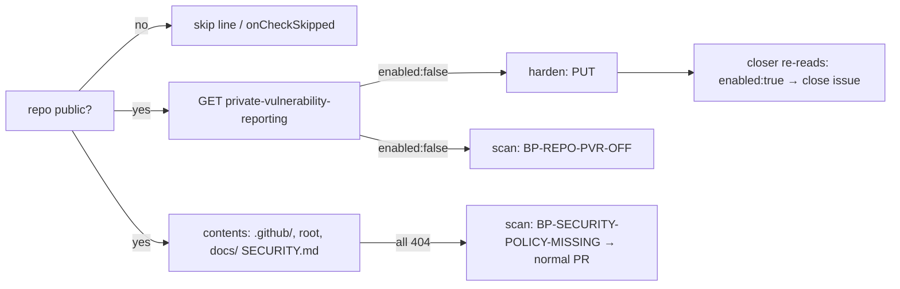

## Summary

Setup now enforces GitHub private vulnerability reporting (PVR) on public
monitored repositories, and the weekly settings scan reports PVR that is off
and a missing `SECURITY.md`. Closes #3227.

- `repo-settings-harden` reads `repos/{repo}/private-vulnerability-reporting`
  on a public repository and, when it reads `enabled: false`, plans and applies
  "Enable private vulnerability reporting" (`PUT`). If PVR is already on,
  nothing is planned. A dry run writes nothing. A private or internal
  repository is skipped, and its line says
  `private vulnerability reporting: skipped — not a public repository`. A
  refused write is a `failed` result, so the step returns `false`.
- `scanRepoSettings` files `BP-REPO-PVR-OFF` when a public repository reads
  `enabled: false`. It files `BP-SECURITY-POLICY-MISSING` when no `SECURITY.md`
  exists at `.github/`, the root or `docs/` on the default branch. The check
  is presence only. Private and internal repositories record one skipped check
  instead.
- The audit closer maps `BP-REPO-PVR-OFF` to the new step and closes it only
  once the re-read shows `enabled: true`.
- `SECURITY.md`'s "Reporting a Vulnerability" steps now name PVR
  (*Security → Advisories → Report a vulnerability*) and
  `security@stsoftware.com.au`.

## Spec

### Intent and Rationale

- PVR and a security policy should not depend on someone remembering to set
  them. Setup fixes the PVR setting, and the audit makes either gap visible.
- Every piece follows the existing secret-scanning / CodeQL path: the same
  visibility gate (`needsPaidSecretProtection`), the same per-repo tally and
  the same closer mapping.

### Essential Design Decisions

- The `SECURITY.md` finding is `BP-SECURITY-POLICY-MISSING`, not the issue's
  working name `BP-REPO-SECURITY-POLICY-MISSING`. `isAdminOnlyRepoSettingsIssue`
  (`worker/deno/lib/admin_only_finding.ts`) treats every `BP-REPO-*` id as an
  admin-only settings change, and `worker/deno/lib/issue_worker.ts` hands those
  to `needs-human` before running the agent. A missing `SECURITY.md` is fixed
  by a normal PR, so it must stay outside that prefix. A test pins this.
- The `SECURITY.md` lookup reuses the CODEOWNERS walk. `findCodeownersOnDefaultBranch`
  is generalised into `findFileOnDefaultBranch(repo, paths, gh)`, and
  CODEOWNERS now delegates to it. Only a 404 at every path counts as absent.
  Any other error is a lookup failure, never a finding.
- `BP-REPO-PVR-OFF` needs a positive read-back (`enabled === true`). The
  scanner is silent when PVR was never read, so its silence alone closes
  nothing.

### Undiscoverable Facts

- On 2026-10-04 all 7 public monitored repositories already had PVR on and a
  root `SECURITY.md` (recorded in the issue). This change keeps them that way.
- The grill-me rounds accepted: monitored repositories only, a scanner
  finding for PVR, a presence-only `SECURITY.md` check fixed by a per-repo PR,
  and fixing VibeCoder's own disclosure section here.

## Evidence

This is a backend/CLI change with no UI. The tests below are the evidence.

**Docs sweep** — grep: `findCodeownersOnDefaultBranch`, `CodeownersLocation`, `BP-REPO-PUSH-PROTECTION-OFF`, `BP-REPO-SECURITY-POLICY-MISSING`, `private.vulnerability.reporting`, `FINDING_STEP_KIND`, `BP-REPO-\*`, "four surfaces", "five settings surfaces"; section: `docs/GITHUB-ACTIONS-AUDIT-SCAN.md#closing-the-settings-findings-repo-settings-harden` and `docs/SETUP.md#repository-settings-hardening`; updated: `docs/GITHUB-ACTIONS-AUDIT-SCAN.md`, `docs/SETUP.md`, `SECURITY.md`, module docs of `worker/deno/lib/repo_settings_scanner.ts`, `worker/deno/lib/repo_settings_harden.ts`, `worker/deno/lib/admin_only_finding.ts`, `worker/deno/setup/repo_settings_audit_close.ts`, `worker/deno/setup/repo_settings_harden_sync.ts`; `docs/GITHUB-ACTIONS-AUDIT-SCAN.md:1113` — still true because the secret-scanning private-repo exemption is unchanged; `docs/GITHUB-ACTIONS-AUDIT-SCAN.md:1258` — still true because `findCodeownersOnDefaultBranch(repo, gh)` keeps its signature and paths; `docs/SETUP.md:426` — still true because the closer still closes only fleet-filed `BP-REPO-*` issues; `docs/audits/security-sweep-2627-codeowners-sync.md:16` — still true because it is a dated sweep record and the function still exists; `worker/deno/setup/codeowners_sync.ts:15` — still true because `findCodeownersOnDefaultBranch` is unchanged for callers; `worker/deno/setup/codeowners_sync.ts:42` — still true because the CODEOWNERS sync still binds `findCodeownersOnDefaultBranch` to `gh`, which now delegates to `findFileOnDefaultBranch` with the same result; `worker/deno/tests/repo_settings_harden_test.ts:708` — still true because that section still tests `hardenRepo` and `findCodeownersOnDefaultBranch`, which keeps its name and signature; `worker/deno/setup/repo_settings_audit_close.ts:14` — still true because a finding id still maps through `FINDING_STEP_KIND` to a step kind, and this change only adds the `BP-REPO-PVR-OFF` entry; `docs/audits/security-sweep-2629-repo-settings-audit-close.md:31` — still true because only ids in the static `FINDING_STEP_KIND` map can close, and `BP-REPO-PVR-OFF` is added to that map (it is also a dated sweep record); `docs/GITHUB-ACTIONS-AUDIT-SCAN.md:89` — still true because its "four surfaces" are the container-image surfaces of check #25, unrelated to repository settings; `docs/PROMPT-BEST-PRACTICES-CHECKLIST.md:63` — still true because its "four surfaces" are the wrapper-issue prompt templates, unrelated to repository settings; `worker/deno/tests/prompt_presence_gaps_test.ts:7` — still true because its "four surfaces" are the persona-less prompt templates of Issue #841, unrelated to repository settings; `worker/deno/tests/prompt_presence_gaps_test.ts:63` — still true because its "four surfaces" are the wrapper-issue prompt templates, unrelated to repository settings.

Related existing rules checked: none. No prompt template or coding-standard
rule changed.

## Acceptance Criteria

<!-- vibe-spec-review inputs="diff+issue-body" -->

- **met** — `repo-settings-harden` reads `GET repos/{repo}/private-vulnerability-reporting` on each public monitored repository; when it returns `enabled: false` it plans a step titled "Enable private vulnerability reporting" and applies it with `PUT`. — evidence: `worker/deno/tests/repo_settings_harden_test.ts::hardenRepo - a public repo with private vulnerability reporting off gets one PUT, applied (Issue #3227)` — reviewer: met
- **met** — When PVR is already enabled, no step is planned and nothing is written (a second setup run plans zero PVR steps). — evidence: `worker/deno/tests/repo_settings_harden_test.ts::hardenRepo - private vulnerability reporting already on makes no call and plans nothing (Issue #3227)` — reviewer: met
- **met** — `--dry-run` lists the PVR step and writes nothing. — evidence: `worker/deno/tests/repo_settings_harden_test.ts::hardenRepo - a dry run plans private vulnerability reporting without writing (Issue #3227)` — reviewer: met
- **met** — A private or internal repository is skipped and its line says so, matching the existing secret-scanning skip. — evidence: `worker/deno/tests/setup_repo_settings_harden_test.ts::runRepoSettingsHarden - a private repo's line reports PVR skipped, and neither reads nor writes it (Issue #3227)` — reviewer: met
- **met** — A refused PVR write is reported on that repository's line and makes the step return `false` (existing per-repo failure handling); it is never reported as success. — evidence: `worker/deno/tests/setup_repo_settings_harden_test.ts::runRepoSettingsHarden - a refused PVR write is reported on the repo's line and the step returns false (Issue #3227)` — reviewer: met
- **met** — `scanRepoSettings` emits a new finding `BP-REPO-PVR-OFF` for a public repository whose PVR read returns `enabled: false`, and none when it returns `true`. — evidence: `worker/deno/tests/repo_settings_scanner_test.ts::scanRepoSettings - a public repository with PVR off files exactly one BP-REPO-PVR-OFF finding (Issue #3227)` — reviewer: met
- **met** — The audit closer maps `BP-REPO-PVR-OFF` to the new PVR harden step and closes the finding issue once a re-read returns `enabled: true`, like `BP-REPO-SECRET-SCANNING-OFF`. — evidence: `worker/deno/tests/setup_repo_settings_audit_close_test.ts::a fleet-filed BP-REPO-PVR-OFF issue closes when the re-read confirms enabled (Issue #3227)` — reviewer: met
- **met** — `scanRepoSettings` emits a new finding (working name `BP-REPO-SECURITY-POLICY-MISSING`) when a public repository has no `SECURITY.md` in the root, `.github/` or `docs/` on its default branch — the same three places `findCodeownersOnDefaultBranch` searches for `CODEOWNERS`. The fix lands as a normal PR in that repository; setup never commits the file. — evidence: `worker/deno/tests/repo_settings_scanner_test.ts::scanRepoSettings - SECURITY.md absent at all three paths files BP-SECURITY-POLICY-MISSING; present at any one path is silent (Issue #3227)`, `worker/deno/tests/repo_settings_scanner_test.ts::scanRepoSettings - BP-SECURITY-POLICY-MISSING is not admin-only; BP-REPO-PVR-OFF is (Issue #3227)` — reviewer: met — reason: the id is `BP-SECURITY-POLICY-MISSING`, because a `BP-REPO-*` id would be routed to `needs-human` instead of a PR
- **met** — The `SECURITY.md` check passes on file presence alone; its wording is not inspected. — evidence: `worker/deno/lib/repo_settings_harden.ts::findFileOnDefaultBranch`, `worker/deno/tests/repo_settings_harden_test.ts::findFileOnDefaultBranch - returns the first present path in the order given (Issue #3227)` — reviewer: met
- **met** — VibeCoder's `SECURITY.md` "📢 Responsible Disclosure Policy" section is rewritten in this issue to point reporters at PVR (*Security → Advisories → Report a vulnerability*) and security@stsoftware.com.au, matching NEAT-AI-core. — evidence: `SECURITY.md` "Reporting a Vulnerability" steps 2–3 — reviewer: met
- **met** — Covered by Deno tests beside `worker/deno/tests/repo_settings_harden_test.ts`, `setup_repo_settings_harden_test.ts`, `repo_settings_scanner_test.ts` and `setup_repo_settings_audit_close_test.ts` — evidence: the Issue #3227 tests listed under Test Plan — reviewer: met
- **unrequested** — Doc updates to `docs/GITHUB-ACTIONS-AUDIT-SCAN.md` and `docs/SETUP.md` — reviewer: unrequested — reason: the docs owed for the changed behaviour (A Code Change Owes a Docs Change); no new behaviour

## Standards Review

<!-- vibe-standards-review inputs="diff+CODING-STANDARDS.md" -->

- **clean** — Branch-outcome coverage for the planner, visibility gates and failure paths. Negative tests can fail because routes are removed and fixtures hold the forbidden state. DRY: `findFileOnDefaultBranch` is reused, not copied. Admin-only routing is pinned by a test. Fail-loud: non-404 reads go to `onLookupFailure` / `failed`. Every removed test assertion is made untrue by the new PVR step or skip (optional note from the reviewer: `needsPaidSecretProtection` is named for its first caller's reason, but it is the same private/internal condition).

## Test Plan

Ran `deno task test:unit` on the four touched test files plus
`worker/deno/tests/admin_only_finding_test.ts`: all passed (128 + 60).
`./quality.sh < /dev/null` passed on the final code, with every stage PASSED
except `config integration`, which is SKIPPED as it always is on this host.

Added (all titled "… (Issue #3227)"):

- `worker/deno/tests/repo_settings_harden_test.ts`: planner off/on/absent, `hardenRepo` PUT applied, already on, dry run, private/internal skip, refused PUT, non-404 read failure, `findFileOnDefaultBranch` order.
- `worker/deno/tests/repo_settings_scanner_test.ts`: PVR off/on, private/internal reads nothing and records one skip, `SECURITY.md` absent at all three paths vs present at each, non-404 contents error, admin-only routing of both ids.
- `worker/deno/tests/setup_repo_settings_audit_close_test.ts`: closes on `enabled:true`; stays open on `enabled:false`, an absent read-back, and a failed step.
- `worker/deno/tests/setup_repo_settings_harden_test.ts`: PUT sent and step returns true; refused PUT reported and step returns false; private repo skip line with no read or write.

Removed or changed assertions in existing tests. #3227 adds PVR as a new
checked kind, so each count below gains one `unchanged` (public repo) or one
`skipped` (private repo), and the scanner records a second skip on private
repos:

- Removed from `worker/deno/tests/repo_settings_scanner_test.ts`: `assertEquals(skips.length, 1, JSON.stringify(skips));` — the private repo now also records the PVR/SECURITY.md skip; now `skips.length, 2`
- Moved `assertEquals( skips[0], "secret scanning / push protection: private repository — needs paid " + "GitHub Secret Protection", );` to `worker/deno/tests/repo_settings_scanner_test.ts` (same test) as a `skips.includes(...)` check of the same string — #3227 adds a second private-repo skip, so `skips[0]` no longer names a fixed entry
- Removed from `worker/deno/tests/repo_settings_scanner_test.ts`: `assertEquals(skips.length, 1);` (internal-repo and boolean-private-flag tests) — #3227 adds the PVR/SECURITY.md skip; now `2`
- Removed from `worker/deno/tests/repo_settings_scanner_test.ts`: `assertEquals(skips, []);` — #3227 makes a private repo always record the PVR/SECURITY.md skip; now `[PVR_AND_SECURITY_MD_SKIP_CHECK]`
- Removed from `worker/deno/tests/setup_repo_settings_audit_close_test.ts`: `assertEquals( [...ids].sort(), [ "BP-REPO-ACTIONS-MAY-APPROVE-PRS", "BP-REPO-DEFAULT-TOKEN-WRITE", "BP-REPO-RULESET-NO-REVIEW", ], );` — #3227 maps `BP-REPO-PVR-OFF` to the PVR step, which has no result in that outcome and so is eligible; the list now also holds `"BP-REPO-PVR-OFF"`
- Removed from `worker/deno/tests/setup_repo_settings_harden_test.ts`: `` assertStringIncludes( first.lines.join("\n"), `${repo}: 6 applied, 1 unchanged, 0 skipped, 0 failed`, ); `` — #3227 reads PVR as on, adding one unchanged; now `2 unchanged`
- Removed from `worker/deno/tests/setup_repo_settings_harden_test.ts`: `` assertStringIncludes( second.lines.join("\n"), `${repo}: 0 applied, 7 unchanged, 0 skipped, 0 failed`, ); `` (two tests) — #3227 adds the PVR unchanged; now `8 unchanged`
- Removed from `worker/deno/tests/setup_repo_settings_harden_test.ts`: `assertMatch( last, /^Repo-settings hardening: 0 applied, 7 unchanged, 0 skipped, 0 failed across 1 repo\(s\)/, );` — #3227 adds the PVR unchanged; now `8 unchanged`
- Removed from `worker/deno/tests/setup_repo_settings_harden_test.ts`: `` assertStringIncludes( out, `${healthy}: 6 applied, 1 unchanged, 0 skipped, 0 failed`, ); `` — #3227 adds the PVR unchanged; now `2 unchanged`
- Removed from `worker/deno/tests/setup_repo_settings_harden_test.ts`: `` assertStringIncludes( out, `${repo}: 5 applied, 1 unchanged, 0 skipped, 1 failed`, ); `` — #3227 adds the PVR unchanged; now `2 unchanged`
- Removed from `worker/deno/tests/setup_repo_settings_harden_test.ts`: `assertStringIncludes(line, "4 applied, 1 unchanged, 2 skipped, 0 failed");` — #3227 skips PVR on the private repo; now `3 skipped`
- Removed from `worker/deno/tests/setup_repo_settings_harden_test.ts`: `assertStringIncludes(line, "6 planned, 1 unchanged, 0 skipped, 0 failed");` — #3227 adds the PVR unchanged; now `2 unchanged`
- Removed from `worker/deno/tests/setup_repo_settings_harden_test.ts`: `assertStringIncludes(line, "5 applied, 1 unchanged, 1 skipped, 0 failed");` (two tests) — #3227 adds the PVR unchanged; now `2 unchanged`

**Branch outcomes:**

- `worker/deno/lib/repo_settings_harden.ts:569` — PVR off → step planned — `worker/deno/tests/repo_settings_harden_test.ts::planRepoSettingsHardening - private vulnerability reporting off plans the exact PUT step (Issue #3227)` — red on base (no step exists there)
- `worker/deno/lib/repo_settings_harden.ts:569` — PVR on / absent → nothing — `worker/deno/tests/repo_settings_harden_test.ts::planRepoSettingsHardening - private vulnerability reporting already on plans nothing (Issue #3227)` and `…not read (field absent, e.g. a private repo) plans nothing (Issue #3227)` — pins the no-op side of the same condition
- `worker/deno/lib/repo_settings_harden.ts:1949` — non-public → skip note, no read — `worker/deno/tests/repo_settings_harden_test.ts::hardenRepo - a private repo never reads private vulnerability reporting and reports the skip (Issue #3227)` — red on base (no `pvrSkipNote`)
- `worker/deno/setup/repo_settings_harden_sync.ts:220` — skip note tallied as skipped — `worker/deno/tests/setup_repo_settings_harden_test.ts::runRepoSettingsHarden - a private repo's line reports PVR skipped, and neither reads nor writes it (Issue #3227)` — removing the branch turned it red
- `worker/deno/lib/repo_settings_scanner.ts:376` — non-public → `onCheckSkipped`, no reads — `worker/deno/tests/repo_settings_scanner_test.ts::scanRepoSettings - a private or internal repository reads neither PVR nor SECURITY.md and records one skip (Issue #3227)` — forcing `exempt = false` turned it red
- `worker/deno/lib/repo_settings_scanner.ts:388` — PVR off → `BP-REPO-PVR-OFF` — `worker/deno/tests/repo_settings_scanner_test.ts::scanRepoSettings - a public repository with PVR off files exactly one BP-REPO-PVR-OFF finding (Issue #3227)` — red on base
- `worker/deno/lib/repo_settings_scanner.ts:409` — non-404 contents error → `onLookupFailure`, no finding — `worker/deno/tests/repo_settings_scanner_test.ts::scanRepoSettings - a non-404 error reading SECURITY.md is reported, not a finding (Issue #3227)` — red on base
- `worker/deno/lib/repo_settings_scanner.ts:411` — absent → `BP-SECURITY-POLICY-MISSING`; present → silent — `worker/deno/tests/repo_settings_scanner_test.ts::scanRepoSettings - SECURITY.md absent at all three paths files BP-SECURITY-POLICY-MISSING; present at any one path is silent (Issue #3227)` — renaming the id back to `BP-REPO-…` turned it and the admin-only test red
- `worker/deno/lib/repo_settings_harden.ts:2083` — paths walked in the given order, first present wins — `worker/deno/tests/repo_settings_harden_test.ts::findFileOnDefaultBranch - returns the first present path in the order given (Issue #3227)` — reversing the loop turned it red
- `worker/deno/setup/repo_settings_audit_close.ts:100` — PVR finding eligible for closing — `worker/deno/tests/setup_repo_settings_audit_close_test.ts::a fleet-filed BP-REPO-PVR-OFF issue closes when the re-read confirms enabled (Issue #3227)` — removing the map entry turned it red
- `worker/deno/setup/repo_settings_audit_close.ts:275` — absent read-back → stays open — `worker/deno/tests/setup_repo_settings_audit_close_test.ts::a fleet-filed BP-REPO-PVR-OFF issue stays open when the read-back is absent, even though the scanner is silent (Issue #3227)` — removing the positive check turned it red
