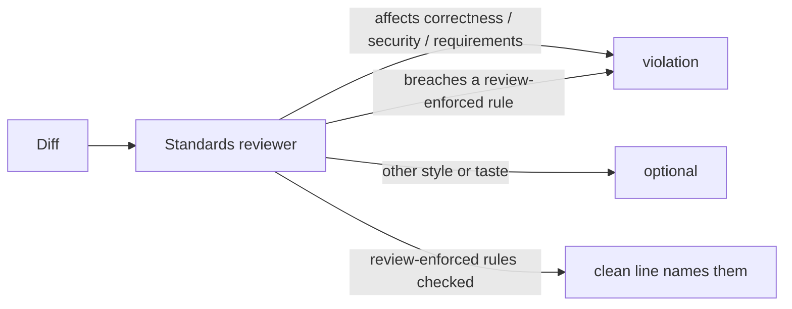

# PR Summary — Issue #3230

## Summary

The issue-phase Standards reviewer only raised a `violation` for departures
affecting correctness, security or the stated requirements, so a rule the target
repository says only review enforces (GRQ-AutoTrader's "one `use` statement per
module per file") passed as `optional` and fleet review sent the PR back
(GRQ-AutoTrader#2481, #2546). The reviewer brief — in `prompts/issue/prompt.md`
and the defined `standards-reviewer` agent's own prompt — now makes a breach of a
review-enforced rule in an added or changed line a `violation` whatever its
effect on correctness, and asks the reviewer to name each review-enforced rule it
checked on its `clean` line. Instructions step 1 gains a reminder to merge new
names into a module's existing `use` / `import` statement instead of starting a
second block. Closes #3230.

## Spec

### Intent and Rationale

- A review-only rule has no lint or CI net, so the worker's own Standards
  reviewer is the only pre-PR check; scoping it out as `optional` guaranteed the
  breach reached fleet review.
- Naming each review-enforced rule on the `clean` line makes a skipped rule
  visible in the PR body, which was the gap in #2544's "clean" review.

### Essential Design Decisions

- The carve-out is narrow: only rules the target repo's standards mark as
  enforced by review (wording such as "by review only" or "a finding a reader has
  to raise"). Every other stylistic departure stays `optional`, so the brief does
  not widen into taste.
- Both reviewer surfaces carry the rule — the prompt bullet (used when reviewers
  are general-purpose) and `STANDARDS_REVIEWER_PROMPT` (used when
  `issue_reviewer_agents` defines them) — so the two dispatch paths agree.
- The fleet reviewer's rule is unchanged, as the issue asked.

### Undiscoverable Facts

- Stable `cargo fmt` sorts `use` statements but does not merge them; the issue
  quotes this from GRQ-AutoTrader's `CODING-STANDARDS.md`.

## Evidence

Prompt and docs change only — no UI. The new drift test pins the rule on every
surface that carries it.

**Docs sweep** — grep: "optional", "not chased", "do not chase", "clean areas",
"correctness, security or the stated requirements"; section:
`docs/workflows/issue-processing.md#-independent-review-on-two-axes` and
`docs/MODEL-AND-CACHING.md#reviewer-sub-agents-issue-phase`; updated:
`prompts/issue/prompt.md`, `worker/deno/lib/issue_executor_agents.ts`,
`docs/workflows/issue-processing.md`, `docs/MODEL-AND-CACHING.md`,
`docs/PROMPTS.md`; `worker/deno/lib/issue_executor_agents.ts:209` — still true
because "any other departure" now follows the new bullet that makes
review-enforced rules never `optional`; `worker/deno/lib/review_block_template.ts:58`
— still true because the `clean` placeholder stays generic and the brief asks for
the rule names; `docs/MODEL-AND-CACHING.md:694` — still true because the brief is
still narrower than the inherited-reviewer one.

Related existing rules checked: the Standards reviewer bullet and the "Every
`violation` names evidence and one of two reasons" rule in
`prompts/issue/prompt.md` (a breach in an added or changed line still may not be
deferred — consistent); the three always-`violation` departures in
`STANDARDS_REVIEWER_PROMPT` (Issues #3011, #3021) — the new rule is a fourth
alongside them; **Check where you insert** in `CODING-STANDARDS.md` (no
conflict). No existing rule on duplicate imports was found.

## Test Plan

- Added `worker/deno/tests/review_only_standards_3230_test.ts` — five drift
  tests pinning the rule in the issue prompt's independent-review section, the
  import reminder in Instructions, the `standards-reviewer` agent prompt,
  `docs/workflows/issue-processing.md` ("Independent review on two axes") and
  `docs/MODEL-AND-CACHING.md`.
- Each pinned phrase ("enforced by review", "whatever its effect on correctness",
  "review-enforced rule", "never `optional`", "does not merge them", "Extend a
  module's existing imports", "only review enforces") is absent from the base
  branch's versions of those files (`git grep -F` on the base commit returned no
  hit), so each test is red without this change.
- `deno task test:unit` over the new test plus
  `issue_reviewer_agents_2575_test.ts`, `workflow_validator_contract_3021_test.ts`,
  `phantom_test_and_stub_contract_3011_test.ts`,
  `issue_prompt_v39_independent_review_test.ts`, `issue_executor_agents_test.ts`
  and `review_block_template_test.ts`: 44 passed, 0 failed. No existing
  assertion was removed.
- `./quality.sh` — QUALITY_RESULT

Branch outcomes: none added

🤖 Generated with [Claude Code](https://claude.com/claude-code)
