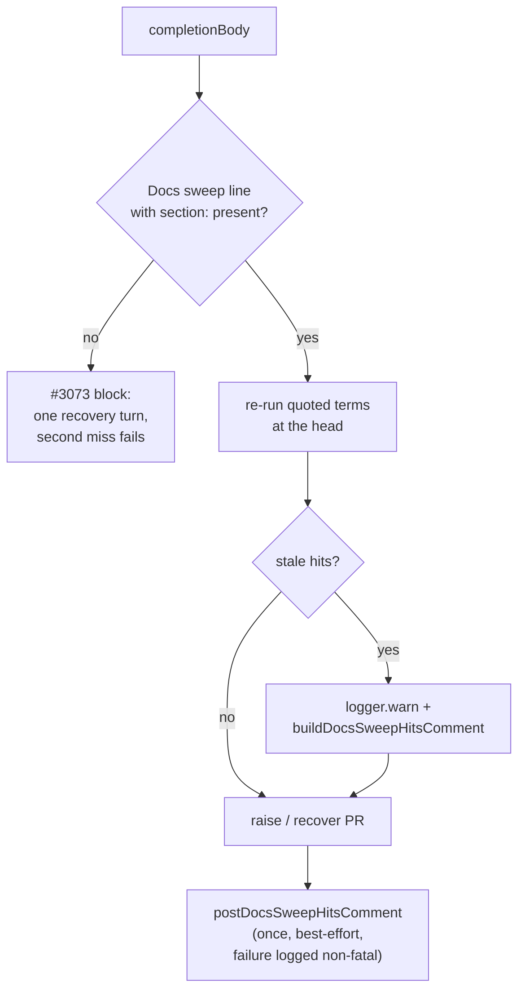

# PR Summary — Issue #3237

## Summary

The Docs sweep term re-run (#3172, #3219) set the Docs sweep block whenever a
quoted term still hit the head outside the diff. That cost fleet runs a
recovery turn, and a second miss failed them, so about 34 issues failed. Stale
term hits are now **advisory**: the worker logs them at WARN and posts them
once as a PR comment for the reviewer. The run is no longer blocked, released
or sent to a recovery turn. A missing `**Docs sweep**` line, or one with no
`section:`, still blocks with its one recovery turn (#3073).

Closes #3237

- [x] Stop stale term hits from setting the block (`completion_phase.ts`)
- [x] Post stale hits once as an advisory PR comment, on both the new-PR and
      recovered-PR paths
- [x] Reword `buildDocsSweepHitsComment` as advisory and drop "a second miss
      fails the run"
- [x] Reword the prompt and docs, and update the drift tests
- [x] Tests: advisory on both paths, a failed post is non-fatal, #3073 still
      blocks

## Spec

### Intent and Rationale

- The term re-run is a heuristic over free text. A hit may still be true, and
  the agent cannot always tell. Blocking on it failed real work, so the hits
  now go to the human reviewer instead.
- The #3073 gate (the line itself is missing) is a structural check with no
  false positives, so it keeps blocking.

### Essential Design Decisions

- `docsSweepBlocked` is now `const` and depends only on the #3073 check.
  Stale hits fill a separate `docsSweepHitsComment` and never override
  `docsSweepComment`, so the gate's block comment is always the
  missing-line comment.
- `postDocsSweepHitsComment` is the single helper that posts the comment. It
  is called after PR creation on the new-PR path and in
  `recoverAndFinaliseExistingPr` for a recovered PR. It posts nothing when
  there are no hits or no PR number, and it catches a post failure and logs
  `Docs sweep hits comment failed (non-fatal)`.
- `recoverAndFinaliseExistingPr` gains an optional 6th parameter,
  `docsSweepHitsComment = ""`, so existing callers are unaffected.
- The re-run keeps its scope, including the 10-hit broad-term cap, as the
  issue assumes.

### Undiscoverable Facts

- Acceptance criterion 4 names `prompts/coding_guidelines/prompt.md`,
  `prompts/pr_feedback/prompt.md` and `source_doc_comments_3219_docs_test.ts`.
  None of them says a stale term hit blocks:
  - the only "a second miss fails the run" wording is in
    `prompts/issue/prompt.md:204-205`, and it describes the #3073
    missing-line gate, which still blocks;
  - the 3219 drift test pins only the source-grep rule.

  The wording that does say a term hit blocks was in `prompts/issue/prompt.md`,
  `CODING-STANDARDS.md`, `docs/workflows/issue-processing.md` and
  `docs/PROMPTS.md`, and is rewritten.

## Evidence

Tests (run from `worker/deno`): `deno task test:unit
tests/completion_phase_docs_sweep_test.ts tests/docs_sweep_hits_test.ts
tests/prompt_docs_sweep_3172_test.ts tests/prompt_docs_sweep_3073_test.ts`.
Result: 73 passed, 0 failed. `deno fmt --check` is clean.

Quality gate: `./quality.sh` PASSED. The `config integration` check was
skipped. The gate ran before the non-fatal-post test was added; that file was
re-run afterwards and passed (14 tests).

**Docs sweep:** grep: `second miss`, `blocks`, `recovery turn`,
`Docs sweep incomplete`, `stale hit`, `buildDocsSweepHitsComment`;
section: `docs/workflows/issue-processing.md#-docs-sweep-on-a-code-change`.

- Updated:
  - `prompts/issue/prompt.md:193-194`
  - `CODING-STANDARDS.md:1235-1237`
  - `docs/workflows/issue-processing.md:1555-1559,1582-1584`
  - `docs/PROMPTS.md:30`
  - the module doc and comment text in `worker/deno/lib/docs_sweep_hits.ts`
  - the comments in `worker/deno/lib/phases/completion_phase.ts` that said a
    stale hit overrides `docsSweepComment`
- Remaining hits:
  - `prompts/issue/prompt.md:204-205` — still true because it describes the
    #3073 missing-line gate.
  - `worker/deno/tests/prompt_docs_sweep_3073_test.ts:54` — still true
    because it pins that #3073 wording.
  - `prompts/pr_feedback/prompt.md:126` — still true because its "recovery
    turn" is the placeholder-token recovery, which this change does not touch.
  - `docs/archive/**` — historical records.

**Related existing rules checked:**

- The #3073 Docs sweep line rule in `prompts/issue/prompt.md` and
  `CODING-STANDARDS.md` (kept, still blocking).
- The #3172 and #3219 re-run rules in the same files and in
  `docs/workflows/issue-processing.md` (changed to advisory in this diff).
- "Never Fail Silently": a failed comment post is logged at WARN, and the hits
  are logged at WARN, so neither is swallowed.

No rule now conflicts.

**Callers checked** (`recoverAndFinaliseExistingPr` gained an optional
parameter):

- `completion_phase.ts:655` (`reportSummaryRuleBlock`, uses the default);
- `completion_phase.ts:2838` and `:2972` (pass `docsSweepHitsComment`);
- the 5 calls in `worker/deno/tests/completion_phase_merged_pr_closure_test.ts`
  (use the default).

`buildDocsSweepHitsComment` and `describeDocsSweepHits` have one production
caller each, `completion_phase.ts:2352-2354`.

`deno.lock` is unchanged.

## Acceptance Criteria

1. **Stale hits no longer block.** Met.
   - `completion_phase_docs_sweep_test.ts` covers this in "a stale hit of the
     Docs sweep's own term is advisory (#3237)" and "a stale doc comment in an
     untouched source file is advisory like a manual hit".
   - Both tests check: status `continue`, 0 recovery calls, PR raised.
2. **One advisory PR comment.** Met.
   - The same tests, plus "a stale hit on a recovered existing PR gets the
     advisory comment posted there", assert exactly one post to the PR number
     and none to the issue.
   - `docs_sweep_hits_test.ts` asserts that the comment says "advisory" and
     "do not block this PR" and contains no "second miss" or "fails the run".
3. **#3073 still blocks.** Met. These existing tests are kept and pass:
   - "code-changing diff without the line recovers once in-run and then raises
     the PR";
   - "the recovery not adding the line fails with no PR raised".
4. **Wording rewritten and drift tests updated.** Met, with one scoping note
   (see Undiscoverable Facts).
   - The blocking wording is rewritten wherever it existed.
   - `prompt_docs_sweep_3172_test.ts` gains three section-scoped tests that
     pin the advisory wording and check the old wording is absent.
   - `coding_guidelines`, `pr_feedback` and the 3219 drift test never held a
     blocking claim, so they are unchanged.

## Standards Review

<!-- vibe-spec-review inputs="diff+issue-body" -->

- reviewer: spec-reviewer sub-agent. Verdict: criteria 1–3 met; criterion 4
  partial, but correct.
  - reason: the issue overstates which files held the blocking wording. The
    reviewer confirmed that `coding_guidelines` and `pr_feedback` never held
    it.
- reviewer: spec-reviewer sub-agent. Minor: the stale-hit `logger.warn` is
  not asserted.
  - reason: accepted. It is the log half of "advisory". The behaviour the
    issue asks for (the comment and no block) is asserted.

<!-- vibe-standards-review inputs="diff+CODING-STANDARDS.md" -->

- reviewer: standards-reviewer sub-agent. Finding: the `catch` branch of
  `postDocsSweepHitsComment` had no test. Status: **fixed**.
  - reason: added "completion - a failed advisory comment post does not fail
    the run (#3237)".
  - That test asserts status `continue`, PR raised, and the WARN
    `Docs sweep hits comment failed (non-fatal)`.
- reviewer: standards-reviewer sub-agent. Clean on log levels, named-test
  existence and the traceability of removed assertions.
  - reason: no other material departures.

## Test Plan

Removed assertions, quoted verbatim:

- From `worker/deno/tests/docs_sweep_hits_test.ts`:
  `assertStringIncludes(comment, "a second miss fails the run");`
  - #3237 requires the comment to drop that sentence.
  - It is replaced by assertions that "advisory" and "do not block this PR"
    are present and that "second miss" and "fails the run" are absent.
- From `worker/deno/tests/completion_phase_docs_sweep_test.ts`, test "a stale
  hit of the Docs sweep's own term gets the one recovery turn, then the PR is
  raised once it is named":
  - `assertEquals(outcome.claudeCalls, 1, "exactly one recovery invocation");`
  - `assertStringIncludes( outcome.claudePrompts[0]!, "docs/reporting-api.md:320", );`
  - `assertEquals(outcome.prCreateCalls, 1, "the recovered run raises its PR");`
  - `assertEquals(outcome.comments.length, 1);`

  #3237 forbids the recovery turn for a stale hit. The test now asserts 0
  recovery calls, PR raised, and one advisory post to the PR.
- From test "a stale hit the recovery leaves alone fails the run with no PR
  raised":
  - `assertEquals(outcome.status, "failure");`
  - `assertEquals(outcome.prCreateCalls, 0, "gh pr create must not run");`
  - `assertStringIncludes(outcome.reason ?? "", "docs/reporting-api.md:320");`

  #3237 forbids failing the run on a stale hit. The test is replaced by the
  recovered-existing-PR advisory test.
- From test "a stale doc comment in an untouched source file blocks like a
  manual hit (Issue #3219)":
  - `assertEquals(outcome.status, "failure");`
  - `assertEquals(outcome.prCreateCalls, 0, "gh pr create must not run");`
  - `assertStringIncludes( outcome.reason ?? "", "crates/report/src/balance.rs:42", );`

  The test now asserts `continue`, PR raised, and the hit named in the one PR
  comment.

Branch outcomes:

- `completion_phase.ts:2348-2354`, stale hits → WARN plus advisory comment,
  no block.
  - Reached by "a stale hit of the Docs sweep's own term is advisory (#3237)"
    and "a stale doc comment in an untouched source file is advisory".
  - Flipped: restoring the block turned 3 tests red.
- `completion_phase.ts:2302`, no stale hits → empty comment, nothing posted.
  - Reached by "a summary with a valid line raises the PR with no comment".
- `completion_phase.ts:791-805`, empty comment or no PR number → return
  without posting.
  - Reached by "a summary with a valid line raises the PR with no comment".
- `completion_phase.ts:3095`, post on the new-PR path.
  - Reached by "a stale hit of the Docs sweep's own term is advisory (#3237)".
  - Flipped: removing the call → red.
- `completion_phase.ts:887`, post on the recovered-PR path.
  - Reached by "a stale hit on a recovered existing PR gets the advisory
    comment posted there (#3237)".
  - Flipped: removing the call → red.
- `completion_phase.ts:798-803`, post throws → WARN, run continues.
  - Reached by "a failed advisory comment post does not fail the run (#3237)".
  - Flipped: removing the try/catch turned this test red on the WARN
    assertion. The outer "Post-PR finalisation error (non-fatal)" handler kept
    the status assertions green.
- `completion_phase.ts:2295`, #3073 missing line → still blocks.
  - Reached by "code-changing diff without the line recovers once in-run and
    then raises the PR" and "the recovery not adding the line fails with no PR
    raised".
  - Flipped: disabling the block turned 4 tests red.

**Guards on the new comment-post path:** the post runs after the PR is created
or recovered, and only adds a comment.

- It reaches no new outcome: no PR is raised or finalised that would not have
  been already, and no attempt is charged.
- The degraded-run, freshness and summary gates all run before it, so it adds
  no route around them.
- It does not double-post, because each path posts once and the two paths are
  exclusive.

**Drift pins:** `deno task drift-pins-on-base origin/main <doc> <section>
<phrase>...` reported each of the 6 new phrases in
`worker/deno/tests/prompt_docs_sweep_3172_test.ts` as `absent on base`, across
`prompts/issue/prompt.md`, `CODING-STANDARDS.md` and
`docs/workflows/issue-processing.md`.

🤖 Generated with [Claude Code](https://claude.com/claude-code)
