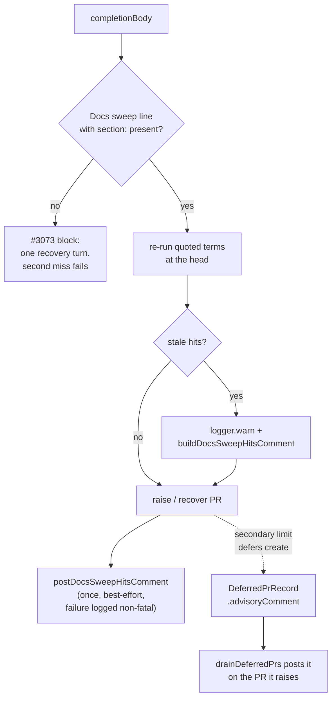

# PR Summary — Issue #3237

## Summary

The Docs sweep term re-run (#3172, #3219) set the Docs sweep block whenever a
quoted term still hit the head outside the diff. That cost fleet runs a
recovery turn, and a second miss failed them, so about 34 issues failed. Stale
term hits are now **advisory**: the worker logs them at WARN and posts them
once as a PR comment for the reviewer. The run is no longer blocked, released
or sent to a recovery turn. A missing `**Docs sweep**` line, or one with no
`section:`, still blocks with its one recovery turn (#3073).

Closes #3237

- [x] Stop stale term hits from setting the block (`completion_phase.ts`)
- [x] Post stale hits once as an advisory PR comment, on both the new-PR and
      recovered-PR paths
- [x] Keep the advisory when GitHub's secondary rate limit defers the PR: it
      is parked in the `DeferredPrRecord` (`advisoryComment`) and the
      next cycle's drain posts it on the PR it raises
- [x] Reword `buildDocsSweepHitsComment` as advisory and drop "a second miss
      fails the run"
- [x] Reword the prompt and docs, and update the drift tests
- [x] Tests: advisory on both paths, a failed post is non-fatal, #3073 still
      blocks

## Spec

### Intent and Rationale

- The term re-run is a heuristic over free text. A hit may still be true, and
  the agent cannot always tell. Blocking on it failed real work, so the hits
  now go to the human reviewer instead.
- The #3073 gate (the line itself is missing) is a structural check with no
  false positives, so it keeps blocking.

### Essential Design Decisions

- `docsSweepBlocked` is now `const` and depends only on the #3073 check.
  Stale hits fill a separate `docsSweepHitsComment` and never override
  `docsSweepComment`, so the gate's block comment is always the
  missing-line comment.
- `postDocsSweepHitsComment` is the single helper that posts the comment. It
  is called after PR creation on the new-PR path and in
  `recoverAndFinaliseExistingPr` for a recovered PR. It posts nothing when
  there are no hits or no PR number, and it catches a post failure and logs
  `Docs sweep hits comment failed (non-fatal)`.
- `recoverAndFinaliseExistingPr` gains an optional 6th parameter,
  `docsSweepHitsComment = ""`, so existing callers are unaffected.
  `reportSummaryRuleBlock` gains the same optional parameter and forwards
  it, so a run whose branch already has a PR and is blocked twice by another
  summary gate (closure, independent review, branch outcomes and the rest)
  still gets the one advisory comment when that path finalises the PR.
- The re-run keeps its scope, including the 10-hit broad-term cap, as the
  issue assumes.

### Undiscoverable Facts

- Acceptance criterion 4 names `prompts/coding_guidelines/prompt.md`,
  `prompts/pr_feedback/prompt.md` and `source_doc_comments_3219_docs_test.ts`.
  None of them says a stale term hit blocks:
  - the only "a second miss fails the run" wording is in
    `prompts/issue/prompt.md:204-205`, and it describes the #3073
    missing-line gate, which still blocks;
  - the 3219 drift test pins only the source-grep rule.

  The wording that does say a term hit blocks was in `prompts/issue/prompt.md`,
  `CODING-STANDARDS.md`, `docs/workflows/issue-processing.md` and
  `docs/PROMPTS.md`, and is rewritten.

## Evidence

Tests (run from `worker/deno`): `deno task test:unit
tests/completion_phase_docs_sweep_test.ts tests/docs_sweep_hits_test.ts
tests/prompt_docs_sweep_3172_test.ts tests/prompt_docs_sweep_3073_test.ts`.
Result: 75 passed, 0 failed. `deno fmt --check` is clean.

Deferral path (`deno task test:unit tests/deferred_pr_drain_test.ts
tests/deferred_pr_store_test.ts tests/completion_phase_secondary_limit_test.ts
tests/deferred_pr_dispatch_test.ts`): 32 passed, 0 failed.

Quality gate: `./quality.sh < /dev/null` on the final head: `Result: FAILED`.
Every check that ran passed except `deno tests` (26011 passed, 53 failed, 11
ignored); `config integration`, `markdownlint` and `semgrep` were skipped
(no live config, and those tools were not installed where the gate ran). None of
the 53 failures is in a file this PR changes:

- 51 are in 19 real-git test files (`git_branch_test.ts`,
  `pr_branch_checkout_test.ts`, `git_pull_conflict_test.ts` and 16 others).
  The same 51 tests failed in the same container on a branch without this
  change, so they come from that container's git setup.
- 2 are in `cache_secret_redaction_1261_test.ts`. They assert their scratch
  directory, made under the current directory, is not under shared `/tmp`, and
  that checkout lived under `/tmp`.

CI's Quality workflow runs the full suite on the pushed head.

**Docs sweep:** grep: `second miss`, `recovery turn`,
`Docs sweep incomplete`, `stale hit`, `term hit`,
`buildDocsSweepHitsComment`;
section: `docs/workflows/issue-processing.md#-docs-sweep-on-a-code-change`;
remaining hits:
`docs/workflows/issue-processing.md:2170-2175` — still true because it
describes the #3163 summary-rule recovery, which this change does not touch;
`docs/workflows/pr-feedback.md:291-310` and `docs/INTERNALS.md:5171` — still
true because their "recovery turn" is the pr_feedback drift-check recovery;
`worker/deno/lib/phases/completion_phase.ts:589`,
`worker/deno/lib/phases/completion_phase.ts:2284-2288`,
`worker/deno/lib/phases/completion_phase.ts:2361`,
`worker/deno/lib/phases/completion_phase.ts:2383`,
`worker/deno/lib/phases/completion_phase.ts:2402` and
`worker/deno/lib/phases/completion_phase.ts:2626` — still true because they
describe the one shared summary-rule recovery turn, which the #3073 gate
still uses;
`worker/deno/tests/completion_phase_docs_sweep_test.ts:456` — still true
because it is about the #3147 branch-outcomes recovery fixture;
`worker/deno/lib/docs_sweep_hits.ts:343` — still true because it describes
the broad-term cap, which this change keeps;
`worker/deno/tests/docs_sweep_hits_test.ts:682` — still true because it is a
section header naming the function under test.

`blocks` was dropped from the terms: it hits about 700 doc and comment lines,
almost all about other gates. Instead, every line in
`docs/workflows/issue-processing.md` that names the #3172 or #3219 re-run, or
lists "docs sweep" among the blocking gates, was read. The gate lists
(`:1720-1723`, `:1785-1789`, `:1885-1891`, `:1980-1984`, `:2178-2183`) are
still true because they mean the #3073 missing-line gate, which still blocks.

- Updated:
  - `prompts/issue/prompt.md:193-194`
  - `CODING-STANDARDS.md:1235-1237`
  - `docs/workflows/issue-processing.md:1555-1559,1582-1584`
  - `docs/PROMPTS.md:30`
  - the module doc and comment text in `worker/deno/lib/docs_sweep_hits.ts`
  - the comments in `worker/deno/lib/phases/completion_phase.ts` that said a
    stale hit overrides `docsSweepComment`
- Remaining hits:
  - `prompts/issue/prompt.md:204-205` — still true because it describes the
    #3073 missing-line gate.
  - `worker/deno/tests/prompt_docs_sweep_3073_test.ts:54` — still true
    because it pins that #3073 wording.
  - `prompts/pr_feedback/prompt.md:126` — still true because its "recovery
    turn" is the placeholder-token recovery, which this change does not touch.
  - `docs/archive/**` — historical records.

**Related existing rules checked:**

- The #3073 Docs sweep line rule in `prompts/issue/prompt.md` and
  `CODING-STANDARDS.md` (kept, still blocking).
- The #3172 and #3219 re-run rules in the same files and in
  `docs/workflows/issue-processing.md` (changed to advisory in this diff).
- "Never Fail Silently": a failed comment post is logged at WARN, and the hits
  are logged at WARN, so neither is swallowed.

No rule now conflicts.

**Callers checked** (`recoverAndFinaliseExistingPr` gained an optional
parameter):

- `completion_phase.ts:658` (`reportSummaryRuleBlock`, uses the default);
- `completion_phase.ts:2849` and `:2984` (pass `docsSweepHitsComment`);
- the 5 calls in `worker/deno/tests/completion_phase_merged_pr_closure_test.ts`
  (use the default).

`buildDocsSweepHitsComment` and `describeDocsSweepHits` have one production
caller each, `completion_phase.ts:2352-2354`.

`deno.lock` is unchanged.

## Acceptance Criteria

1. **Stale hits no longer block.** Met.
   - `completion_phase_docs_sweep_test.ts` covers this in "a stale hit of the
     Docs sweep's own term is advisory (#3237)" and "a stale doc comment in an
     untouched source file is advisory like a manual hit".
   - Both tests check: status `continue`, 0 recovery calls, PR raised.
2. **One advisory PR comment.** Met.
   - The same tests, plus "a stale hit on a recovered existing PR gets the
     advisory comment posted there" and "a stale hit on an existing PR blocked
     twice by another summary gate is still posted to the PR", assert exactly
     one post to the PR number and none to the issue. The last one went red
     before `reportSummaryRuleBlock` forwarded the comment (0 posts) and green
     after.
   - `docs_sweep_hits_test.ts` asserts that the comment says "advisory" and
     "do not block this PR" and contains no "second miss" or "fails the run".
3. **#3073 still blocks.** Met. These existing tests are kept and pass:
   - "code-changing diff without the line recovers once in-run and then raises
     the PR";
   - "the recovery not adding the line fails with no PR raised".
4. **Wording rewritten and drift tests updated.** Met, with one scoping note
   (see Undiscoverable Facts).
   - The blocking wording is rewritten wherever it existed.
   - `prompt_docs_sweep_3172_test.ts` gains three section-scoped tests that
     pin the advisory wording and check the old wording is absent.
   - `coding_guidelines`, `pr_feedback` and the 3219 drift test never held a
     blocking claim, so they are unchanged.

## Standards Review

<!-- vibe-spec-review inputs="diff+issue-body" -->

- reviewer: spec-reviewer sub-agent. Verdict: criteria 1–3 met; criterion 4
  partial, but correct.
  - reason: the issue overstates which files held the blocking wording. The
    reviewer confirmed that `coding_guidelines` and `pr_feedback` never held
    it.
- reviewer: spec-reviewer sub-agent. Minor: the stale-hit `logger.warn` is
  not asserted.
  - reason: accepted. It is the log half of "advisory". The behaviour the
    issue asks for (the comment and no block) is asserted.

<!-- vibe-standards-review inputs="diff+CODING-STANDARDS.md" -->

- reviewer: standards-reviewer sub-agent. Finding: the `catch` branch of
  `postDocsSweepHitsComment` had no test. Status: **fixed**.
  - reason: added "completion - a failed advisory comment post does not fail
    the run (#3237)".
  - That test asserts status `continue`, PR raised, and the WARN
    `Docs sweep hits comment failed (non-fatal)`.
- reviewer: standards-reviewer sub-agent. Clean on log levels, named-test
  existence and the traceability of removed assertions.
  - reason: no other material departures.

## Test Plan

Removed assertions, quoted verbatim:

- From `worker/deno/tests/docs_sweep_hits_test.ts`:
  `assertStringIncludes(comment, "a second miss fails the run");`
  - #3237 requires the comment to drop that sentence.
  - It is replaced by assertions that "advisory" and "do not block this PR"
    are present and that "second miss" and "fails the run" are absent.
- From `worker/deno/tests/completion_phase_docs_sweep_test.ts`, test "a stale
  hit of the Docs sweep's own term gets the one recovery turn, then the PR is
  raised once it is named":
  - `assertEquals(outcome.claudeCalls, 1, "exactly one recovery invocation");`
  - `assertStringIncludes( outcome.claudePrompts[0]!, "docs/reporting-api.md:320", );`
  - `assertEquals(outcome.prCreateCalls, 1, "the recovered run raises its PR");`
  - `assertEquals(outcome.comments.length, 1);`

  #3237 forbids the recovery turn for a stale hit. The test now asserts 0
  recovery calls, PR raised, and one advisory post to the PR.
- From test "a stale hit the recovery leaves alone fails the run with no PR
  raised":
  - `assertEquals(outcome.status, "failure");`
  - `assertEquals(outcome.prCreateCalls, 0, "gh pr create must not run");`
  - `assertStringIncludes(outcome.reason ?? "", "docs/reporting-api.md:320");`

  #3237 forbids failing the run on a stale hit. The test is replaced by the
  recovered-existing-PR advisory test.
- From test "a stale doc comment in an untouched source file blocks like a
  manual hit (Issue #3219)":
  - `assertEquals(outcome.status, "failure");`
  - `assertEquals(outcome.prCreateCalls, 0, "gh pr create must not run");`
  - `assertStringIncludes( outcome.reason ?? "", "crates/report/src/balance.rs:42", );`

  The test now asserts `continue`, PR raised, and the hit named in the one PR
  comment.
- Removed from `worker/deno/tests/completion_phase_docs_sweep_test.ts`:
  `assertStringIncludes( outcome.comments[0]!, "BrokerBalance refuses a stale quote", );`
  — #3237 moves the hit from the gate's block comment to the advisory PR
  comment. The same text is now asserted on `prPosts[0]!.body` in "a stale
  hit of the Docs sweep's own term is advisory (#3237)", so it is checked on
  the PR and not on the issue.
- Removed from `worker/deno/tests/completion_phase_docs_sweep_test.ts`:
  `assertStringIncludes( outcome.comments[0] ?? "", "BrokerBalance is shared by the two old callers", );`
  — same reason. It is now asserted on `prPosts[0]!.body` in "a stale doc
  comment in an untouched source file is advisory like a manual hit (#3237,
  Issue #3219)".

Branch outcomes:

- `completion_phase.ts:2351-2358`, stale hits → WARN plus advisory comment,
  no block.
  - Reached by "a stale hit of the Docs sweep's own term is advisory (#3237)"
    and "a stale doc comment in an untouched source file is advisory".
  - Flipped: restoring the block turned 3 tests red.
- `completion_phase.ts:2306`, no stale hits → empty comment, nothing posted.
  - Reached by "a summary with a valid line raises the PR with no comment".
- `completion_phase.ts:795-810`, empty comment or no PR number → return
  without posting.
  - Reached by "a summary with a valid line raises the PR with no comment".
- `completion_phase.ts:3108`, post on the new-PR path.
  - Reached by "a stale hit of the Docs sweep's own term is advisory (#3237)".
  - Flipped: removing the call → red.
- `completion_phase.ts:891`, post on the recovered-PR path.
  - Reached by "a stale hit on a recovered existing PR gets the advisory
    comment posted there (#3237)".
  - Flipped: removing the call → red.
- `completion_phase.ts:803-809`, post throws → WARN, run continues.
  - Reached by "a failed advisory comment post does not fail the run (#3237)".
  - Flipped: removing the try/catch turned this test red on the WARN
    assertion. The outer "Post-PR finalisation error (non-fatal)" handler kept
    the status assertions green.
- `completion_phase.ts:2931` and `:2998` (`deferPrCreation`) carry
  `advisoryComment`.
  - Reached by "a stale hit on a PR deferred by the secondary limit is parked
    with the PR, not lost (Issue #3237)" (the `gh pr create` deferral site).
  - Flipped: dropping the field → red.
- `deferred_pr_drain.ts`, advisory present and PR raised → post on the PR.
  - Reached by "deferred drain - a parked advisory comment is posted on the PR
    it raises (Issue #3237)". Flipped: skipping the post → red.
  - No advisory → only the PR-raised note on the issue: "deferred drain - a
    record with no advisory posts only the PR-raised note (Issue #3237)".
- `deferred_pr_store.ts` `isDeferredPrRecord`, `advisoryComment` absent,
  string, or other type.
  - Reached by "deferred PR - an advisory comment round-trips, and a
    non-string one is refused (Issue #3237)" and the existing round-trip test.
- `completion_phase.ts:2299`, #3073 missing line → still blocks.
  - Reached by "code-changing diff without the line recovers once in-run and
    then raises the PR" and "the recovery not adding the line fails with no PR
    raised".
  - Flipped: disabling the block turned 4 tests red.

**Guards on the new comment-post path:** the post runs after the PR is created
or recovered, and only adds a comment.

- It reaches no new outcome: no PR is raised or finalised that would not have
  been already, and no attempt is charged.
- The degraded-run, freshness and summary gates all run before it, so it adds
  no route around them.
- It does not double-post, because each path posts once and the paths are
  exclusive: new PR, recovered PR, or deferred PR (posted by the drain only
  after its own create succeeds; a PR something else already opened is
  dropped without posting).

**Drift pins:** `deno task drift-pins-on-base origin/main <doc> <section>
<phrase>...` reported each of the 6 new phrases in
`worker/deno/tests/prompt_docs_sweep_3172_test.ts` as `absent on base`, across
`prompts/issue/prompt.md`, `CODING-STANDARDS.md` and
`docs/workflows/issue-processing.md`.

🤖 Generated with [Claude Code](https://claude.com/claude-code)
