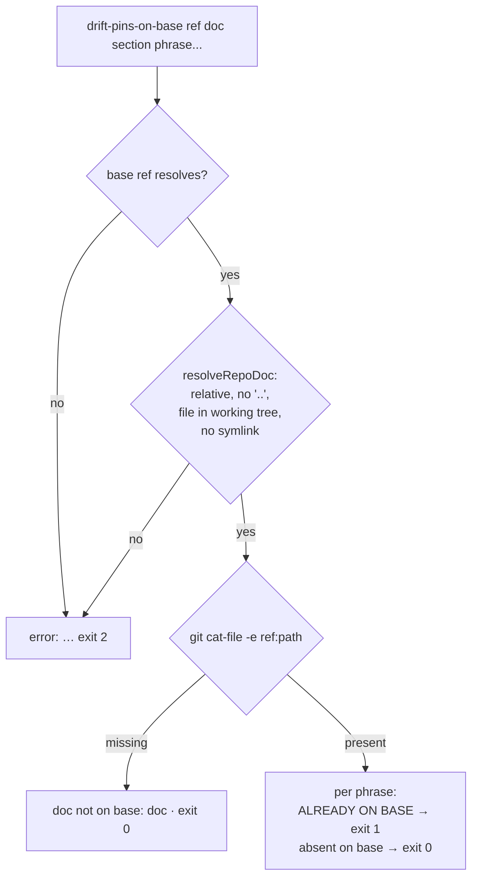

# PR Summary — Issue #3238

## Summary

`deno task drift-pins-on-base` printed `absent on base` for every phrase when
it could not resolve `<doc>` (e.g. `../../prompts/pr_feedback/prompt.md` run
from `worker/deno`). Because `git show <base>:<path>` misses silently, the
check passed vacuous pins. It now validates `<doc>` before git sees it and
fails loud (exit 2, naming the path tried). A doc that is genuinely new on
base is reported once as `doc not on base: <doc>`.

Closes #3238



## Spec

### Intent and Rationale

- An unresolvable path must never be reported the same way as "absent on
  base". The tool exists to catch vacuous pins, so a silent miss defeats it.
- A doc that is genuinely new on base is still legitimate, so it gets its own
  single line rather than an error.

### Essential Design Decisions

- `resolveRepoDoc` rejects empty, absolute, drive-letter and any `..` segment
  outright, rather than normalising `..` away. It then requires a real file
  in the working tree and a `realPath` equal to `<root>/<normalised>`, which
  means no symlink anywhere on the path.
- `pinsAlreadyOnBase` returns `undefined` for "not on base", distinct from
  `[]`. The decision uses `git cat-file -e`, and a `git show` failure after
  that is a thrown error, not an empty answer.
- The CLI body is `driftPinsCli(args, out, err, repo?)` and returns its exit
  code. This lets tests drive it directly without a subprocess.

### Undiscoverable Facts

- `git show <ref>:<path>` resolves `<path>` against the repo root, not the
  cwd, whatever directory the task runs from. That is why a cwd-relative
  `../../…` path missed.
- git reads base trees by path and does not follow working-tree symlinks, so
  a symlinked path would also miss silently. That is why symlinks are refused.

## Evidence

Reproduced on base from `worker/deno` (before the fix):

```text
$ deno task drift-pins-on-base origin/main ../../prompts/pr_feedback/prompt.md "Making Changes" "each pinned phrase on its own"
absent on base: each pinned phrase on its own        # exit 0 — wrong
$ deno task drift-pins-on-base origin/main prompts/pr_feedback/prompt.md "Making Changes" "each pinned phrase on its own"
ALREADY ON BASE: each pinned phrase on its own       # exit 1 — correct
```

After the fix, the first command prints
`error: doc path "../../prompts/pr_feedback/prompt.md" must be relative to the repo root with no ".." segments (e.g. prompts/issue/prompt.md)`
and exits 2. The second is unchanged.

Tests: `worker/deno/tests/drift_pins_on_base_3238_test.ts` (new, 8 tests) and
`worker/deno/tests/drift_pins_on_base_3193_test.ts` (updated). Run
`deno task test:unit tests/drift_pins_on_base_3193_test.ts tests/drift_pins_on_base_3238_test.ts`:
17 passed, 0 failed.

**Path confinement:** tests cover `..` traversal (`../doc.md`,
`sub/../doc.md`), an absolute path, a missing path (`nope/missing.md`), a
directory symlink pointing out of the repo (`link/doc.md`), an in-repo file
symlink (`alias.md`), and the combined `missing/../link/doc.md`. The combined
case is refused by the `..` rule before any filesystem call.

**Docs sweep:**

- Grep terms: `drift-pins-on-base`, `pinsAlreadyOnBase`, `absent on base`,
  `<doc>`.
- Updated: the "Documentation-drift tests" passage in
  `CODING-STANDARDS.md:216-222` and the drift-pins bullet in
  `CONTRIBUTING.md:193-197`. Both now say `<doc>` is repo-root-relative, that
  an unresolvable path exits 2, and that a doc the base never had prints a
  single `doc not on base` line. I also updated the doc comments on
  `BasePinCheck.doc`, `pinsAlreadyOnBase` and the CLI in
  `worker/deno/tests/support/markdown_docs.ts`.
- Remaining hits, all still true:
  - `CODING-STANDARDS.md:348`, `prompts/coding_guidelines/prompt.md:1183`,
    `prompts/issue/prompt.md:1083` and `prompts/pr_feedback/prompt.md:83`:
    still true because each only names the command and its argument order,
    which are unchanged.
  - `worker/deno/tests/source_doc_comments_3219_docs_test.ts:16`: still true
    because it only names the command.
  - `docs/archive/**`: historical records.
- Related rules checked: Path Confinement (coding guidelines) and "A negative
  test must be able to fail". No rule conflicts.

**Callers checked** (the `pinsAlreadyOnBase` return type widened to
`string[] | undefined`): `tests/drift_pins_on_base_3193_test.ts`, the
`drift-pins-on-base` task in `worker/deno/deno.json` (already has
`--allow-read`, which `stat`/`realPath` need), and `driftPinsCli`. There are
no other callers.

`deno.lock` is unchanged.

## Test Plan

- Removed from `worker/deno/tests/drift_pins_on_base_3193_test.ts`: `assertEquals( await pinsAlreadyOnBase({ doc: "missing.md", title: "Escalation", phrases: ["needs-human label"], baseRef: "base", repo: clone, }), [], );` — #3238 requires an unresolvable `<doc>` to fail loud instead of reading as an empty answer, so `missing.md` (absent from the working tree) now throws `not found in the working tree` rather than returning `[]`; that refusal is covered by `worker/deno/tests/drift_pins_on_base_3238_test.ts::resolveRepoDoc - rejects a path missing from the working tree`, and the "doc the base ref never had" case is replaced by the `new.md` assertion below, which expects `undefined`

Changed assertion in `worker/deno/tests/drift_pins_on_base_3193_test.ts`,
verbatim:

```diff
+    await commitFile(clone, "new.md", BASE_DOC, "new doc");
-    // A doc the base ref never had holds no pins.
+    // A doc the base ref never had is reported as not on base.
-        doc: "missing.md",
+        doc: "new.md",
-      [],
+      undefined,
```

Justification: `missing.md` never existed in the working tree, so under
#3238 it is an unresolvable path and now throws. The case this assertion
meant to cover, a doc the base ref never had, is now a doc committed only
on the feature branch. It returns the new `undefined` ("not on base")
rather than `[]`.

Branch outcomes (all in `worker/deno/tests/support/markdown_docs.ts`; tests
are in `worker/deno/tests/drift_pins_on_base_3238_test.ts` unless noted):

- `markdown_docs.ts:156-165`: a path that escapes the root (`..`, absolute)
  throws `no ".." segments`. Reached by "resolveRepoDoc - rejects any path
  that escapes the repo root" and "driftPinsCli - an unresolvable doc path
  fails loud, prints nothing on out". Removing `segments.includes("..")` →
  3 tests red.
- `markdown_docs.ts:166` (accept): `./doc.md` normalises to `doc.md`. Reached
  by the same escape test.
- `markdown_docs.ts:177`: missing from the working tree throws
  `not found in the working tree`. Reached by "resolveRepoDoc - rejects a
  path missing from the working tree". Removing the check → red.
- `markdown_docs.ts:188`: a symlink on the path throws
  `goes through a symlink`. Reached by "resolveRepoDoc - rejects a path
  through a symlink". Removing the realPath comparison → red.
- `markdown_docs.ts:227`: an unresolvable base ref throws. Reached by
  "driftPinsCli - a base ref that does not resolve fails loud, prints nothing
  on out" and the 3193 test. Flipping it → red.
- `markdown_docs.ts:235`: `cat-file -e` miss → `undefined`. Reached by
  "driftPinsCli - a doc only on the feature branch is reported as not on
  base" and `drift_pins_on_base_3193_test.ts`. Returning `[]` instead → red.
- `markdown_docs.ts:237`: `git show` fails after `cat-file -e` succeeded,
  which throws. This is fail-closed defence for a race or corrupt object; no
  test reaches it, because a fixture cannot make `show` fail on a blob
  `cat-file -e` just confirmed. **Untested.**
- `markdown_docs.ts:263`: too few arguments → usage, exit 2. Reached by
  "driftPinsCli - too few arguments is a usage error".
- `markdown_docs.ts:270`: any thrown error → `error:` on err, exit 2, nothing
  on out. Reached by the unresolvable-path and bad-ref CLI tests.
- `markdown_docs.ts:274`: not on base → one `doc not on base:` line, exit 0.
  Reached by the feature-branch-only CLI test.
- `markdown_docs.ts:282`: any vacuous pin → exit 1, else 0, with per-phrase
  lines. Reached by "driftPinsCli - happy path: ALREADY ON BASE and absent on
  base, per phrase".

The resolver refusal tests assert the specific rule message, not just the
path. An earlier draft asserted only the quoted path, and flip (i) stayed
green because the stat and symlink checks also refused those inputs.

## Pre-PR Security Self-Check

- [x] Input validation: `<doc>` is checked against an allow-shape (relative,
      no `..`, real file, no symlink) before use.
- [x] Injection surface: git is invoked through `Deno.Command` argv; there is
      no shell.
- [x] No secrets or hidden files staged; no new dependencies.
