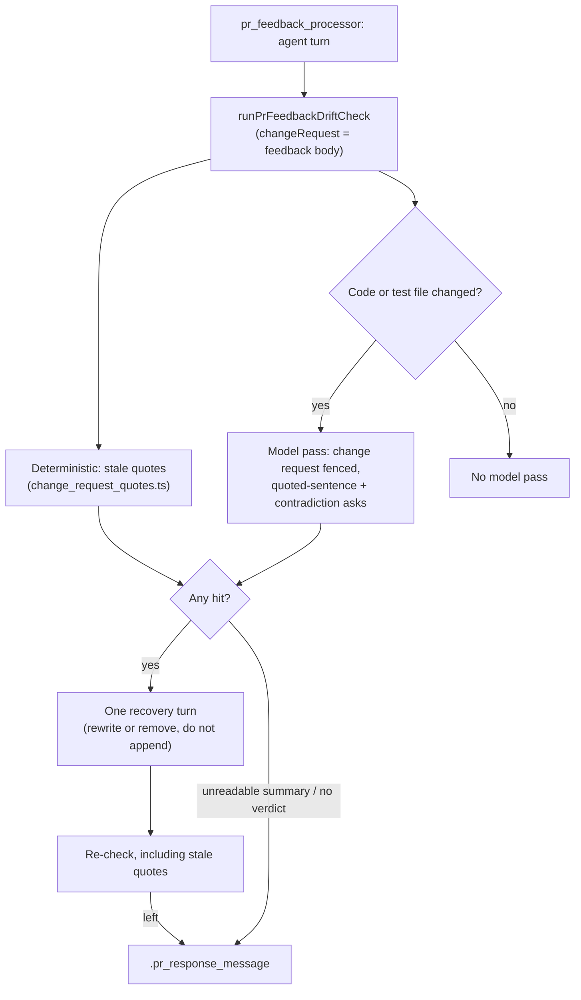

# PR Summary — Issue #3244

## Summary

Review-fix pushes kept leaving a PR-summary sentence the push made false, sometimes with a "PR-feedback round N" correction appended below it (GRQ-AutoTrader#2486, VibeCoder#3236), past the #3143 drift check. This PR gives that check the change request it is answering and adds a deterministic backstop for quoted summary sentences. Closes #3244.

- **Did the check run?** For VibeCoder#3236 the model pass did not run. Push `48f762da` changed only `CODING-STANDARDS.md`, the PR summary and a test file. All three are docs-sweep-exempt, and on the base branch `runPrFeedbackDriftCheck` asked its model question only when `codeChangingFiles` was non-empty. GRQ-AutoTrader#2486's push `99a96f9d` changed `.github/workflows/quality.yml`, a code file, so its model pass ran and missed the drift. **The model pass now also runs when the push changes a test file.** A docs-only push still gets none.
- **Change request into the drift question (proposal 1).** `pr_feedback_processor.ts` passes the comment or review body the run answers (`processedBody`, as the agent's prompt carried it) as `DriftCheckInput.changeRequest`. `buildDriftQuestionPrompt` fences it as untrusted text. It asks the model to confirm that every sentence the change request quotes has been rewritten or removed at the head. A quoted sentence still present, even with a correction after it, counts as drift.
- **Internal-contradiction clause (proposal 2).** The drift question always reports the earlier of two sentences when a later sentence in the same file corrects, supersedes or contradicts it.
- **Deterministic backstop (proposal 3).** The new `worker/deno/lib/change_request_quotes.ts` parses findings in the review-fleet-prs `reviewBody` shape. For each finding against a `docs/archive/pr-summaries/pr-summary-*.md`, it takes every quoted span of four or more words in the problem text and looks for it in that summary at the head, normalised for case, whitespace, emphasis and quote style. On every non-skipped push, a span still present is a hit. It gets the existing single recovery turn, with a "rewrite or remove, do not append" step. If the span is still there afterwards, it is reported in `.pr_response_message`. A summary that a finding names but that cannot be read is reported as not checked (`quoteCheckUnavailable`) rather than passed.
- The prose rules in `prompts/pr_feedback/prompt.md` and `CODING-STANDARDS.md` stay. The prompt's description of the drift check now matches what it does.

## Spec

### Intent and Rationale

- The two misses had two causes. On #3236 the model pass never ran. On GRQ#2486 it ran without the reviewer's quoted sentence. Each cause gets its own fix.
- The deterministic check needs no model, so it catches the quoted-sentence case even on a docs-only push or when the model pass returns no verdict.

### Essential Design Decisions

- Stale quotes reuse the existing recovery path: one fix turn, then report. There is no new gate, so the check stays a backstop, as #3143 designed it.
- Only findings in the `**\`file[:line]\`**: problem` shape against a `pr-summary-*.md` are checked deterministically. `**Fix:**` text and the closing summary are never read as part of a problem, because they routinely quote prose that is not the finding.
- A named summary that cannot be read fails loud (`quoteCheckUnavailable`) but does not drive a recovery turn, because no recovery turn can fix a file the check cannot read.
- The quote extractor uses linear hand-written scanners, not a backtracking regex, because it reads reviewer-written text. Growth tests in `worker/deno/tests/change_request_quotes_3244_test.ts` pin this, so that file is listed in `WALL_CLOCK_TEST_FILES`.

### Undiscoverable Facts

- The verdict on whether the check ran comes from each push's file list (`gh api repos/<repo>/commits/<sha> --jq '[.files[].filename]'`) checked against the base-branch gate. The host run logs were not reachable from this container.

## Evidence

This is a backend change with no UI surface. The evidence is the unit and integration tests below, which run against real temporary git repositories, plus the full gate.

Observed tool output the change relies on:

- `gh api repos/stSoftwareAU/VibeCoder/commits/48f762da --jq '[.files[].filename]'` → `["CODING-STANDARDS.md","docs/archive/pr-summaries/pr-summary-3232.md","worker/deno/tests/own_change_claims_3120_test.ts"]`: no code file, so the base branch ran no model pass.
- `gh api repos/stSoftwareAU/GRQ-AutoTrader/commits/99a96f9d --jq '[.files[].filename]'` → `[".github/workflows/quality.yml",".github/zizmor.yml","crates/infra/tests/cargo_cache.rs"]`: a code file, so the model pass ran.
- The parser's producer contract is `reviewBody` in `.claude/skills/review-fleet-prs/review_log.ts`, which writes the `**\`<file>[:<line>]\`**: <problem>` / optional `**Fix:**` / closing-summary shape.

**Docs sweep** — grep: `quoteCheckUnavailable`, `staleQuotes`, `change_request_quotes`, "Three checks run", "only when the push changes a code file"; section: `docs/workflows/pr-feedback.md#the-workers-drift-check-issue-3143`; updated: `docs/workflows/pr-feedback.md`, `prompts/pr_feedback/prompt.md`, `docs/INTERNALS.md`

Every hit of those terms at the head is in a line this diff adds or changes. I read the whole § "The worker's drift check (Issue #3143)" and rewrote it from three checks to four. Lines 169 and 250 of `docs/workflows/pr-feedback.md` only link to that section and are unchanged.

Related existing rules checked: `prompts/pr_feedback/prompt.md` "Keep the PR summary true to the head" and `CODING-STANDARDS.md` § PR Summary and Evidence ("rewrite — never append to — the summary"). The new prompt sentence agrees with both: an appended correction still counts as drift.

## Acceptance Criteria

<!-- vibe-spec-review inputs="diff+issue-body" -->

- **met** — Pass the change-request findings into the drift question, fenced as untrusted text, and ask the pass to confirm every sentence a finding quotes has been rewritten or removed at the head — evidence: `worker/deno/tests/pr_feedback_drift_check_3244_test.ts::buildDriftQuestionPrompt - fences the change request only when given, and always carries the internal-contradiction clause`, `worker/deno/tests/pr_feedback_processor_drift_check_3143_test.ts::processPrFeedback - drift check: the change request body is passed to the drift check (Issue #3244)` — reviewer: met
- **met** — Add an internal-contradiction clause to the drift question — evidence: `worker/deno/tests/pr_feedback_drift_check_3244_test.ts::buildDriftQuestionPrompt - fences the change request only when given, and always carries the internal-contradiction clause` — reviewer: met
- **met** — Deterministic backstop: a quoted span of four or more words from a finding against a `pr-summary-*.md` that is still in the summary at the head is treated as a block on the existing recovery path (one fix turn, then report it in `.pr_response_message`) — evidence: `worker/deno/lib/change_request_quotes.ts`, `worker/deno/tests/pr_feedback_drift_check_3244_test.ts::runPrFeedbackDriftCheck - a test-only push that leaves a change-request-quoted sentence standing under a round-2 note is reported with the stale quote` — reviewer: met
- **met** — Check first whether the check ran or missed; if it did not run, fix that first — evidence: the commit file lists under Evidence; `worker/deno/tests/pr_feedback_drift_check_3244_test.ts::runPrFeedbackDriftCheck - a test-only push with no change request still makes a model call` — reviewer: missing — reason: the reviewer looked for host-log evidence in the diff. The check was done against each push's real file list and the base-branch gate (see Evidence). It showed the model pass never ran for #3236, and this diff fixes that.
- **met** — Keep the prose rules; these checks enforce them and do not replace them — evidence: `prompts/pr_feedback/prompt.md` keeps "Keep the PR summary true to the head" and only updates its description of the drift check — reviewer: met
- **met** — Tests feed the drift check a fix diff plus a finding quoting a still-present summary sentence with an appended correction below it, and assert the deterministic check blocks it and the recovery turn runs — evidence: `worker/deno/tests/pr_feedback_drift_check_3244_test.ts::runPrFeedbackDriftCheck - a test-only push that leaves a change-request-quoted sentence standing under a round-2 note is reported with the stale quote`, `worker/deno/tests/pr_feedback_drift_check_3244_test.ts::runPrFeedbackDriftCheck - a recovery turn that rewrites the stale quoted sentence away reports recovered` — reviewer: met
- **unrequested** — The model pass now also runs when the push changes a test file (`modelPassNeeded` in `worker/deno/lib/pr_feedback_drift_check.ts`) — reviewer: unrequested — reason: this is the "if the check did not run, fix that first" step. The #3236 push changed only test and doc files, so it got no model pass.
- **unrequested** — `docs/audits/lib-sweep-coverage/top-up-3244.json` and the `WALL_CLOCK_TEST_FILES` entry in `worker/deno/lib/parallel_unsafe_test_manifest.ts` — reviewer: unrequested — reason: the repository's completeness checks require both registrations for a new lib module and a growth-measuring test.

## Standards Review

<!-- vibe-standards-review inputs="diff+CODING-STANDARDS.md" -->

- **clean** — The reviewer found no violations. It checked these review-enforced rules: every outcome of a branch you add needs a test, a named test must exist, writing a gate over text (compare like with like, no silent pass on unread input), vetting regexes on untrusted text with hostile growth cases, a stub mirrors the real callee's contract (parser shape checked against `reviewBody`), and a code change owes a docs change. It also checked Australian English, commit safety and secret redaction. Optional only: the git fixture helpers in the new drift-check test file are copied from the #3143 test file.

## Test Plan

- `worker/deno/tests/change_request_quotes_3244_test.ts` (new): unit tests for the parser, the quote extractor, normalisation, `findStaleQuotes` and `summaryFilesNamedBy`, plus four growth tests on hostile input.
- `worker/deno/tests/pr_feedback_drift_check_3244_test.ts` (new): `runPrFeedbackDriftCheck` against real temporary git repositories, covering a test-only push, a docs-only push, recovered and reported outcomes, a quote already rewritten, an unreadable named summary, and a test-only push with no change request. It also has prompt-builder and `formatDriftResidual` unit tests.
- `worker/deno/tests/pr_feedback_processor_drift_check_3143_test.ts`: one test added, "the change request body is passed to the drift check (Issue #3244)". I removed it from the call site and it went red with `Actual: undefined`.
- **No assertion was removed from an existing test.** The only existing test file touched gains one new test.
- Removed two branches from `change_request_quotes.ts` that had no observable effect: a conditional push absorbed by `join(" ").trim()`, and an empty-quote check that `extractQuotedSpans`' four-word floor makes unreachable. Behaviour is unchanged and the tests still pass.
- `./quality.sh < /dev/null`: `Result: PASSED (with skipped checks)` (config integration skipped, as on every run here). It ran on this head before the final test-only commit. The touched test files were re-run after that commit.

**Branch outcomes:**

Lib line numbers are at the head. Every "went red" was observed by flipping the branch, running the named test file, then restoring the code.

- `worker/deno/lib/pr_feedback_drift_check.ts:926` — model pass when a test file changed — `worker/deno/tests/pr_feedback_drift_check_3244_test.ts::runPrFeedbackDriftCheck - a test-only push with no change request still makes a model call` — flipped to code-only, test went red
- `worker/deno/lib/pr_feedback_drift_check.ts:926` — no model pass on a docs-only push — `worker/deno/tests/pr_feedback_drift_check_3143_test.ts::runPrFeedbackDriftCheck - a docs-only push makes no model call and reports clean` — unchanged base behaviour, still green
- `worker/deno/lib/pr_feedback_drift_check.ts:992` — stale quote prevents "clean" — `worker/deno/tests/pr_feedback_drift_check_3244_test.ts::runPrFeedbackDriftCheck - a docs-only push with a still-present quoted sentence makes no model call but still runs the recovery turn` — flipped, 4 tests went red
- `worker/deno/lib/pr_feedback_drift_check.ts:993` — unreadable named summary prevents "clean" — `worker/deno/tests/pr_feedback_drift_check_3244_test.ts::runPrFeedbackDriftCheck - a finding naming a pr-summary that does not exist at the head is reported with quoteCheckUnavailable and no recovery call` — flipped, test went red
- `worker/deno/lib/pr_feedback_drift_check.ts:1008` — stale quote triggers the recovery turn — `worker/deno/tests/pr_feedback_drift_check_3244_test.ts::runPrFeedbackDriftCheck - a test-only push that leaves a change-request-quoted sentence standing under a round-2 note is reported with the stale quote` — flipped, test went red
- `worker/deno/lib/pr_feedback_drift_check.ts:1008` — unreadable summary alone runs no recovery turn — `worker/deno/tests/pr_feedback_drift_check_3244_test.ts::runPrFeedbackDriftCheck - a finding naming a pr-summary that does not exist at the head is reported with quoteCheckUnavailable and no recovery call` — passes on the head (1 agent call at most)
- `worker/deno/lib/pr_feedback_drift_check.ts:1073` — stale quote still present after recovery → residual `staleQuotes` — `worker/deno/tests/pr_feedback_drift_check_3244_test.ts::runPrFeedbackDriftCheck - a test-only push that leaves a change-request-quoted sentence standing under a round-2 note is reported with the stale quote` — flipped, 2 tests went red
- `worker/deno/lib/pr_feedback_drift_check.ts:1073` — stale quote rewritten by recovery → "recovered" — `worker/deno/tests/pr_feedback_drift_check_3244_test.ts::runPrFeedbackDriftCheck - a recovery turn that rewrites the stale quoted sentence away reports recovered` — flipping the "recovered" gate went red
- `worker/deno/lib/pr_feedback_drift_check.ts:1077` — unreadable summary → `quoteCheckUnavailable` — `worker/deno/tests/pr_feedback_drift_check_3244_test.ts::runPrFeedbackDriftCheck - a finding naming a pr-summary that does not exist at the head is reported with quoteCheckUnavailable and no recovery call` — flipped, test went red
- `worker/deno/lib/pr_feedback_drift_check.ts:307` — change request present / absent (fenced into the question) — `worker/deno/tests/pr_feedback_drift_check_3244_test.ts::buildDriftQuestionPrompt - fences the change request only when given, and always carries the internal-contradiction clause` — flipped, test went red
- `worker/deno/lib/pr_feedback_drift_check.ts:331` — change request present / absent (quoted-sentence instruction) — `worker/deno/tests/pr_feedback_drift_check_3244_test.ts::buildDriftQuestionPrompt - fences the change request only when given, and always carries the internal-contradiction clause` — flipped, test went red
- `worker/deno/lib/pr_feedback_drift_check.ts:432` — stale quotes present / absent (fenced into the recovery prompt) — `worker/deno/tests/pr_feedback_drift_check_3244_test.ts::buildDriftRecoveryPrompt - fences stale quotes only when given, and the 'do not append' step only then` — flipped, 3 tests went red
- `worker/deno/lib/pr_feedback_drift_check.ts:467` — stale quotes present / absent (rewrite step) — `worker/deno/tests/pr_feedback_drift_check_3244_test.ts::buildDriftRecoveryPrompt - fences stale quotes only when given, and the 'do not append' step only then` — flipped, test went red
- `worker/deno/lib/pr_feedback_drift_check.ts:536` — stale quotes make a hit in `formatDriftResidual` — `worker/deno/tests/pr_feedback_drift_check_3244_test.ts::formatDriftResidual - a staleQuotes-only residual lists the quote under the 'found text' intro` — flipped, test went red
- `worker/deno/lib/pr_feedback_drift_check.ts:569` — stale quotes listed in the residual — `worker/deno/tests/pr_feedback_drift_check_3244_test.ts::formatDriftResidual - a staleQuotes-only residual lists the quote under the 'found text' intro` — flipped, test went red
- `worker/deno/lib/pr_feedback_drift_check.ts:581` — `quoteCheckUnavailable` line printed — `worker/deno/tests/pr_feedback_drift_check_3244_test.ts::formatDriftResidual - a quoteCheckUnavailable-only residual prints only that line, no 'found text' intro` — flipped, test went red
- `worker/deno/lib/pr_feedback_drift_check.ts:781` — stale quotes choose the "found text" reply lead — `worker/deno/tests/pr_feedback_drift_check_3244_test.ts::runPrFeedbackDriftCheck - a docs-only push with a still-present quoted sentence makes no model call but still runs the recovery turn` — flipped, test went red
- `worker/deno/lib/change_request_quotes.ts:48` — PR-summary path match / lookalike — `worker/deno/tests/change_request_quotes_3244_test.ts::isPrSummaryPath - matches a PR summary, rejects lookalikes` — flipped to always-match, test went red
- `worker/deno/lib/change_request_quotes.ts:73` — non-header line skipped — `worker/deno/tests/change_request_quotes_3244_test.ts::parseChangeRequestFindings - strips a trailing :line, and excludes the Fix text and closing summary` — flipped, test went red
- `worker/deno/lib/change_request_quotes.ts:79` — trailing `:line` stripped — `worker/deno/tests/change_request_quotes_3244_test.ts::parseChangeRequestFindings - strips a trailing :line, and excludes the Fix text and closing summary` — flipped, test went red
- `worker/deno/lib/change_request_quotes.ts:86` — blank line ends the problem — `worker/deno/tests/change_request_quotes_3244_test.ts::parseChangeRequestFindings - strips a trailing :line, and excludes the Fix text and closing summary` — flipped, test went red
- `worker/deno/lib/change_request_quotes.ts:90` — `**Fix:**` line ends the problem — `worker/deno/tests/change_request_quotes_3244_test.ts::parseChangeRequestFindings - a **Fix:** line directly after the problem with no blank line stops the problem there` — flipped, test went red
- `worker/deno/lib/change_request_quotes.ts:91` — next header ends the problem — `worker/deno/tests/change_request_quotes_3244_test.ts::parseChangeRequestFindings - the next finding header directly after the problem with no blank line starts a new finding` — flipped, test went red
- `worker/deno/lib/change_request_quotes.ts:126` — line break drops an open straight-double span — `worker/deno/tests/change_request_quotes_3244_test.ts::extractQuotedSpans - a quote whose opener and closer are on different lines yields nothing` — flipped, test went red
- `worker/deno/lib/change_request_quotes.ts:132` — `\"` inside a span kept — `worker/deno/tests/change_request_quotes_3244_test.ts::extractQuotedSpans - the VibeCoder#3236 problem text, literally` — flipped, test went red
- `worker/deno/lib/change_request_quotes.ts:132` — `\"` outside a span opens one — `worker/deno/tests/change_request_quotes_3244_test.ts::extractQuotedSpans - an escaped \" outside a span opens one, closed by a bare quote` — flipped, test went red
- `worker/deno/lib/change_request_quotes.ts:142` — bare `"` closes a span — `worker/deno/tests/change_request_quotes_3244_test.ts::extractQuotedSpans - the VibeCoder#3236 problem text, literally` — flipped, test went red
- `worker/deno/lib/change_request_quotes.ts:170` — `“` opens a span / nested `“` kept — `worker/deno/tests/change_request_quotes_3244_test.ts::extractQuotedSpans - curly double quotes`, `worker/deno/tests/change_request_quotes_3244_test.ts::extractQuotedSpans - a nested “ inside a curly-double span is kept literally` — flipped, tests went red
- `worker/deno/lib/change_request_quotes.ts:179` — `”` closes a span — `worker/deno/tests/change_request_quotes_3244_test.ts::extractQuotedSpans - curly double quotes` — flipped, test went red
- `worker/deno/lib/change_request_quotes.ts:198` — single-quote opener at text start — `worker/deno/tests/change_request_quotes_3244_test.ts::extractQuotedSpans - a single-quote opener at the very start of the text` — flipped, test went red
- `worker/deno/lib/change_request_quotes.ts:200` — single-quote opener only after whitespace, `(` or `[` — `worker/deno/tests/change_request_quotes_3244_test.ts::extractQuotedSpans - a single quote mid-word never opens a span` — flipped to any position, test went red
- `worker/deno/lib/change_request_quotes.ts:234` — closer before a letter is an apostrophe / otherwise closes — `worker/deno/tests/change_request_quotes_3244_test.ts::extractQuotedSpans - straight single quotes containing an apostrophe`, `worker/deno/tests/change_request_quotes_3244_test.ts::extractQuotedSpans - curly single quotes containing an apostrophe` — flipped, tests went red
- `worker/deno/lib/change_request_quotes.ts:273` — span split at an ellipsis — `worker/deno/tests/change_request_quotes_3244_test.ts::extractQuotedSpans - an ellipsis-truncated quote yields the fragment before the ellipsis` — flipped to no split, test went red
- `worker/deno/lib/change_request_quotes.ts:275` — fragment under four words dropped — `worker/deno/tests/change_request_quotes_3244_test.ts::extractQuotedSpans - a 3-word quote never clears the 4-word floor` — flipped, test went red
- `worker/deno/lib/change_request_quotes.ts:276` — duplicate span dropped — `worker/deno/tests/change_request_quotes_3244_test.ts::extractQuotedSpans - a duplicated span is returned once` — flipped, test went red
- `worker/deno/lib/change_request_quotes.ts:333` — finding on a non-summary file ignored — `worker/deno/tests/change_request_quotes_3244_test.ts::findStaleQuotes - a finding on a non-summary file is ignored` — flipped, test went red
- `worker/deno/lib/change_request_quotes.ts:335` — unreadable summary reported unchecked — `worker/deno/tests/change_request_quotes_3244_test.ts::findStaleQuotes - a summary mapped to undefined is reported unchecked, not stale` — flipped, test went red
- `worker/deno/lib/change_request_quotes.ts:336` — duplicate unchecked file dropped — `worker/deno/tests/change_request_quotes_3244_test.ts::findStaleQuotes - two findings naming the same unreadable summary report it once in unchecked` — flipped, test went red
- `worker/deno/lib/change_request_quotes.ts:345` — quote absent from the summary is not stale — `worker/deno/tests/change_request_quotes_3244_test.ts::findStaleQuotes - a rewritten summary reports no stale quotes` — flipped, test went red
- `worker/deno/lib/change_request_quotes.ts:347` — duplicate stale quote dropped — `worker/deno/tests/change_request_quotes_3244_test.ts::findStaleQuotes - two findings quoting the same sentence in the same summary report it once` — flipped, test went red
- `worker/deno/lib/change_request_quotes.ts:363` — non-summary finding skipped — `worker/deno/tests/change_request_quotes_3244_test.ts::summaryFilesNamedBy - unique PR summary paths, first-seen order` — flipped, test went red
- `worker/deno/lib/change_request_quotes.ts:364` — duplicate summary path dropped — `worker/deno/tests/change_request_quotes_3244_test.ts::summaryFilesNamedBy - unique PR summary paths, first-seen order` — flipped, test went red
