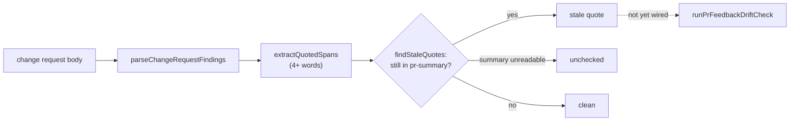

# PR Summary — Issue #3244

## Summary

Review-fix pushes keep leaving sentences in the PR summary that the push itself makes false, sometimes with a "PR-feedback round N" correction appended below them (GRQ-AutoTrader#2486, VibeCoder#3236). The #3143 drift check let those pushes through. This branch adds the building blocks for the issue's three proposed guardrails. **It does not yet wire them into the drift check that runs on a review-fix push.**

What the branch contains at the head:

- **`worker/deno/lib/change_request_quotes.ts` (new).** This is the deterministic, no-I/O backstop from proposal 3.
  - `parseChangeRequestFindings` reads a change request in the `**\`file:line\`**: problem` shape that `reviewBody` (`.claude/skills/review-fleet-prs/review_log.ts`) writes. It keeps only each finding's problem text, never the `**Fix:**` text or the closing summary.
  - `extractQuotedSpans` returns every quoted span of four or more words. It reads straight, curly and single quotes, splits a span at an ellipsis, and never lets a span cross a line break. It uses linear hand-written scanners, not a backtracking regex.
  - `normaliseForQuoteMatch` folds case, whitespace, Markdown emphasis, backticks, underscores and quote style.
  - `findStaleQuotes` reports each quote that is still present in the named `pr-summary-*.md`. A summary mapped to `undefined` is reported as `unchecked` rather than skipped.
  - `isPrSummaryPath` replaces the private `SUMMARY_PATH_PATTERN` that `pr_feedback_drift_check.ts` used before.
  - `summaryFilesNamedBy` lists the summaries the findings name.
- **`worker/deno/lib/pr_feedback_drift_check.ts`.**
  - `buildDriftQuestionPrompt` takes an optional `changeRequest`. When it is given, the prompt fences it as untrusted text and asks the model to confirm each quoted sentence was rewritten or removed. The question now always carries the internal-contradiction clause (proposal 2), and its wording covers "code, tests or docs".
  - `buildDriftRecoveryPrompt` takes optional `staleQuotes`, fences them, and adds a "rewrite or remove, do not append" step.
  - `DriftResidual` carries optional `staleQuotes`, which `formatDriftResidual` and the `.pr_response_message` lead count as hits.
  - `loadSummaries` now uses `isPrSummaryPath`.

**Not done at the head (outstanding for #3244):**

- `runPrFeedbackDriftCheck` does not call `parseChangeRequestFindings`, `findStaleQuotes` or `summaryFilesNamedBy`.
- `runPrFeedbackDriftCheck` does not pass `changeRequest` to the question prompt or `staleQuotes` to the recovery prompt.
- The model pass still runs only when the push changes a code file (`changesBehaviour`).
- `DriftCheckInput.changeRequest` is declared, but `pr_feedback_processor.ts` never sets it.

So a test- or docs-only push like VibeCoder#3236's round 2 still gets no model pass, and no reviewer quote is checked at runtime yet. The module doc comment at the top of `pr_feedback_drift_check.ts` says both gaps "are fixed here". That is not true at the head. It is a code-file comment, so this summary-only fix leaves it in place and records it here instead.

Refs #3244. Because of the outstanding items above, this PR does not close it.

## Evidence

This is a backend change with no UI surface. The evidence is the unit tests and the branch-flip runs below.

**Docs sweep** — grep: `pr_feedback_drift_check`, `change_request_quotes`, `buildDriftQuestionPrompt`, `buildDriftRecoveryPrompt`, `DriftResidual`, `changeRequest`, `staleQuotes`, `SUMMARY_PATH_PATTERN`, `isPrSummaryPath`, "drift check", "Four checks run", "quoted-sentence"; section: `docs/workflows/pr-feedback.md#the-workers-drift-check-issue-3143`; updated: `docs/INTERNALS.md`, `docs/workflows/pr-feedback.md`, `prompts/pr_feedback/prompt.md`

Sweep detail:

- I ran each term over `README.md`, `docs/` (excluding `docs/archive/`), every `*/README.md`, `prompts/`, `CODING-STANDARDS.md` and `DESIGN-PRINCIPLES.md`. The "drift check" hits in `docs/LESSONS-LEARNT.md`, `prompts/documentation_audit/prompt.md` and `DESIGN-PRINCIPLES.md` are about other drift checks, and none is affected. Lines 169 and 250 of `docs/workflows/pr-feedback.md` only point at the section below and stay true.
- `docs/workflows/pr-feedback.md` § "The worker's drift check (Issue #3143)": I read it through. Earlier commits on this branch had rewritten it to say four things that `runPrFeedbackDriftCheck` does not do at the head:
  - "Four checks run".
  - The model pass "runs on every push that changed a file".
  - The question is "fenced together with the change request".
  - A "Deterministic quoted-sentence check … runs on every non-skipped push".
  
  I restored the section to its base text ("Three checks run", model pass only when the push changes a code file), which matches the head.
- `prompts/pr_feedback/prompt.md` ("Keep the PR summary true to the head"): an earlier commit had changed its closing sentence to tell the agent that a model pass "runs on every push" and that quoted spans are "checked for at the head". Neither happens at runtime, so I restored the base sentence.
- `docs/INTERNALS.md` module table: the `pr_feedback_drift_check.ts` row said the model pass is "now carrying the change request and a quoted-sentence recheck". The row now says the prompt builders take a change request and stale quotes, but nothing passes them yet. The `change_request_quotes.ts` row now says the module is not yet called by the drift check.

## Test Plan

- `worker/deno/tests/change_request_quotes_3244_test.ts` is a new file. It adds 21 `Deno.test` declarations, and no existing test is edited.
- **No assertion was removed from an existing test.** The diff adds this one test file and does not touch any other test file.
- `cd worker/deno && deno test --allow-all tests/change_request_quotes_3244_test.ts`: `ok | 21 passed | 0 failed`, run on this head.
- `cd worker/deno && deno test --allow-all tests/pr_feedback_drift_check_3143_test.ts tests/pr_feedback_processor_drift_check_3143_test.ts`: `ok | 30 passed | 0 failed`, run on this head.
- No test covers the new `changeRequest`/`staleQuotes` branches in `pr_feedback_drift_check.ts` (see Branch outcomes). There is no end-to-end test that feeds `runPrFeedbackDriftCheck` a finding quoting a still-present summary sentence. The issue asks for one, but the wiring it would exercise does not exist yet.

**Branch outcomes:**

For each line below, I flipped the branch in the working tree, ran the named test file, then restored the code. The two drift-check test files are `worker/deno/tests/pr_feedback_drift_check_3143_test.ts` and `worker/deno/tests/pr_feedback_processor_drift_check_3143_test.ts`.

- `worker/deno/lib/change_request_quotes.ts:47` — match / no match (lookalike path) — `worker/deno/tests/change_request_quotes_3244_test.ts::isPrSummaryPath - matches a PR summary, rejects lookalikes` — flipped to always-match, test went red
- `worker/deno/lib/change_request_quotes.ts:73` — skip (a line that is not a finding header) — `worker/deno/tests/change_request_quotes_3244_test.ts::parseChangeRequestFindings - strips a trailing :line, and excludes the Fix text and closing summary` — flipped to record it as a finding, test went red
- `worker/deno/lib/change_request_quotes.ts:79` — trailing `:line` stripped — `worker/deno/tests/change_request_quotes_3244_test.ts::parseChangeRequestFindings - strips a trailing :line, and excludes the Fix text and closing summary` — flipped to keep it, test went red
- `worker/deno/lib/change_request_quotes.ts:83` — empty rest-of-line not pushed — no test reaches it — flipped, test stayed green
- `worker/deno/lib/change_request_quotes.ts:87` — blank line ends the problem — `worker/deno/tests/change_request_quotes_3244_test.ts::parseChangeRequestFindings - strips a trailing :line, and excludes the Fix text and closing summary` — flipped to keep reading, test went red
- `worker/deno/lib/change_request_quotes.ts:91` — `**Fix:**` line ends the problem with no blank line before it — no test reaches it — flipped, test stayed green
- `worker/deno/lib/change_request_quotes.ts:92` — next finding header ends the problem with no blank line before it — no test reaches it — flipped, test stayed green
- `worker/deno/lib/change_request_quotes.ts:127` — line break drops an open straight-double span — `worker/deno/tests/change_request_quotes_3244_test.ts::extractQuotedSpans - a quote whose opener and closer are on different lines yields nothing` — flipped, test went red
- `worker/deno/lib/change_request_quotes.ts:133` — `\"` inside a span kept as `"` — `worker/deno/tests/change_request_quotes_3244_test.ts::extractQuotedSpans - the VibeCoder#3236 problem text, literally`, `worker/deno/tests/change_request_quotes_3244_test.ts::findStaleQuotes - the quoted sentence still present is reported stale` — flipped, tests went red
- `worker/deno/lib/change_request_quotes.ts:135` — `\"` outside a span opens one — no test reaches it — flipped, test stayed green
- `worker/deno/lib/change_request_quotes.ts:143` — bare `"` closes a span — `worker/deno/tests/change_request_quotes_3244_test.ts::extractQuotedSpans - the VibeCoder#3236 problem text, literally` — flipped, test went red
- `worker/deno/lib/change_request_quotes.ts:170` — `“` opens a span — `worker/deno/tests/change_request_quotes_3244_test.ts::extractQuotedSpans - curly double quotes` — flipped, test went red
- `worker/deno/lib/change_request_quotes.ts:174` — nested `“` inside a span kept — no test reaches it — flipped, test stayed green
- `worker/deno/lib/change_request_quotes.ts:180` — `”` closes a span — `worker/deno/tests/change_request_quotes_3244_test.ts::extractQuotedSpans - curly double quotes` — flipped, test went red
- `worker/deno/lib/change_request_quotes.ts:199` — single-quote opener at text start — no test reaches it — flipped, test stayed green
- `worker/deno/lib/change_request_quotes.ts:201` — single-quote opener only after whitespace, `(` or `[` — no test reaches it — flipped to any position, test stayed green
- `worker/deno/lib/change_request_quotes.ts:235` — closer before a letter is an apostrophe — `worker/deno/tests/change_request_quotes_3244_test.ts::extractQuotedSpans - straight single quotes containing an apostrophe`, `worker/deno/tests/change_request_quotes_3244_test.ts::extractQuotedSpans - curly single quotes containing an apostrophe` — flipped, tests went red
- `worker/deno/lib/change_request_quotes.ts:237` — closer otherwise closes — `worker/deno/tests/change_request_quotes_3244_test.ts::extractQuotedSpans - straight single quotes containing an apostrophe`, `worker/deno/tests/change_request_quotes_3244_test.ts::extractQuotedSpans - curly single quotes containing an apostrophe` — flipped, tests went red
- `worker/deno/lib/change_request_quotes.ts:274` — span split at an ellipsis — `worker/deno/tests/change_request_quotes_3244_test.ts::extractQuotedSpans - an ellipsis-truncated quote yields the fragment before the ellipsis` — flipped to no split, test went red
- `worker/deno/lib/change_request_quotes.ts:276` — fragment under four words dropped — `worker/deno/tests/change_request_quotes_3244_test.ts::extractQuotedSpans - a 3-word quote never clears the 4-word floor` — flipped, test went red
- `worker/deno/lib/change_request_quotes.ts:277` — duplicate span dropped — no test reaches it — flipped, test stayed green
- `worker/deno/lib/change_request_quotes.ts:334` — finding on a non-summary file ignored — `worker/deno/tests/change_request_quotes_3244_test.ts::findStaleQuotes - a finding on a non-summary file is ignored` — flipped, test went red
- `worker/deno/lib/change_request_quotes.ts:336` — unreadable summary reported unchecked — `worker/deno/tests/change_request_quotes_3244_test.ts::findStaleQuotes - a summary mapped to undefined is reported unchecked, not stale` — flipped to not report it, test went red
- `worker/deno/lib/change_request_quotes.ts:337` — duplicate unchecked file dropped — no test reaches it — flipped, test stayed green
- `worker/deno/lib/change_request_quotes.ts:346` — empty normalised quote skipped — no test reaches it — flipped, test stayed green
- `worker/deno/lib/change_request_quotes.ts:347` — quote absent from summary (rewritten) is not stale — `worker/deno/tests/change_request_quotes_3244_test.ts::findStaleQuotes - a rewritten summary reports no stale quotes` — flipped, test went red
- `worker/deno/lib/change_request_quotes.ts:349` — duplicate stale quote dropped — no test reaches it — flipped, test stayed green
- `worker/deno/lib/change_request_quotes.ts:365` — non-summary finding skipped — `worker/deno/tests/change_request_quotes_3244_test.ts::summaryFilesNamedBy - unique PR summary paths, first-seen order` — flipped, test went red
- `worker/deno/lib/change_request_quotes.ts:366` — duplicate summary path dropped — `worker/deno/tests/change_request_quotes_3244_test.ts::summaryFilesNamedBy - unique PR summary paths, first-seen order` — flipped, test went red
- `worker/deno/lib/pr_feedback_drift_check.ts:302` — change request present (fenced into the question) / absent — no test reaches it — flipped, both drift-check test files stayed green
- `worker/deno/lib/pr_feedback_drift_check.ts:326` — change request present (quoted-sentence instruction added) / absent — no test reaches it — flipped, both drift-check test files stayed green
- `worker/deno/lib/pr_feedback_drift_check.ts:427` — stale quotes present (fenced into the recovery prompt) / absent — no test reaches it — flipped, both drift-check test files stayed green
- `worker/deno/lib/pr_feedback_drift_check.ts:462` — stale quotes present (rewrite step added) / absent — no test reaches it — flipped, both drift-check test files stayed green
- `worker/deno/lib/pr_feedback_drift_check.ts:523` — absent (no stale quotes, not a hit) — `worker/deno/tests/pr_feedback_drift_check_3143_test.ts::formatDriftResidual - a modelPassUnavailable-only residual prints only the unavailable line, no 'found text' intro` — flipped absent to hit, test went red; the present (stale quotes are a hit) outcome is reached by no test
- `worker/deno/lib/pr_feedback_drift_check.ts:555` — stale quotes listed in the residual — no test reaches it — flipped, both drift-check test files stayed green
- `worker/deno/lib/pr_feedback_drift_check.ts:733` — absent (no stale quotes, "could not check it fully" lead) — `worker/deno/tests/pr_feedback_drift_check_3143_test.ts::runPrFeedbackDriftCheck - a modelPassUnavailable-only residual gets the 'could not check it fully' lead, not the 'found text' lead` — flipped absent to hit, test went red; the present outcome is reached by no test
