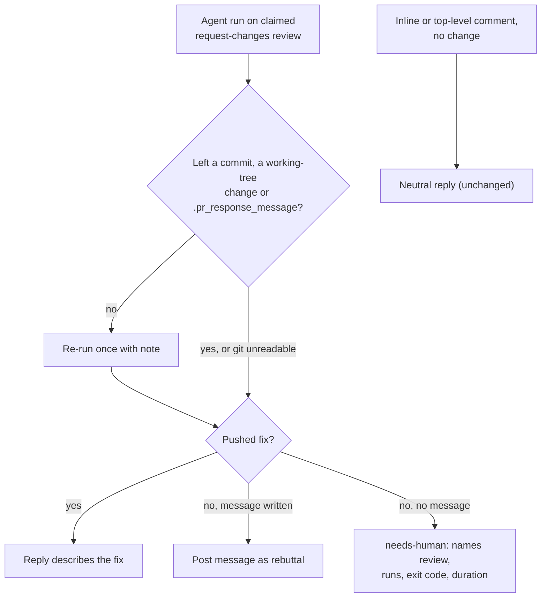

## Summary

When a PR-feedback run on a request-changes review (`commentType: "pr_review"`)
leaves nothing behind, the worker no longer posts the neutral "could not
identify a code change" reply. Here "nothing" means no commit, no working-tree
change and no `.pr_response_message`. The worker re-runs the agent once, in the
same run, with a note appended to the prompt. If there is still no pushed fix
and no `.pr_response_message`, it labels the PR `needs-human`. The comment names
the review, the run count, and the last run's exit code and duration.

On a reviewer change request, an agent-written `.pr_response_message` with no
fix is now posted as the reply (the rebuttal). Before this change the neutral
reply replaced it. Inline and top-level comments keep the neutral reply. The
`pr_feedback` prompt states the rule.

Closes #3246. One criterion is partial: the "release the claim so the next
cycle retries" mechanism is replaced by an in-run retry. The reason is under
Acceptance Criteria.

## Spec

### Intent and Rationale

- A no-change run on a reviewer's finding is a failed run, not a judgement that nothing needs doing. The neutral reply dropped the finding, so it came back word for word on the next review.
- The worker claims a `pr_review` by dismissing it (`markCommentProcessed`), and GitHub cannot undo a dismissal (`removeProcessedMark` returns an error for `pr_review`). Releasing the claim for a later cycle is therefore impossible. The bounded retry runs inside the same run instead.

### Essential Design Decisions

- The review state decides, not the login. `isReviewerChangeRequest` is `commentType === "pr_review"`. The scan surfaces those only for CHANGES_REQUESTED reviews from authorised commenters or trusted review bots. The reviewer App's login is unknown to the worker, because `pr_reviewer_app` is read only by the skill.
- `MAX_REVIEWER_NO_CHANGE_ATTEMPTS = 2` agent runs per claimed review. When the probe cannot read git state (`unknown`), the worker skips the re-run. The final check still escalates if no fix or rebuttal exists.
- The probe reads `.pr_response_message` without consuming it, because `readPrResponseMessage` consumes it later in the run.

### Undiscoverable Facts

- The fleet reviewer App posts its findings with `gh pr review --request-changes` (`.claude/skills/review-fleet-prs/post.ts`), so it always arrives as a `pr_review`.
- During this run the first full-gate parallel test pass died with no failing test printed. A full `deno task test:unit` then passed (`exit=0`), and the re-run gate passed.

## Evidence

Backend-only change, so there is no UI screenshot.

- `worker/deno/tests/pr_feedback_reviewer_no_change_test.ts` drives `processPrFeedback` end to end on mocked ports (`createMockDeps`) with a real temp `workDir`, so `.pr_response_message` is a real file.
- Load-bearing fakes:
  - `branchHeadChanged` and `runGitCommand` mocks stand in for `lib/branch_head_tracker.ts` and `lib/git_timeout.ts`. Property relied on: a `Result` whose `ok:false` means "unreadable".
  - `runClaudeWithRetry` mocks stand in for `lib/claude_runner.ts`. Property relied on: `ok`/`timedOut`/`exitCode`.
  - The escalation `gh` mock follows `lib/gh_escalation_client.ts`: REST `.../issues/N/labels` and `.../comments`, with `issue edit`/`issue comment` fallbacks.
- Related existing prompt rules checked: `prompts/pr_feedback/prompt.md` "Every change-request finding ends fixed or rebutted" (#2917), the `.pr_response_message` paragraph ("if no change was needed — why the current code is correct"), and the Escape Hatch section. The new paragraph agrees with each.

**Docs sweep** — grep: "could not identify a code change", "neutral reply", "no-changes reply", `replyNoChanges`, `buildFeedbackNoChangesResponse`; section: `docs/workflows/pr-feedback.md#every-finding-ends-fixed-or-rebutted-issue-2917`, and the decision-points list; updated: `docs/workflows/pr-feedback.md` (new subsection and decision-point bullet) and the `pr_feedback` prompt; hits left in place: DESIGN-PRINCIPLES.md:1399 — still true because the escape-hatch path still posts Claude's message instead of the neutral fallback; docs/CONFIGURATION.md:4634 — still true because it describes the CI-fix no-changes reply, which is unchanged; docs/workflows/ci-fix.md:190 — still true because it covers the CI-fix path, which is unchanged; docs/workflows/ci-fix.md:203 — still true because it is the CI-fix deferral diagram, which is unchanged; worker/deno/lib/branch_head_tracker.ts:8 — still true because it is the historical reason that module exists; worker/deno/lib/pr_feedback_processor.ts:773 — still true because it is the #1862 history note; worker/deno/lib/pr_feedback_processor.ts:1785 — still true because `replyNoChanges` still posts the neutral message for the comment types that reach it; worker/deno/lib/pr_no_changes_response.ts:64 — still true because the rebuttal is posted through `replyWithResult`, not as a no-changes reply, so every no-changes reply still carries the trailer; worker/deno/lib/escape_hatch.ts:18 — still true because a false-positive escape hatch still suppresses the regular no-changes reply; worker/deno/tests/pr_feedback_processor_escape_hatch_test.ts:384 — still true because that test drives a non-review comment, which keeps the neutral reply; worker/deno/tests/pr_feedback_processor_no_changes_test.ts:8 — still true because those tests drive non-review comments, which keep the neutral reply; worker/deno/tests/pr_feedback_processor_self_push_test.ts:9 — still true because it is the #1862 history note; worker/deno/tests/pr_feedback_processor_self_push_test.ts:181 — still true because the neutral fallback still exists for non-review comments; worker/deno/tests/pr_feedback_trusted_bot_e2e_test.ts:208 — still true because `replyNoChanges` is still the no-change branch for the comment types that test drives; worker/deno/tests/pr_ci_processor_check_name_injection_test.ts:175 — still true because it covers the CI-fix no-changes reply, which is unchanged; worker/deno/tests/pr_ci_processor_check_name_injection_test.ts:273 — still true because it covers the CI-fix no-changes reply, which is unchanged; worker/deno/tests/pr_ci_processor_marker_injection_test.ts:148 — still true because it covers the CI-fix no-changes reply, which is unchanged.

## Acceptance Criteria

<!-- vibe-spec-review inputs="diff+issue-body" -->

- **partial** — In `pr_feedback_processor.ts` (`replyNoChanges` and its caller): when the claimed feedback is a CHANGES_REQUESTED review (or a review comment) from a login in `pr_reviewers`/the reviewer App, a run that ends with no new commit and no agent-written `.pr_response_message` must not post the neutral "could not identify a code change" reply; treat it as a failed attempt, log the run's exit reason and duration, release the claim so the next cycle retries, and escalate with `needs-human` after a bounded number of no-change attempts at the same review — evidence: `worker/deno/lib/pr_feedback_processor.ts`, `worker/deno/lib/pr_feedback_reviewer_no_change.ts`, `worker/deno/tests/pr_feedback_reviewer_no_change_test.ts::reviewer no-change: both runs answer nothing — retries once, escalates` — reviewer: partial — reason: a dismissed `pr_review` cannot be un-dismissed (`removeProcessedMark` errors for it), so the bounded retry (2 runs) happens inside the run rather than through a released claim; inline review comments are not covered, because the worker cannot identify the reviewer App's login
- **met** — In `prompts/pr_feedback/prompt.md`, state the rule from #2917 for this outcome too: a reviewer's finding with a file, line and fix is never answered with "no change"; the agent either applies it and pushes, or writes a `.pr_response_message` that rebuts the finding by name with evidence — evidence: `prompts/pr_feedback/prompt.md`, `worker/deno/tests/pr_feedback_reviewer_no_change_docs_test.ts::pr_feedback - a change request is never answered with no change (Issue #3246)` — reviewer: met
- **met** — Keep the neutral reply for genuinely vague human feedback, where it is still the right answer — evidence: `worker/deno/tests/pr_feedback_reviewer_no_change_test.ts::reviewer no-change: plain review comment is unaffected — neutral reply, no retry` — reviewer: met
- **partial** — Unit test: a no-change run on a `pr_reviewers` CHANGES_REQUESTED review posts no neutral reply. It releases the claim or escalates. A no-change run on a plain human comment still gets the neutral reply — evidence: `worker/deno/tests/pr_feedback_reviewer_no_change_test.ts` — reviewer: partial — reason: the escalate and plain-comment halves are tested; there is no claim-release path to test, for the dismissal reason above

## Standards Review

<!-- vibe-standards-review inputs="diff+CODING-STANDARDS.md" -->

- **violation** — Documentation-drift tests must be section-scoped (`readRepoDoc` + `section`), not a whole-file includes — evidence: `worker/deno/tests/pr_feedback_reviewer_no_change_prompt_test.ts:1` — reason: fixed in this diff (replaced by the section-scoped `worker/deno/tests/pr_feedback_reviewer_no_change_docs_test.ts`)
- **violation** — Log Levels Are a Promise: the handled escalation was logged at ERROR — evidence: `worker/deno/lib/pr_feedback_processor.ts:1532` — reason: fixed in this diff (now `logger.warn`; the two genuine failures stay at ERROR)
- **clean** — checked and compliant: named tests exist; every new branch has a test; fakes match the ports they stand in for; no hidden files; Australian English; no existing test assertion removed. Review-enforced rules checked: log levels, documentation-drift section scoping.

## Test Plan

- Added `worker/deno/tests/pr_feedback_reviewer_no_change_test.ts`, with 15 tests: 8 end-to-end `processPrFeedback` scenarios plus unit tests of `probeAgentAnswer` and `buildReviewerNoChangeEscalation`.
- Added `worker/deno/tests/pr_feedback_reviewer_no_change_docs_test.ts`, a documentation-drift test scoped to the `Making Changes` section of `prompts/pr_feedback/prompt.md`. Each pinned phrase is absent from the base section: `deno task drift-pins-on-base origin/main prompts/pr_feedback/prompt.md "Making Changes" …` reported all four as `absent on base`. The phrases are `"no change" is not an answer to a change request`, `rebut that finding by name`, `re-runs you once`, and `` it labels the pr `needs-human` instead of replying ``. Deleting the new prompt paragraph turned the test red.
- No existing test was edited, so no assertion was removed.
- Regression red against the old behaviour: with `isReviewerChangeRequest` forced to `false` (the base behaviour), tests 1–4 failed, 4 of 12 at the time. The base code posts the neutral reply and runs the agent once.
- `deno task test:unit` over the new test files plus `pr_feedback_processor_no_changes_test.ts`, `pr_feedback_processor_escape_hatch_test.ts`, `pr_feedback_processor_self_push_test.ts`, `pr_feedback_processor_milestone_fix_test.ts` and `pr_feedback_finding_resolution_2917_test.ts` passed on the final head: `ok | 42 passed | 0 failed`.
- `./quality.sh` passed on the final code head (`dbee083c`): `Result: PASSED (with skipped checks)`. Only config integration was skipped (no `.config.json` on this host).
- Entry point checked: `processPrFeedback` is the only changed call site. The new tests drive it directly, and forcing `isReviewerChangeRequest` false turns them red.
- Exits above the new retry loop: a live-state close, a lost claim, branch-prepare failure, a gated-head checkout failure, `!claudeResult.ok` and a timeout. Each one fires on an infrastructure signal before any agent answer exists, and the failed or timed-out agent run already goes through `handlePrCommentFailure`. So these exits keep precedence. The new reply branches come after the escape-hatch verification and push verification, so those guards still apply.

**Branch outcomes:**

- `worker/deno/lib/pr_feedback_processor.ts:1001` — retry loop entered for `pr_review` — `worker/deno/tests/pr_feedback_reviewer_no_change_test.ts::reviewer no-change: both runs answer nothing — retries once, escalates` — forcing `isReviewerChangeRequest` false turned it red
- `worker/deno/lib/pr_feedback_processor.ts:1001` — loop not entered for a plain comment — `worker/deno/tests/pr_feedback_reviewer_no_change_test.ts::reviewer no-change: plain review comment is unaffected — neutral reply, no retry` — asserts a single agent call and the neutral reply
- `worker/deno/lib/pr_feedback_processor.ts:1032` — answered, no re-run — `worker/deno/tests/pr_feedback_reviewer_no_change_test.ts::reviewer no-change: first run writes rebuttal — no retry, posts rebuttal` and `::reviewer no-change: dirty working tree answers — no retry` — making `workingTreeStatus` return "" turned the dirty-tree test red
- `worker/deno/lib/pr_feedback_processor.ts:1033` — unknown, no re-run — `worker/deno/tests/pr_feedback_reviewer_no_change_test.ts::reviewer no-change: head-moved probe unreadable — no retry, still escalates` — went red under the forced-false flip
- `worker/deno/lib/pr_feedback_processor.ts:1067` — re-run failed — `worker/deno/tests/pr_feedback_reviewer_no_change_test.ts::reviewer no-change: retry call itself fails — still escalates, exit code -1, failure logged` — deleting the block turned it red
- `worker/deno/lib/pr_feedback_processor.ts:1523` — rebuttal posted — `worker/deno/tests/pr_feedback_reviewer_no_change_test.ts::reviewer no-change: first run nothing, retry writes rebuttal — posts rebuttal` — went red under the forced-false flip
- `worker/deno/lib/pr_feedback_processor.ts:1528` — escalated to `needs-human` — `worker/deno/tests/pr_feedback_reviewer_no_change_test.ts::reviewer no-change: both runs answer nothing — retries once, escalates` — went red under the forced-false flip
- `worker/deno/lib/pr_feedback_processor.ts:1565` — escalation could not post — `worker/deno/tests/pr_feedback_reviewer_no_change_test.ts::reviewer no-change: escalation that cannot post anything is logged loudly` — deleting the block turned it red
- `worker/deno/lib/pr_feedback_reviewer_no_change.ts:86`, `:89`, `:92`, `:94` and the final `nothing` return — the `probeAgentAnswer` outcomes — `worker/deno/tests/pr_feedback_reviewer_no_change_test.ts::probeAgentAnswer: …` (six tests) — each asserts the exact returned value; these lines were not flipped one at a time

🤖 Generated with [Claude Code](https://claude.com/claude-code)
