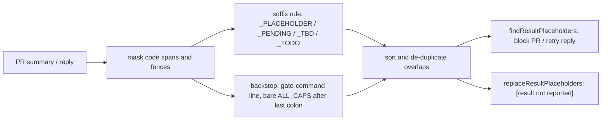

## Summary

The result-placeholder gate (#3124) only matched ALL-CAPS tokens ending in
`_PLACEHOLDER`, so GRQ#5164 shipped `GATE_OUTCOME_PENDING` where the
`./quality.sh` result belonged. The gate now catches the suffixes `_PENDING`,
`_TBD` and `_TODO` as well. It also has a structural backstop: on a line that
cites a gate command, a bare ALL-CAPS identifier with an underscore after the
line's last colon is flagged too, whatever its suffix. Text inside code spans
and fences is still never flagged. Closes #3248.

## Spec

### Intent and Rationale

- The prompt rule against placeholder tokens did not stop the model. Only the
  deterministic gate is reliable, and it was keyed on one spelling.
- Widening the suffix set fixes the escape that was seen. The backstop on
  result lines catches the next invented spelling without listing it: the
  corpus run found `QUALITY_RESULT` and `GATE_RESULT`, which no suffix rule
  matches.

### Essential Design Decisions

- Both rules run over a code-masked copy of the text: every in-code character
  except `\n` becomes a space. Offsets therefore line up with the original, so
  `replaceResultPlaceholders` splices into the original and leaves code
  byte-identical. Overlapping matches from the two rules are de-duplicated.
- The backstop needs a gate command on the raw line (the command usually sits
  in backticks) and a full match of the trimmed tail after the last colon.
  The identifier must contain at least one underscore, so `PASSED` and `OK`
  stay legitimate results.
- All regexes are hardcoded, and the `MAX_SCAN_CHARS` and `MAX_NAMED_TOKENS`
  caps are unchanged.

### Undiscoverable Facts

- GRQ's archive holds the real escape at
  `docs/archive/pr-summaries/pr-summary-4926.md:92`, and an earlier
  `QUALITY_RESULT` result token at `pr-summary-4870.md:160`.

## Evidence

Backend/CLI change only: no UI files.

- **Corpus run** of `findResultPlaceholders` over every archived PR summary:
  VibeCoder (881 files) and GRQ (1,429 files, sparse clone).
  - 3 hits, all true positives:
    - GRQ `pr-summary-4926.md` — `GATE_OUTCOME_PENDING`
    - GRQ `pr-summary-4870.md` — `QUALITY_RESULT` (backstop)
    - VibeCoder `pr-summary-2806.md` — `GATE_RESULT.` (backstop)
  - **0 false positives.** Every bare `MAX_PENDING` in GRQ's summaries is
    inside code spans or a Mermaid fence, so the gate ignores it.
  - **False negatives:** none found among lines matching
    `\b[A-Z][A-Z0-9_]*_(PLACEHOLDER|PENDING|TBD|TODO)\b`.
- **Red against base:** with the base-branch `result_placeholder_gate.ts`
  restored, 7 new unit tests and both new completion-phase tests failed.
  - Unit: the GRQ#5164 line, the three suffix cases, and the three backstop
    cases.
  - All pass on the head.

**Docs sweep** — grep: `_PLACEHOLDER`, "ending in", "fill-in-later",
"placeholder token", "result.placeholder"; section:
`docs/workflows/issue-processing.md#-a-leftover-placeholder-token-blocks-the-summary`;
updated: `docs/workflows/issue-processing.md`, `docs/CONFIGURATION.md`,
`docs/INTERNALS.md`, `CODING-STANDARDS.md`, `prompts/issue/prompt.md`,
`prompts/pr_feedback/prompt.md`, `worker/deno/lib/pr_branch_preparation.ts`
(doc comment), `worker/deno/lib/result_placeholder_gate.ts` (module doc).
Hits left in place:

- `worker/deno/lib/phases/completion_phase.ts:2389` — still true because it
  names `QUALITY_RESULT_PLACEHOLDER` only as an example token.
- `worker/deno/lib/phases/completion_phase.ts:2701` — still true for the same
  reason.

Related existing rules checked: the Test Plan placeholder rule in
`prompts/issue/prompt.md`, the reply rule in `prompts/pr_feedback/prompt.md`,
and the unresolved-placeholder sentence in `CODING-STANDARDS.md`. Each was
updated to the widened set in this diff, and no conflicting rule was found.

## Acceptance Criteria

<!-- vibe-spec-review inputs="diff+issue-body" -->

- **met** — Widen the token pattern to the fill-in-later suffixes the model actually uses. At least `_PLACEHOLDER`, `_PENDING`, `_TBD` and `_TODO` — evidence: `worker/deno/tests/result_placeholder_gate_test.ts::findResultPlaceholders - the _TBD, _TODO and _PENDING suffixes are reported in prose` — reviewer: met
- **met** — Keep the existing rules: a hardcoded regex, the scan-size cap, and no match inside code spans or fences — evidence: `worker/deno/tests/result_placeholder_gate_test.ts::findResultPlaceholders - a bare identifier inside a fenced block is not flagged` — reviewer: met
- **met** — Optionally, add a structural backstop for result lines — evidence: `worker/deno/tests/result_placeholder_gate_test.ts::findResultPlaceholders - the structural backstop catches a bare identifier on a deno test result line` — reviewer: met
- **met** — Update the module doc comment, `docs/CONFIGURATION.md`, `docs/INTERNALS.md` and `docs/workflows/issue-processing.md` — evidence: `worker/deno/lib/result_placeholder_gate.ts`, `docs/workflows/issue-processing.md` — reviewer: met
- **met** — add cases to `result_placeholder_gate_test.ts` and `completion_phase_result_placeholder_test.ts` with `GATE_OUTCOME_PENDING` in a result line — evidence: `worker/deno/tests/completion_phase_result_placeholder_test.ts::completion - a GATE_OUTCOME_PENDING result token blocks PR creation (Issue #3248)` — reviewer: met
- **met** — They must fail on main and pass with the change — evidence: base-branch lib restored → 7 new unit tests and 2 new completion tests red; head → green — reviewer: met
- **met** — Keep a negative case for an all-caps name in code (`` `SYNC_PENDING` ``) — evidence: `worker/deno/tests/result_placeholder_gate_test.ts::findResultPlaceholders - a bare identifier inside an inline code span is not flagged` — reviewer: met
- **met** — and for prose identifiers that are not results — evidence: `worker/deno/tests/result_placeholder_gate_test.ts::findResultPlaceholders - an identifier that is not the line's result is not flagged` — reviewer: met
- **unrequested** — `CODING-STANDARDS.md`, `prompts/issue/prompt.md` and `prompts/pr_feedback/prompt.md` wording widened — reviewer: unrequested — reason: each stated the gate was `_PLACEHOLDER`-only, which this change makes false (A Code Change Owes a Docs Change)
- **unrequested** — `worker/deno/lib/pr_branch_preparation.ts` doc comment names `GATE_OUTCOME_PENDING` — reviewer: unrequested — reason: the chokepoint's doc comment describes the same token set
- **unrequested** — `assertLinearGrowth` hostile-input tests for the three regexes — reviewer: unrequested — reason: CODING-STANDARDS requires one hostile case per regex run on untrusted text
- **unrequested** — `tests/result_placeholder_gate_test.ts` registered in `WALL_CLOCK_TEST_FILES` (`worker/deno/lib/parallel_unsafe_test_manifest.ts`) — reviewer: unrequested — reason: added after the review; the repo's manifest test requires every growth-timing test file to be listed

## Standards Review

<!-- vibe-standards-review inputs="diff+CODING-STANDARDS.md" -->

- **clean** — The reviewer found no violations. It checked these rules:
  - Writing a gate over text: evasion table both ways, no silent pass on
    unread input, like-with-like comparison.
  - ReDoS guidance: a ratio-form growth test per new regex.
  - Australian English.
  - The four over-engineering departures: `maskCode` reuses
    `splitOutsideCode`.
  - A named test must exist.
  - Removed assertions: none.
  - Docs-change rules.
  - Optional note: the corpus counts belong in the summary. They are recorded
    under Evidence.

## Test Plan

- `worker/deno/tests/result_placeholder_gate_test.ts`: 18 new tests.
  - Positive: the GRQ#5164 line, the `_TBD`/`_TODO`/`_PENDING` suffixes, the
    backstop on `deno test` and `cargo test` lines (trailing full stop kept on
    replace), and one de-duplicated overlap with its replace output.
  - Negative: a line with no colon, `SYNC_PENDING` in a code span and in a
    fence, `SYNC_PENDING_COUNT`, `PASSED`, a line with no gate command, an
    identifier that is not the line's result, `MAX_SCAN_CHARS: 200000`, and a
    backticked result.
  - Four `assertLinearGrowth` hostile cases.
- `worker/deno/tests/completion_phase_result_placeholder_test.ts`: two new
  tests. The GRQ#5164 summary blocks PR creation, and the in-run recovery
  that fills in the result raises the PR.
- No existing assertion was removed or changed.
- `deno test -A tests/result_placeholder_gate_test.ts tests/completion_phase_result_placeholder_test.ts tests/pr_feedback_processor_result_placeholder_test.ts`
  on the final head: 51 passed, 0 failed.
- Full `./quality.sh < /dev/null` on the final tree: PASSED, with config
  integration skipped as usual.

**Branch outcomes:**

- `worker/deno/lib/result_placeholder_gate.ts:51` — suffix match on `_PENDING`/`_TBD`/`_TODO` — `worker/deno/tests/result_placeholder_gate_test.ts::findResultPlaceholders - the _TBD, _TODO and _PENDING suffixes are reported in prose` — red against the base `_PLACEHOLDER`-only regex
- `worker/deno/lib/result_placeholder_gate.ts:269` — no gate command on the line → not flagged — `worker/deno/tests/result_placeholder_gate_test.ts::findResultPlaceholders - a line with no gate command is not flagged` — flipping the condition to `true` went red
- `worker/deno/lib/result_placeholder_gate.ts:269` — gate command present → backstop runs — `worker/deno/tests/result_placeholder_gate_test.ts::findResultPlaceholders - the structural backstop catches a bare identifier on a deno test result line` — disabling the backstop went red
- `worker/deno/lib/result_placeholder_gate.ts:271` — no colon on the line → not flagged — `worker/deno/tests/result_placeholder_gate_test.ts::findResultPlaceholders - a gate-command line with no colon is not flagged` — flipping to `true` went red
- `worker/deno/lib/result_placeholder_gate.ts:275` — tail is not a bare identifier with an underscore → not flagged — `worker/deno/tests/result_placeholder_gate_test.ts::findResultPlaceholders - a result with no underscore (PASSED) is not flagged` — making the underscore group optional went red
- `worker/deno/lib/result_placeholder_gate.ts:291` — overlapping match from both rules dropped — `worker/deno/tests/result_placeholder_gate_test.ts::findResultPlaceholders - a backstop identifier also ending in _PENDING is reported once` — removing the dedupe went red (the replacement was spliced in twice)
- Code masking (in-code text never flagged) — `worker/deno/tests/result_placeholder_gate_test.ts::findResultPlaceholders - a bare identifier inside an inline code span is not flagged` — scanning unmasked text went red (9 tests)

🤖 Generated with [Claude Code](https://claude.com/claude-code)
