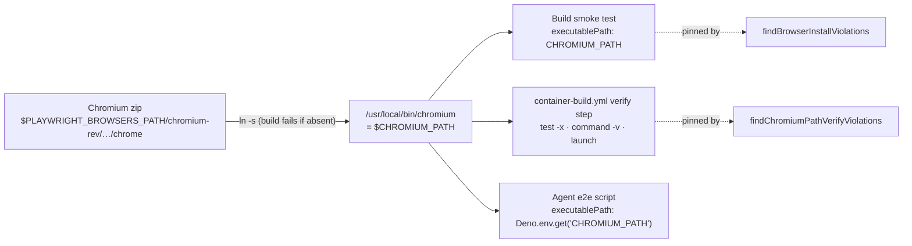

# PR Summary — Issue #3250

## Summary

Fleet UI PRs kept shipping `e2e/` Playwright checks that were never run. The agent reported "no Chromium" because GRQ-AutoTrader's scripts launch with `executablePath: Deno.env.get("CHROMIUM_PATH")`, and nothing set `CHROMIUM_PATH` or put the baked browser on `PATH`. This PR fixes it in three places:

- **Container.** The image exports `CHROMIUM_PATH=/usr/local/bin/chromium` as a symlink to the baked Chrome binary, which also puts `chromium` on `PATH`. The build smoke test and the `container-build.yml` verify step both launch Chromium through that path. Two validators in `container_manifest.ts` pin all of it.
- **Prompts.** `prompts/issue/prompt.md` and `prompts/pr_feedback/prompt.md` now say a browser check you did not run is not a safety net: run it against the baked Chromium, and show it passing on the fix and failing with the fix reverted.
- **Coding standards.** The UI/PWA bullet in `CODING-STANDARDS.md` now covers the 1×1 `visually-hidden` trap and says to measure only after the UI has committed.

Closes #3250.

## Spec

### Intent and Rationale

- The browser was already in the image, but the agent could not find it. The fix exposes it in the form repo scripts already use (`CHROMIUM_PATH`), instead of asking every repo to learn `PLAYWRIGHT_BROWSERS_PATH`.
- A symlink in `/usr/local/bin` covers both lookups at once: `$CHROMIUM_PATH` for `executablePath`, and `which chromium` for an agent that checks `PATH`.
- The prompt rule also covers runs where the browser truly cannot start. The agent must quote the error and must not present the unrun script as the regression guard.

### Essential Design Decisions

- The symlink target is resolved with `find … -name chrome` and fails the build (`test -n`) if no binary is found. A Playwright revision bump therefore cannot leave a dangling `CHROMIUM_PATH`.
- The Containerfile's build-time smoke test now launches only through `executablePath: process.env.CHROMIUM_PATH`. Playwright's default `PLAYWRIGHT_BROWSERS_PATH` lookup, which the MCP server uses, stays covered in CI by the workflow's "Capture a screenshot with headless Chromium inside the image" step, which calls `chromium.launch({ args: ["--no-sandbox"] })` with no `executablePath`.
- `container-build.yml` had no step-content validator, so `findChromiumPathVerifyViolations` was added. A test runs it against the committed workflow, so deleting any of the three checks turns the suite red.

### Undiscoverable Facts

- `CHROMIUM_PATH` reaches the agent unchanged. `buildAgentChildEnv` in `worker/deno/lib/agent_env.ts` passes the parent environment through, minus a denylist and secret-shaped names, and `CHROMIUM_PATH` matches neither. So the image `ENV` is enough and no worker change is needed.
- Neither the new symlink nor a real e2e run against it could be exercised in this run, because the image is not rebuilt here. The container-build workflow proves both on the PR.

## Evidence

This is a backend, container and prompt change; no UI file is touched. The evidence is the unit tests below and the CI container build.

**Docs sweep** — grep: `CHROMIUM_PATH`, `PLAYWRIGHT_BROWSERS_PATH`, "which chromium", "no Chromium"; section: `docs/CONTAINER-IMAGE.md#playwright--headless-chromium`; updated: `docs/CONTAINER-IMAGE.md`; `docs/CONTAINER-IMAGE.md:311` — still true because Chromium is still installed into `PLAYWRIGHT_BROWSERS_PATH` at build time; `docs/CONTAINER.md:247` — still true because the MCP server still resolves the baked browser via `PLAYWRIGHT_BROWSERS_PATH`; `docs/CONTAINER.md:268` — still true because `resolveBrowserEnvironment()` is unchanged; `docs/CONTAINER.md:269` — still true for the same reason; `docs/DEPLOYMENT.md:959` — still true because `PLAYWRIGHT_BROWSERS_PATH` is still set inside the container; `docs/CONFIGURATION.md:4462` — still true because `skip_screenshot_check` still starts no Chromium for the MCP server; `docs/audits/security-sweep-2925-browser-grant.md:23` — still true because it describes the same unchanged opt-out; `prompts/issue/prompt.md:480` — the new rule itself, telling the agent not to rely on `which chromium` alone; `worker/deno/lib/container_manifest.ts:1263` — still true because `BROWSERS_PATH_ENV_RE` still matches the unchanged `ENV PLAYWRIGHT_BROWSERS_PATH=` line; `worker/deno/setup/screenshot.ts:183` — still true because the Containerfile still installs Chromium under `/opt/playwright-browsers` and sets `PLAYWRIGHT_BROWSERS_PATH` to it; `CHROMIUM_PATH` is only a symlink added alongside; `worker/deno/setup/screenshot.ts:262` — still true because `resolveBrowserEnvironment()` and the image's `PLAYWRIGHT_BROWSERS_PATH` are unchanged; `worker/deno/setup/screenshot.ts:609` — still true because the MCP server launch in `screenshot.ts` is untouched and still passes `PLAYWRIGHT_BROWSERS_PATH`

**Related existing rules checked:**

- `prompts/issue/prompt.md` Error Recovery item 3, "The headless browser is provided on every run — do not assume it is unavailable". The new paragraph extends it to repo `e2e/` scripts and agrees with it.
- `prompts/pr_feedback/prompt.md` **A requested red run is shown, not claimed**. The new paragraph sits directly after it and defers to it for the red run.
- `CODING-STANDARDS.md` **A new test must go red without its change** and the UI/PWA "Choosing assertions" bullet. The new sentences extend that bullet and agree with it.
- The generic browser wording in `prompts/coding_guidelines` and `prompts/test_audit`. Neither contradicts the new rule.

## Acceptance Criteria

<!-- vibe-spec-review inputs="diff+issue-body" -->

- **met** — **Container:** expose the baked browser to repo scripts. Export `CHROMIUM_PATH` (and/or put the baked `chrome`/`headless_shell` on `PATH`) pointing at the binary under `$PLAYWRIGHT_BROWSERS_PATH`, in the image and in the agent's run environment. Add a check in `container-build.yml` / `container_manifest.ts` that `"$CHROMIUM_PATH"` exists and launches — evidence: `container/Containerfile`, `.github/workflows/container-build.yml`, `worker/deno/tests/container_manifest_test.ts::container-build.yml - the committed verify step checks CHROMIUM_PATH (Issue #3250)`, `worker/deno/tests/container_manifest_test.ts::findBrowserInstallViolations - reports a CHROMIUM_PATH that is never linked (Issue #3250)` — reviewer: met
- **met** — **Prompts (`prompts/issue/prompt.md` and `prompts/pr_feedback/prompt.md`):** a browser check you did not run is not a safety net. Before claiming a review's browser-check ask is met, run the `e2e/` script against the baked Chromium. Show it passing on the fix and failing with the fix reverted, per **A requested red run is shown, not claimed**. If it truly cannot run, say so and do not present it as the regression guard — evidence: `worker/deno/tests/e2e_browser_check_run_3250_test.ts` — reviewer: met
- **met** — **CODING-STANDARDS.md, UI bullet (one sentence each):** a closed `visually-hidden` element has a 1x1 box, which Playwright counts as visible, so assert the semantic closed state (`aria-expanded="false"`, or the open-only class absent). Measure only after the UI has committed, never in the same synchronous `page.evaluate` as the click — evidence: `worker/deno/tests/ui_assertion_closed_state_3250_test.ts` — reviewer: met
- **missing** — Future GRQ-AutoTrader UI PRs that touch `e2e/` should quote a real run of the script in the PR body or `.pr_response_message` — reviewer: missing — reason: a post-merge observation of future fleet PRs and `log.jsonl`; no diff can demonstrate it (the reviewer said "missing, as expected … not a defect")
- **unrequested** — the new `CHROMIUM_PATH` paragraph in `docs/CONTAINER-IMAGE.md` — reviewer: unrequested — reason: the docs change this code change owes, under **A Code Change Owes a Docs Change**
- **unrequested** — the build smoke test launches through `CHROMIUM_PATH` instead of Playwright's default lookup — reviewer: unrequested — reason: it proves the new path at build time; the default lookup stays covered by the workflow's screenshot step (see Essential Design Decisions)
- **unrequested** — the "do not conclude Chromium is missing from `which chromium` alone" sentence in `prompts/issue/prompt.md` — reviewer: unrequested — reason: it answers the root cause the issue names (`which chromium` found nothing)
- **unrequested** — the paragraph-ordering test in `e2e_browser_check_run_3250_test.ts` — reviewer: unrequested — reason: it pins the new rule next to the **A requested red run is shown, not claimed** rule it refers back to

## Standards Review

<!-- vibe-standards-review inputs="diff+CODING-STANDARDS.md" -->

- **clean** — Named tests all exist in the diff. Each new workflow invariant is validated by `findChromiumPathVerifyViolations`, with positive, negative and committed-file tests. No assertion was removed from an existing test; only the shared `BROWSER_CONTAINERFILE` fixture gained lines. Drift tests read narrowed sections. Every new violation outcome has a negative test. The symlink step fails loud (`test -n`). Australian English is used, and prompt edits are made in place.
- **clean** — Optional notes, not chased:
  - "never links" is only checked when `ENV CHROMIUM_PATH` is present, so a missing ENV is reported once rather than twice.
  - The link check is a substring match.
  - The ordering test reuses two pre-existing phrases, but it still goes red without the new paragraph.

## Test Plan

- `worker/deno/tests/container_manifest_test.ts`:
  - `BROWSER_CONTAINERFILE` fixture extended with the `ENV CHROMIUM_PATH`, symlink and `executablePath` lines.
  - Three new `findBrowserInstallViolations` tests, one per removed line.
  - Five `findChromiumPathVerifyViolations` fixture tests.
  - `container-build.yml - the committed verify step checks CHROMIUM_PATH (Issue #3250)` against the real workflow.
- `worker/deno/tests/e2e_browser_check_run_3250_test.ts` (new): pins the rule in the issue prompt's "Error Recovery" and pr_feedback's "Making Changes", and pins its position after the red-run paragraph. It went red with the two prompt edits reverted.
- `worker/deno/tests/ui_assertion_closed_state_3250_test.ts` (new): pins the closed-state guidance in "Choosing assertions". It went red with the `CODING-STANDARDS.md` edit reverted.
- Removed assertions: none. The only edit to existing test code is the fixture extension.
- Drift pins: `deno task drift-pins-on-base origin/main <doc> <section> <phrase>...` (from `worker/deno`) reported `absent on base` for every pinned phrase:
  - `prompts/issue/prompt.md` "Error Recovery", 5 phrases;
  - `prompts/pr_feedback/prompt.md` "Making Changes", 4 phrases;
  - `CODING-STANDARDS.md` "Choosing assertions": "1×1 box", `aria-expanded="false"`, "same synchronous `page.evaluate` as the click".
- `deno task test:unit tests/container_manifest_test.ts tests/e2e_browser_check_run_3250_test.ts tests/ui_assertion_closed_state_3250_test.ts tests/new_test_must_go_red_3093_test.ts < /dev/null` — 146 passed, 0 failed on the final code head.
- `./quality.sh < /dev/null` passed on the final head.

**Branch outcomes:**

Each "flipped" outcome below went red when its check was deleted or inverted, and was then restored.

- `worker/deno/lib/container_manifest.ts:1147` — no `ENV CHROMIUM_PATH` → violation — `worker/deno/tests/container_manifest_test.ts::findBrowserInstallViolations - reports a build that never sets ENV CHROMIUM_PATH (Issue #3250)` — flipped
- `worker/deno/lib/container_manifest.ts:1158` — ENV set but never linked → violation — `…::findBrowserInstallViolations - reports a CHROMIUM_PATH that is never linked (Issue #3250)` — flipped
- `worker/deno/lib/container_manifest.ts:1169` — no launch through `CHROMIUM_PATH` → violation — `…::findBrowserInstallViolations - reports a build that never launches through CHROMIUM_PATH (Issue #3250)` — flipped
- `worker/deno/lib/container_manifest.ts:1147/1158/1169` — all present → no violation — `…::findBrowserInstallViolations - a baked browser has none` and `…::container/ - the committed image bakes Playwright's headless Chromium` — a falsely failing check turns both red
- `worker/deno/lib/container_manifest.ts:1205` — verify step absent → violation — `…::findChromiumPathVerifyViolations - reports a workflow without the verify step` — flipped
- `worker/deno/lib/container_manifest.ts:1223` — no `test -x` → violation — `…::findChromiumPathVerifyViolations - reports a missing test -x check` — flipped
- `worker/deno/lib/container_manifest.ts:1232` — no `command -v chromium` match → violation — `…::findChromiumPathVerifyViolations - reports a missing command -v chromium check` — flipped
- `worker/deno/lib/container_manifest.ts:1242` — no `executablePath` launch → violation — `…::findChromiumPathVerifyViolations - reports a missing executablePath launch` — flipped
- `worker/deno/lib/container_manifest.ts:1205-1242` — complete step → `[]` — `…::findChromiumPathVerifyViolations - a complete verify step has none` and `…::container-build.yml - the committed verify step checks CHROMIUM_PATH (Issue #3250)`
- `container/Containerfile` `test -n "${chrome_bin}"` — no `chrome` binary unzipped → build fails. No unit test reaches it: it is a shell guard exercised only by the CI container build.

## Pre-PR security self-check

- [x] Input validation: the new validators read committed repository files only.
- [x] Secrets: none staged; `git diff --cached --name-only` was checked before each commit.
- [x] Injection surface: no new shell input from users. The workflow lines use the image's own `ENV`, and no `${{ github.* }}` is interpolated.
- [x] Dependencies: none added. The Playwright and Chromium pins are unchanged.
