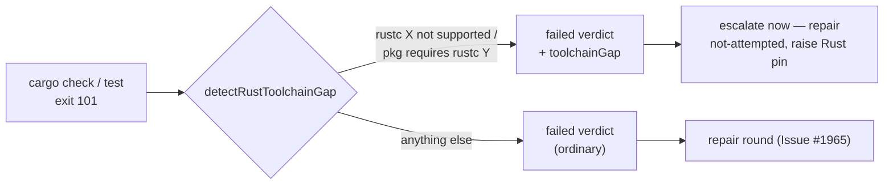

# PR Summary — Issue #3255

## Summary

The milestone sync gate on `stSoftwareAU/NEAT-AI-Discovery` kept refusing every resolution and every repair round. The cause was not the resolution. The tree declares `rust-version = "1.99"`, but the container's Rust is pinned to 1.98.0 (`container/tools.json`), so `cargo check` exits 101 before compiling anything. The gate reported that as an ordinary build failure, so it offered a repair round that "changed nothing in the tree" and could never pass.

The gate now recognises this environment fault and says what it is:

- **Detection.** `detectRustToolchainGap` (`worker/deno/lib/milestone_merge_gate.ts`) reads cargo's own MSRV refusal: the header `error: rustc X is not supported by the following packages:` and the lines `pkg@ver requires rustc Y`. It returns the installed version, the highest required version, and the packages that need it.
- **Both gates name it.** `checkMergedTree` and the cargo test step of `verifyResolvedTree` (`milestone_resolution_gate.ts`) carry `toolchainGap` on the failed verdict. Their detail says the host's rustc is older than the tree's `rust-version` and that the container's Rust pin must be raised. It also says no change to the resolution can fix it.
- **No pointless repair.** `runGateWithRepair` (`milestone_gate_repair.ts`) escalates a toolchain-gap verdict straight away, with repair status `not-attempted`, instead of spending an agent round on it.
- **Readable output.** The gate's output tail collapses consecutive duplicate lines (`… requires rustc 1.99 (×40)`), so the reason is no longer buried under 40 copies of one line.

This PR does not raise the Rust pin, which is a separate container change. That work is tracked in follow-up issue #3258.

Closes #3255.

## Spec

### Intent and Rationale

- The issue asks to fix the **gate**, not the conflict. The gate could not verify this tree because the host could not build it at all. Teaching the gate to verify the tree therefore means letting it tell an environment fault apart from a resolution fault, and say which one it is. Then neither the agent nor the human goes looking in the merged code.
- A repair round is an agent run against the same clone and the same host. When the fault is the host's rustc, the result is already known, so the round is skipped and the escalation says why.

### Essential Design Decisions

- Detection keys on cargo's own MSRV error text, not on `rust-toolchain.toml` or `Cargo.toml` parsing. That is the signal the gate already has in hand, and it holds however the requirement was declared, including a transitive dependency's `rust-version`.
- `toolchainGap` is an optional field on the existing verdict, not a new status. Every caller that only reads `status` behaves as before, and only the repair wrapper acts on it.
- The parsing is line-wise. Each line is trimmed and capped at 4000 characters, and the regexes are anchored with disjoint character classes, so they run in linear time on agent-controlled output. Hostile-input tests pin that.
- `describeRustToolchainGap` is the single source of the detail sentence, shared by both gates.
- `tests/milestone_merge_gate_test.ts` now uses `assertLinearGrowth`, so it is registered in `WALL_CLOCK_TEST_FILES` (`worker/deno/lib/parallel_unsafe_test_manifest.ts`) and runs in the serial pass, as the Issue #940 manifest test requires. This follows the #3223 precedent.

### Undiscoverable Facts

- The container has no `rustup`, so a `rust-toolchain.toml` pin cannot download a newer toolchain. The pinned 1.98.0 is the only rustc there is.
- Cargo prints one `requires rustc` line per workspace package and target that it checks. That is why the logged failure repeated about 40 times.
- In this container, plain `cargo` is rewritten by a wrapper that summarises the output. The reproduction used `/usr/local/bin/cargo` to see cargo's exact text.

## Evidence

This is a backend change with no UI surface. The evidence is the reproduction and the unit tests below.



**Docs sweep:**

- Greps: `toolchainGap`, "toolchain gap", `repair round`, `1.98`, `rust-version`.
- Updated:
  - `docs/INTERNALS.md`: the paragraph after the repair-rung narrative, the decision node in the repair flowchart, and the `milestone_gate_repair.ts` row of the module table. That table was re-padded by `deno fmt` to fit the longer row, which is a whitespace-only change.
  - `docs/CONTAINER-IMAGE.md`: the Rust section says that an older pin surfaces as a named toolchain gap.
- Still true:
  - `docs/CONTAINER.md:89` and `:117` (Rust 1.98.0): the pin is unchanged in this PR.
  - `docs/CONTAINER.md:1260` and `:1270`: these describe the HOST_DISK_LOW deferral of the verification and its repair rounds, which is untouched.
  - `docs/workflows/milestones.md:523`: timing attribution of a repair round, which is unchanged.
  - `docs/workflows/merge-conflicts.md:215`: the type-check gate "with its repair round" is still the milestone gate. The exception for a toolchain gap is documented in INTERNALS.

**Related existing rules checked:** none found that govern toolchain detection. This change adds no prompt or standards rule.

## Reproduction

Status: **verified**

The logged line from the issue was `neat_ai_discovery@0.74.279 requires rustc 1.99`, repeated about 40 times under `cargo check --workspace --all-targets --locked in /home/vibe/auto-issue-work/NEAT-AI-Discovery failed (exit 101)`.

I reproduced it in this container with a throwaway crate that declares `rust-version = "1.99"`, built with `/usr/local/bin/cargo` (rustc 1.98.0). It exits 101 with:

```text
error: rustc 1.98.0 is not supported by the following packages:
  msrvprobe@0.1.0 requires rustc 1.99
```

The regression tests build their fixtures from that exact output, with the logged NEAT-AI-Discovery line repeated 40 times. Against the base code, the verdict carried no gap and the repair wrapper offered a repair round. With the fix, the verdict names the gap and no repair is offered.

## Test Plan

Tests added, all named "(Issue #3255)":

- `worker/deno/tests/milestone_merge_gate_test.ts`:
  - `checkMergedTree` with and without a toolchain gap.
  - Seven `detectRustToolchainGap` tests: header and requirement; requirement only; highest version wins with dedupe; malformed line; empty input; and three hostile linear-time inputs.
  - One `collapseRepeatedLines` test.
- `worker/deno/tests/milestone_resolution_gate_test.ts`: `verifyResolvedTree` with and without a toolchain gap.
- `worker/deno/tests/milestone_gate_repair_test.ts`: `runGateWithRepair` with a gap verdict (no repair) and without one (repair still offered).

Other checks:

- Removed assertions: none. The existing repair tests are unchanged apart from fixture fields.
- `deno task test:unit tests/milestone_merge_gate_test.ts tests/milestone_resolution_gate_test.ts tests/milestone_gate_repair_test.ts < /dev/null`: 63 passed, 0 failed.
- `deno task check:manifests < /dev/null`: 678 passed, 0 failed. The first full-gate run had failed only on the Issue #940 manifest test until the registration above was added.
- `./quality.sh < /dev/null`: QUALITY_RESULT_PENDING

**Branch outcomes:**

Each outcome below was flipped by deleting or inverting its branch. The named test went red, and the branch was then restored.

- `worker/deno/lib/milestone_gate_repair.ts:556`:
  - Gap → escalate, `not-attempted`: `worker/deno/tests/milestone_gate_repair_test.ts::runGateWithRepair - a failed verdict carrying a toolchain gap is not offered a repair (Issue #3255)`. Flipped (short-circuit removed): red.
  - No gap → repair offered: `…::runGateWithRepair - a failed verdict without a toolchain gap still offers a repair (Issue #3255)`. Flipped (short-circuit made unconditional): red.
- `worker/deno/lib/milestone_merge_gate.ts:514`:
  - Gap → named detail plus `toolchainGap`: `worker/deno/tests/milestone_merge_gate_test.ts::checkMergedTree - a host rustc older than the tree's rust-version is named as a toolchain gap, not an ordinary failure (Issue #3255)`. Flipped: red.
  - No gap → ordinary failure: `…::checkMergedTree - an ordinary cargo failure carries no toolchain gap (Issue #3255)`. Flipped: red.
- `worker/deno/lib/milestone_resolution_gate.ts:309`:
  - Gap: `worker/deno/tests/milestone_resolution_gate_test.ts::verifyResolvedTree - a host rustc older than the tree's rust-version is named as a toolchain gap, not an ordinary failure (Issue #3255)`. Flipped: red.
  - No gap: `…::verifyResolvedTree - an ordinary cargo test failure carries no toolchain gap (Issue #3255)`. Flipped: red.
- `worker/deno/lib/milestone_merge_gate.ts:408`:
  - Required version found → gap: `worker/deno/tests/milestone_merge_gate_test.ts::detectRustToolchainGap - a header and a requirement line together report the installed and required versions (Issue #3255)`. Flipped (detection removed): red.
  - No required version → `undefined`: `…::detectRustToolchainGap - a malformed requirement line (no version, no package) is not a gap (Issue #3255)` and `…::detectRustToolchainGap - empty output is not a gap (Issue #3255)`. Flipped: red.
- `worker/deno/lib/milestone_merge_gate.ts:317`:
  - Run > 1 → `(×N)` suffix; run of 1 → line unchanged: `worker/deno/tests/milestone_merge_gate_test.ts::collapseRepeatedLines - consecutive duplicates collapse, non-consecutive duplicates do not, single lines are unchanged (Issue #3255)`. Flipped: red.

## Pre-PR security self-check

- [x] Input validation: the parser reads cargo output only. Lines are capped at 4000 characters, the regexes are anchored and linear, and hostile tests cover them.
- [x] Secrets: none staged. `git diff --cached --name-only` was checked before each commit.
- [x] Injection surface: there are no new shell, SQL or HTTP calls. The detected versions and package names are only interpolated into a log and escalation sentence.
- [x] Dependencies: none added. The Rust pin is unchanged, with follow-up #3258.
