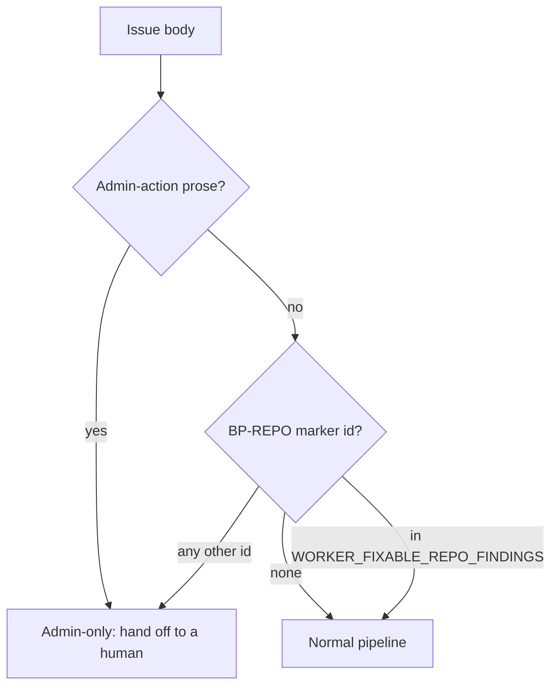

# PR Summary — Issue #3266

## Summary

`isAdminOnlyRepoSettingsIssue` now skips the up-front admin hand-off for
`BP-REPO-SECURITY-POLICY-MISSING`. A new `WORKER_FIXABLE_REPO_FINDINGS`
allowlist in `worker/deno/lib/admin_only_finding.ts` holds that id, because
committing a `SECURITY.md` is ordinary repo work a worker PR can do. If the body
also contains the scanner's admin-action prose, the issue is still admin-only.
`parseRepoSettingsFindingId` is unchanged. Closes #3266.

## Spec

### Intent and Rationale

- Before this change, every `BP-REPO-*` marker was routed to a human before any
  work started. The planned security-policy finding is fixed by a commit, so
  routing it to a human would leave it unfixed.
- An exact-id allowlist keeps every other `BP-REPO-*` finding on the admin path
  and needs only a one-line edit to add an id later.

### Essential Design Decisions

- The prose check runs first, so an allowlisted id whose body still says the
  worker cannot change repository settings is still handed off.
- The lookup is an exact `Set` match on the upper-cased id. A prefix
  (`BP-REPO-SECURITY-POLICY`) or a longer id
  (`BP-REPO-SECURITY-POLICY-MISSING-X`) is still admin-only.
- `parseRepoSettingsFindingId` still returns the id.
  `worker/deno/setup/repo_settings_audit_close.ts` reads it to close fixed
  findings.

### Undiscoverable Facts

- The scanner does not file `BP-REPO-SECURITY-POLICY-MISSING` yet. It is planned
  under milestone #3227, and this change gets the hand-off ready before the
  scanner starts filing it.
- The issue body was reworded to avoid quoting the marker and the prose, because
  quoting them made the hand-off fire on #3266 itself (see the issue comments).

## Evidence

Backend-only change. The new unit tests in
`worker/deno/tests/admin_only_finding_test.ts` cover the behaviour.

**Docs sweep** — grep: `isAdminOnlyRepoSettingsIssue`, `admin_only_finding`,
`SECURITY-POLICY-MISSING`, "admin-only", "Repository-admin action"; section:
none — no manual under `docs/` (outside `docs/archive/`), and no README,
documents the admin-only hand-off. Its contract lives in the module doc of
`worker/deno/lib/admin_only_finding.ts` and the call-site comment in
`worker/deno/lib/issue_worker.ts`. Both are updated in this diff to name the
allowlist exception. Updated: `worker/deno/lib/admin_only_finding.ts`,
`worker/deno/lib/issue_worker.ts`. Hits left in place:

- `docs/audits/security-sweep-2629-repo-settings-audit-close.md:31` — still true
  because it describes the marker regex and the close-out, and neither changed.
- `docs/audits/security-sweep-2757-lib-delta-12d-12f.md:160` — still true
  because `parseRepoSettingsFindingId` is unchanged.

## Acceptance Criteria

<!-- vibe-spec-review inputs="diff+issue-body" -->

- **met** — A body whose only marker is the finding-id comment for
  `BP-REPO-SECURITY-POLICY-MISSING` is **not** admin-only. — evidence:
  `worker/deno/tests/admin_only_finding_test.ts::isAdminOnlyRepoSettingsIssue - the worker-fixable security-policy finding is NOT admin-only (Issue #3266)`
  — reviewer: met
- **met** — The same marker plus the scanner's admin-action prose (whatever
  `REPO_ADMIN_ACTION_PROSE` matches) **is** admin-only. — evidence:
  `worker/deno/tests/admin_only_finding_test.ts::isAdminOnlyRepoSettingsIssue - the admin-action prose still wins over a worker-fixable id`
  — reviewer: met
- **met** — Every other `BP-REPO-*` marker (e.g. `BP-REPO-PVR-OFF`,
  `BP-REPO-CODEOWNERS-REVIEW-OFF`) is still admin-only. — evidence:
  `worker/deno/tests/admin_only_finding_test.ts::isAdminOnlyRepoSettingsIssue - every other BP-REPO id stays admin-only`
  — reviewer: met
- **met** — Marker matching stays case-insensitive, as today. — evidence: the
  lower-case marker case in
  `worker/deno/tests/admin_only_finding_test.ts::isAdminOnlyRepoSettingsIssue - the worker-fixable security-policy finding is NOT admin-only (Issue #3266)`,
  plus the existing
  `isAdminOnlyRepoSettingsIssue - matching is case-insensitive and whitespace-tolerant`
  — reviewer: met
- **met** — `parseRepoSettingsFindingId` still returns
  `BP-REPO-SECURITY-POLICY-MISSING` for that marker. — evidence:
  `worker/deno/tests/admin_only_finding_test.ts::parseRepoSettingsFindingId - still yields the worker-fixable security-policy id (Issue #3266)`
  — reviewer: met

## Standards Review

<!-- vibe-standards-review inputs="diff+CODING-STANDARDS.md" -->

- **clean** — The reviewer found no violations and no removed test assertions.
  It checked these rules: a named test must exist, branch-outcome coverage,
  narrowing a shared helper (this change loosens it for one id, and
  `issue_worker.ts` is its only production caller), a code change owes a docs
  change, Australian English, and over-engineering. Stub, fake and
  workflow-validator rules do not apply. Optional note: the allowlist has a
  single member.

## Test Plan

- Added four tests to `worker/deno/tests/admin_only_finding_test.ts`. They are
  listed under Acceptance Criteria. No existing test was edited, so no assertion
  is removed.
- `deno task test:unit tests/admin_only_finding_test.ts` (from `worker/deno`):
  12 passed, 0 failed on the final head.
- `./quality.sh < /dev/null` on the final head: PASSED. The `config integration`
  stage was skipped by the gate itself; every other stage passed.
- Red without the change: with the old `isAdminOnlyRepoSettingsIssue` body
  restored, the "NOT admin-only" test failed and the others passed.

**Branch outcomes:**

- `worker/deno/lib/admin_only_finding.ts:64` — prose present → admin-only even
  for an allowlisted id —
  `worker/deno/tests/admin_only_finding_test.ts::isAdminOnlyRepoSettingsIssue - the admin-action prose still wins over a worker-fixable id`
  — moving the prose check after the allowlist short-circuit turned it red
- `worker/deno/lib/admin_only_finding.ts:66` — allowlisted id → not admin-only —
  `worker/deno/tests/admin_only_finding_test.ts::isAdminOnlyRepoSettingsIssue - the worker-fixable security-policy finding is NOT admin-only (Issue #3266)`
  — restoring the old body (no allowlist) turned it red
- `worker/deno/lib/admin_only_finding.ts:66` — any other `BP-REPO-*` id →
  admin-only —
  `worker/deno/tests/admin_only_finding_test.ts::isAdminOnlyRepoSettingsIssue - every other BP-REPO id stays admin-only`
  — swapping the exact match for `startsWith("BP-REPO-SECURITY-POLICY")` turned
  it red
- `worker/deno/lib/admin_only_finding.ts:66` — no marker → not admin-only — the
  existing `isAdminOnlyRepoSettingsIssue - a non-repo finding does NOT match`
  test reaches it (this outcome is not new)

Callers checked: `worker/deno/lib/issue_worker.ts` (`workOnIssueCore`) is the
only production caller of `isAdminOnlyRepoSettingsIssue`, and its call is
unchanged. `parseRepoSettingsFindingId` callers
(`worker/deno/setup/repo_settings_audit_close.ts`) are unaffected.

🤖 Generated with [Claude Code](https://claude.com/claude-code)
