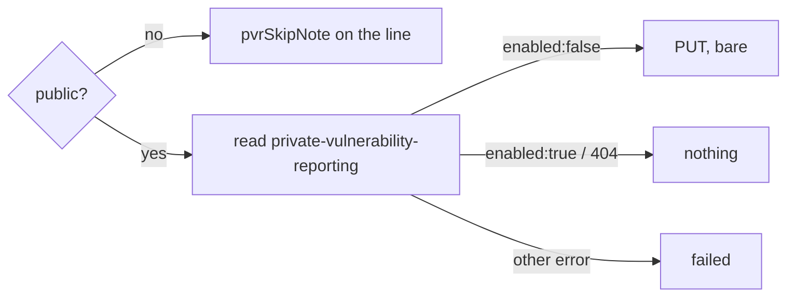

## Summary

`repo-settings-harden` now turns on private vulnerability reporting (PVR) on
public monitored repositories, writing only when it drifted. Closes #3267.

- `worker/deno/lib/repo_settings_harden.ts` — new `private-vulnerability-reporting`
  step kind and `privateVulnerabilityReporting` snapshot field. The planner adds a
  bare `PUT private-vulnerability-reporting` only when the read says
  `enabled: false`. `hardenRepoInto` reads the endpoint through `read()` only when
  `needsPaidSecretProtection` says the repository is public. Otherwise it sets
  `pvrSkipNote` (`PRIVATE_VULNERABILITY_REPORTING_SKIP_NOTE`). A new
  `outcomeSkipNotes` helper lists every skip note in order.
- `worker/deno/setup/repo_settings_harden_sync.ts` — the kind is in `CHECKED_KINDS`,
  and the skip note is counted as skipped on the repository's line.
- `worker/deno/commands/repo_settings_harden.ts` — the CLI prints the PVR skip note
  through `outcomeSkipNotes`.
- `docs/SETUP.md` and `docs/GITHUB-ACTIONS-AUDIT-SCAN.md` describe the new step.

## Spec

### Intent and Rationale

- A public repository could drift to having no private disclosure channel. This
  PR adds PVR alongside secret scanning and CodeQL, reusing their visibility gate.

### Essential Design Decisions

- Plan only on `enabled === false`. When the field is absent (a 404, an unread
  surface, or a private repository), nothing is planned. A blind PUT is never
  written.
- The visibility gate is `needsPaidSecretProtection`. When the visibility cannot
  be read but the `repos/{repo}` read succeeded, the repository is treated as
  public and PVR is still read. When the `repos/{repo}` read itself fails, the
  repository is already a failed line.

### Undiscoverable Facts

- Real API, observed: `gh api repos/stSoftwareAU/VibeCoder/private-vulnerability-reporting`
  returns `{"enabled":true}` for this public repository. The code depends on the
  `enabled` boolean.
- GitHub documents PVR as enabled by owners/admins of **public** repositories
  ("Configuring private vulnerability reporting for a repository", GitHub Docs).
  The issue specifies the same gate.

## Evidence

Backend/CLI change; covered by unit tests through `hardenRepo` and
`runRepoSettingsHarden` with recording `gh` fakes.

**Docs sweep** — grep: `codeql-default-setup`, "CodeQL default setup", `repo-settings-harden`, `codeqlSkipNote`, `CHECKED_KINDS`; section: `docs/SETUP.md#repository-settings-hardening`, `docs/GITHUB-ACTIONS-AUDIT-SCAN.md#closing-the-settings-findings-repo-settings-harden`; updated: `docs/SETUP.md`, `docs/GITHUB-ACTIONS-AUDIT-SCAN.md`, module docs of `worker/deno/lib/repo_settings_harden.ts` and `worker/deno/setup/repo_settings_harden_sync.ts`; `docs/CONFIGURATION.md:437` — still true because it describes only `copilot_code_review`

## Acceptance Criteria

<!-- vibe-spec-review inputs="diff+issue-body" -->

- **met** — Public repo reading `enabled:false` → exactly one bare `gh api --method PUT repos/<repo>/private-vulnerability-reporting`, result `applied`. — evidence: `worker/deno/tests/repo_settings_harden_test.ts::hardenRepo - a public repo with private vulnerability reporting off gets a bare PUT (Issue #3267)` — reviewer: met
- **met** — Public repo reading `enabled:true` → no step and no write. — evidence: `worker/deno/tests/repo_settings_harden_test.ts::hardenRepo - private vulnerability reporting already on makes no write (Issue #3267)` — reviewer: met
- **met** — Dry run → step reported `planned`, no write. — evidence: `worker/deno/tests/repo_settings_harden_test.ts::hardenRepo - a dry run plans private vulnerability reporting without writing (Issue #3267)` — reviewer: met
- **met** — Private or internal repo → no PVR read or write; the skip note appears on the repo's line. — evidence: `worker/deno/tests/setup_repo_settings_harden_test.ts::runRepoSettingsHarden - a private repo makes no PVR read or write, and the line says why (Issue #3267)` — reviewer: met
- **met** — Unreadable visibility is never treated as exempt (the PVR read still runs or the repo fails, never a silent skip). — evidence: `worker/deno/tests/repo_settings_harden_test.ts::hardenRepo - an unreadable visibility still reads and writes private vulnerability reporting, never a silent skip (Issue #3267)` — reviewer: met
- **met** — Refused PUT → `failed` on the repo's line and the sync step returns false. — evidence: `worker/deno/tests/setup_repo_settings_harden_test.ts::runRepoSettingsHarden - a refused PVR write fails the step, named on the line (Issue #3267)` — reviewer: met
- **met** — Non-404 read error → `failed`, nothing planned for PVR. — evidence: `worker/deno/tests/repo_settings_harden_test.ts::hardenRepo - a non-404 private-vulnerability-reporting read failure plans nothing about it (Issue #3267)` — reviewer: met
- **met** — `docs/SETUP.md` lists the new step. — evidence: `docs/SETUP.md` — reviewer: met
- **unrequested** — PVR paragraph in `docs/GITHUB-ACTIONS-AUDIT-SCAN.md` — reviewer: unrequested — reason: that section documents the CLI, whose output now carries the PVR skip line (docs-change rule)
- **unrequested** — exported `outcomeSkipNotes` helper used by the CLI — reviewer: unrequested — reason: the reviewer judged it not true scope creep; it threads the new skip note into the CLI's existing "never silently absent" output with a testable seam

## Standards Review

<!-- vibe-standards-review inputs="diff+CODING-STANDARDS.md" -->

- **clean** — no violations found. Checked: fail-loud on read errors, every new branch outcome tested, the new behaviour reaching every caller (sync + CLI), the fake mirroring the existing `codeScanning` modelling, named tests existing, Australian English, KISS/DRY, no removed assertion without a requirement (the count bumps follow from adding the kind to `CHECKED_KINDS`). Optional: "observe the real tool" evidence for the PVR endpoint, recorded under Undiscoverable Facts above.

## Test Plan

- `deno test tests/repo_settings_harden_test.ts tests/setup_repo_settings_harden_test.ts` (from `worker/deno`): 145 passed, 0 failed.
- `./quality.sh < /dev/null` on the final code: `Result: PASSED (with skipped checks)` (only `config integration` skipped, as on every run).
- Added to `worker/deno/tests/repo_settings_harden_test.ts`:
  - the planner cases;
  - the `hardenRepo` cases: public off/on, dry run, private, internal,
    unreadable visibility, failed `repos/{repo}` read, refused PUT, non-404
    read error and 404;
  - the `outcomeSkipNotes` cases.
- Added to `worker/deno/tests/setup_repo_settings_harden_test.ts`: the fake gains
  `pvr?`. New sync cases cover a public repo with PVR off (PUT once, then
  nothing), PVR already on, a dry run, a private repo (no read, skip note) and a
  refused PUT (returns false).
- Removed assertion lines, each replaced by a +1 count. #3267 adds
  `private-vulnerability-reporting` to `CHECKED_KINDS`, so every line counts one
  more checked setting: unchanged on a public repository where the read is a
  404, skipped on a private one. The old counts are untrue.
  - Removed from `worker/deno/tests/setup_repo_settings_harden_test.ts`: `` `${repo}: 6 applied, 1 unchanged, 0 skipped, 0 failed`, `` — now `2 unchanged`
  - Removed from `worker/deno/tests/setup_repo_settings_harden_test.ts` (two places): `` `${repo}: 0 applied, 7 unchanged, 0 skipped, 0 failed`, `` — now `8 unchanged`
  - Removed from `worker/deno/tests/setup_repo_settings_harden_test.ts`: `/^Repo-settings hardening: 0 applied, 7 unchanged, 0 skipped, 0 failed across 1 repo\(s\)/,` — now `8 unchanged`
  - Removed from `worker/deno/tests/setup_repo_settings_harden_test.ts`: `` `${healthy}: 6 applied, 1 unchanged, 0 skipped, 0 failed`, `` — now `2 unchanged`
  - Removed from `worker/deno/tests/setup_repo_settings_harden_test.ts`: `` `${repo}: 5 applied, 1 unchanged, 0 skipped, 1 failed`, `` — now `2 unchanged`
  - Removed from `worker/deno/tests/setup_repo_settings_harden_test.ts`: `assertStringIncludes(line, "4 applied, 1 unchanged, 2 skipped, 0 failed");` — now `3 skipped` (private repository)
  - Removed from `worker/deno/tests/setup_repo_settings_harden_test.ts`: `assertStringIncludes(line, "6 planned, 1 unchanged, 0 skipped, 0 failed");` — now `2 unchanged`
  - Removed from `worker/deno/tests/setup_repo_settings_harden_test.ts` (two places): `assertStringIncludes(line, "5 applied, 1 unchanged, 1 skipped, 0 failed");` — now `2 unchanged`

**Branch outcomes:**

- `worker/deno/lib/repo_settings_harden.ts:686` — `enabled: false` plans a PUT. Test: `worker/deno/tests/repo_settings_harden_test.ts::planRepoSettingsHardening - a repo reporting private vulnerability reporting off plans a bare PUT (Issue #3267)`. Flipped to `!== true`: the "already on, or absent" test went red.
- `worker/deno/lib/repo_settings_harden.ts:686` — on or absent plans nothing. Test: `worker/deno/tests/repo_settings_harden_test.ts::planRepoSettingsHardening - private vulnerability reporting already on, or absent, plans nothing (Issue #3267)`. Flipped to `!== true`: went red.
- `worker/deno/lib/repo_settings_harden.ts:1948` — a private or internal repository gets the skip note and no read. Test: `worker/deno/tests/repo_settings_harden_test.ts::hardenRepo - a private repo makes no private-vulnerability-reporting call and says why (Issue #3267)`. Removing the note assignment turned 3 tests red.
- `worker/deno/lib/repo_settings_harden.ts:1953` — a public repository is read. Test: `worker/deno/tests/repo_settings_harden_test.ts::hardenRepo - a public repo with private vulnerability reporting off gets a bare PUT (Issue #3267)`. Removing the read turned 5 tests red, including the unreadable-visibility, refused-PUT and non-404 tests.
- `worker/deno/lib/repo_settings_harden.ts:1953` — a non-404 read error is `failed`. Test: `worker/deno/tests/repo_settings_harden_test.ts::hardenRepo - a non-404 private-vulnerability-reporting read failure plans nothing about it (Issue #3267)`. Went red with the read removed.
- `worker/deno/lib/repo_settings_harden.ts:1953` — a 404 plans nothing. Test: `worker/deno/tests/repo_settings_harden_test.ts::hardenRepo - a 404 on private vulnerability reporting plans nothing (Issue #3267)`. Under the old `!== true` planner a 404 planned a PUT; that flip turned the planner test red.
- `worker/deno/setup/repo_settings_harden_sync.ts:221` — the skip note is counted as skipped on the line. Test: `worker/deno/tests/setup_repo_settings_harden_test.ts::runRepoSettingsHarden - a private repo makes no PVR read or write, and the line says why (Issue #3267)`. Reverting the `CHECKED_KINDS` and tally branch turned it red.
- `worker/deno/lib/repo_settings_harden.ts` `outcomeSkipNotes` — includes `pvrSkipNote`. Test: `worker/deno/tests/repo_settings_harden_test.ts::outcomeSkipNotes - returns the three notes in order when all are set (Issue #3267)`. Dropping the PVR note turned 2 tests red.

Entry points checked:
- The sync step: `runRepoSettingsHarden` tests (above).
- The CLI: its skip-note composition now calls `outcomeSkipNotes`, tested
  directly. The command itself calls `runGhCommand` with no seam, as it did
  before this PR.

🤖 Generated with [Claude Code](https://claude.com/claude-code)
