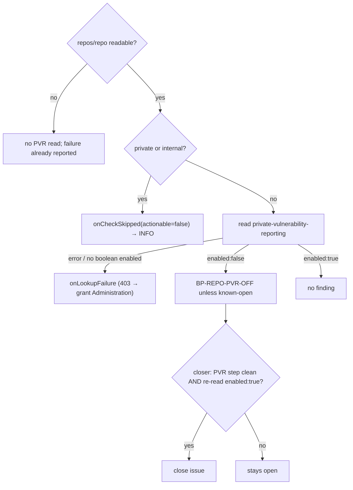

## Summary

The weekly GitHub Actions audit now files `BP-REPO-PVR-OFF` for a public
repository with private vulnerability reporting (PVR) off. Setup's audit
closer closes that finding only when the #3267 harden step ran cleanly and a
re-read shows `"enabled": true`. Closes #3268.

- `worker/deno/lib/repo_settings_scanner.ts` — new check 5. A public
  repository is read at `repos/{repo}/private-vulnerability-reporting` through
  `readJson`. `enabled === false` adds `BP-REPO-PVR-OFF` through the existing
  `add()`, so a known-open id is not filed again, with the `ADMIN` prose in
  `suggestedFix`. A private or internal repository (`needsPaidSecretProtection`,
  the gate harden uses) is not read, and its skip goes through
  `onCheckSkipped`. A read failure, or a body without a boolean `enabled`
  (`{}`, `null`), goes to `onLookupFailure`.
- `onCheckSkipped` gains a required `actionable` argument: `true` for the
  existing secret-protection skip (a licence would lift it), `false` for the
  PVR skip (GitHub does not offer PVR on private repositories).
- `worker/deno/lib/idle_task_templates/github_actions_audit_template.ts` — an
  `actionable` skip still logs `WARNING`; a non-actionable one logs `INFO`.
  The new `permissionNeededFor` names the "Administration" read permission for
  a 403 on `private-vulnerability-reporting`, in both the log line and the
  summary. Every other check keeps "Actions policies".
- `worker/deno/setup/repo_settings_audit_close.ts` — `BP-REPO-PVR-OFF` maps to
  `private-vulnerability-reporting` in `FINDING_STEP_KIND`. `confirmFixed`
  requires the positive read-back `enabled === true`. The module doc has a new
  bullet.
- `docs/GITHUB-ACTIONS-AUDIT-SCAN.md` — adds the id to the `BP-REPO-*` list,
  plus a paragraph on the public-only check (the INFO skip, the lookup
  failure, the Administration permission) and a sentence on the closer.

## Spec

### Intent and Rationale

- A public repository with PVR off leaves a public issue as the only way to
  report a vulnerability. The audit makes that visible, and setup closes the
  finding once harden has fixed it.
- The closer needs a positive read-back. A private repository is never read,
  so the scanner saying nothing proves nothing.

### Essential Design Decisions

- PVR uses the same visibility gate as secret scanning
  (`needsPaidSecretProtection`). If `repos/{repo}` cannot be read, PVR is not
  read either; that failure is already reported.
- A body without a boolean `enabled` is a lookup failure, never a pass.
- `actionable` is required, not optional with a default, so each caller has
  to choose the log level on purpose.

### Undiscoverable Facts

- GitHub's "Permissions required for fine-grained personal access tokens"
  page lists `GET /repos/{owner}/{repo}/private-vulnerability-reporting`
  under **Administration** (read), not Actions policies.
- Observed: `gh api -i repos/stSoftwareAU/VibeCoder/private-vulnerability-reporting`
  → `HTTP/2.0 200 OK`, body `{"enabled":true}`. The scanner relies on
  exactly that `enabled` boolean.
- A previous run of this issue stopped with four Standards findings unfixed
  (WARNING-level skip, untested `{}` body, wrong 403 permission, a stale test
  title). This PR fixes all four.

## Evidence

Backend only: no UI files are touched. The tests below are the evidence.

**Docs sweep** — grep: `BP-REPO-PVR-OFF`, `private-vulnerability-reporting`, `Actions policies`, `ACTIONS_POLICY_PERMISSION`, `onCheckSkipped`, "logged once at `WARNING`" (README.md, docs/ excluding docs/archive/ and docs/audits/, */README.md); section: `docs/GITHUB-ACTIONS-AUDIT-SCAN.md#native-repository-settings-pre-filer`; updated: `docs/GITHUB-ACTIONS-AUDIT-SCAN.md`; `docs/GITHUB-ACTIONS-AUDIT-SCAN.md:1108` — still true because the secret-protection skip still logs at WARNING (`actionable: true`); `docs/GITHUB-ACTIONS-AUDIT-SCAN.md:1215` — still true because it describes the #3267 harden step; `docs/SETUP.md:368` — still true because it describes the #3267 harden step.

## Acceptance Criteria

<!-- vibe-spec-review inputs="diff+issue-body" -->

- **met** — Public repo with `enabled:false` → one `BP-REPO-PVR-OFF` finding with the admin prose. — evidence: `worker/deno/tests/repo_settings_scanner_test.ts::scanRepoSettings - a public repository with PVR off files BP-REPO-PVR-OFF (Issue #3268)` — reviewer: met
- **met** — Public repo with `enabled:true` → no finding. — evidence: `worker/deno/tests/repo_settings_scanner_test.ts::scanRepoSettings - a public repository with PVR on files nothing but still reads the endpoint (Issue #3268)` — reviewer: met
- **met** — Already-open `BP-REPO-PVR-OFF` → no duplicate. — evidence: `worker/deno/tests/repo_settings_scanner_test.ts::scanRepoSettings - a known-open BP-REPO-PVR-OFF is not re-filed (Issue #3268)` — reviewer: met
- **met** — Private repo → no PVR read, check recorded as skipped. — evidence: `worker/deno/tests/repo_settings_scanner_test.ts::scanRepoSettings - a private or internal repository is not read for PVR and the skip is recorded (Issue #3268)` — reviewer: met
- **met** — 403 / other read error → `onLookupFailure` called, no finding. — evidence: `worker/deno/tests/repo_settings_scanner_test.ts::scanRepoSettings - a PVR read failure is a lookup failure, not a finding or a skip (Issue #3268)` — reviewer: met
- **met** — Closer closes an open `BP-REPO-PVR-OFF` only when the PVR step ran cleanly **and** the re-read shows `enabled:true`. — evidence: `worker/deno/tests/setup_repo_settings_audit_close_test.ts::BP-REPO-PVR-OFF closes once hardening applied and the re-read shows enabled: true` — reviewer: met
- **met** — Closer leaves it open on a re-read of `false`, a dry run, a failed step, or a missing read-back. — evidence: `worker/deno/tests/setup_repo_settings_audit_close_test.ts::BP-REPO-PVR-OFF stays open when the re-read shows enabled: false`, `::BP-REPO-PVR-OFF never closes on a dry run (planned/failed/skipped this run)`, `::BP-REPO-PVR-OFF stays open when the read-back has no enabled field (scanner reports a lookup failure)`, `::BP-REPO-PVR-OFF stays open and warns when the PVR read-back rejects` — reviewer: met
- **met** — Docs list the new id. — evidence: `docs/GITHUB-ACTIONS-AUDIT-SCAN.md:1083` — reviewer: met
- **unrequested** — the `actionable` argument on `onCheckSkipped`, and INFO vs WARNING in the audit template's skip logging — reviewer: unrequested — reason: needed so the PVR skip this diff adds logs at INFO under CODING-STANDARDS "Log Levels Are a Promise"; the secret-protection skip passes `true` and still logs WARNING, so its level is unchanged (the reviewer's note that this changes secret scanning's log level does not match the code)
- **unrequested** — `ADMINISTRATION_READ_PERMISSION` / `permissionNeededFor` in `github_actions_audit_template.ts` — reviewer: unrequested — reason: the reviewer called this "a necessary consequence rather than true creep — borderline, flagged for visibility only"; without it, a 403 on the new PVR read would tell the operator to grant the wrong permission

## Standards Review

<!-- vibe-standards-review inputs="diff+CODING-STANDARDS.md" -->

- **clean** — the reviewer found no violations. Checked: Log Levels Are a Promise (INFO for the non-actionable PVR skip, WARNING for the actionable secret-protection skip); Never Fail Silently (`{}`/`null` body → `onLookupFailure`); A named test must exist; A new argument reaches every caller (`repo_settings_audit_close.ts` passes no `onCheckSkipped` and does not need one); Every outcome of a branch has a test; reuse of `needsPaidSecretProtection` and `readJson`; Australian English; Check where you insert (review-enforced) in `docs/GITHUB-ACTIONS-AUDIT-SCAN.md`. It found no removed assertion lines. Optional, not chased: a lookup map for `permissionNeededFor` if a third permission appears.

## Test Plan

- `./quality.sh < /dev/null` on the head before this summary commit: `Result: PASSED (with skipped checks)` — only `config integration` was skipped; deno tests, lint, type check, fmt, semgrep and markdownlint all passed.
- `deno task test:unit tests/repo_settings_scanner_test.ts tests/github_actions_audit_template_test.ts tests/setup_repo_settings_audit_close_test.ts < /dev/null` (from `worker/deno`): 116 passed, 0 failed.
- Added to `worker/deno/tests/repo_settings_scanner_test.ts`:
  - PVR off, PVR on, known-open, private/internal skipped with `actionable === false`;
  - 403/404/500 read failure, a `{}` body, a `null` body;
  - unreadable `repos/{repo}` not followed by a PVR read.
  - The #2225 secret-protection skip test now also asserts `actionable === true`.
- Added to `worker/deno/tests/github_actions_audit_template_test.ts`:
  - `runTask - private vulnerability reporting skipped on a private repository is logged at INFO, never WARN or ERROR (Issue #3268)`;
  - `runTask - a 403 on the private-vulnerability-reporting read names the Administration permission, not Actions policies (Issue #3268)`;
  - `permissionNeededFor - names Administration for private-vulnerability-reporting, Actions policies for everything else (Issue #3268)`.
  - `makeGhStub` answers the PVR endpoint with `{"enabled":true}`. Its `[]` fallback would now be a lookup failure.
- Added to `worker/deno/tests/setup_repo_settings_audit_close_test.ts`:
  - closes on applied, and on no step of its kind, when the re-read is `enabled:true`;
  - stays open on `enabled:false`, on planned/failed/skipped, on a read-back without `enabled` (now a scanner lookup failure), on a private repo, and on a rejected read-back.
- Changed in existing tests:
  - the `HARDENED`/`OPEN` fixtures gain a PVR entry;
  - the private/internal secret-protection tests filter `onCheckSkipped` to `SECRET_PROTECTION_SKIP_CHECK`;
  - one title is now "records no secret-protection skip (Issue #2225)".
- Removed assertions (multi-line assertions with a line changed):
  - In `worker/deno/tests/repo_settings_scanner_test.ts`: `assertEquals(ids, [ "BP-REPO-ACTIONS-ALLOW-ALL", "BP-REPO-ACTIONS-MAY-APPROVE-PRS", "BP-REPO-DEFAULT-TOKEN-WRITE", "BP-REPO-PUSH-PROTECTION-OFF", "BP-REPO-RULESET-NO-REVIEW", "BP-REPO-SECRET-SCANNING-OFF", "BP-REPO-SHA-PIN-NOT-ENFORCED", ]);`. #3268 makes a public repository with PVR off file `BP-REPO-PVR-OFF`, so the old list is untrue. The same test now asserts that list plus `"BP-REPO-PVR-OFF"`.
  - In `worker/deno/tests/setup_repo_settings_audit_close_test.ts`: `assertEquals( [...ids].sort(), [ "BP-REPO-ACTIONS-MAY-APPROVE-PRS", "BP-REPO-DEFAULT-TOKEN-WRITE", "BP-REPO-RULESET-NO-REVIEW", ], );`. #3268 maps `BP-REPO-PVR-OFF` in `FINDING_STEP_KIND`, and that kind is absent from the outcome, so it is eligible. The same test now asserts that list plus `"BP-REPO-PVR-OFF"`.

**Branch outcomes:**

- `worker/deno/lib/repo_settings_scanner.ts:384` — `repos/{repo}` unreadable → no PVR read — `worker/deno/tests/repo_settings_scanner_test.ts::scanRepoSettings - an unreadable repos/{owner}/{repo} is not followed by a PVR read (Issue #3268)` — forcing `if (true)` turned it red
- `worker/deno/lib/repo_settings_scanner.ts:385` — private/internal → skip with `actionable: false`, no read — `worker/deno/tests/repo_settings_scanner_test.ts::scanRepoSettings - a private or internal repository is not read for PVR and the skip is recorded (Issue #3268)` — never skipping, and swapping the `actionable` values, each turned it red
- `worker/deno/lib/repo_settings_scanner.ts:336` — secret-protection skip passes `actionable: true` — `worker/deno/tests/repo_settings_scanner_test.ts::scanRepoSettings - a private repository files neither secret-scanning finding and records one skip (Issue #2225)` — swapping to `false` turned it red
- `worker/deno/lib/repo_settings_scanner.ts:398` — body without a boolean `enabled` (`{}` / `null`) → lookup failure — `worker/deno/tests/repo_settings_scanner_test.ts::scanRepoSettings - a PVR response without a boolean enabled field is a lookup failure, not a finding (Issue #3268)` and `::scanRepoSettings - a PVR response body of null is a lookup failure, not a throw (Issue #3268)` — removing the guard turned the `{}` test red; `pvr.enabled` without `?.` turned the `null` test red with a TypeError
- `worker/deno/lib/repo_settings_scanner.ts:403` — `enabled:false` → finding — `worker/deno/tests/repo_settings_scanner_test.ts::scanRepoSettings - a public repository with PVR off files BP-REPO-PVR-OFF (Issue #3268)` — inverting to `=== true` turned it red
- `worker/deno/lib/repo_settings_scanner.ts:403` — `enabled:true` → no finding — `worker/deno/tests/repo_settings_scanner_test.ts::scanRepoSettings - a public repository with PVR on files nothing but still reads the endpoint (Issue #3268)` — inverting to `=== true` turned it red
- `worker/deno/lib/idle_task_templates/github_actions_audit_template.ts:1526` — `actionable` false → INFO — `worker/deno/tests/github_actions_audit_template_test.ts::runTask - private vulnerability reporting skipped on a private repository is logged at INFO, never WARN or ERROR (Issue #3268)` — always `logger.warn` turned it red
- `worker/deno/lib/idle_task_templates/github_actions_audit_template.ts:1526` — `actionable` true → WARNING — `worker/deno/tests/github_actions_audit_template_test.ts::runTask - a deliberately skipped settings check is named in the summary and logged as a warning, not an error (Issue #2225)` — kept green and asserts the `warn:` line
- `worker/deno/lib/idle_task_templates/github_actions_audit_template.ts:631` — PVR check → Administration; anything else → Actions policies — `worker/deno/tests/github_actions_audit_template_test.ts::permissionNeededFor - names Administration for private-vulnerability-reporting, Actions policies for everything else (Issue #3268)` and `::runTask - a 403 on the private-vulnerability-reporting read names the Administration permission, not Actions policies (Issue #3268)` — always returning `ACTIONS_POLICY_PERMISSION` turned both red
- `worker/deno/setup/repo_settings_audit_close.ts:102` — `BP-REPO-PVR-OFF` eligible — `worker/deno/tests/setup_repo_settings_audit_close_test.ts::FINDING_STEP_KIND covers every BP-REPO id the scanner files` — removing the mapping turned it red
- `worker/deno/setup/repo_settings_audit_close.ts:277` — `enabled:true` → close — `worker/deno/tests/setup_repo_settings_audit_close_test.ts::BP-REPO-PVR-OFF closes once hardening applied and the re-read shows enabled: true` — forcing `false` turned it red
- `worker/deno/setup/repo_settings_audit_close.ts:277` — private repo not read → stays open — `worker/deno/tests/setup_repo_settings_audit_close_test.ts::BP-REPO-PVR-OFF stays open when the repo is private (PVR not read at all)` — forcing `true` turned it red

🤖 Generated with [Claude Code](https://claude.com/claude-code)
