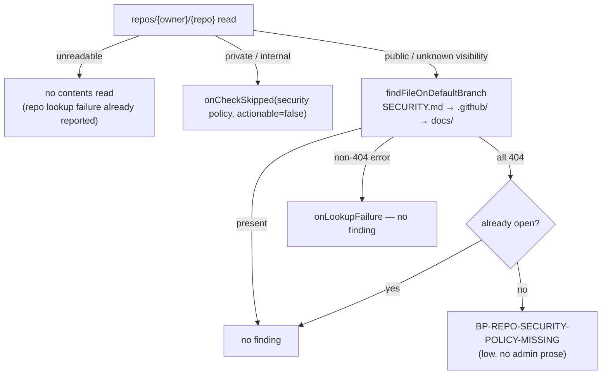

## Summary

The weekly GitHub Actions audit's settings pre-filer now files
`BP-REPO-SECURITY-POLICY-MISSING` when a public monitored repository has no
`SECURITY.md` on its default branch. The fix text tells the reader to add the
file through a normal pull request, with no admin-action prose, so the worker
can take the issue (#3266). Closes #3269.

- `findCodeownersOnDefaultBranch` is generalised into
  `findFileOnDefaultBranch(repo, gh, paths)` with the same semantics. The old
  function is now a thin wrapper. `SECURITY_POLICY_PATHS` lists the three
  locations GitHub recognises.
- `scanRepoSettings` reads the security policy on public repositories only,
  behind the same visibility gate as private vulnerability reporting. An
  absent policy files the finding (unless it is already open), a non-404 read
  error goes to `onLookupFailure`, and a private or internal repository goes
  to `onCheckSkipped`.
- No harden step, no `FINDING_STEP_KIND` mapping and no write path for
  `SECURITY.md`. The pull request that adds the file resolves the finding.

## Spec

### Intent and Rationale

- A public repository with no security policy leaves a reporter no private route, so a vulnerability can end up in a public issue. The audit makes that gap visible.
- The fix is an ordinary commit, so the finding is worded for a worker PR rather than an admin, which keeps `isAdminOnlyRepoSettingsIssue` from routing it to a human.

### Essential Design Decisions

- The visibility gate is `needsPaidSecretProtection`, shared with the PVR check. An unreadable `repos/{owner}/{repo}` reads nothing. A readable one with no visibility field is read like a public repository, as PVR does.
- `findFileOnDefaultBranch` treats only a 404 at every path as `absent`. Any other error is `error`, and an empty path list is an `error` rather than a vacuous `absent`.
- `FINDING_STEP_KIND` deliberately has no entry for this id. The pin test now excludes `WORKER_FIXABLE_REPO_FINDINGS`, now exported from `admin_only_finding.ts` rather than copied, and asserts each of those ids is filed but unmapped.
- A 403 on the contents read names the repository "Contents" fine-grained read permission (`CONTENTS_READ_PERMISSION`), not "Actions policies".

### Undiscoverable Facts

- A maintainer comment on #3269 records that an earlier admin-only hand-off was a false positive. An acceptance criterion had quoted the admin phrase, and the criterion was reworded. The finding body test here asserts through the real `isAdminOnlyRepoSettingsIssue`.
- GitHub's fine-grained token permissions page lists `GET /repos/{owner}/{repo}/contents/{path}` under Contents (read).

## Evidence

Backend only, no UI files. The behaviour is covered by unit tests through the real `scanRepoSettings`, `findFileOnDefaultBranch`, `fileWorkflowFinding` and `isAdminOnlyRepoSettingsIssue`. The gh seam is a table-driven stub. It returns `HTTP 404: Not Found` for a missing path, which `isNotFoundError` (`classifyGitHubError`) classifies as NotFound, the same classifier the CODEOWNERS finder already relies on in production.

Provenance cited in the diff: #3269: Audit: BP-REPO-SECURITY-POLICY-MISSING for public repos without SECURITY.md; #3266: Let the worker fix BP-REPO-SECURITY-POLICY-MISSING with a normal PR; #3268: Audit: BP-REPO-PVR-OFF finding, closed by setup once PVR reads enabled; #2626: Extract a reusable per-repo hardening function from the repo-settings-harden command.

**Docs sweep**: grep: `findCodeownersOnDefaultBranch`, `FINDING_STEP_KIND`, `BP-REPO-PVR-OFF`, `BP-REPO-PUSH-PROTECTION-OFF`, `permissionNeededFor`, "admin must act", "human must act", "says plainly", "Actions policies for everything". Section: `docs/GITHUB-ACTIONS-AUDIT-SCAN.md#native-repository-settings-pre-filer` (the settings pre-filer paragraphs and "A check that could not run says so"). Updated: `docs/GITHUB-ACTIONS-AUDIT-SCAN.md`, plus the module and doc comments in `worker/deno/lib/repo_settings_scanner.ts`, `worker/deno/lib/admin_only_finding.ts`, `worker/deno/setup/repo_settings_audit_close.ts` and `worker/deno/lib/idle_task_templates/github_actions_audit_template.ts`. Hits left in place:
- `docs/GITHUB-ACTIONS-AUDIT-SCAN.md:1092` is still true because the sentence now excludes `BP-REPO-SECURITY-POLICY-MISSING`.
- `worker/deno/setup/codeowners_sync.ts:15` and `:42` are still true because `findCodeownersOnDefaultBranch` keeps its signature and behaviour.
- `worker/deno/tests/github_actions_audit_template_test.ts:3691` is still true because that test checks only PVR and `actions/permissions/workflow`, both unchanged.
- `worker/deno/lib/worker_token_privilege_scanner.ts:46` is still true because it is a different scanner.

## Acceptance Criteria

<!-- vibe-spec-review inputs="diff+issue-body" -->

- **met** — Public repo with `SECURITY.md` at any of the three paths → no finding. — evidence: `worker/deno/tests/repo_settings_scanner_test.ts::scanRepoSettings - a public repository with SECURITY.md at any recognised location files nothing (Issue #3269)` — reviewer: met
- **met** — Public repo with none of them → one `BP-REPO-SECURITY-POLICY-MISSING` finding whose body has none of the scanner's admin-action prose (nothing `REPO_ADMIN_ACTION_PROSE` matches). — evidence: `worker/deno/tests/repo_settings_scanner_test.ts::scanRepoSettings - a public repository with no SECURITY.md anywhere files BP-REPO-SECURITY-POLICY-MISSING, and the issue it becomes is not admin-only (Issue #3269)` — reviewer: met
- **met** — Already-open finding → no duplicate. — evidence: `worker/deno/tests/repo_settings_scanner_test.ts::scanRepoSettings - an already-open BP-REPO-SECURITY-POLICY-MISSING is not re-filed (Issue #3269)` — reviewer: met
- **met** — Non-404 contents error → `onLookupFailure`, no finding. — evidence: `worker/deno/tests/repo_settings_scanner_test.ts::scanRepoSettings - a non-404 security-policy read error is a lookup failure, never a finding (Issue #3269)` and `::scanRepoSettings - a 404 at the root then a non-404 at .github/SECURITY.md is a lookup failure, no finding (Issue #3269)` — reviewer: met
- **met** — Private repo → no contents read, check recorded as skipped. — evidence: `worker/deno/tests/repo_settings_scanner_test.ts::scanRepoSettings - a private or internal repository is not read for a security policy and the skip is recorded (Issue #3269)` — reviewer: met
- **met** — Existing CODEOWNERS finder tests pass unchanged. — evidence: `worker/deno/tests/repo_settings_harden_test.ts` (`findCodeownersOnDefaultBranch - …` tests untouched and passing) — reviewer: met
- **met** — Docs list the new id. — evidence: `docs/GITHUB-ACTIONS-AUDIT-SCAN.md` (`BP-REPO-*` list and the new Issue #3269 paragraph) — reviewer: met
- **unrequested** — `CONTENTS_READ_PERMISSION` and the `permissionNeededFor` branch for `SECURITY_POLICY_CHECK`, with its test — reviewer: unrequested — reason: without it, a 403 on the new contents read would be logged as needing "Actions policies", a wrong instruction that this check itself would introduce
- **unrequested** — exporting `WORKER_FIXABLE_REPO_FINDINGS` from `admin_only_finding.ts` and excluding it in the `FINDING_STEP_KIND` pin test — reviewer: unrequested — reason: the existing pin required a step mapping for every filed id, which the issue explicitly forbids for this id; the export reuses the owner rather than copying the set

## Standards Review

<!-- vibe-standards-review inputs="diff+CODING-STANDARDS.md" -->

- **clean**: the reviewer found no violations. Review-enforced rules it checked: a named test must exist, a stub mirrors the real callee's contract, a fake mirrors the production implementation, a workflow behaviour change extends the validator (no workflow touched), avoid over-engineering (the finder is generalised rather than duplicated, and the worker-fixable set is reused rather than copied), the log-level promise (the private skip is `actionable: false` → INFO), and removed or changed assertions in existing tests (both are justified by the issue; see the Test Plan). Optional nits it raised (not acted on): the security-policy block nests two `if` levels, and the docs sentence listing ids is dense.

## Test Plan

Added:

- In `worker/deno/tests/repo_settings_harden_test.ts`, six `findFileOnDefaultBranch - … (Issue #3269)` tests:
  - present at each path
  - absent with the ordered reads
  - first-path non-404 stops
  - 404 then non-404
  - empty paths
  - invalid repo
- In `worker/deno/tests/repo_settings_scanner_test.ts`, seven `scanRepoSettings - … (Issue #3269)` tests (listed under Acceptance Criteria above, plus the unreadable `repos/{owner}/{repo}` case).
- In `worker/deno/tests/github_actions_audit_template_test.ts`, `permissionNeededFor - names Contents for the security-policy read (Issue #3269)`.

Existing tests edited:

- In `worker/deno/tests/repo_settings_scanner_test.ts`, `HARDENED` and `OPEN` gain a `"/contents/SECURITY.md"` entry, so existing tests keep their results. No assertion was removed. In "a private or internal repository is not read for PVR and the skip is recorded (Issue #3268)", only the collector changed: `actionableFlags.push(actionable);` now runs only for `what === "private vulnerability reporting"`. `assertEquals(actionableFlags, [false]);` is unchanged. The requirement "private/internal → `onCheckSkipped`" adds a second skip, which would otherwise enter the list.
- In `worker/deno/tests/setup_repo_settings_audit_close_test.ts`, the assertion `assertEquals(Object.keys(FINDING_STEP_KIND).sort(), filed);` was removed. The requirement "no `FINDING_STEP_KIND` mapping" makes it untrue. It is replaced by the same comparison over `filed` minus `WORKER_FIXABLE_REPO_FINDINGS`, plus a check that each worker-fixable id is filed and absent from the map. The test is renamed "… except the worker-fixable ones (Issue #3269)".

Red checks (each change reverted, test seen red, then restored):

- Prefixing `${ADMIN}` to the new `suggestedFix` turned the admin-only body test red.
- Treating `error` as `absent` turned the non-404 test red.
- Dropping the visibility gate turned the private/internal test red.
- Bypassing `add` (no `known` check) turned the already-open test red.
- Reverting the `permissionNeededFor` mapping turned the Contents test red.
- Removing the empty-paths guard turned the empty-paths test red.
- Adding a `FINDING_STEP_KIND` entry for the id turned the pin test red, and so did renaming the scanner's id.

**Branch outcomes:**

- `worker/deno/lib/repo_settings_harden.ts:2091`: empty `paths` → error with no call. Reached by `findFileOnDefaultBranch - an empty paths list is an error without a call (Issue #3269)`. Removing the guard turned it red.
- `worker/deno/lib/repo_settings_scanner.ts:452`: unreadable `repoInfo` → no contents read. Reached by `scanRepoSettings - an unreadable repos/{owner}/{repo} is not followed by a security-policy read (Issue #3269)`.
- `worker/deno/lib/repo_settings_scanner.ts:453`: private/internal → `onCheckSkipped` with `actionable: false`. Reached by `scanRepoSettings - a private or internal repository is not read for a security policy and the skip is recorded (Issue #3269)`. Dropping the gate turned it red.
- `worker/deno/lib/repo_settings_scanner.ts:465`: `error` → `onLookupFailure`, no finding. Reached by `scanRepoSettings - a non-404 security-policy read error is a lookup failure, never a finding (Issue #3269)`. Filing on error turned it red.
- `worker/deno/lib/repo_settings_scanner.ts:467`: `absent` → finding via `add` (respects `known`). Reached by `scanRepoSettings - a public repository with no SECURITY.md anywhere files BP-REPO-SECURITY-POLICY-MISSING, and the issue it becomes is not admin-only (Issue #3269)` and `scanRepoSettings - an already-open BP-REPO-SECURITY-POLICY-MISSING is not re-filed (Issue #3269)`. Bypassing `add` turned the latter red.
- `worker/deno/lib/repo_settings_scanner.ts:467` (`present`, implicit else) → no finding. Reached by `scanRepoSettings - a public repository with SECURITY.md at any recognised location files nothing (Issue #3269)`.
- `worker/deno/lib/idle_task_templates/github_actions_audit_template.ts:646`: `SECURITY_POLICY_CHECK` → Contents permission. Reached by `permissionNeededFor - names Contents for the security-policy read (Issue #3269)`. Reverting the branch turned it red.

Callers checked:

- `findCodeownersOnDefaultBranch` is called by `worker/deno/setup/repo_settings_harden_sync.ts:414-415` and `worker/deno/setup/codeowners_sync.ts`. Its signature and behaviour are unchanged, and `worker/deno/tests/codeowners_sync_test.ts` passes.
- `scanRepoSettings` is called by the audit template and by the audit closer (`setup/repo_settings_audit_close.ts`). The closer's re-scan now also reads the contents API. A non-404 error there is a failed re-scan and closes nothing, as for every other read. The new id is never eligible, because it has no step mapping.

Gate: `./quality.sh < /dev/null` on the head passed: `Result: PASSED (with skipped checks)`. The one skip is `config integration`. The first run failed on markdownlint MD018 (a wrapped line began with `#3269).**`). The wrap was fixed and the gate re-run.

🤖 Generated with [Claude Code](https://claude.com/claude-code)
