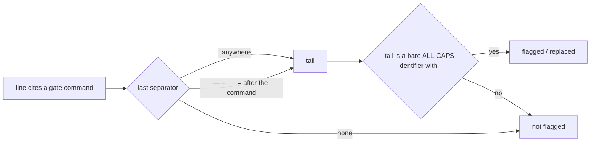

## Summary

The result-placeholder gate's structural backstop only read the text after a
line's last colon. A gate result line that used a dash before a bare ALL-CAPS
placeholder, such as `- ./quality.sh — GATE_RESULT` (PRs #3233 and #3283),
therefore passed. On a line that cites a gate command, an em dash, en dash,
spaced hyphen, spaced double hyphen or `=` after the cited command now also
counts as a result separator. The colon rule is unchanged. Closes #3287.

## Spec

### Intent and Rationale

- Two fleet PRs escaped the backstop the same way, so the separator check was
  the gap, not the prompt guidance. The fix widens the separator set as the
  issue suggests and leaves the identifier test (`BARE_IDENTIFIER_RE`) alone.
- The dashes and `=` are found with `lastIndexOf`, not a new regex, so the
  scan stays linear on untrusted text.

### Essential Design Decisions

- The new separators count only at or after the end of the first
  `GATE_COMMAND_RE` match. Without that limit, an indented bullet's `- ` or an
  option's `=` before the command would read as a separator
  (`  - GATE_RESULT` followed by a code-span command, `MODE=FAST_PATH` before
  one).
- A colon still counts anywhere on the line, exactly as Issue #3248 made it,
  so no input the gate flagged before is now let through. The latest
  separator on the line wins.

### Undiscoverable Facts

- The bodies of PRs #3233 and #3283 were corrected before merge (checked with
  `gh pr view`), and neither summary is in `docs/archive/pr-summaries/`. The
  regression fixtures therefore use the lines quoted in the issue and its
  comment.

## Evidence

Backend-only change: no UI file is touched.

- `worker/deno/tests/result_placeholder_gate_test.ts`: 7 new tests (the PR
  #3283 and #3233 escapes, en dash, spaced hyphen, spaced double hyphen,
  `=` spaced and unspaced, and an unspaced em dash with a full stop) failed
  against the unfixed gate (`7 failed | 44 passed`) and pass after the fix
  (`51 passed | 0 failed`).
- Corpus run, as **Writing a gate over text** requires: I ran
  `findResultPlaceholders` over all 893 files in `docs/archive/pr-summaries/`
  before and after the change. Both runs flagged 1 file, and it is the same
  file: `pr-summary-2806.md`, which has a genuine unfilled `GATE_RESULT` after
  a colon. Result: 0 new false positives and 0 false negatives. A grep of the
  corpus found no line with a gate command followed by a dash or `=` and a
  bare identifier, so the two real escapes (#3233 and #3283) are covered only
  by the fixtures above.
- **Docs sweep**: grep `after the colon on a`, `line's last colon`,
  `its last colon`, `last \`:\``, `GATE_OUTCOME_PENDING`, `backstop`;
  section: `docs/workflows/issue-processing.md` (result-placeholder gate
  paragraph) and `docs/CONFIGURATION.md` ("Nor can a leftover fill-in-later
  token"); updated: `docs/workflows/issue-processing.md`,
  `docs/CONFIGURATION.md`, `prompts/issue/prompt.md`,
  `prompts/pr_feedback/prompt.md`, and the module and `findTokenMatches` doc
  comments in `worker/deno/lib/result_placeholder_gate.ts`.
  `docs/INTERNALS.md:2193` is still true because it describes the
  replacement generically ("a bare fill-in-later token") and names no
  separator. `worker/deno/lib/pr_branch_preparation.ts:219` is still true
  for the same reason.
- Related prompt rules checked: the Test Plan placeholder rule in
  `prompts/issue/prompt.md` and the Response Message rule in
  `prompts/pr_feedback/prompt.md`. Both now name "a colon, dash or `=`" and
  agree with the code. I applied the rule to this PR's own diff and summary:
  every placeholder-shaped example sits inside backticks or a code block, so
  nothing is flagged.

## Test Plan

- Added to `worker/deno/tests/result_placeholder_gate_test.ts`, in the section
  "Dash and equals result separators (Issue #3287)":
  - Caught: the PR #3283 escape (em dash, with replace), the PR #3233 escape
    (command outside backticks), en dash, spaced hyphen, spaced double
    hyphen, `=` (spaced and unspaced), and an unspaced em dash with a full
    stop (with replace).
  - Not flagged: legitimate `— passed`, `— OK`, `— PASSED`, `– passed`,
    `- OK` and `= OK` results; an indented bullet's dash before the command;
    an `=` before the command; a dash inside a code span.
  - Hostile growth: `POST_COMMAND_SEPARATORS - a long run of em dashes that
    never completes a bare identifier scales linearly`.
- No existing test was edited, and no assertion was removed.
- `deno test tests/result_placeholder_gate_test.ts` from `worker/deno`:
  passed (51 passed, 0 failed).
- Full `./quality.sh < /dev/null` on the head: passed with skipped checks.
  The only skip was config integration ("deno or .config.json not
  available"), which is environmental.

**Branch outcomes:**

- `worker/deno/lib/result_placeholder_gate.ts:86`: a dash or `=` at or after
  the command end is taken as the separator. Reached by the seven "is caught"
  tests above. Removing it (the base code) turned all seven red.
- `worker/deno/lib/result_placeholder_gate.ts:86`: a dash or `=` before the
  command end is ignored. Reached by "an indented list bullet's dash before
  the command is not a separator" and "an equals sign before the command is
  not a separator". Passing `0` as the command end turned both red.
- `worker/deno/lib/result_placeholder_gate.ts:79`: a colon anywhere on the
  line (moved, not changed). Reached by the existing Issue #3248 colon tests,
  such as "the structural backstop catches a bare identifier on a deno test
  result line".
- `worker/deno/lib/result_placeholder_gate.ts:312`: no separator, so nothing
  is flagged. Reached by the existing "a gate-command line with no colon is
  not flagged". In a scratch copy, reading the whole line when no separator
  was found made that input return `["QUALITY_GATE_OUTCOME"]`, so the test
  would go red.

🤖 Generated with [Claude Code](https://claude.com/claude-code)
