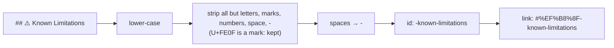

# Fix heading-anchor links to match GitHub's ids; enable MD051

## Summary

Closes #3292.

14 of 21 links in the `SECURITY.md` table of contents, and the
`docs/OVERVIEW.md:468` link, pointed at ids GitHub never emits. This PR fixes
them, plus every other in-file link the same rule flags across 17 docs, and
turns on markdownlint `MD051` so new broken in-file fragments fail the lint
gate.

GitHub's heading ids differ from the hand-written links in two ways:

- **A leading emoji leaves a leading `-`**: `## 🛡️ Foo` gives `-foo`, not
  `foo`.
- **A variation-selector emoji keeps U+FE0F**: `## ⚠️ Foo` gives `️-foo`,
  which a link writes as `#%EF%B8%8F-foo`. Our own slugger
  (`worker/deno/lib/markdown_anchors.ts`) dropped the selector. That made 41
  cross-file `#-foo` links (README `#-supported-labels`, THREAT-MODEL
  `#-residual-risks`, CONFIGURATION `#-the-cycle-deadline-model` and others)
  look correct to our tests, but GitHub could not resolve them.

## Spec

### Intent and Rationale

A table-of-contents link that scrolls nowhere is a silent failure. The issue
asks for the links to be fixed and for `MD051` to stop the problem coming
back.

### Essential Design Decisions

- **Percent-encoded `%EF%B8%8F` in links**, not a raw U+FE0F. The raw
  character is invisible in editors and diffs. The encoded form is
  unambiguous and is what GitHub itself emits in its rendered `href`s.
- **`githubSlug` now keeps `\p{M}`** (marks, which include U+FE0F).
  Doc-anchor tests compare the decoded fragment with the slug:
  - `threat_model_docs_test.ts`
  - `docs_provider_matrix_test.ts`, which now reuses `githubSlug` instead of a
    private copy
- **Two pinned literals were updated**: `CANONICAL_MODEL_ANCHOR` in
  `deadline_model_docs_check.ts`, and the residual-risk link pin in
  `claude_token_isolation_test.ts`.
- **Only links broken by the FE0F root cause were changed cross-file.** About
  57 other broken cross-file links have different causes (stale headings, and
  `githubSlug` dropping `_`). They are tracked in follow-up #3337, so this
  diff stays reviewable.

### Undiscoverable Facts

- GitHub keeps U+FE0F in heading ids. Confirmed from the rendered HTML via
  `gh api repos/stSoftwareAU/VibeCoder/contents/SECURITY.md -H "Accept: application/vnd.github.html"`:
  the anchor `href`s read `#%EF%B8%8F-...`.
- `MD051` checks in-file fragments only. Cross-file links need a separate
  test, which is follow-up #3337.
- `docs/archive/**` is excluded from markdownlint, so archived summaries are
  not checked.

## Evidence

- `deno run --no-config --no-lock -A npm:markdownlint-cli2@0.23.2 < /dev/null`
  is clean with `MD051` on.
- Every doc edit changes the link fragment only (checked with
  `git diff --word-diff`).

## Test Plan

- [x] `./quality.sh < /dev/null`: every check passed except one Deno test.
      `deno tests` ran 26,136 passed and 1 failed. The failure was
      `worker/deno/tests/launcher_parity_test.ts` (`VIBE_BUILD_COMMIT`
      `…-dirty` vs a newer HEAD), because the worker's WIP checkpoint
      committed mid-run. Re-run on the clean tree: 24 passed, 0 failed.
- [x] `deno task test:unit` for `markdown_anchors_test.ts`,
      `threat_model_docs_test.ts`, `docs_provider_matrix_test.ts`,
      `agents_md_pointer_anchors_test.ts`, `deadline_model_docs_check_test.ts`
      and `claude_token_isolation_test.ts` passes.
- [x] Red run: restoring the old `STRIP` (without `\p{M}`) fails
      `worker/deno/tests/markdown_anchors_test.ts` (variation-selector case).
- [x] Red run: removing `decodeURIComponent` fails
      `worker/deno/tests/threat_model_docs_test.ts`.
- Removed from `worker/deno/tests/claude_token_isolation_test.ts`:
  `assert( section.includes("THREAT-MODEL.md#-residual-risks"), "the several-tokens setup section must point at the recorded residual risk", );`
  — #3292 requires links to match GitHub's heading ids, and GitHub keeps
  U+FE0F in `⚖️ Residual risks`, so `#-residual-risks` no longer resolves.
  The same test now pins `THREAT-MODEL.md#%EF%B8%8F-residual-risks`.
- Removed from `worker/deno/tests/docs_provider_matrix_test.ts`:
  `` assert( anchors.has(anchor), `the ${MATRIX_HEADING} matrix links #${anchor}, which is not a heading ` + `in ${DOC_NAME}`, ); ``
  — #3292 makes the private `slug()` (which dropped U+FE0F) untrue, so the
  anchor set is now built from `githubSlug` and the matrix link is
  percent-decoded first. The same check lives on in the same test with the
  decoded anchor.
- Removed from `worker/deno/tests/markdown_anchors_test.ts`:
  `assertEquals( githubSlug("🎚️ Model/effort precedence chain"), "-modeleffort-precedence-chain", );`
  — #3292 shows GitHub keeps U+FE0F, so the slug `-modeleffort-precedence-chain`
  is untrue. The same test now expects `️-modeleffort-precedence-chain` and
  adds the encoded `%EF%B8%8F-known-limitations` case.
- Branch outcomes: none added.
- Rules checked: CODING-STANDARDS markdown/lint sections and the
  `.markdownlint-cli2.jsonc` rule comments. No rule conflicts with `MD051`.
  Applying the new lint rule to this PR's own diff found nothing.
- Advisor note: the final two-literal fix was a continuation of the same
  executor task (via SendMessage), not a third re-task.

**Docs sweep** — grep: `githubSlug`, `markdown_anchors`, `MD051`, `markdownlint`, `docs_provider_matrix_test`, "leading hyphen", `#-` fragments to FE0F headings; section: `CONTRIBUTING.md#local-quality-gate`; no hits — the section's markdownlint sentences stay true with `MD051` on, `docs/MODEL-AND-CACHING.md`'s `docs_provider_matrix_test.ts` sentence stays true, and no `#-` link to a FE0F heading is left outside `docs/archive/`

🤖 Generated with [Claude Code](https://claude.com/claude-code)
