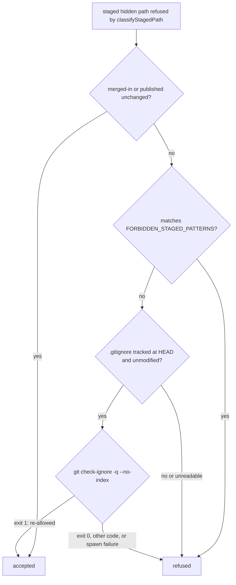

## Summary

The pre-commit safety gate refused every hidden path missing from the
worker's canonical allowlist (`ALLOWED_HIDDEN_PATHS`), even a file the
repo's own `.gitignore` re-allows and tracks on purpose. That made #3293
fail twice, on `.claude/skills/review-fleet-prs/SKILL.md`, `run.sh` and
`review_log.ts`. The gate now also exempts a refused hidden path when the
repo's tracked, unmodified root `.gitignore` re-allows it, as
`git check-ignore --no-index` reports. Secret patterns
(`FORBIDDEN_STAGED_PATTERNS`) are never exempt this way, and every failure
to read the answer leaves the path refused. `REQUIRED_GITIGNORE_PATTERNS`
is not widened. Closes #3296.

- [x] Failing real-repo regression test first (verified red on base)
- [x] `gitignoreReallowed` helper, wired into `assertSafeToCommit`
- [x] Fail-closed seam and stub tests; every guard broken on purpose
- [x] Docs sweep across the standards, security and merge manuals
- [x] Spec and Standards reviews
- [x] Full `./quality.sh`

## Spec

### Intent and Rationale

- A repo may track hidden files of its own: this repo re-allows
  `.claude/skills` and `.claude/agents` (#2675, #2976). The repo's own
  `.gitignore` already records that choice, so the gate reads it rather
  than growing a second list.
- `ALLOWED_HIDDEN_PATHS` stays the worker's canonical fleet-wide list. A
  per-repo opt-in must not widen what every other repo accepts.

### Essential Design Decisions

- The exemption is the last one in `assertSafeToCommit`, after the
  `mergedInUnchanged` and default-ref exemptions. `classifyStagedPath` is
  unchanged, so its other callers keep the strict answer.
- The `.gitignore` must exist at `HEAD` (`cat-file -e HEAD:.gitignore`) and
  be unmodified in the index and working tree (`diff --quiet HEAD --
  .gitignore`). Otherwise an agent could opt a path in within the very
  commit being judged.
- `check-ignore` exit 1 is the only exempting answer. Exit 0, any other
  code, or a spawn failure leaves the path refused. A `run` test seam
  exists only because `runGitCommand` reports a timeout as `ok:true` with
  code 124.
- `assertAdoptedMergeIsSafe` (`worker/deno/lib/milestone_merge_state.ts`)
  is deliberately excluded: an agent-committed merge stays held to the
  strict classifier plus `mergedInUnchanged`.

### Undiscoverable Facts

- `--no-index` is load-bearing. Without it, `check-ignore` reports any
  *tracked* path as not ignored, so every tracked hidden file would be
  exempt.
- `-z` without `--stdin` is fatal in `check-ignore`, so paths are checked
  one call each.
- `.git/info/exclude` and `core.excludesFile` can only add ignores, never
  re-allow, and `gitignore_enforcer.ts` never writes `info/exclude`.
  Reading them through `check-ignore` therefore cannot widen the
  exemption.
- Residual risk: the gate reads `.gitignore` at `HEAD`, not on the base
  branch, so a re-allow committed earlier on the same branch counts.
  Secrets stay refused regardless, and the prompt rule tells agents never
  to add a re-allow rule themselves.

## Evidence

Backend-only change: no UI file is touched.



Observed `git check-ignore` against this repo's `.gitignore`:

```text
$ git check-ignore -q --no-index -- .claude/skills/review-fleet-prs/SKILL.md; echo $?
1
$ git check-ignore -q --no-index -- .claude/settings.local.json; echo $?
0
$ git check-ignore -q --no-index -- .env; echo $?
0
$ git check-ignore -v -n --no-index -- .claude/skills/review-fleet-prs/SKILL.md; echo $?
::	.claude/skills/review-fleet-prs/SKILL.md
1
```

The code relies on exit 1 meaning "not ignored", and exit 0 meaning
"ignored".

- `worker/deno/tests/pre_commit_safety_gitignore_reallow_3296_test.ts`: 19
  tests. Real-repo fixtures (with a local git identity) cover the
  acceptance criteria and the `.gitignore` guards. Stub tests cover a
  spawn failure and an unexpected exit code.
- That file, `worker/deno/tests/pre_commit_safety_test.ts` and
  `worker/deno/tests/hidden_files_safety_integration_test.ts`: 69 passed,
  0 failed. `deno fmt --check`, lint and check are clean.
- **Docs sweep**: grep `ALLOWED_HIDDEN_PATHS`, `classifyStagedPath`,
  `REQUIRED_GITIGNORE_PATTERNS`, `hidden path`, `Pre-commit safety gate`,
  `allowlist`; updated: `CODING-STANDARDS.md`, `DESIGN-PRINCIPLES.md`,
  `SECURITY.md`, `docs/MERGE.md`, `docs/THREAT-MODEL.md` (C26),
  `prompts/coding_guidelines/prompt.md`, and the module and helper doc
  comments in `worker/deno/lib/pre_commit_safety.ts`. Still true:
  - `docs/AGENT-ACCOUNTABILITY.md:729` — still true because it describes
    the enforcer's allowlist, which is unchanged;
  - `README.md:505` — still true because it lists the enforcer's
    re-allowed paths, not the gate's decision;
  - `docs/CONFIGURATION.md:5223` — still true because it describes
    `REQUIRED_GITIGNORE_PATTERNS`, which is not widened;
  - `worker/deno/lib/git_push.ts:453` — still true because it describes
    worker state files, which no repo re-allows;
  - `worker/deno/lib/milestone_merge_state.ts:188` — still true because
    the adopted-merge check keeps the strict classifier.

  The hits in `milestone_conflict_ladder.ts:247`,
  `milestone_gate_repair.ts:246`, `preserved_wip_branch.ts:29`,
  `session_manager.ts:134`, `worker_state_paths.ts:6` and
  `commands/git_operations.ts:518` name the gate without saying what it
  accepts, so they stay true.
- Related existing rules checked: Commit Safety in
  `CODING-STANDARDS.md` and `prompts/coding_guidelines/prompt.md` ("Never
  stage or commit hidden files", the five-entry allowlist, "If a hidden
  file legitimately needs to be tracked, raise an issue first"), the
  `SECURITY.md` hidden-file controls, and `docs/THREAT-MODEL.md` C26. Each
  now names the per-repo opt-in and keeps the secret patterns absolute. I
  applied the reworded rule to this PR's own diff: it stages no hidden
  path at all, so nothing is flagged.
- Pre-existing, out of scope: `DESIGN-PRINCIPLES.md` omits `.vscode/`;
  `CODING-STANDARDS.md:967` has an MD018-style line.

## Reproduction

- Symptom: `assertSafeToCommit` refused
  `.claude/skills/review-fleet-prs/SKILL.md` in a repo whose `.gitignore`
  re-allows `.claude/skills` (#3293, twice).
- Status: verified. On base `416fd710`, `classifyStagedPath` returned
  `violation` for `SKILL.md`, `.claude/settings.local.json` and `.env`,
  and no later exemption applied.
- Regression test: "assertSafeToCommit - an edited committed SKILL.md
  passes when the repo's own .gitignore re-allows .claude/skills (Issue
  #3296)" failed on base and passes after the fix.

## Acceptance Criteria

<!-- vibe-spec-review inputs="diff+issue-body" -->

An independent reviewer was given only the diff and the issue body.

- **met** — A modified `.claude/skills/<x>/SKILL.md` in a repo whose
  `.gitignore` re-allows `.claude/skills` passes the gate — evidence:
  `gitignoreReallowed` wired into `assertSafeToCommit`
  (`worker/deno/lib/pre_commit_safety.ts:413`) and the regression test
  named under Reproduction — reviewer: met
- **met** — The same path in a repo whose `.gitignore` does not re-allow
  it is still refused — evidence: the "no .gitignore at all exempts
  nothing" and non-re-allowing fixtures in
  `worker/deno/tests/pre_commit_safety_gitignore_reallow_3296_test.ts` —
  reviewer: met
- **met** — `.claude/settings.local.json`, which stays ignored under
  `.claude/*`, is still refused — evidence: "does not exempt a path
  check-ignore reports as ignored (exit 0)" in the same file — reviewer:
  met
- **met** — Secret patterns (`.env`, `.config*.json`, `*.pem`, …) are
  refused even if a repo's `.gitignore` re-allows them — evidence: ".env,
  .config.local.json and key.pem stay refused even when the repo's
  .gitignore re-allows them" and "never exempts a
  FORBIDDEN_STAGED_PATTERNS path" — reviewer: met
- **unrequested** — Doc updates across the six manuals listed in the Docs
  sweep — reviewer: unrequested — reason: they keep the docs truthful
  about the changed safety gate, as **A Code Change Owes a Docs Change**
  requires.

## Standards Review

<!-- vibe-standards-review inputs="diff+CODING-STANDARDS.md" -->

No material departures found. Removed or weakened assertions: none (the
only test file is new). Rules checked: Language and Spelling; Never Fail
Silently — Fail Loud; Commit Safety (including the per-repo opt-in); A
Code Change Owes a Docs Change; the TDD rules, A named test must exist, A
stub mirrors the real callee's contract, Observe the real tool before you
rely on it, Every outcome of a branch you add needs a test; Prompt
Engineering (check existing rules, apply a new rule to your own diff,
scope a rule); PR Summary absolute-word claims. Style note, not a
violation: the optional `run` test seam slightly widens
`gitignoreReallowed`'s public signature.

## Test Plan

- Removed assertions: none. No existing test was edited.
- New file
  `worker/deno/tests/pre_commit_safety_gitignore_reallow_3296_test.ts` (19
  tests). The existing tests expecting the hidden-path refusal were
  re-run and still reach it:
  `worker/deno/tests/pre_commit_safety_test.ts` and
  `worker/deno/tests/hidden_files_safety_integration_test.ts` (69 passed
  in total).
- Named tests checked with `git ls-files` from the repository root: all
  three are tracked.
- Full `./quality.sh < /dev/null` on the head: passed with skipped
  checks. The only skip was config integration ("deno or .config.json not
  available"), which is environmental.

**Branch outcomes:**

- `worker/deno/lib/pre_commit_safety.ts:310` forbidden filter: reached by
  "never exempts a FORBIDDEN_STAGED_PATTERNS path" and ".env,
  .config.local.json and key.pem stay refused even when the repo's
  .gitignore re-allows them". Dropping the filter turned 2 red.
- `worker/deno/lib/pre_commit_safety.ts:311` empty candidates: reached by
  "empty candidates short-circuits without running git".
- `worker/deno/lib/pre_commit_safety.ts:320` `.gitignore` not at `HEAD`:
  reached by "an untracked .gitignore exempts nothing", "no .gitignore at
  all exempts nothing" and "a non-repo cwd (check-ignore cannot run)
  exempts nothing".
- `worker/deno/lib/pre_commit_safety.ts:325` `.gitignore` modified:
  reached by "a working-tree-modified .gitignore exempts nothing" and "a
  staged-modified .gitignore exempts nothing". Bypassing both guards
  turned 4 red.
- `worker/deno/lib/pre_commit_safety.ts:332` check-ignore cannot run:
  reached by "a check-ignore call that cannot run at all exempts
  nothing". Treating `!ok` as exempt turned it red.
- `worker/deno/lib/pre_commit_safety.ts:333` exit 1 exempts: reached by
  "exempts a path check-ignore reports as not ignored (exit 1)", the
  positive stub control, and the AC1 regression test.
- `worker/deno/lib/pre_commit_safety.ts:333` exit 0 or another code:
  reached by "does not exempt a path check-ignore reports as ignored
  (exit 0)" and "a check-ignore exit code other than 0 or 1 exempts
  nothing". Exempting any code turned 3 red; exempting `code !== 0`
  turned the exit-128 test red. Dropping `--no-index` turned 2 red.
- `worker/deno/lib/pre_commit_safety.ts:413` wiring: the AC1 regression
  test goes red on base without it.

All mutations were restored.

**Guards kept and excluded:** kept: the secret patterns stay absolute;
the merged-in and default-ref exemptions run first, unchanged; the Issue
#1758 message is unchanged. Excluded: `assertAdoptedMergeIsSafe`, covered
by "an agent-added .env or .claude/secret during a merge is still refused
with no re-allowing .gitignore present (Issue #3296 sanity)".

**Callers checked:** `assertSafeToCommit` is called by
`commitAndPushPending` (`worker/deno/lib/git_push.ts:625`),
`stageAgentResolution` (`worker/deno/lib/milestone_conflict_ladder.ts:275`)
and `worker/deno/tests/hidden_files_safety_integration_test.ts:182`. All
three gain the exemption by intent. `classifyStagedPath` is unchanged, so
`assertAdoptedMergeIsSafe` and `unstageWorkerStateFiles`
(`worker/deno/lib/git_push.ts:468`) are unaffected.

🤖 Generated with [Claude Code](https://claude.com/claude-code)
