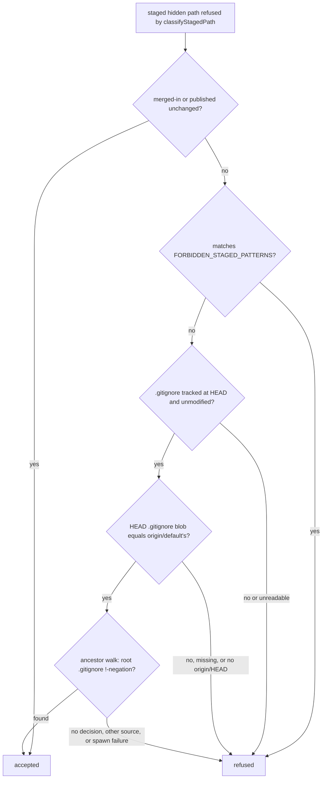

## Summary

The pre-commit safety gate refused every hidden path missing from the
worker's canonical allowlist (`ALLOWED_HIDDEN_PATHS`), even a file the
repo's own `.gitignore` re-allows and tracks on purpose. That made #3293
fail twice, on `.claude/skills/review-fleet-prs/SKILL.md`, `run.sh` and
`review_log.ts`. The gate now also exempts a refused hidden path when an
ancestor-directory walk finds an explicit `!`-negation decided by the
repo's tracked, unmodified root `.gitignore` itself, **and** that root
`.gitignore` is byte-identical to `.gitignore` on the local
`origin/<default>` ref (hardening from the PR #3308 review — a re-allow
committed only on the branch under review, never published on the repo's
own default branch, no longer exempts anything).
Secret patterns and credential-store paths (`FORBIDDEN_STAGED_PATTERNS`)
are never exempt this way, and every failure to read the answer leaves the
path refused. `REQUIRED_GITIGNORE_PATTERNS` is not widened. Closes #3296.

- [x] Failing real-repo regression test first (verified red on base)
- [x] `gitignoreReallowed` helper, wired into `assertSafeToCommit`
- [x] Fail-closed seam and stub tests; every guard broken on purpose
- [x] Docs sweep across the standards, security and merge manuals
- [x] Spec and Standards reviews
- [x] Full `./quality.sh`

## Spec

### Intent and Rationale

- A repo may track hidden files of its own: this repo re-allows
  `.claude/skills` and `.claude/agents` (#2675, #2976). The repo's own
  `.gitignore` already records that choice, so the gate reads it rather
  than growing a second list.
- `ALLOWED_HIDDEN_PATHS` stays the worker's canonical fleet-wide list. A
  per-repo opt-in must not widen what every other repo accepts.

### Essential Design Decisions

- The exemption is the last one in `assertSafeToCommit`, after the
  `mergedInUnchanged` and default-ref exemptions. `classifyStagedPath` is
  unchanged, so its other callers keep the strict answer.
- The `.gitignore` must exist at `HEAD` (`cat-file -e HEAD:.gitignore`),
  its index must match `HEAD` (`diff --cached --quiet HEAD -- .gitignore`)
  and its working tree must match `HEAD`
  (`diff --quiet HEAD -- .gitignore`). The index check catches a
  staged-only edit whose working-tree file has been put back (PR #3308
  review hardening of the gap noted in Standards Review below).
- An ancestor-directory walk finding an explicit `!`-negation decided by
  the root `.gitignore` itself is the only exempting answer. No decision
  anywhere in the chain, a decision from a nested or untracked
  `.gitignore`, a non-negation decision, or a spawn failure leaves the
  path refused (PR #3308 review). A `run` test seam exists only because
  `runGitCommand` reports a timeout as `ok:true` with code 124.
- `HEAD:.gitignore`'s blob must also equal `origin/<default>:.gitignore`'s
  (PR #3308 review). `.gitignore` is itself on
  `ALLOWED_HIDDEN_PATHS`, so a worker commit could carry an agent's
  `!`-negation and a later commit on the same branch then stage the path
  it re-allows — without this check the repo's own choice would be
  decided by the branch under review, not by what the repo's default
  branch actually publishes. `originDefaultRef` (already used by the
  #2774 exemption) gained a test-seam `run` parameter so this check shares
  it. An unresolvable `origin/HEAD`, a missing `.gitignore` on either ref,
  or a mismatched blob all leave nothing exempt (fail closed).
- `assertAdoptedMergeIsSafe` (`worker/deno/lib/milestone_merge_state.ts`)
  is deliberately excluded: an agent-committed merge stays held to the
  strict classifier plus `mergedInUnchanged`.

### Undiscoverable Facts

- `--no-index` is load-bearing. Without it, `check-ignore` reports any
  *tracked* path as not ignored, so the walk never sees the rule that
  re-allows a tracked file's directory: dropping it turns the AC1
  regression test and its real-repo helper test red (fail closed, not
  open).
- `-z` without `--stdin` is fatal in `check-ignore`, so paths are checked
  one call each.
- `.git/info/exclude` and `core.excludesFile` can only add ignores, never
  re-allow, and `gitignore_enforcer.ts` never writes `info/exclude`.
  Reading them through `check-ignore` therefore cannot widen the
  exemption.
- The ancestor-walk and root-source requirement (PR #3308 review) closes the
  risk that a bare `check-ignore` exit 1 would otherwise cover a hidden
  path no rule mentions, or a path re-allowed by an untracked nested
  `.gitignore`. The previously-noted residual risk — the gate read
  `.gitignore` at `HEAD` only, so a re-allow committed earlier on the same
  branch (never published on the repo's default branch) would still
  count, since `.gitignore` is itself on `ALLOWED_HIDDEN_PATHS` — is now
  closed by the `origin/<default>` blob-match requirement above (PR #3308
  review).

## Evidence

Backend-only change: no UI file is touched.



Observed `git check-ignore` against this repo's `.gitignore`:

```text
$ git check-ignore -q --no-index -- .claude/skills/review-fleet-prs/SKILL.md; echo $?
1
$ git check-ignore -q --no-index -- .claude/settings.local.json; echo $?
0
$ git check-ignore -q --no-index -- .env; echo $?
0
$ git check-ignore -v -n --no-index -- .claude/skills/review-fleet-prs/SKILL.md; echo $?
::	.claude/skills/review-fleet-prs/SKILL.md
1
```

The code no longer treats a bare exit 1 as sufficient: it also requires the
deciding rule found by the ancestor walk to be a root-`.gitignore`
`!`-negation, not just the exit code, and requires that root `.gitignore`
to match `origin/<default>`'s copy (both from the PR #3308 review).

- `worker/deno/tests/pre_commit_safety_gitignore_reallow_3296_test.ts`: 36
  tests. Real-repo fixtures (built as an upstream-plus-clone pair, so
  `origin/<default>` is configured and matches `HEAD` by construction)
  cover the acceptance criteria, the `.gitignore` guards, the
  branch-only-reallow and no-origin cases, and an unpatched repo whose
  published `.gitignore` has no `.*` rule (Case 9, which only the
  ancestor walk can refuse). Stub tests cover each `check-ignore` failure
  mode, each unparsable decision line, each `.gitignore` guard failing on
  its own, an unresolvable `origin/HEAD`, and a `HEAD`/`origin/<default>`
  blob mismatch.
- That file, `worker/deno/tests/pre_commit_safety_test.ts` and
  `worker/deno/tests/hidden_files_safety_integration_test.ts`: 101 passed,
  0 failed. `deno fmt --check` and lint are clean; `deno check` of the two
  changed files reports no error outside the standard library (see Test
  Plan for why).
- **Cited issue numbers** (each looked up with the REST API on this head):
  - #1758: Merge-conflict pass starts a resolution it cannot finish before
    the cycle ends, then charges the watchdog's SIGTERM to the PR as a
    failed attempt (Issue #1693) — pre-existing in the gate's error
    message, not added by this diff;
  - #2675: Check in a review-fleet-prs Claude Code skill for automated
    first-pass PR review;
  - #2737: Pre-commit safety gate refuses a merge that only brings in
    hidden files already tracked on the base, so conflict resolution fails
    and the PR is abandoned;
  - #2774: Pre-commit safety gate refuses WIP preservation for hidden files
    already published on the default branch;
  - #2976: review-fleet-prs: review PRs with Opus 5.5 at xhigh effort
    instead of Fable;
  - #3293: Run the review-fleet-prs headless round inside the worker
    container image;
  - #3296: Pre-commit safety gate refuses edits to tracked .claude/skills
    files the repo's .gitignore re-allows;
  - #3308: Pre-commit gate: accept hidden paths the repo's tracked
    .gitignore re-allows (#3296) — this PR; "PR #3308 review" names the
    review rounds that asked for the hardening;
  - #3309: Remaining drift tests still pin presence phrases over a whole
    flattened doc instead of section() — unrelated; named only as the
    citation this round removed;
  - #3336: Pre-commit safety gate classifies credential-store paths in a
    subdirectory (.ssh/, .aws/, .netrc) as safe — main's attribution for
    the credential-store pattern, restored.
- **Docs sweep** — grep: `ALLOWED_HIDDEN_PATHS`, `classifyStagedPath`,
  `REQUIRED_GITIGNORE_PATTERNS`, `hidden path`, `Pre-commit safety gate`,
  `allowlist`; section: `docs/MERGE.md#read-only-default-branch` (the
  staged-path gate's exemption bullets) and `SECURITY.md` "Configuration
  File (.config.json)" (the `assertSafeToCommit()` exemption paragraphs);
  updated: `CODING-STANDARDS.md`, `DESIGN-PRINCIPLES.md`,
  `SECURITY.md`, `docs/MERGE.md`, `docs/THREAT-MODEL.md` (C26),
  `prompts/coding_guidelines/prompt.md`, and the module and helper doc
  comments in `worker/deno/lib/pre_commit_safety.ts`. `README.md` and
  `docs/CONFIGURATION.md`: no hits. Still true:
  - `docs/AGENT-ACCOUNTABILITY.md:729` — still true because it describes
    the enforcer's allowlist, which is unchanged;
  - `worker/deno/lib/git_push.ts:453` — still true because it describes
    worker state files, which no repo re-allows;
  - `worker/deno/lib/milestone_merge_state.ts:188` — still true because
    the adopted-merge check keeps the strict classifier.

  The hits in `milestone_conflict_ladder.ts:247`,
  `milestone_gate_repair.ts:246`, `preserved_wip_branch.ts:29`,
  `session_manager.ts:134`, `worker_state_paths.ts:6` and
  `commands/git_operations.ts:518` name the gate without saying what it
  accepts, so they stay true.
- Related existing rules checked: Commit Safety in
  `CODING-STANDARDS.md` and `prompts/coding_guidelines/prompt.md` ("Never
  stage or commit hidden files", the five-entry allowlist, "If a hidden
  file legitimately needs to be tracked, raise an issue first"), the
  `SECURITY.md` hidden-file controls, and `docs/THREAT-MODEL.md` C26. Each
  now names the per-repo opt-in and keeps the secret patterns absolute. I
  applied the reworded rule to this PR's own diff: it stages no hidden
  path at all, so nothing is flagged.
- Pre-existing, out of scope: `DESIGN-PRINCIPLES.md` omits `.vscode/`;
  `CODING-STANDARDS.md:967` has an MD018-style line.

## Reproduction

- Symptom: `assertSafeToCommit` refused
  `.claude/skills/review-fleet-prs/SKILL.md` in a repo whose `.gitignore`
  re-allows `.claude/skills` (#3293, twice).
- Status: verified. On base `416fd710`, `classifyStagedPath` returned
  `violation` for `SKILL.md`, `.claude/settings.local.json` and `.env`,
  and no later exemption applied.
- Regression test: "assertSafeToCommit - an edited committed SKILL.md
  passes when the repo's own .gitignore re-allows .claude/skills (Issue
  #3296)" failed on base and passes after the fix.

## Test Plan

- Removed assertions: none. `makeSkillRepo` in
  `pre_commit_safety_gitignore_reallow_3296_test.ts` was changed from a
  plain `git init` fixture to an upstream-plus-clone pair (so
  `origin/<default>` exists and matches `HEAD`); every existing test using
  it was re-run and still reaches its original assertion (see below).
- New file `worker/deno/tests/pre_commit_safety_gitignore_reallow_3296_test.ts`
  (36 tests). Two tests were renamed to describe current behaviour rather
  than the removed exit-1/exit-0 logic, and Case 9 was rebuilt on the
  upstream-plus-clone fixture with `.npmrc` and `.git-credentials` staged
  (it previously had no origin, so it returned before the walk ran). The
  existing tests expecting the hidden-path refusal were re-run and still
  reach it: `worker/deno/tests/pre_commit_safety_test.ts` and
  `worker/deno/tests/hidden_files_safety_integration_test.ts` (101 passed
  in total with the new file).
- Named tests checked with `git ls-files` from the repository root: all
  three are tracked.
- Full `./quality.sh < /dev/null` on this head: **FAILED in this
  environment, for a reason outside the diff.** The session's egress policy
  refuses `jsr.io`, so every step that resolves `@std/*` under `--frozen`
  (deno tests, deno type check, completeness checks) failed to load its
  imports before running anything. Every other step passed: lint, fmt,
  markdownlint, mermaid, workflow hygiene, the chokepoint checks, source
  targets and release-tag ruleset; config integration and semgrep were
  SKIPPED. The three blocked steps were then run against a local
  `denoland/std` checkout through a scratch import map (not committed):
  - completeness checks: the 48 derived suites, 675 passed, 0 failed;
  - deno tests: the whole `worker/deno/tests/` tree, 27116 passed and 185
    failed; the same 34 files run on `origin/main` fail the identical 185
    tests (launcher, `first-run.sh`, podman and git-remote fixtures this
    sandbox cannot provide), and none touches the files this PR changes;
  - deno type check: the two changed files report no error outside the
    substituted standard library.
  CI on the pushed head is the authoritative run.

**Branch outcomes:**

- `worker/deno/lib/pre_commit_safety.ts:315` decided line with no tab is unparsable, nothing exempt: reached by `worker/deno/tests/pre_commit_safety_gitignore_reallow_3296_test.ts` "a decided check-ignore line with no tab cannot be parsed and exempts nothing (PR #3308 review)". Flipping it turned 1 red.
- `worker/deno/lib/pre_commit_safety.ts:316` decided line without the source:line:pattern shape, nothing exempt: reached by `worker/deno/tests/pre_commit_safety_gitignore_reallow_3296_test.ts` "a decided check-ignore line without the source:line:pattern shape exempts nothing (PR #3308 review)". Flipping it turned 1 red.
- `worker/deno/lib/pre_commit_safety.ts:319` decided line with an empty source, nothing exempt: reached by `worker/deno/tests/pre_commit_safety_gitignore_reallow_3296_test.ts` "a decided check-ignore line with an empty source exempts nothing (PR #3308 review)". Flipping it turned 1 red.
- `worker/deno/lib/pre_commit_safety.ts:351` `--no-index` reads ignore rules for tracked paths: reached by `worker/deno/tests/pre_commit_safety_gitignore_reallow_3296_test.ts` "real repo: exempts a nested file whose ancestor directory the root .gitignore re-allows with a `!` rule". Flipping it turned 3 red.
- `worker/deno/lib/pre_commit_safety.ts:354` check-ignore cannot be spawned, nothing exempt: reached by `worker/deno/tests/pre_commit_safety_gitignore_reallow_3296_test.ts` "a check-ignore call that cannot run at all exempts nothing". Flipping it turned 1 red.
- `worker/deno/lib/pre_commit_safety.ts:356` check-ignore exit code other than 0 or 1, nothing exempt: reached by `worker/deno/tests/pre_commit_safety_gitignore_reallow_3296_test.ts` "a check-ignore exit code other than 0 or 1 exempts nothing". Flipping it turned 1 red.
- `worker/deno/lib/pre_commit_safety.ts:357` undecided segment walks up to its parent: reached by `worker/deno/tests/pre_commit_safety_gitignore_reallow_3296_test.ts` "positive control: a root .gitignore negation on an ancestor directory exempts a nested file (PR #3308 review)"; "real repo: exempts a nested file whose ancestor directory the root .gitignore re-allows with a `!` rule". Flipping it turned 4 red.
- `worker/deno/lib/pre_commit_safety.ts:360` no decision anywhere in the chain, nothing exempt: reached by `worker/deno/tests/pre_commit_safety_gitignore_reallow_3296_test.ts` "a published .gitignore lacking the `.*` rule exempts nothing for .npmrc or .git-credentials (PR #3308 review)"; "no decision anywhere in the ancestor chain does not exempt (PR #3308 review)". Flipping it turned 2 red.
- `worker/deno/lib/pre_commit_safety.ts:412` FORBIDDEN_STAGED_PATTERNS paths never reach the walk: reached by `worker/deno/tests/pre_commit_safety_gitignore_reallow_3296_test.ts` "never exempts a FORBIDDEN_STAGED_PATTERNS path"; ".env, .config.local.json and key.pem stay refused even when the repo's .gitignore re-allows them (Issue #3296)". Flipping it turned 3 red.
- `worker/deno/lib/pre_commit_safety.ts:413` no candidates left, no git call made: reached by `worker/deno/tests/pre_commit_safety_gitignore_reallow_3296_test.ts` "empty candidates short-circuits without running git". Flipping it turned 1 red.
- `worker/deno/lib/pre_commit_safety.ts:426` `.gitignore` not tracked at HEAD, nothing exempt: reached by `worker/deno/tests/pre_commit_safety_gitignore_reallow_3296_test.ts` "exempts nothing when only the cat-file guard fails (.gitignore is not tracked at HEAD) (PR #3308 review)". Flipping it turned 1 red.
- `worker/deno/lib/pre_commit_safety.ts:431` `.gitignore` modified in the index, nothing exempt: reached by `worker/deno/tests/pre_commit_safety_gitignore_reallow_3296_test.ts` "a .gitignore modified only in the index exempts nothing (PR #3308 review)". Flipping it turned 2 red.
- `worker/deno/lib/pre_commit_safety.ts:436` `.gitignore` modified in the working tree, nothing exempt: reached by `worker/deno/tests/pre_commit_safety_gitignore_reallow_3296_test.ts` "a working-tree-modified .gitignore exempts nothing (Issue #3296)". Flipping it turned 2 red.
- `worker/deno/lib/pre_commit_safety.ts:446` unresolvable `origin/HEAD`, nothing exempt: reached by `worker/deno/tests/pre_commit_safety_gitignore_reallow_3296_test.ts` "an unresolvable origin/HEAD exempts nothing even with a decided root negation (PR #3308 review)"; "a repo with no origin configured exempts nothing, even with a decided root negation (PR #3308 review)". Flipping it turned 2 red.
- `worker/deno/lib/pre_commit_safety.ts:451` `HEAD:.gitignore` blob unreadable, nothing exempt: reached by `worker/deno/tests/pre_commit_safety_gitignore_reallow_3296_test.ts` "exempts nothing when only the rev-parse HEAD guard fails (HEAD:.gitignore's blob cannot be read) (PR #3308 review)". Flipping it turned 1 red.
- `worker/deno/lib/pre_commit_safety.ts:456` `origin/<default>:.gitignore` missing, nothing exempt: reached by `worker/deno/tests/pre_commit_safety_gitignore_reallow_3296_test.ts` "exempts nothing when only the rev-parse origin guard fails (origin/<default>:.gitignore does not exist) (PR #3308 review)". Flipping it turned 1 red.
- `worker/deno/lib/pre_commit_safety.ts:457` blob differs from `origin/<default>`'s, nothing exempt: reached by `worker/deno/tests/pre_commit_safety_gitignore_reallow_3296_test.ts` "a HEAD .gitignore blob that differs from origin/<default>'s exempts nothing (PR #3308 review)"; "a re-allow committed only on this branch, absent from origin/<default>, exempts nothing (PR #3308 review)". Flipping it turned 2 red.
- `worker/deno/lib/pre_commit_safety.ts:464` decision from a nested or untracked `.gitignore`, not exempt: reached by `worker/deno/tests/pre_commit_safety_gitignore_reallow_3296_test.ts` "a decision from a nested/untracked .gitignore does not exempt (PR #3308 review)"; "an untracked nested .claude/.gitignore re-allowing settings.local.json is still refused (PR #3308 review)". Flipping it turned 2 red.
- `worker/deno/lib/pre_commit_safety.ts:465` non-negation root decision, not exempt: reached by `worker/deno/tests/pre_commit_safety_gitignore_reallow_3296_test.ts` "a non-negation decision from the root .gitignore does not exempt (PR #3308 review)"; "real repo: does not exempt a path a non-negation root .gitignore rule (`.claude/*`) decides". Flipping it turned 4 red.
- `worker/deno/lib/pre_commit_safety.ts:553` wiring into `assertSafeToCommit`: reached by `worker/deno/tests/pre_commit_safety_gitignore_reallow_3296_test.ts` "an edited committed SKILL.md passes when the repo's own .gitignore re-allows .claude/skills (Issue #3296)". Flipping it turned 2 red.

Each flip was run against the three files above (101 tests); the counts are
the tests that went red.

All mutations were restored.

**Guards kept and excluded:** kept: the secret patterns stay absolute;
the merged-in and default-ref exemptions run first, unchanged; the Issue
#1758 message is unchanged. Excluded: `assertAdoptedMergeIsSafe`
(`worker/deno/lib/milestone_merge_state.ts:234`), which still calls
`classifyStagedPath` directly and is not touched by this diff; no new test
exercises it. The "(Issue #3296 sanity)" test only stages `.env` in a plain
commit and checks `assertSafeToCommit` still refuses it.

**Callers checked:** `assertSafeToCommit` is called by
`commitAndPushPending` (`worker/deno/lib/git_push.ts:625`),
`stageAgentResolution` (`worker/deno/lib/milestone_conflict_ladder.ts:275`)
and `worker/deno/tests/hidden_files_safety_integration_test.ts:182`. All
three gain the exemption by intent. `classifyStagedPath` is unchanged, so
`assertAdoptedMergeIsSafe` and `unstageWorkerStateFiles`
(`worker/deno/lib/git_push.ts:468`) are unaffected.

🤖 Generated with [Claude Code](https://claude.com/claude-code)

## Acceptance Criteria

<!-- vibe-spec-review inputs="diff+issue-body" -->

- **met** — A modified .claude/skills/<x>/SKILL.md in a repo whose .gitignore re-allows .claude/skills passes the gate. — evidence: `worker/deno/tests/pre commit safety gitignore reallow 3296 test.ts::assertSafeToCommit - an edited committed SKILL.md passes when the repo's own .gitignore re-allows .claude/skills (Issue #3296)` — reviewer: met
- **met** — The same path in a repo whose .gitignore does not re-allow it is still refused. — evidence: `worker/deno/tests/pre commit safety gitignore reallow 3296 test.ts::assertSafeToCommit - an edited committed SKILL.md is refused when the repo's .gitignore does not re-allow .claude/skills (Issue #3296)` — reviewer: met
- **met** — .claude/settings.local.json , which stays ignored under .claude/ , is still refused. — evidence: `worker/deno/tests/pre commit safety gitignore reallow 3296 test.ts::assertSafeToCommit - .claude/settings.local.json stays refused even though .claude/skills is re-allowed (Issue #3296)` — reviewer: met
- **met** — Secret patterns ( .env , .config .json , .pem , …) are refused even if a repo's .gitignore re-allows them. — evidence: `worker/deno/tests/pre commit safety gitignore reallow 3296 test.ts::assertSafeToCommit - .env, .config.local.json and key.pem stay refused even when the repo's .gitignore re-allows them (Issue #3296); gitignoreReallowed - never exempts a FORBIDDEN STAGED PATTERNS path` — reviewer: met

## Standards Review

<!-- vibe-standards-review inputs="diff+CODING-STANDARDS.md" -->

- **fixed (PR #3308 review)** — The docs said the root .gitignore must be unmodified 'in both the index and the working tree', but the code only ran git diff --quiet HEAD -- .gitignore, which compares HEAD with the working tree. A staged .gitignore edit whose working-tree copy had been put back would have passed. — evidence: `worker/deno/lib/pre_commit_safety.ts` now also runs `git diff --cached --quiet HEAD -- .gitignore`, and Case 11 in `worker/deno/tests/pre_commit_safety_gitignore_reallow_3296_test.ts` covers the index-only edit.
- **fixed (PR #3308 review)** — The docs said a path is exempt when the .gitignore 're-allows' it, but exit 1 from git check-ignore -q --no-index only means 'not ignored', which would also exempt a hidden path no rule mentions and a path re-allowed by an untracked nested .gitignore. — evidence: `gitignoreReallowed` now requires an ancestor-walk decision from the root `.gitignore` itself that is an explicit `!`-negation; Case 9 (rebuilt on the upstream-plus-clone fixture so origin/<default> matches HEAD) and Case 10 in the same test file cover both previously-untested scenarios.
- **clean** — Australian English spelling, JSDoc on the new exported function, fail-closed handling when git cannot run or returns other exit codes, TDD (a dedicated 3296 test file with positive and negative controls), and secret patterns checked before any .gitignore exemption

**PR #3308 review follow-up (hand-added, not a re-run of the automated
reviews above):** a later review round found that `HEAD`'s `.gitignore`
alone was still trusted, so a `!`-negation committed only on the branch
under review — never published on the repo's own default branch — could
still exempt a later commit on that branch, even though the two findings
the same round raised about exit-1-alone and nested/untracked
`.gitignore` were already fixed by the entries above. `gitignoreReallowed`
now also requires `HEAD:.gitignore` to match `origin/<default>:.gitignore`
byte for byte, fail-closed when `origin/HEAD` cannot be resolved or either
`.gitignore` is missing. See Branch outcomes above for the tests that
reach each new guard.

**Third PR #3308 review round (hand-added):** Case 9 was vacuous (no
origin, so it returned before the walk), the agent prompt still listed
re-allowed hidden files as always forbidden, citations named the unrelated
#3309, and Branch outcomes and the `quality.sh` result were stale. All four
are fixed above: Case 9 is rebuilt, the prompt bullet now matches
CODING-STANDARDS.md, every #3309 citation now reads "PR #3308 review" (and
main's #3336 attribution is restored), and Branch outcomes and the Test
Plan are regenerated against this head.
