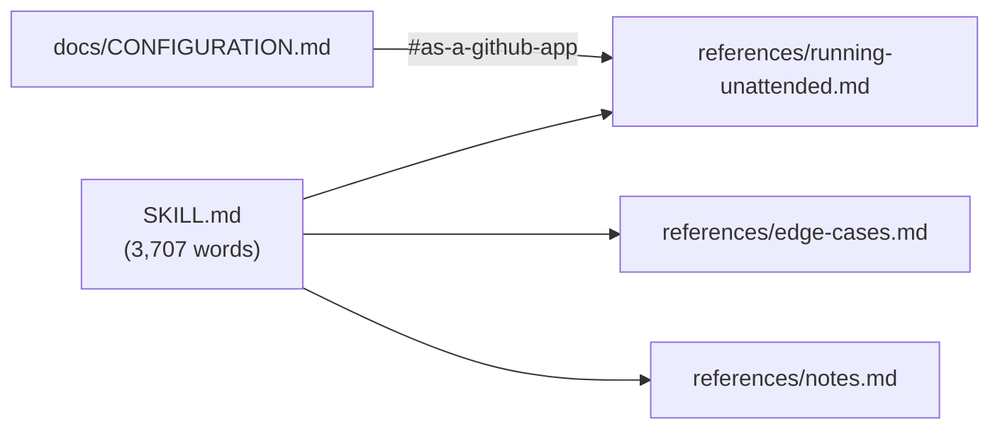

# PR Summary — Issue #3300

**Closes #3300**

## Summary

Splits four sections out of `.claude/skills/review-fleet-prs/SKILL.md` into
`references/`, cutting it from about 4,300 words to 3,707 by `wc -w`, with the
frontmatter included:

- "Running unattended" → `references/running-unattended.md`
- "Dependabot PRs" and "Approved fleet PRs that are behind" → `references/edge-cases.md`
- "Notes" → `references/notes.md`

Each moved section leaves a one-line pointer in `SKILL.md`. `docs/CONFIGURATION.md`
now links to `references/running-unattended.md#as-a-github-app`. A new test
checks every link in the skill, its references and `docs/CONFIGURATION.md`.

- [x] Move the four sections, naming the `scripts/` helper paths in the moved text
- [x] Leave a one-line pointer for each moved section, and repoint rule 9's Dependabot link
- [x] Repoint the `docs/CONFIGURATION.md` link
- [x] Add `worker/deno/tests/review_fleet_prs_skill_links_3300_test.ts` with in-test fixtures for each failure
- [x] Spec and standards review
- [x] `./quality.sh`

## Spec

### Intent and Rationale

- The skills guide keeps `SKILL.md` to what every round needs. Setup, rare edge
  cases and background now load only when a round needs them.
- "Learn" stays in `SKILL.md`, so `review_fleet_prs_skill_labels_2882_test.ts`
  is unchanged.

### Essential Design Decisions

- The moved text is reworded only where it no longer sits inside `SKILL.md`.
  Lines are rewrapped, and the `###` subheadings of "Running unattended"
  become `##` in `references/running-unattended.md`. The changes are:
  - Helper names carry their `scripts/` prefix (`scripts/post.ts`,
    `scripts/app_token.ts`, `scripts/escalate.ts`, `scripts/dependabot.ts`,
    `scripts/branch_update.ts`, `scripts/run.sh --once`).
  - The `SETUP.md` and `CONFIGURATION.md` links gain the extra `../` that the
    deeper directory needs.
  - In `references/running-unattended.md`, "`scripts/run.sh` under this
    directory" becomes "under the skill directory
    (`.claude/skills/review-fleet-prs/`)". "`runner.log` in the log directory
    below" becomes "in the log directory (`<logs>/review-fleet-prs/`, see
    [notes.md](notes.md))", a new link. "step 4" becomes
    "[SKILL.md](../SKILL.md)'s step 4", also a new link.
  - In `references/edge-cases.md`, "(rule 9)" becomes
    "([SKILL.md](../SKILL.md) rule 9)", a new link.
- The link test reuses `anchorSet` from `worker/deno/lib/markdown_anchors.ts`,
  so anchors are slugged the same way as the repo's other anchor checks.
- `skillLinkProblems(root)` takes the root as a parameter, so the same function
  checks both the real repo and each temp-dir fixture. It catches only
  `NotFound` and rethrows every other error.

### Undiscoverable Facts

- Rule 9 in `SKILL.md` linked the in-file `#dependabot-prs` anchor. It now
  links `references/edge-cases.md#dependabot-prs`, so that link survives the
  move.
- The old `docs/CONFIGURATION.md` anchor appears only in
  `docs/archive/pr-summaries/`, which is a historical record and stays as it is.

## Evidence

This change touches only docs and a test; no UI is affected.

`wc -w .claude/skills/review-fleet-prs/SKILL.md` → `3707`.

**Docs sweep** — grep: `#running-unattended`, `#as-a-github-app`,
`#dependabot-prs`, `#approved-fleet-prs-that-are-behind`, `#notes` and
`review-fleet-prs/SKILL.md#` over the repo outside `docs/archive/`. Updated:
`docs/CONFIGURATION.md:406` and `.claude/skills/review-fleet-prs/SKILL.md:98`.
Remaining hits: `.claude/skills/review-fleet-prs/SKILL.md:144` and `:149`
point into `references/edge-cases.md`, and the link test checks both. No other
hit names a moved anchor.

## Acceptance Criteria

<!-- vibe-spec-review inputs="diff+issue-body" -->

- **met** — `SKILL.md`, frontmatter included, is under 4,306 words by `wc -w`. — evidence: `wc -w` → 3707 — reviewer: met
- **met** — None of the four moved sections remains in `SKILL.md`. Only the pointers do. — evidence: `.claude/skills/review-fleet-prs/SKILL.md:23`, `:144`, `:149` and `:390` are the pointers, and no moved heading remains — reviewer: met
- **met** — The new link test passes. It fails when a `references/` file is unlinked, a link target is missing, or the `docs/CONFIGURATION.md` anchor no longer exists. In-test fixtures prove each failure. — evidence: `worker/deno/tests/review_fleet_prs_skill_links_3300_test.ts:290`, `:305` and `:321` — reviewer: met
- **met** — `review_fleet_prs_skill_labels_2882_test.ts` still passes, because "Learn" stays in `SKILL.md`. — evidence: the targeted run below — reviewer: met
- **met** — `./quality.sh` passes. — evidence: the Test Plan below — reviewer: partial — reason: the reviewer cannot run commands; the gate was run here

## Standards Review

<!-- vibe-standards-review inputs="diff+CODING-STANDARDS.md" -->

- **clean** — no violations. Checked: the docs sweep finds no stale anchor
  outside `docs/archive/`; Australian English; the test calls real code
  against real files and does not grep source; errors other than `NotFound`
  are rethrown; every named test exists. One optional nit was not taken: an
  automated word-count assertion, which the issue does not ask for.

## Test Plan

- From `worker/deno`: the link test (9 tests), `review_fleet_prs_skill_labels_2882_test.ts`,
  private-refs and frontmatter tests all pass. `deno fmt --check`, `deno lint`
  and `deno check` are clean on the new test.
- `./quality.sh < /dev/null` → `Result: PASSED (with skipped checks)`. Only `config integration` was skipped. deno tests, lint, type check, fmt and markdownlint all passed. After the run, one fixture test was added for `:201`; the link test file then passed 9/9, and `deno fmt` and `deno lint` were clean.
- Red checks against the real repo. Each break went red with the message shown,
  and the files were restored byte-identical:
  - Removing the `notes.md` pointer from `SKILL.md` → `unlinked references file: .claude/skills/review-fleet-prs/references/notes.md`.
  - Renaming the edge-cases link to `references/edge-case.md` → `missing link target` (twice: the pointer and rule 9).
  - Changing the `docs/CONFIGURATION.md` anchor to `#gone` → `missing anchor: docs/CONFIGURATION.md -> …running-unattended.md#gone`.

**Branch outcomes:** (all in `worker/deno/tests/review_fleet_prs_skill_links_3300_test.ts`)

- `:109` missing link target → "skillLinkProblems - missing link target"; disabling the push went red.
- `:118` missing anchor → "skillLinkProblems - missing CONFIGURATION anchor"; disabling the push went red.
- `:141` missing file → "skillLinkProblems - missing SKILL.md"; disabling the push went red.
- `:191` no reference files → "skillLinkProblems - no reference files"; disabling the push went red.
- `:201` missing `docs/CONFIGURATION.md` → "skillLinkProblems - missing CONFIGURATION.md"; disabling the push went red (0 vs 1).
- `:211` no skill link in `docs/CONFIGURATION.md` → "skillLinkProblems - CONFIGURATION has no skill link"; disabling the push went red.
- `:235` unlinked references file → "skillLinkProblems - unlinked references file"; disabling the push went red.
- Clean path (no problems) → "skillLinkProblems - clean fixture is clean" and "skillLinkProblems - real repo".

**Callers checked:** `docs/CONFIGURATION.md:406` is the only link into the
skill directory from outside it. `:174` and `:382` mention the skill and
`scripts/run.sh` in prose only, and both stay true.

**Related rules checked:** this change adds no rule. I applied **A Code Change
Owes a Docs Change** to this PR's own diff and found nothing outstanding.

## Security Self-Check

- [x] Input validation: no new external input. The test reads repo files only.
- [x] Secrets: no hidden file is staged outside `.claude/skills/`, which the repo's `.gitignore` re-allows.
- [x] Injection surface, output encoding, auth and dependencies: not affected.
- [x] Path confinement: no new path guard. Link resolution in the test only decides whether a file exists.
