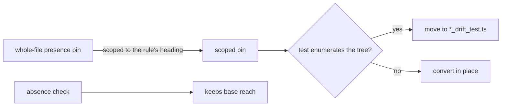

# PR Summary — Issue #3309

## Summary

Follow-up to #3263 and #3302. Each drift test listed in #3309 was audited.
Its **presence** pins now read only the section that holds their rule, using
`readRepoDoc()`, `section()` and `flat()` from
`worker/deno/tests/support/markdown_docs.ts`. Absence checks keep the
whole-file reach they had on base. Every moved check was red-checked: its rule
text was deleted from its own section only, and the test went red. Closes #3309.

- **Converted in place:** `coding_guidelines_additive_member_3137`,
  `coding_guidelines_meaning_change_2904`, `coding_guidelines_twin_drift`,
  `documentation_audit_prompt_v9`, `hidden_allowlist_drift`,
  `idle_task_live_recheck_dedup_3045`, `issue_prompt_workflow_files`,
  `reserved_label_warning_v2826`, `scan_prompt_open_issue_titles`,
  `security_scan_defensive_labels` and `test_category_definitions`.
- **Section pins split into a `*_drift_test.ts` file:** `prompt_presence_gaps`,
  `severity_emoji_scale`, `suppression_governance_drift` and
  `overflow_tracker_scope`. `markdown_docs.ts` spawns git, so it matches
  `HEAVY_RE`, the #3302 hazard. `overflow_tracker_scope_test.ts` calls
  `Deno.readDir`, which makes it a `check:manifests` family member, so
  importing the helper there would have dropped it from the family. Running
  `deriveCompletenessTestFiles()` lists the same 49 files on base and head.
- **Audited and left as they are:**
  - `github_actions_audit_cost_group` already slices each numbered check and
    `### Cost and speed` with its own helpers.
  - `merge_conflict_prompt_v2` and `unfenced_untrusted_text` pin rendered
    prompts (`buildMergeConflictPrompt`, `assembleOrphanDepsPrompt`).
  - `pr_body_matches_final_diff_3015`, `pr_claims_verified_3058`,
    `prompt_docs_sweep_2952`, `prompt_docs_sweep_3073` and
    `prompt_docs_sweep_3172` already read every pin through `section()`.
  - `timing_assertion_policy` already scopes its presence pins. Its whole-file
    reads are its two absence checks.
  - `security_tree_sweep_test.ts` pins scanner and report output, not a doc.
- In `test_audit_unit_suite_checks_943`, the "every surface counting the
  catalogue says thirteen" pin stays whole-file. Its three claims sit in three
  places: the overview above the first `##`, the `## Phase 2` heading line
  itself (which `section()` excludes), and `## Stable finding ID recipe`.

## Spec

### Intent and Rationale

- A whole-file presence pin stays green when a rule moves into an unrelated
  section, so each pin now reads the section holding the sentence it was
  written for. This follows CODING-STANDARDS.md § "Re-scoping an existing
  drift test" (#3307).

### Essential Design Decisions

- A test that enumerates the tree must not import `markdown_docs.ts`. Its
  section pins go in a sibling `*_drift_test.ts` file, so the
  `check:manifests` family is unchanged.
- Absence checks keep their base reach (the whole template, or the same slice
  base used). Narrowing one would weaken it.
- Where one section holds two copies of a phrase, the pin is narrowed to the
  bullet that holds its rule. In the 2904 test, "enum variant" now reads the
  meaning-change bullet, not the whole docs-change section.

### Undiscoverable Facts

- The earlier attempt's gate failure was the removed-assertion gate capping
  the Test Plan at 2,000 characters. The milestone base fixed that cap
  (f245af8d), and this branch now merges it.

## Evidence

Test-only change, no UI. The touched test files pass, and the full
`./quality.sh` gate passed on the head before the last two fix commits. Those
commits change only test files, and their tests were re-run (see Test Plan).

**Docs sweep** — grep: `overflow_tracker_scope`, `scan_prompt_open_issue_titles_test`, `idle_task_live_recheck_dedup`, "Re-scoping an existing drift test"; section: `CODING-STANDARDS.md#documentation-drift-tests` (read; the rule this PR applies, unchanged); no hits outside `docs/archive/`

Issue numbers this diff adds as provenance, looked up with `gh issue view`:

- #3309: Remaining drift tests still pin presence phrases over a whole flattened doc instead of section()
- #1483: A new module or VIBE_ var costs a full CI matrix to learn it needed registering — the completeness checks are seconds, but only reachable via the full suite
- #780, #788, #789, #841: titles checked; cited only in moved test names that already carried them

## Acceptance Criteria

<!-- vibe-spec-review inputs="diff+issue-body" -->

- **met** — it is scoped to its rule's section, per #3307 — evidence: the per-pin "Moved check" lines in the Test Plan; `worker/deno/tests/overflow_tracker_scope_drift_test.ts` — reviewer: partial — reason: the reviewer flagged two things. `overflow_tracker_scope_test.ts` dropped out of the `check:manifests` family, which is fixed in 9551475d (its pins moved to the drift file, and the family is identical on base and head). The unchanged candidates are accounted for, with reasons, in the Summary's "Audited and left as they are" list.
- **met** — absence checks stay on `flatWholeFile` — evidence: `worker/deno/tests/idle_task_live_recheck_dedup_3045_test.ts`, `worker/deno/tests/documentation_audit_prompt_v9_test.ts`, `worker/deno/tests/severity_emoji_scale_test.ts`, `worker/deno/tests/suppression_governance_drift_test.ts` and `worker/deno/tests/overflow_tracker_scope_test.ts` keep their absence checks on the whole template — reviewer: partial — reason: the reviewer found "no case where an absence check was wrongly narrowed". It marked this partial only because these checks keep their original raw or whole-file collapse rather than calling `flatWholeFile`. The rule they answer to ("Absence checks keep their reach") is about reach, and that is unchanged.
- **met** — there is one Test Plan line per moved pin, recording its section and red-check result — evidence: the "Moved check" lines below — reviewer: missing — reason: the reviewer saw only the diff and said the Test Plan, which lives in this summary, was "not assessable from the diff"
- **unrequested** — `test_audit_unit_suite_checks_943_test.ts` passes the check number through `escapeRegExp` and carries a `nosemgrep` note — reviewer: unrequested — reason: the comment names semgrep's `detect-non-literal-regexp` rule for the `RegExp` built in a file this PR touches; no assertion changes
- **unrequested** — `documentation_audit_prompt_v9_test.ts` adds a `CHECK_TITLES` map and rewrites `catalogueSection()` — reviewer: unrequested — reason: these are the helpers that scope the check-13 and check-14 pins with `section()`, replacing the hand-indexed slice
- **unrequested** — the converted tests drop `loadPrompt()` for a raw `readRepoDoc()` — reviewer: unrequested — reason: `section()` and `flat()` take the raw template; `loadPrompt()` (`worker/deno/lib/prompt_manager.ts:435`) only reads the file, so the text is the same, and no converted test rendered placeholders
- **unrequested** — the 2904 pins read the meaning-change bullet, not the whole docs-change section — reviewer: unrequested — reason: the red-check showed the section-wide "enum variant" pin stayed green when the rule's own copy was deleted, so the pin moved to the bullet holding its rule, per #3307
- **unrequested** — `test_category_definitions_test.ts` loses its custom "rename it there too" message — reviewer: unrequested — reason: the shared `section()` replaces the local helper and throws `no heading containing …` for a renamed heading

## Standards Review

<!-- vibe-standards-review inputs="diff+CODING-STANDARDS.md" -->

- **violation** — Documentation-drift tests, condition 1: a test-local whitespace collapser on a changed line — evidence: `worker/deno/tests/scan_prompt_open_issue_titles_test.ts:113` (`normalise(section(…))`) — reason: fixed in this diff (9551475d uses `flat(section(…))` and deletes `normalise`). The new `overflow_tracker_scope_drift_test.ts` got the same fix: its `overflowSentences` takes `flat(section(…))`.
- **clean** — review-enforced rules checked: condition 1 (no raw `includes` over a whole page, no test-local collapser on changed lines), "Map each pin to its rule", "Absence checks keep their reach", `flatWholeFile` limited to absence checks. Also checked: moved-test destinations exist, no stub or workflow change. Optional notes not chased: no scoped list uses `assertPins`, because the executors found no subsumed pin in any list; `security_scan_defensive_labels_test.ts` shadows `flat` with a local of the same name.

## Test Plan

- `deno test -A` on all 20 touched test files, run on the final head: `ok | 194 passed | 0 failed`.
- `deno fmt --check`, `deno lint` and `deno check` on the same files: clean.
- `./quality.sh < /dev/null` on the final head: QUALITY_RESULT_LINE
- Completeness family: `deriveCompletenessTestFiles()` returns the same 49 files on base and head. Before 9551475d, `tests/overflow_tracker_scope_test.ts` was missing from the head list.
- These are moved pins, which CODING-STANDARDS.md § "Re-scoping an existing drift test" expects to be on base already. So each one was red-checked rather than checked absent on base. The rule's text was deleted from its own section only, leaving other copies of the phrase alone, in a scratch worktree, and the test file was run. One line per moved check follows.

- Moved check — `worker/deno/tests/coding_guidelines_additive_member_3137_test.ts` — pin `existing sibling members` — `CODING-STANDARDS.md` § A Code Change Owes a Docs Change (additive-member bullet) — red-check: failed as expected
- Moved check — `worker/deno/tests/coding_guidelines_additive_member_3137_test.ts` — pin `not the new one` — `CODING-STANDARDS.md` § A Code Change Owes a Docs Change (additive-member bullet) — red-check: failed as expected
- Moved check — `worker/deno/tests/coding_guidelines_additive_member_3137_test.ts` — pin `reads as complete` — `CODING-STANDARDS.md` § A Code Change Owes a Docs Change (additive-member bullet) — red-check: failed as expected
- Moved check — `worker/deno/tests/coding_guidelines_additive_member_3137_test.ts` — pin `enum variant` — `CODING-STANDARDS.md` § A Code Change Owes a Docs Change (additive-member bullet) — red-check: failed as expected
- Moved check — `worker/deno/tests/coding_guidelines_meaning_change_2904_test.ts` — pin `renders or explains` — `CODING-STANDARDS.md` § A Code Change Owes a Docs Change (meaning-change bullet) — red-check: failed as expected
- Moved check — `worker/deno/tests/coding_guidelines_meaning_change_2904_test.ts` — pin `every case` — `CODING-STANDARDS.md` § A Code Change Owes a Docs Change (meaning-change bullet) — red-check: failed as expected
- Moved check — `worker/deno/tests/coding_guidelines_meaning_change_2904_test.ts` — pin `old wording` — `CODING-STANDARDS.md` § A Code Change Owes a Docs Change (meaning-change bullet) — red-check: failed as expected
- Moved check — `worker/deno/tests/coding_guidelines_meaning_change_2904_test.ts` — pin `enum variant` — `CODING-STANDARDS.md` § A Code Change Owes a Docs Change (meaning-change bullet) — red-check: failed as expected
- Moved check — `worker/deno/tests/coding_guidelines_additive_member_3137_test.ts` — pin `existing sibling members` — `prompts/coding_guidelines/prompt.md` § A Code Change Owes a Docs Change (additive-member bullet) — red-check: failed as expected
- Moved check — `worker/deno/tests/coding_guidelines_additive_member_3137_test.ts` — pin `not the new one` — `prompts/coding_guidelines/prompt.md` § A Code Change Owes a Docs Change (additive-member bullet) — red-check: failed as expected
- Moved check — `worker/deno/tests/coding_guidelines_additive_member_3137_test.ts` — pin `reads as complete` — `prompts/coding_guidelines/prompt.md` § A Code Change Owes a Docs Change (additive-member bullet) — red-check: failed as expected
- Moved check — `worker/deno/tests/coding_guidelines_additive_member_3137_test.ts` — pin `enum variant` — `prompts/coding_guidelines/prompt.md` § A Code Change Owes a Docs Change (additive-member bullet) — red-check: failed as expected
- Moved check — `worker/deno/tests/coding_guidelines_meaning_change_2904_test.ts` — pin `renders or explains` — `prompts/coding_guidelines/prompt.md` § A Code Change Owes a Docs Change (meaning-change bullet) — red-check: failed as expected
- Moved check — `worker/deno/tests/coding_guidelines_meaning_change_2904_test.ts` — pin `every case` — `prompts/coding_guidelines/prompt.md` § A Code Change Owes a Docs Change (meaning-change bullet) — red-check: failed as expected
- Moved check — `worker/deno/tests/coding_guidelines_meaning_change_2904_test.ts` — pin `old wording` — `prompts/coding_guidelines/prompt.md` § A Code Change Owes a Docs Change (meaning-change bullet) — red-check: failed as expected
- Moved check — `worker/deno/tests/coding_guidelines_meaning_change_2904_test.ts` — pin `enum variant` — `prompts/coding_guidelines/prompt.md` § A Code Change Owes a Docs Change (meaning-change bullet) — red-check: failed as expected
- Moved check — `worker/deno/tests/coding_guidelines_additive_member_3137_test.ts` — pin `existing sibling members` — `prompts/issue/prompt.md` § Instructions — red-check: failed as expected
- Moved check — `worker/deno/tests/coding_guidelines_additive_member_3137_test.ts` — pin `no longer reads as complete` — `prompts/issue/prompt.md` § Instructions — red-check: failed as expected
- Moved check — `worker/deno/tests/coding_guidelines_twin_drift_test.ts` — pin `/not every\s+change needs a new test/i` — `CODING-STANDARDS.md` § Test-Driven Development (TDD) — red-check: failed as expected
- Moved check — `worker/deno/tests/coding_guidelines_twin_drift_test.ts` — pin `/not every\s+change needs a new test/i` — `prompts/coding_guidelines/prompt.md` § Testing Best Practices — red-check: failed as expected
- Moved check — `worker/deno/tests/coding_guidelines_twin_drift_test.ts` — pin `TDD_PATTERN` — `prompts/coding_guidelines/prompt.md` § Testing Best Practices — red-check: failed as expected
- Moved check — `worker/deno/tests/coding_guidelines_twin_drift_test.ts` — pin `test-count rejection regex` — `prompts/coding_guidelines/prompt.md` § Testing Best Practices — red-check: failed as expected
- Moved check — `worker/deno/tests/coding_guidelines_twin_drift_test.ts` — pin `test-count rejection regex` — `CODING-STANDARDS.md` § Test coverage expectations — red-check: failed as expected
- Moved check — `worker/deno/tests/coding_guidelines_twin_drift_test.ts` — pin `/where practical first add a regression test/` — `prompts/coding_guidelines/prompt.md` § Test Coverage Expectations — red-check: failed as expected
- Moved check — `worker/deno/tests/coding_guidelines_twin_drift_test.ts` — pin `/injected block asks for test-first work …/` — `CODING-STANDARDS.md` § Language-Agnostic Standards vs Per-Language Buckets — red-check: failed as expected
- Moved check — `worker/deno/tests/coding_guidelines_twin_drift_test.ts` — pin `TDD_PATTERN` — `prompts/issue/prompt.md` § Instructions — red-check: failed as expected (deleting only "follow TDD" stayed green because the pattern matches twice in rule 1; deleting "follow TDD: - Write a failing test first" went red)
- Moved check — `worker/deno/tests/coding_guidelines_twin_drift_test.ts` — pin `TDD_PATTERN` — `prompts/pr_feedback/prompt.md` § Conflict Resolution — red-check: failed as expected
- Moved check — `worker/deno/tests/documentation_audit_prompt_v9_test.ts` — pin `{{SUPPRESSED_IDS}}` — `prompts/documentation_audit/prompt.md` § Inputs — red-check: failed as expected
- Moved check — `worker/deno/tests/documentation_audit_prompt_v9_test.ts` — pin `{{KNOWN_OPEN_FINDING_IDS}}` — `prompts/documentation_audit/prompt.md` § Inputs — red-check: failed as expected
- Moved check — `worker/deno/tests/documentation_audit_prompt_v9_test.ts` — pin `{{OPEN_ISSUE_TITLES}}` — `prompts/documentation_audit/prompt.md` § Inputs — red-check: failed as expected
- Moved check — `worker/deno/tests/documentation_audit_prompt_v9_test.ts` — pin `{{ATTRIBUTION_FOOTER}}` — `prompts/documentation_audit/prompt.md` § Inputs — red-check: failed as expected
- Moved check — `worker/deno/tests/documentation_audit_prompt_v9_test.ts` — pin `### 13. Comment contradicts the code (heading)` — `prompts/documentation_audit/prompt.md` § 13. Comment contradicts the code — red-check: failed as expected
- Moved check — `worker/deno/tests/documentation_audit_prompt_v9_test.ts` — pin `The source code is the truth` — `prompts/documentation_audit/prompt.md` § 13. Comment contradicts the code — red-check: failed as expected
- Moved check — `worker/deno/tests/documentation_audit_prompt_v9_test.ts` — pin `delete the comment` — `prompts/documentation_audit/prompt.md` § 13. Comment contradicts the code — red-check: failed as expected
- Moved check — `worker/deno/tests/documentation_audit_prompt_v9_test.ts` — pin `Cite the comment's file and line` — `prompts/documentation_audit/prompt.md` § 13. Comment contradicts the code — red-check: failed as expected
- Moved check — `worker/deno/tests/documentation_audit_prompt_v9_test.ts` — pin `possible bug in the code` — `prompts/documentation_audit/prompt.md` § 13. Comment contradicts the code — red-check: failed as expected
- Moved check — `worker/deno/tests/documentation_audit_prompt_v9_test.ts` — pin `guard` — `prompts/documentation_audit/prompt.md` § 13. Comment contradicts the code — red-check: failed as expected
- Moved check — `worker/deno/tests/documentation_audit_prompt_v9_test.ts` — pin `limit` — `prompts/documentation_audit/prompt.md` § 13. Comment contradicts the code — red-check: failed as expected
- Moved check — `worker/deno/tests/documentation_audit_prompt_v9_test.ts` — pin `error path` — `prompts/documentation_audit/prompt.md` § 13. Comment contradicts the code — red-check: failed as expected
- Moved check — `worker/deno/tests/documentation_audit_prompt_v9_test.ts` — pin `**Stay silent**` — `prompts/documentation_audit/prompt.md` § 13. Comment contradicts the code — red-check: failed as expected
- Moved check — `worker/deno/tests/documentation_audit_prompt_v9_test.ts` — pin `TODO` — `prompts/documentation_audit/prompt.md` § 13. Comment contradicts the code — red-check: failed as expected
- Moved check — `worker/deno/tests/documentation_audit_prompt_v9_test.ts` — pin `commented-out code` — `prompts/documentation_audit/prompt.md` § 13. Comment contradicts the code — red-check: failed as expected
- Moved check — `worker/deno/tests/documentation_audit_prompt_v9_test.ts` — pin `rationale` — `prompts/documentation_audit/prompt.md` § 13. Comment contradicts the code — red-check: failed as expected
- Moved check — `worker/deno/tests/documentation_audit_prompt_v9_test.ts` — pin `one finding per source file` — `prompts/documentation_audit/prompt.md` § 13. Comment contradicts the code — red-check: failed as expected
- Moved check — `worker/deno/tests/documentation_audit_prompt_v9_test.ts` — pin `possible-bug shape at severity:medium` — `prompts/documentation_audit/prompt.md` § 13. Comment contradicts the code — red-check: failed as expected
- Moved check — `worker/deno/tests/documentation_audit_prompt_v9_test.ts` — pin `contradicts the code it sits beside` — `prompts/documentation_audit/prompt.md` § Sibling boundary — what belongs to this scan — red-check: failed as expected
- Moved check — `worker/deno/tests/documentation_audit_prompt_v9_test.ts` — pin `paraphrase` — `prompts/documentation_audit/prompt.md` § Sibling boundary — what belongs to this scan — red-check: failed as expected
- Moved check — `worker/deno/tests/documentation_audit_prompt_v9_test.ts` — pin `<example name="comment-contradicts-adjacent-code">` — `prompts/documentation_audit/prompt.md` § Phase 2 — Apply the fourteen-check catalogue — red-check: failed as expected
- Moved check — `worker/deno/tests/documentation_audit_prompt_v9_test.ts` — pin `<example name="comment-documents-a-guard-the-code-lacks">` — `prompts/documentation_audit/prompt.md` § Phase 2 — Apply the fourteen-check catalogue — red-check: failed as expected
- Moved check — `worker/deno/tests/documentation_audit_prompt_v9_test.ts` — pin `<example name="comment-explaining-why">` — `prompts/documentation_audit/prompt.md` § Phase 2 — Apply the fourteen-check catalogue — red-check: failed as expected
- Moved check — `worker/deno/tests/documentation_audit_prompt_v9_test.ts` — pin `<example name="oversized-agent-instruction-file">` — `prompts/documentation_audit/prompt.md` § Phase 2 — Apply the fourteen-check catalogue — red-check: failed as expected
- Moved check — `worker/deno/tests/documentation_audit_prompt_v9_test.ts` — pin `<example name="gate-command-satisfies-both-stages">` — `prompts/documentation_audit/prompt.md` § Phase 2 — Apply the fourteen-check catalogue — red-check: failed as expected
- Moved check — `worker/deno/tests/documentation_audit_prompt_v9_test.ts` — pin `**Check 13 is exempt from that stop rule**` — `prompts/documentation_audit/prompt.md` § Phase 2 — Apply the fourteen-check catalogue — red-check: failed as expected
- Moved check — `worker/deno/tests/documentation_audit_prompt_v9_test.ts` — pin `as you open it` — `prompts/documentation_audit/prompt.md` § Phase 2 — Apply the fourteen-check catalogue — red-check: failed as expected
- Moved check — `worker/deno/tests/documentation_audit_prompt_v9_test.ts` — pin `### 14. Agent instructions do not follow Claude Code guidance (heading)` — `prompts/documentation_audit/prompt.md` § 14. Agent instructions do not follow Claude Code guidance — red-check: failed as expected
- Moved check — `worker/deno/tests/documentation_audit_prompt_v9_test.ts` — pin `AGENTS.md` — `prompts/documentation_audit/prompt.md` § 14. Agent instructions do not follow Claude Code guidance — red-check: failed as expected
- Moved check — `worker/deno/tests/documentation_audit_prompt_v9_test.ts` — pin `CLAUDE.md` — `prompts/documentation_audit/prompt.md` § 14. Agent instructions do not follow Claude Code guidance — red-check: failed as expected
- Moved check — `worker/deno/tests/documentation_audit_prompt_v9_test.ts` — pin `GEMINI.md` — `prompts/documentation_audit/prompt.md` § 14. Agent instructions do not follow Claude Code guidance — red-check: failed as expected
- Moved check — `worker/deno/tests/documentation_audit_prompt_v9_test.ts` — pin `.github/copilot-instructions.md` — `prompts/documentation_audit/prompt.md` § 14. Agent instructions do not follow Claude Code guidance — red-check: failed as expected
- Moved check — `worker/deno/tests/documentation_audit_prompt_v9_test.ts` — pin `.cursorrules` — `prompts/documentation_audit/prompt.md` § 14. Agent instructions do not follow Claude Code guidance — red-check: failed as expected
- Moved check — `worker/deno/tests/documentation_audit_prompt_v9_test.ts` — pin `@path` — `prompts/documentation_audit/prompt.md` § 14. Agent instructions do not follow Claude Code guidance — red-check: failed as expected
- Moved check — `worker/deno/tests/documentation_audit_prompt_v9_test.ts` — pin `Never ask a repo to **create** a CLAUDE.md` — `prompts/documentation_audit/prompt.md` § 14. Agent instructions do not follow Claude Code guidance — red-check: failed as expected
- Moved check — `worker/deno/tests/documentation_audit_prompt_v9_test.ts` — pin `Run this check only when checks 5 and 9 are clear` — `prompts/documentation_audit/prompt.md` § 14. Agent instructions do not follow Claude Code guidance — red-check: failed as expected
- Moved check — `worker/deno/tests/documentation_audit_prompt_v9_test.ts` — pin `hold this one until one file remains` — `prompts/documentation_audit/prompt.md` § 14. Agent instructions do not follow Claude Code guidance — red-check: failed as expected
- Moved check — `worker/deno/tests/documentation_audit_prompt_v9_test.ts` — pin `runnable command line` — `prompts/documentation_audit/prompt.md` § 14. Agent instructions do not follow Claude Code guidance — red-check: failed as expected
- Moved check — `worker/deno/tests/documentation_audit_prompt_v9_test.ts` — pin `**test** — always required` — `prompts/documentation_audit/prompt.md` § 14. Agent instructions do not follow Claude Code guidance — red-check: failed as expected
- Moved check — `worker/deno/tests/documentation_audit_prompt_v9_test.ts` — pin `Cargo.toml` — `prompts/documentation_audit/prompt.md` § 14. Agent instructions do not follow Claude Code guidance — red-check: failed as expected
- Moved check — `worker/deno/tests/documentation_audit_prompt_v9_test.ts` — pin `Makefile with a build` — `prompts/documentation_audit/prompt.md` § 14. Agent instructions do not follow Claude Code guidance — red-check: failed as expected
- Moved check — `worker/deno/tests/documentation_audit_prompt_v9_test.ts` — pin `in a repo that has no such stage is not a finding` — `prompts/documentation_audit/prompt.md` § 14. Agent instructions do not follow Claude Code guidance — red-check: failed as expected
- Moved check — `worker/deno/tests/documentation_audit_prompt_v9_test.ts` — pin `Naming the test runner or the build tool without a command line does **not** satisfy the item` — `prompts/documentation_audit/prompt.md` § 14. Agent instructions do not follow Claude Code guidance — red-check: failed as expected
- Moved check — `worker/deno/tests/documentation_audit_prompt_v9_test.ts` — pin `./quality.sh` — `prompts/documentation_audit/prompt.md` § 14. Agent instructions do not follow Claude Code guidance — red-check: failed as expected
- Moved check — `worker/deno/tests/documentation_audit_prompt_v9_test.ts` — pin `no agent instruction file at all` — `prompts/documentation_audit/prompt.md` § 14. Agent instructions do not follow Claude Code guidance — red-check: failed as expected
- Moved check — `worker/deno/tests/documentation_audit_prompt_v9_test.ts` — pin `is a finding here only when` — `prompts/documentation_audit/prompt.md` § 14. Agent instructions do not follow Claude Code guidance — red-check: failed as expected
- Moved check — `worker/deno/tests/documentation_audit_prompt_v9_test.ts` — pin `the documented end-state, not a gap` — `prompts/documentation_audit/prompt.md` § 14. Agent instructions do not follow Claude Code guidance — red-check: failed as expected
- Moved check — `worker/deno/tests/documentation_audit_prompt_v9_test.ts` — pin `.env.example` — `prompts/documentation_audit/prompt.md` § 14. Agent instructions do not follow Claude Code guidance — red-check: failed as expected
- Moved check — `worker/deno/tests/documentation_audit_prompt_v9_test.ts` — pin `CONTRIBUTING.md` — `prompts/documentation_audit/prompt.md` § 14. Agent instructions do not follow Claude Code guidance — red-check: failed as expected
- Moved check — `worker/deno/tests/documentation_audit_prompt_v9_test.ts` — pin `.github/pull_request_template.md` — `prompts/documentation_audit/prompt.md` § 14. Agent instructions do not follow Claude Code guidance — red-check: failed as expected
- Moved check — `worker/deno/tests/documentation_audit_prompt_v9_test.ts` — pin `docs/adr/` — `prompts/documentation_audit/prompt.md` § 14. Agent instructions do not follow Claude Code guidance — red-check: failed as expected
- Moved check — `worker/deno/tests/documentation_audit_prompt_v9_test.ts` — pin `rustfmt.toml` — `prompts/documentation_audit/prompt.md` § 14. Agent instructions do not follow Claude Code guidance — red-check: failed as expected
- Moved check — `worker/deno/tests/documentation_audit_prompt_v9_test.ts` — pin `Code style rules` — `prompts/documentation_audit/prompt.md` § 14. Agent instructions do not follow Claude Code guidance — red-check: failed as expected
- Moved check — `worker/deno/tests/documentation_audit_prompt_v9_test.ts` — pin `Repository etiquette` — `prompts/documentation_audit/prompt.md` § 14. Agent instructions do not follow Claude Code guidance — red-check: failed as expected
- Moved check — `worker/deno/tests/documentation_audit_prompt_v9_test.ts` — pin `Project-specific architectural decisions` — `prompts/documentation_audit/prompt.md` § 14. Agent instructions do not follow Claude Code guidance — red-check: failed as expected
- Moved check — `worker/deno/tests/documentation_audit_prompt_v9_test.ts` — pin `Developer environment quirks` — `prompts/documentation_audit/prompt.md` § 14. Agent instructions do not follow Claude Code guidance — red-check: failed as expected
- Moved check — `worker/deno/tests/documentation_audit_prompt_v9_test.ts` — pin `Common gotchas` — `prompts/documentation_audit/prompt.md` § 14. Agent instructions do not follow Claude Code guidance — red-check: failed as expected
- Moved check — `worker/deno/tests/documentation_audit_prompt_v9_test.ts` — pin `Do not infer a signal` — `prompts/documentation_audit/prompt.md` § 14. Agent instructions do not follow Claude Code guidance — red-check: failed as expected
- Moved check — `worker/deno/tests/documentation_audit_prompt_v9_test.ts` — pin `gotchas are never mandatory` — `prompts/documentation_audit/prompt.md` § 14. Agent instructions do not follow Claude Code guidance — red-check: failed as expected
- Moved check — `worker/deno/tests/documentation_audit_prompt_v9_test.ts` — pin `**Conditional — five further items, each behind a fixed signal**` — `prompts/documentation_audit/prompt.md` § 14. Agent instructions do not follow Claude Code guidance — red-check: failed as expected
- Moved check — `worker/deno/tests/documentation_audit_prompt_v9_test.ts` — pin `under 200 lines per` — `prompts/documentation_audit/prompt.md` § 14. Agent instructions do not follow Claude Code guidance — red-check: failed as expected
- Moved check — `worker/deno/tests/documentation_audit_prompt_v9_test.ts` — pin `wc -l` — `prompts/documentation_audit/prompt.md` § 14. Agent instructions do not follow Claude Code guidance — red-check: failed as expected
- Moved check — `worker/deno/tests/documentation_audit_prompt_v9_test.ts` — pin `no exclusion for blank lines` — `prompts/documentation_audit/prompt.md` § 14. Agent instructions do not follow Claude Code guidance — red-check: failed as expected
- Moved check — `worker/deno/tests/documentation_audit_prompt_v9_test.ts` — pin `an imported file over 200` — `prompts/documentation_audit/prompt.md` § 14. Agent instructions do not follow Claude Code guidance — red-check: failed as expected
- Moved check — `worker/deno/tests/documentation_audit_prompt_v9_test.ts` — pin `it never fires on README.md` — `prompts/documentation_audit/prompt.md` § 14. Agent instructions do not follow Claude Code guidance — red-check: failed as expected
- Moved check — `worker/deno/tests/documentation_audit_prompt_v9_test.ts` — pin `file-by-file descriptions` — `prompts/documentation_audit/prompt.md` § 14. Agent instructions do not follow Claude Code guidance — red-check: failed as expected
- Moved check — `worker/deno/tests/documentation_audit_prompt_v9_test.ts` — pin `same file's size entry` — `prompts/documentation_audit/prompt.md` § 14. Agent instructions do not follow Claude Code guidance — red-check: failed as expected
- Moved check — `worker/deno/tests/documentation_audit_prompt_v9_test.ts` — pin `collapse into a single finding per run` — `prompts/documentation_audit/prompt.md` § 14. Agent instructions do not follow Claude Code guidance — red-check: failed as expected
- Moved check — `worker/deno/tests/documentation_audit_prompt_v9_test.ts` — pin `Agent instruction files do not follow Claude Code guidance` — `prompts/documentation_audit/prompt.md` § 14. Agent instructions do not follow Claude Code guidance — red-check: failed as expected
- Moved check — `worker/deno/tests/documentation_audit_prompt_v9_test.ts` — pin `primary file is the agent instruction file` — `prompts/documentation_audit/prompt.md` § 14. Agent instructions do not follow Claude Code guidance — red-check: failed as expected
- Moved check — `worker/deno/tests/documentation_audit_prompt_v9_test.ts` — pin ``wc`` — `prompts/documentation_audit/prompt.md` § Hard Constraints (apply to every phase) — red-check: failed as expected
- Moved check — `worker/deno/tests/documentation_audit_prompt_v9_test.ts` — pin `This binds hardest on checks 10–14` — `prompts/documentation_audit/prompt.md` § Hard Constraints (apply to every phase) — red-check: failed as expected
- Moved check — `worker/deno/tests/documentation_audit_prompt_v9_test.ts` — pin `missing a mandatory command (check 14)` — `prompts/documentation_audit/prompt.md` § Severity guidance — red-check: failed as expected
- Moved check — `worker/deno/tests/documentation_audit_prompt_v9_test.ts` — pin `says to exclude (check 14)` — `prompts/documentation_audit/prompt.md` § Severity guidance — red-check: failed as expected
- Moved check — `worker/deno/tests/documentation_audit_prompt_v9_test.ts` — pin `a comment the adjacent code refutes and that should simply be removed (check 13)` — `prompts/documentation_audit/prompt.md` § Severity guidance — red-check: failed as expected
- Moved check — `worker/deno/tests/documentation_audit_prompt_v9_test.ts` — pin `for an agent-instruction gap (check 14)` — `prompts/documentation_audit/prompt.md` § Phase 4 — File one issue per finding — red-check: failed as expected
- Moved check — `worker/deno/tests/documentation_audit_prompt_v9_test.ts` — pin `for a contradicting comment (check 13)` — `prompts/documentation_audit/prompt.md` § Phase 4 — File one issue per finding — red-check: failed as expected
- Moved check — `worker/deno/tests/documentation_audit_prompt_v9_test.ts` — pin `@path` — `prompts/documentation_audit/prompt.md` § Phase 1 — Inventory the documentation surface — red-check: failed as expected
- Moved check — `worker/deno/tests/documentation_audit_prompt_v9_test.ts` — pin `line count` — `prompts/documentation_audit/prompt.md` § Phase 1 — Inventory the documentation surface — red-check: failed as expected
- Moved check — `worker/deno/tests/documentation_audit_prompt_v9_test.ts` — pin `Source comments` — `prompts/documentation_audit/prompt.md` § Phase 1 — Inventory the documentation surface — red-check: failed as expected
- Moved check — `worker/deno/tests/documentation_audit_prompt_v9_test.ts` — pin `13. **Comment contradicts the code**` — `docs/DOCUMENTATION-AUDIT-SCAN.md` § The fourteen-check catalogue — red-check: failed as expected
- Moved check — `worker/deno/tests/documentation_audit_prompt_v9_test.ts` — pin `14. **Agent instructions do not follow Claude Code guidance**` — `docs/DOCUMENTATION-AUDIT-SCAN.md` § The fourteen-check catalogue — red-check: failed as expected
- Moved check — `worker/deno/tests/documentation_audit_prompt_v9_test.ts` — pin `Comments that contradict the code they sit beside` — `docs/DOCUMENTATION-AUDIT-SCAN.md` § Relationship to sibling scans — red-check: failed as expected
- Moved check — `worker/deno/tests/documentation_audit_prompt_v9_test.ts` — pin `Fourteen checks` — `DESIGN-PRINCIPLES.md` § Documentation-audit scans (template #13) — red-check: failed as expected
- Moved check — `worker/deno/tests/documentation_audit_prompt_v9_test.ts` — pin `fourteen-check catalogue` — `DESIGN-PRINCIPLES.md` § Documentation-audit scans (template #13) — red-check: failed as expected
- Moved check — `worker/deno/tests/documentation_audit_prompt_v9_test.ts` — pin `Claude Code guidance` — `DESIGN-PRINCIPLES.md` § Documentation-audit scans (template #13) — red-check: failed as expected
- Moved check — `worker/deno/tests/hidden_allowlist_drift_test.ts` — pin `.gitignore` — `prompts/coding_guidelines/prompt.md` § Commit Safety — red-check: failed as expected
- Moved check — `worker/deno/tests/hidden_allowlist_drift_test.ts` — pin `.github/` — `prompts/coding_guidelines/prompt.md` § Commit Safety — red-check: failed as expected
- Moved check — `worker/deno/tests/hidden_allowlist_drift_test.ts` — pin `.vscode/` — `prompts/coding_guidelines/prompt.md` § Commit Safety — red-check: failed as expected
- Moved check — `worker/deno/tests/hidden_allowlist_drift_test.ts` — pin `.markdownlint-cli2.jsonc` — `prompts/coding_guidelines/prompt.md` § Commit Safety — red-check: failed as expected
- Moved check — `worker/deno/tests/hidden_allowlist_drift_test.ts` — pin `.gitattributes` — `prompts/coding_guidelines/prompt.md` § Commit Safety — red-check: failed as expected
- Moved check — `worker/deno/tests/hidden_allowlist_drift_test.ts` — pin `*.pem` — `prompts/coding_guidelines/prompt.md` § Commit Safety — red-check: failed as expected
- Moved check — `worker/deno/tests/hidden_allowlist_drift_test.ts` — pin `*.key` — `prompts/coding_guidelines/prompt.md` § Commit Safety — red-check: failed as expected
- Moved check — `worker/deno/tests/hidden_allowlist_drift_test.ts` — pin `*.p12` — `prompts/coding_guidelines/prompt.md` § Commit Safety — red-check: failed as expected
- Moved check — `worker/deno/tests/hidden_allowlist_drift_test.ts` — pin `*.pfx` — `prompts/coding_guidelines/prompt.md` § Commit Safety — red-check: failed as expected
- Moved check — `worker/deno/tests/hidden_allowlist_drift_test.ts` — pin `id_rsa` — `prompts/coding_guidelines/prompt.md` § Commit Safety — red-check: failed as expected
- Moved check — `worker/deno/tests/hidden_allowlist_drift_test.ts` — pin `id_rsa.*` — `prompts/coding_guidelines/prompt.md` § Commit Safety — red-check: failed as expected
- Moved check — `worker/deno/tests/hidden_allowlist_drift_test.ts` — pin `credentials.json` — `prompts/coding_guidelines/prompt.md` § Commit Safety — red-check: failed as expected
- Moved check — `worker/deno/tests/hidden_allowlist_drift_test.ts` — pin `service-account*.json` — `prompts/coding_guidelines/prompt.md` § Commit Safety — red-check: failed as expected
- Moved check — `worker/deno/tests/hidden_allowlist_drift_test.ts` — pin `REQUIRED_GITIGNORE_PATTERNS` — `prompts/coding_guidelines/prompt.md` § Commit Safety — red-check: failed as expected
- Moved check — `worker/deno/tests/hidden_allowlist_drift_test.ts` — pin `.gitignore` — `CODING-STANDARDS.md` § Commit Safety — never commit hidden files — red-check: failed as expected
- Moved check — `worker/deno/tests/hidden_allowlist_drift_test.ts` — pin `.github/` — `CODING-STANDARDS.md` § Commit Safety — never commit hidden files — red-check: failed as expected
- Moved check — `worker/deno/tests/hidden_allowlist_drift_test.ts` — pin `.vscode/` — `CODING-STANDARDS.md` § Commit Safety — never commit hidden files — red-check: failed as expected
- Moved check — `worker/deno/tests/hidden_allowlist_drift_test.ts` — pin `.markdownlint-cli2.jsonc` — `CODING-STANDARDS.md` § Commit Safety — never commit hidden files — red-check: failed as expected
- Moved check — `worker/deno/tests/hidden_allowlist_drift_test.ts` — pin `.gitattributes` — `CODING-STANDARDS.md` § Commit Safety — never commit hidden files — red-check: failed as expected
- Moved check — `worker/deno/tests/hidden_allowlist_drift_test.ts` — pin `*.pem` — `CODING-STANDARDS.md` § Commit Safety — never commit hidden files — red-check: failed as expected
- Moved check — `worker/deno/tests/hidden_allowlist_drift_test.ts` — pin `*.key` — `CODING-STANDARDS.md` § Commit Safety — never commit hidden files — red-check: failed as expected
- Moved check — `worker/deno/tests/hidden_allowlist_drift_test.ts` — pin `*.p12` — `CODING-STANDARDS.md` § Commit Safety — never commit hidden files — red-check: failed as expected
- Moved check — `worker/deno/tests/hidden_allowlist_drift_test.ts` — pin `*.pfx` — `CODING-STANDARDS.md` § Commit Safety — never commit hidden files — red-check: failed as expected
- Moved check — `worker/deno/tests/hidden_allowlist_drift_test.ts` — pin `id_rsa` — `CODING-STANDARDS.md` § Commit Safety — never commit hidden files — red-check: failed as expected
- Moved check — `worker/deno/tests/hidden_allowlist_drift_test.ts` — pin `id_rsa.*` — `CODING-STANDARDS.md` § Commit Safety — never commit hidden files — red-check: failed as expected
- Moved check — `worker/deno/tests/hidden_allowlist_drift_test.ts` — pin `credentials.json` — `CODING-STANDARDS.md` § Commit Safety — never commit hidden files — red-check: failed as expected
- Moved check — `worker/deno/tests/hidden_allowlist_drift_test.ts` — pin `service-account*.json` — `CODING-STANDARDS.md` § Commit Safety — never commit hidden files — red-check: failed as expected
- Moved check — `worker/deno/tests/hidden_allowlist_drift_test.ts` — pin `REQUIRED_GITIGNORE_PATTERNS` — `CODING-STANDARDS.md` § Commit Safety — never commit hidden files — red-check: failed as expected
- Moved check — `worker/deno/tests/idle_task_live_recheck_dedup_3045_test.ts` — pin `the only finding-id dedup source (best_practices)` — `prompts/best_practices/prompt.md` § Phase 4 — File one issue per finding (outcome-only) — red-check: failed as expected
- Moved check — `worker/deno/tests/idle_task_live_recheck_dedup_3045_test.ts` — pin `the only finding-id dedup source (dead_code)` — `prompts/dead_code/prompt.md` § For each surviving finding (skip silently if its id is in the suppressed or known-open list) — red-check: failed as expected
- Moved check — `worker/deno/tests/idle_task_live_recheck_dedup_3045_test.ts` — pin `the only finding-id dedup source (deprecated_api)` — `prompts/deprecated_api/prompt.md` § For each surviving finding (skip silently if its id is in the suppressed or known-open list) — red-check: failed as expected
- Moved check — `worker/deno/tests/idle_task_live_recheck_dedup_3045_test.ts` — pin `the only finding-id dedup source (doc_coverage)` — `prompts/doc_coverage/prompt.md` § For each surviving finding (skip silently if its id is in the suppressed or known-open list) — red-check: failed as expected
- Moved check — `worker/deno/tests/idle_task_live_recheck_dedup_3045_test.ts` — pin `the only finding-id dedup source (documentation_audit)` — `prompts/documentation_audit/prompt.md` § For each surviving finding (skip silently if its id is in the suppressed or known-open list) — red-check: failed as expected
- Moved check — `worker/deno/tests/idle_task_live_recheck_dedup_3045_test.ts` — pin `the only finding-id dedup source (duplicated_knowledge)` — `prompts/duplicated_knowledge/prompt.md` § For each surviving finding (skip silently if its id is in the suppressed or known-open list) — red-check: failed as expected
- Moved check — `worker/deno/tests/idle_task_live_recheck_dedup_3045_test.ts` — pin `the only finding-id dedup source (format_drift)` — `prompts/format_drift/prompt.md` § For each surviving finding (skip silently if its id is in the suppressed or known-open list) — red-check: failed as expected
- Moved check — `worker/deno/tests/idle_task_live_recheck_dedup_3045_test.ts` — pin `the only finding-id dedup source (github_actions_audit)` — `prompts/github_actions_audit/prompt.md` § For each surviving finding (skip silently if its id is in the suppressed or known-open list) — red-check: failed as expected
- Moved check — `worker/deno/tests/idle_task_live_recheck_dedup_3045_test.ts` — pin `the only finding-id dedup source (orphan_deps)` — `prompts/orphan_deps/prompt.md` § For each surviving finding (skip silently if its id is in the suppressed or known-open list) — red-check: failed as expected
- Moved check — `worker/deno/tests/idle_task_live_recheck_dedup_3045_test.ts` — pin `the only finding-id dedup source (private_repo_reference_audit)` — `prompts/private_repo_reference_audit/prompt.md` § For each surviving finding (skip silently if its id is in the suppressed or known-open list) — red-check: failed as expected
- Moved check — `worker/deno/tests/idle_task_live_recheck_dedup_3045_test.ts` — pin `the only finding-id dedup source (security_scan)` — `prompts/security_scan/prompt.md` § For each surviving finding (skip silently if its id is in the suppressed or known-open list) — red-check: failed as expected
- Moved check — `worker/deno/tests/idle_task_live_recheck_dedup_3045_test.ts` — pin `the only finding-id dedup source (supply_chain_detection)` — `prompts/supply_chain_detection/prompt.md` § For each surviving finding (skip silently if its id is in the suppressed or known-open list) — red-check: failed as expected
- Moved check — `worker/deno/tests/idle_task_live_recheck_dedup_3045_test.ts` — pin `the only finding-id dedup source (supply_chain_readiness)` — `prompts/supply_chain_readiness/prompt.md` § For each surviving finding (skip silently if its id is in the suppressed or known-open list) — red-check: failed as expected
- Moved check — `worker/deno/tests/idle_task_live_recheck_dedup_3045_test.ts` — pin `the only finding-id dedup source (test_audit)` — `prompts/test_audit/prompt.md` § For each surviving finding (skip silently if its id is in the suppressed or known-open list) — red-check: failed as expected
- Moved check — `worker/deno/tests/issue_prompt_workflow_files_test.ts` — pin `.github/workflows/` — `prompts/issue/prompt.md` § Workflow Files — `.github/workflows/` — red-check: failed as expected
- Moved check — `worker/deno/tests/issue_prompt_workflow_files_test.ts` — pin `vibe-coder:workflow-sync` — `prompts/issue/prompt.md` § Workflow Files — `.github/workflows/` — red-check: failed as expected
- Moved check — `worker/deno/tests/issue_prompt_workflow_files_test.ts` — pin `verbatim` — `prompts/issue/prompt.md` § Workflow Files — `.github/workflows/` — red-check: failed as expected
- Moved check — `worker/deno/tests/issue_prompt_workflow_files_test.ts` — pin `How to apply` — `prompts/issue/prompt.md` § Workflow Files — `.github/workflows/` — red-check: failed as expected
- Moved check — `worker/deno/tests/issue_prompt_workflow_files_test.ts` — pin `repository-specific` — `prompts/issue/prompt.md` § Workflow Files — `.github/workflows/` — red-check: failed as expected
- Moved check — `worker/deno/tests/issue_prompt_workflow_files_test.ts` — pin `already resolved` — `prompts/issue/prompt.md` § Workflow Files — `.github/workflows/` — red-check: failed as expected
- Moved check — `worker/deno/tests/issue_prompt_workflow_files_test.ts` — pin `never re-resolve a pin` — `prompts/issue/prompt.md` § Workflow Files — `.github/workflows/` — red-check: failed as expected
- Moved check — `worker/deno/tests/issue_prompt_workflow_files_test.ts` — pin `never bump one to a newer tag` — `prompts/issue/prompt.md` § Workflow Files — `.github/workflows/` — red-check: failed as expected
- Moved check — `worker/deno/tests/issue_prompt_workflow_files_test.ts` — pin `never reformat the yaml` — `prompts/issue/prompt.md` § Workflow Files — `.github/workflows/` — red-check: failed as expected
- Moved check — `worker/deno/tests/issue_prompt_workflow_files_test.ts` — pin `never write an action sha from memory` — `prompts/issue/prompt.md` § Workflow Files — `.github/workflows/` — red-check: failed as expected
- Moved check — `worker/deno/tests/issue_prompt_workflow_files_test.ts` — pin `gh api repos/<owner>/<repo>/commits/<tag>` — `prompts/issue/prompt.md` § Workflow Files — `.github/workflows/` — red-check: failed as expected
- Moved check — `worker/deno/tests/issue_prompt_workflow_files_test.ts` — pin `trailing comment` — `prompts/issue/prompt.md` § Workflow Files — `.github/workflows/` — red-check: failed as expected
- Moved check — `worker/deno/tests/issue_prompt_workflow_files_test.ts` — pin ``action-pins`` — `prompts/issue/prompt.md` § Workflow Files — `.github/workflows/` — red-check: failed as expected
- Moved check — `worker/deno/tests/issue_prompt_workflow_files_test.ts` — pin ``workflow-permissions`` — `prompts/issue/prompt.md` § Workflow Files — `.github/workflows/` — red-check: failed as expected
- Moved check — `worker/deno/tests/issue_prompt_workflow_files_test.ts` — pin ``workflow-triggers`` — `prompts/issue/prompt.md` § Workflow Files — `.github/workflows/` — red-check: failed as expected
- Moved check — `worker/deno/tests/issue_prompt_workflow_files_test.ts` — pin ``checkout-persist-credentials`` — `prompts/issue/prompt.md` § Workflow Files — `.github/workflows/` — red-check: failed as expected
- Moved check — `worker/deno/tests/issue_prompt_workflow_files_test.ts` — pin ``milestone-branch-filters`` — `prompts/issue/prompt.md` § Workflow Files — `.github/workflows/` — red-check: failed as expected
- Moved check — `worker/deno/tests/issue_prompt_workflow_files_test.ts` — pin ``ci-install-pins`` — `prompts/issue/prompt.md` § Workflow Files — `.github/workflows/` — red-check: failed as expected
- Moved check — `worker/deno/tests/issue_prompt_workflow_files_test.ts` — pin ``run-injection`` — `prompts/issue/prompt.md` § Workflow Files — `.github/workflows/` — red-check: failed as expected
- Moved check — `worker/deno/tests/issue_prompt_workflow_files_test.ts` — pin ``artifact-uploads`` — `prompts/issue/prompt.md` § Workflow Files — `.github/workflows/` — red-check: failed as expected
- Moved check — `worker/deno/tests/issue_prompt_workflow_files_test.ts` — pin ``gitleaks-drift`` — `prompts/issue/prompt.md` § Workflow Files — `.github/workflows/` — red-check: failed as expected
- Moved check — `worker/deno/tests/issue_prompt_workflow_files_test.ts` — pin ``strict-mode`` — `prompts/issue/prompt.md` § Workflow Files — `.github/workflows/` — red-check: failed as expected
- Moved check — `worker/deno/tests/issue_prompt_workflow_files_test.ts` — pin ``version-comment-drift`` — `prompts/issue/prompt.md` § Workflow Files — `.github/workflows/` — red-check: failed as expected
- Moved check — `worker/deno/tests/issue_prompt_workflow_files_test.ts` — pin `every `uses:` reference is pinned to a 40-character commit SHA` — `prompts/issue/prompt.md` § Workflow Files — `.github/workflows/` — red-check: failed as expected
- Moved check — `worker/deno/tests/issue_prompt_workflow_files_test.ts` — pin `every workflow and job declares least-privilege `permissions:`` — `prompts/issue/prompt.md` § Workflow Files — `.github/workflows/` — red-check: failed as expected
- Moved check — `worker/deno/tests/issue_prompt_workflow_files_test.ts` — pin `no test/lint/scan workflow triggers on push to the default branch` — `prompts/issue/prompt.md` § Workflow Files — `.github/workflows/` — red-check: failed as expected
- Moved check — `worker/deno/tests/issue_prompt_workflow_files_test.ts` — pin `every `actions/checkout` sets `persist-credentials: false` unless the job pushes` — `prompts/issue/prompt.md` § Workflow Files — `.github/workflows/` — red-check: failed as expected
- Moved check — `worker/deno/tests/issue_prompt_workflow_files_test.ts` — pin `every `pull_request` branch filter also matches `milestone/<slug>` branches` — `prompts/issue/prompt.md` § Workflow Files — `.github/workflows/` — red-check: failed as expected
- Moved check — `worker/deno/tests/issue_prompt_workflow_files_test.ts` — pin `every `run:` package install pins an exact version` — `prompts/issue/prompt.md` § Workflow Files — `.github/workflows/` — red-check: failed as expected
- Moved check — `worker/deno/tests/issue_prompt_workflow_files_test.ts` — pin `no `run:` step interpolates an attacker-controllable `${{ github.* }}` field` — `prompts/issue/prompt.md` § Workflow Files — `.github/workflows/` — red-check: failed as expected
- Moved check — `worker/deno/tests/issue_prompt_workflow_files_test.ts` — pin `no `actions/upload-artifact` step uploads the whole workspace` — `prompts/issue/prompt.md` § Workflow Files — `.github/workflows/` — red-check: failed as expected
- Moved check — `worker/deno/tests/issue_prompt_workflow_files_test.ts` — pin `the gitleaks workflow still matches the canonical hardened shape` — `prompts/issue/prompt.md` § Workflow Files — `.github/workflows/` — red-check: failed as expected
- Moved check — `worker/deno/tests/issue_prompt_workflow_files_test.ts` — pin `multi-line `run:` opens with `set -euo pipefail`` — `prompts/issue/prompt.md` § Workflow Files — `.github/workflows/` — red-check: failed as expected
- Moved check — `worker/deno/tests/issue_prompt_workflow_files_test.ts` — pin `one pinned SHA carries one version comment` — `prompts/issue/prompt.md` § Workflow Files — `.github/workflows/` — red-check: failed as expected
- Moved check — `worker/deno/tests/scan_prompt_open_issue_titles_test.ts` — pin `{{OPEN_ISSUE_TITLES}} (best_practices)` — `prompts/best_practices/prompt.md` § Inputs — red-check: failed as expected
- Moved check — `worker/deno/tests/scan_prompt_open_issue_titles_test.ts` — pin `BLOCK_SENTENCES — Judge on substance, not title wording (best_practices)` — `prompts/best_practices/prompt.md` § Inputs — red-check: failed as expected
- Moved check — `worker/deno/tests/scan_prompt_open_issue_titles_test.ts` — pin `{{OPEN_ISSUE_TITLES}} (dead_code)` — `prompts/dead_code/prompt.md` § Inputs — red-check: failed as expected
- Moved check — `worker/deno/tests/scan_prompt_open_issue_titles_test.ts` — pin `BLOCK_SENTENCES — Judge on substance, not title wording (dead_code)` — `prompts/dead_code/prompt.md` § Inputs — red-check: failed as expected
- Moved check — `worker/deno/tests/scan_prompt_open_issue_titles_test.ts` — pin `{{OPEN_ISSUE_TITLES}} (deprecated_api)` — `prompts/deprecated_api/prompt.md` § Inputs — red-check: failed as expected
- Moved check — `worker/deno/tests/scan_prompt_open_issue_titles_test.ts` — pin `BLOCK_SENTENCES — Judge on substance, not title wording (deprecated_api)` — `prompts/deprecated_api/prompt.md` § Inputs — red-check: failed as expected
- Moved check — `worker/deno/tests/scan_prompt_open_issue_titles_test.ts` — pin `{{OPEN_ISSUE_TITLES}} (doc_coverage)` — `prompts/doc_coverage/prompt.md` § Inputs — red-check: failed as expected
- Moved check — `worker/deno/tests/scan_prompt_open_issue_titles_test.ts` — pin `BLOCK_SENTENCES — Judge on substance, not title wording (doc_coverage)` — `prompts/doc_coverage/prompt.md` § Inputs — red-check: failed as expected
- Moved check — `worker/deno/tests/scan_prompt_open_issue_titles_test.ts` — pin `{{OPEN_ISSUE_TITLES}} (documentation_audit)` — `prompts/documentation_audit/prompt.md` § Inputs — red-check: failed as expected
- Moved check — `worker/deno/tests/scan_prompt_open_issue_titles_test.ts` — pin `BLOCK_SENTENCES — Judge on substance, not title wording (documentation_audit)` — `prompts/documentation_audit/prompt.md` § Inputs — red-check: failed as expected
- Moved check — `worker/deno/tests/scan_prompt_open_issue_titles_test.ts` — pin `{{OPEN_ISSUE_TITLES}} (duplicated_knowledge)` — `prompts/duplicated_knowledge/prompt.md` § Inputs — red-check: failed as expected
- Moved check — `worker/deno/tests/scan_prompt_open_issue_titles_test.ts` — pin `BLOCK_SENTENCES — Judge on substance, not title wording (duplicated_knowledge)` — `prompts/duplicated_knowledge/prompt.md` § Inputs — red-check: failed as expected
- Moved check — `worker/deno/tests/scan_prompt_open_issue_titles_test.ts` — pin `{{OPEN_ISSUE_TITLES}} (format_drift)` — `prompts/format_drift/prompt.md` § Inputs — red-check: failed as expected
- Moved check — `worker/deno/tests/scan_prompt_open_issue_titles_test.ts` — pin `BLOCK_SENTENCES — Judge on substance, not title wording (format_drift)` — `prompts/format_drift/prompt.md` § Inputs — red-check: failed as expected
- Moved check — `worker/deno/tests/scan_prompt_open_issue_titles_test.ts` — pin `{{OPEN_ISSUE_TITLES}} (github_actions_audit)` — `prompts/github_actions_audit/prompt.md` § Inputs — red-check: failed as expected
- Moved check — `worker/deno/tests/scan_prompt_open_issue_titles_test.ts` — pin `BLOCK_SENTENCES — Judge on substance, not title wording (github_actions_audit)` — `prompts/github_actions_audit/prompt.md` § Inputs — red-check: failed as expected
- Moved check — `worker/deno/tests/scan_prompt_open_issue_titles_test.ts` — pin `{{OPEN_ISSUE_TITLES}} (orphan_deps)` — `prompts/orphan_deps/prompt.md` § Inputs — red-check: failed as expected
- Moved check — `worker/deno/tests/scan_prompt_open_issue_titles_test.ts` — pin `BLOCK_SENTENCES — Judge on substance, not title wording (orphan_deps)` — `prompts/orphan_deps/prompt.md` § Inputs — red-check: failed as expected
- Moved check — `worker/deno/tests/scan_prompt_open_issue_titles_test.ts` — pin `{{OPEN_ISSUE_TITLES}} (private_repo_reference_audit)` — `prompts/private_repo_reference_audit/prompt.md` § Inputs — red-check: failed as expected
- Moved check — `worker/deno/tests/scan_prompt_open_issue_titles_test.ts` — pin `BLOCK_SENTENCES — Judge on substance, not title wording (private_repo_reference_audit)` — `prompts/private_repo_reference_audit/prompt.md` § Inputs — red-check: failed as expected
- Moved check — `worker/deno/tests/scan_prompt_open_issue_titles_test.ts` — pin `{{OPEN_ISSUE_TITLES}} (retro)` — `prompts/retro/prompt.md` § Inputs — red-check: failed as expected
- Moved check — `worker/deno/tests/scan_prompt_open_issue_titles_test.ts` — pin `BLOCK_SENTENCES — Judge on substance, not title wording (retro)` — `prompts/retro/prompt.md` § Inputs — red-check: failed as expected
- Moved check — `worker/deno/tests/scan_prompt_open_issue_titles_test.ts` — pin `{{OPEN_ISSUE_TITLES}} (security_scan)` — `prompts/security_scan/prompt.md` § Inputs — red-check: failed as expected
- Moved check — `worker/deno/tests/scan_prompt_open_issue_titles_test.ts` — pin `BLOCK_SENTENCES — Judge on substance, not title wording (security_scan)` — `prompts/security_scan/prompt.md` § Inputs — red-check: failed as expected
- Moved check — `worker/deno/tests/scan_prompt_open_issue_titles_test.ts` — pin `{{OPEN_ISSUE_TITLES}} (supply_chain_detection)` — `prompts/supply_chain_detection/prompt.md` § Inputs — red-check: failed as expected
- Moved check — `worker/deno/tests/scan_prompt_open_issue_titles_test.ts` — pin `BLOCK_SENTENCES — Judge on substance, not title wording (supply_chain_detection)` — `prompts/supply_chain_detection/prompt.md` § Inputs — red-check: failed as expected
- Moved check — `worker/deno/tests/scan_prompt_open_issue_titles_test.ts` — pin `{{OPEN_ISSUE_TITLES}} (supply_chain_readiness)` — `prompts/supply_chain_readiness/prompt.md` § Inputs — red-check: failed as expected
- Moved check — `worker/deno/tests/scan_prompt_open_issue_titles_test.ts` — pin `BLOCK_SENTENCES — Judge on substance, not title wording (supply_chain_readiness)` — `prompts/supply_chain_readiness/prompt.md` § Inputs — red-check: failed as expected
- Moved check — `worker/deno/tests/scan_prompt_open_issue_titles_test.ts` — pin `{{OPEN_ISSUE_TITLES}} (test_audit)` — `prompts/test_audit/prompt.md` § Inputs — red-check: failed as expected
- Moved check — `worker/deno/tests/scan_prompt_open_issue_titles_test.ts` — pin `BLOCK_SENTENCES — Judge on substance, not title wording (test_audit)` — `prompts/test_audit/prompt.md` § Inputs — red-check: failed as expected
- Moved check — `worker/deno/tests/overflow_tracker_scope_drift_test.ts` — pin `security-scan-overflow` — `prompts/security_scan/prompt.md` § For each surviving finding (skip silently if its id is in the suppressed or known-open list) — red-check: failed as expected
- Moved check — `worker/deno/tests/overflow_tracker_scope_drift_test.ts` — pin `overflow tracker … for <scan> runs (github_actions_audit)` — `prompts/github_actions_audit/prompt.md` § For each surviving finding (…) — red-check: failed as expected
- Moved check — `worker/deno/tests/overflow_tracker_scope_drift_test.ts` — pin `overflow tracker … for <scan> runs (dead_code)` — `prompts/dead_code/prompt.md` § For each surviving finding (…) — red-check: failed as expected
- Moved check — `worker/deno/tests/overflow_tracker_scope_drift_test.ts` — pin `overflow tracker … for <scan> runs (deprecated_api)` — `prompts/deprecated_api/prompt.md` § For each surviving finding (…) — red-check: failed as expected
- Moved check — `worker/deno/tests/overflow_tracker_scope_drift_test.ts` — pin `overflow tracker … for <scan> runs (documentation_audit)` — `prompts/documentation_audit/prompt.md` § Phase 3 — Triage — red-check: failed as expected
- Moved check — `worker/deno/tests/overflow_tracker_scope_drift_test.ts` — pin `overflow tracker … for <scan> runs (duplicated_knowledge)` — `prompts/duplicated_knowledge/prompt.md` § Phase 3 — Triage — red-check: failed as expected
- Moved check — `worker/deno/tests/overflow_tracker_scope_drift_test.ts` — pin `overflow tracker … for <scan> runs (private_repo_reference_audit)` — `prompts/private_repo_reference_audit/prompt.md` § Phase 3 — Triage — red-check: failed as expected
- Moved check — `worker/deno/tests/reserved_label_warning_v2826_test.ts` — pin `The follow-up issue you open must carry only descriptive labels` — `prompts/pr_feedback/prompt.md` § Escape Hatch — red-check: failed as expected
- Moved check — `worker/deno/tests/reserved_label_warning_v2826_test.ts` — pin `do **not** add any reserved workflow label` — `prompts/pr_feedback/prompt.md` § Escape Hatch — red-check: failed as expected
- Moved check — `worker/deno/tests/reserved_label_warning_v2826_test.ts` — pin `is removed after creation` — `prompts/pr_feedback/prompt.md` § Escape Hatch — red-check: failed as expected
- Moved check — `worker/deno/tests/reserved_label_warning_v2826_test.ts` — pin `The follow-up issue you open must carry only descriptive labels` — `prompts/ci_fix/prompt.md` § Escape Hatch — red-check: failed as expected
- Moved check — `worker/deno/tests/reserved_label_warning_v2826_test.ts` — pin `do **not** add any reserved workflow label` — `prompts/ci_fix/prompt.md` § Escape Hatch — red-check: failed as expected
- Moved check — `worker/deno/tests/reserved_label_warning_v2826_test.ts` — pin `is removed after creation` — `prompts/ci_fix/prompt.md` § Escape Hatch — red-check: failed as expected
- Moved check — `worker/deno/tests/reserved_label_warning_v2826_test.ts` — pin `The follow-up issue you open must carry only descriptive labels` — `prompts/issue/prompt.md` § Escape Hatch — red-check: failed as expected
- Moved check — `worker/deno/tests/reserved_label_warning_v2826_test.ts` — pin `do **not** add any reserved workflow label` — `prompts/issue/prompt.md` § Escape Hatch — red-check: failed as expected
- Moved check — `worker/deno/tests/reserved_label_warning_v2826_test.ts` — pin `is removed after creation` — `prompts/issue/prompt.md` § Escape Hatch — red-check: failed as expected
- Moved check — `worker/deno/tests/security_scan_defensive_labels_test.ts` — pin ``gh label create` (allowlist sentence)` — `prompts/security_scan/prompt.md` § Hard Constraints (apply to every phase) — red-check: failed as expected
- Moved check — `worker/deno/tests/security_scan_defensive_labels_test.ts` — pin `gh label create security-scan-overflow` — `prompts/security_scan/prompt.md` § Defensive label creation — red-check: failed as expected
- Moved check — `worker/deno/tests/security_scan_defensive_labels_test.ts` — pin `gh label create severity:low` — `prompts/security_scan/prompt.md` § Defensive label creation — red-check: failed as expected
- Moved check — `worker/deno/tests/security_scan_defensive_labels_test.ts` — pin `--color b60205` — `prompts/security_scan/prompt.md` § Defensive label creation — red-check: failed as expected
- Moved check — `worker/deno/tests/security_scan_defensive_labels_test.ts` — pin `--description "Finding is speculative — low confidence"` — `prompts/security_scan/prompt.md` § Defensive label creation — red-check: failed as expected
- Moved check — `worker/deno/tests/security_scan_defensive_labels_test.ts` — pin `|| true` — `prompts/security_scan/prompt.md` § Defensive label creation — red-check: failed as expected
- Moved check — `worker/deno/tests/prompt_presence_gaps_drift_test.ts` — pin `Wrapper issue body` — `docs/PROMPT-BEST-PRACTICES-CHECKLIST.md` § Applicability — the three surface kinds — red-check: failed as expected
- Moved check — `worker/deno/tests/prompt_presence_gaps_drift_test.ts` — pin `prompts/alert_feed/` — `docs/PROMPT-BEST-PRACTICES-CHECKLIST.md` § Applicability — the three surface kinds — red-check: failed as expected
- Moved check — `worker/deno/tests/prompt_presence_gaps_drift_test.ts` — pin `prompts/workflow_annotation_scan/` — `docs/PROMPT-BEST-PRACTICES-CHECKLIST.md` § Applicability — the three surface kinds — red-check: failed as expected
- Moved check — `worker/deno/tests/prompt_presence_gaps_drift_test.ts` — pin `/wrapper issue body/i (row 5 n/a cell)` — `docs/PROMPT-BEST-PRACTICES-CHECKLIST.md` § Checklist — red-check: failed as expected
- Moved check — `worker/deno/tests/prompt_presence_gaps_drift_test.ts` — pin `841` — `docs/PROMPT-HOUSE-VOCABULARY.md` § Out of scope — red-check: failed as expected
- Moved check — `worker/deno/tests/prompt_presence_gaps_drift_test.ts` — pin `docs/PROMPT-BEST-PRACTICES-CHECKLIST.md` — `docs/PROMPT-HOUSE-VOCABULARY.md` § Out of scope — red-check: failed as expected
- Moved check — `worker/deno/tests/prompt_presence_gaps_drift_test.ts` — pin `/wrapper issue bod/i` — `docs/PROMPT-HOUSE-VOCABULARY.md` § Out of scope — red-check: failed as expected
- Moved check — `worker/deno/tests/prompt_presence_gaps_drift_test.ts` — pin `### Verification before exit` — `docs/PROMPT-HOUSE-VOCABULARY.md` § Out of scope — red-check: failed as expected
- Moved check — `worker/deno/tests/severity_emoji_scale_drift_test.ts` — pin `There is **no `severity:critical`**` — `prompts/orphan_deps/prompt.md` § Severity guidance — red-check: failed as expected
- Moved check — `worker/deno/tests/suppression_governance_drift_drift_test.ts` — pin `check all three governance fields` — `prompts/retro/prompt.md` § Phase 4 — Triage — red-check: failed as expected
- Moved check — `worker/deno/tests/suppression_governance_drift_drift_test.ts` — pin `Never silently honour an ungoverned marker` — `prompts/retro/prompt.md` § Phase 4 — Triage — red-check: failed as expected

### Assertions removed from existing tests

Every assertion the diff removes from an existing test, as the worker's removed-assertion gate lists them:

- Removed from `worker/deno/tests/coding_guidelines_additive_member_3137_test.ts`: `` assert(result.ok, `${name} prompt failed to load`); `` — the file now reads the raw template with `readRepoDoc()` so each pin can be scoped with `section()`, and this loader check went with `loadPrompt()`; `readRepoDoc()` throws on a missing file and `section()` throws on a missing heading.
- Removed from `worker/deno/tests/coding_guidelines_additive_member_3137_test.ts`: `` assert(found, `could not locate the docs-change section in ${what}`); `` — the file's local heading-search helper is replaced by the shared `section()` from `support/markdown_docs.ts`, which throws `no heading containing …` when the heading is missing.
- Removed from `worker/deno/tests/coding_guidelines_additive_member_3137_test.ts`: `` assert( found, `could not locate the additive-member bullet in ${what}: ${text}`, ); `` — still at the head in `additiveMemberBullet` with the same text; the gate counts it removed because the helper's signature (`text: string` → `text: DocSection`) and return line changed.
- Removed from `worker/deno/tests/coding_guidelines_additive_member_3137_test.ts`: `` assert( flat.includes(phrase), `${surface} is missing "${phrase}" from the additive-member bullet: ${flat}`, ); `` — re-asserted as `flattened.includes(phrase)` on `additiveMemberBullet(text, surface)`, the bullet cut from `section(…, "A Code Change Owes a Docs Change")`; the local `flat` variable is renamed because `flat` is now the imported helper.
- Removed from `worker/deno/tests/coding_guidelines_additive_member_3137_test.ts`: `assertEquals( additiveMemberBullet( section(standards, "CODING-STANDARDS.md"), "CODING-STANDARDS.md", ), additiveMemberBullet( section(guidelines, "coding_guidelines"), "coding_guidelines", ), "the additive-member bullet must be identical on both surfaces", );` — re-asserted with `section(standards, DOCS_CHANGE_SECTION)` / `section(guidelines, DOCS_CHANGE_SECTION)`; the shared `section()` takes the heading title, not a surface label.
- Removed from `worker/deno/tests/coding_guidelines_meaning_change_2904_test.ts`: `` assert(result.ok, `${name} prompt failed to load`); `` — the file now reads the raw template with `readRepoDoc()` so each pin can be scoped with `section()`, and this loader check went with `loadPrompt()`; `readRepoDoc()` throws on a missing file and `section()` throws on a missing heading.
- Removed from `worker/deno/tests/coding_guidelines_meaning_change_2904_test.ts`: `` assert(found, `could not locate the docs-change section in ${what}`); `` — the file's local heading-search helper is replaced by the shared `section()` from `support/markdown_docs.ts`, which throws `no heading containing …` when the heading is missing.
- Removed from `worker/deno/tests/coding_guidelines_meaning_change_2904_test.ts`: `` assert(found, `could not locate the meaning-change bullet in ${what}`); `` — still at the head in `meaningBullet` with the same text; the gate counts it removed because the helper's signature (`text: string` → `text: DocSection`) and return line changed.
- Removed from `worker/deno/tests/coding_guidelines_meaning_change_2904_test.ts`: `` assert( flat.includes(phrase), `${surface} is missing "${phrase}" from the docs-change section: ${text}`, ); `` — re-asserted as `flattened.includes(phrase)` on `meaningBullet(text, surface)` with the message `… from the meaning-change bullet: ${flattened}` — scoped to the bullet that holds the rule, because the additive-member bullet in the same section also says "enum variant" and kept the whole-section pin green when the rule's own copy was deleted.
- Removed from `worker/deno/tests/coding_guidelines_meaning_change_2904_test.ts`: `assertEquals( meaningBullet( section(standards, "CODING-STANDARDS.md"), "CODING-STANDARDS.md", ), meaningBullet( section(guidelines, "coding_guidelines"), "coding_guidelines", ), "the state-meaning-change bullet must be identical on both surfaces", );` — re-asserted with `section(standards, DOCS_CHANGE_SECTION)` / `section(guidelines, DOCS_CHANGE_SECTION)`; the shared `section()` takes the heading title, not a surface label.
- Removed from `worker/deno/tests/coding_guidelines_twin_drift_test.ts`: `` assert(result.ok, `${name} prompt failed to load`); `` — the file now reads the raw template with `readRepoDoc()` so each pin can be scoped with `section()`, and this loader check went with `loadPrompt()`; `readRepoDoc()` throws on a missing file and `section()` throws on a missing heading.
- Removed from `worker/deno/tests/coding_guidelines_twin_drift_test.ts`: `` assert( /not every\s+change needs a new test/i.test(rule), `${surface} must allow changes with no new test`, ); `` — re-asserted against `flat(section(standards, "Test-Driven Development (TDD)"))` and `flat(section(guidelines, "Testing Best Practices"))` in the same test.
- Removed from `worker/deno/tests/coding_guidelines_twin_drift_test.ts`: `` assert( /not (?:add a test per function|add tests merely for coverage|merely increase coverage)/i .test(rule), `${surface} must reject test-count targets`, ); `` — re-asserted against `flat(section(standards, "Test coverage expectations"))` and `flat(section(guidelines, "Testing Best Practices"))` in the same test.
- Removed from `worker/deno/tests/coding_guidelines_twin_drift_test.ts`: `assert(TDD_PATTERN.test(guidelines));` — re-asserted against `section(guidelines, "Testing Best Practices")` in the same test.
- Removed from `worker/deno/tests/coding_guidelines_twin_drift_test.ts`: `assert(/where practical first add a regression test/.test(guidelines));` — re-asserted against `section(guidelines, "Test Coverage Expectations")` in the same test.
- Removed from `worker/deno/tests/coding_guidelines_twin_drift_test.ts`: `assert(/not every\s+change needs a new test/i.test(guidelines));` — re-asserted against `section(guidelines, "Testing Best Practices")` in the same test.
- Removed from `worker/deno/tests/coding_guidelines_twin_drift_test.ts`: `assert( /injected block asks for test-first work when a new behavioural regression\s+test is warranted/ .test(standards), "CODING-STANDARDS.md must describe the conditional injected rule", );` — re-asserted against `section(standards, "Language-Agnostic Standards vs Per-Language Buckets")` in the same test.
- Removed from `worker/deno/tests/coding_guidelines_twin_drift_test.ts`: `` assert( TDD_PATTERN.test(text), `CODING-STANDARDS.md attributes test-first TDD to the ${name} prompt, ` + "but that prompt states no test-first rule", ); `` — re-asserted against `flat(section(text, TDD_SEQUENCE_SECTION[name]))` (`issue` → "Instructions", `pr_feedback` → "Conflict Resolution") in the same test.
- Removed from `worker/deno/tests/documentation_audit_prompt_v9_test.ts`: `assertEquals(result.ok, true, "documentation_audit failed to load");` — the file now reads the raw template with `readRepoDoc()` so each pin can be scoped with `section()`, and this loader check went with `loadPrompt()`; `readRepoDoc()` throws on a missing file and `section()` throws on a missing heading.
- Removed from `worker/deno/tests/documentation_audit_prompt_v9_test.ts`: `` assert(start >= 0, `check ${n} heading not found in the catalogue`); `` — `catalogueSection()` now finds the check with `section(body, CHECK_TITLES[n])`, which throws when the heading is missing.
- Removed from `worker/deno/tests/documentation_audit_prompt_v9_test.ts`: `` assert(end > start, `check ${n} section is empty`); `` — `catalogueSection()` now uses `section()`; an empty check-14 section is still caught by `assert(check.length > 0, "check 14 section is empty")`.
- Removed from `worker/deno/tests/documentation_audit_prompt_v9_test.ts`: `assertStringIncludes(body, placeholder);` — re-asserted against `flat(section(…, "Inputs"))` in the same test.
- Removed from `worker/deno/tests/documentation_audit_prompt_v9_test.ts`: `assertStringIncludes(text, "### 13. Comment contradicts the code");` — `catalogueSection(13)` calls `section(body, "13. Comment contradicts the code")`, which throws when the heading is renamed or removed.
- Removed from `worker/deno/tests/documentation_audit_prompt_v9_test.ts`: `assertStringIncludes(text, "The source code is the truth");` — re-asserted against `catalogueSection(13)` in the same test.
- Removed from `worker/deno/tests/documentation_audit_prompt_v9_test.ts`: `assertStringIncludes(text, "contradicts the code it sits beside");` — re-asserted against `flat(section(…, "Sibling boundary — what belongs to this scan"))` in the same test.
- Removed from `worker/deno/tests/documentation_audit_prompt_v9_test.ts`: `assertStringIncludes(text, "paraphrase");` — re-asserted against `flat(section(…, "Sibling boundary — what belongs to this scan"))` in the same test.
- Removed from `worker/deno/tests/documentation_audit_prompt_v9_test.ts`: `assertStringIncludes( text, '<example name="comment-contradicts-adjacent-code">', );` — re-asserted against `section(…, "Phase 2 — Apply the fourteen-check catalogue")`, which holds the shared worked-examples block.
- Removed from `worker/deno/tests/documentation_audit_prompt_v9_test.ts`: `assertStringIncludes( text, '<example name="comment-documents-a-guard-the-code-lacks">', );` — re-asserted against `section(…, "Phase 2 — Apply the fourteen-check catalogue")`, which holds the shared worked-examples block.
- Removed from `worker/deno/tests/documentation_audit_prompt_v9_test.ts`: `assertStringIncludes(text, '<example name="comment-explaining-why">');` — re-asserted against `section(…, "Phase 2 — Apply the fourteen-check catalogue")`, which holds the shared worked-examples block.
- Removed from `worker/deno/tests/documentation_audit_prompt_v9_test.ts`: `assertStringIncludes( text, "### 14. Agent instructions do not follow Claude Code guidance", );` — `checkFourteen()` calls `section(body, "14. Agent instructions do not follow Claude Code guidance")`, which throws when the heading is missing, and the test asserts `check.length > 0`.
- Removed from `worker/deno/tests/documentation_audit_prompt_v9_test.ts`: `assertStringIncludes( text, '<example name="oversized-agent-instruction-file">', );` — re-asserted against `section(…, "Phase 2 — Apply the fourteen-check catalogue")`, which holds the shared worked-examples block.
- Removed from `worker/deno/tests/documentation_audit_prompt_v9_test.ts`: `assertStringIncludes( text, '<example name="gate-command-satisfies-both-stages">', );` — re-asserted against `section(…, "Phase 2 — Apply the fourteen-check catalogue")`, which holds the shared worked-examples block.
- Removed from `worker/deno/tests/documentation_audit_prompt_v9_test.ts`: `assert( constraints.length > 0, "the no-code-execution constraint was not found", );` — re-asserted as `scoped.length > 0`, where `scoped` is the constraint-2 excerpt cut from `section(…, "Hard Constraints")`.
- Removed from `worker/deno/tests/documentation_audit_prompt_v9_test.ts`: `` assertStringIncludes(constraints, "`wc`"); `` — re-asserted against `scoped`, the constraint-2 excerpt of `section(…, "Hard Constraints")`.
- Removed from `worker/deno/tests/documentation_audit_prompt_v9_test.ts`: `assertStringIncludes(text, "This binds hardest on checks 10–14");` — re-asserted against `flat(section(text, "Hard Constraints"))`; the stale-range absence checks beside it stay whole-file.
- Removed from `worker/deno/tests/documentation_audit_prompt_v9_test.ts`: `assertStringIncludes(severitySection, "comment");` — the bare word "comment" matched any sentence in the section, so it guarded no rule; replaced by the check-13 severity sentence `a comment the adjacent code refutes and that should simply be removed (check 13)` on `flat(section(…, "Severity guidance"))`.
- Removed from `worker/deno/tests/documentation_audit_prompt_v9_test.ts`: `assertStringIncludes(manual, "## The fourteen-check catalogue");` — `section(manual, "The fourteen-check catalogue")` throws when that heading is missing.
- Removed from `worker/deno/tests/documentation_audit_prompt_v9_test.ts`: `assertStringIncludes(manual, "13. **Comment contradicts the code**");` — re-asserted against `section(manual, "The fourteen-check catalogue")`.
- Removed from `worker/deno/tests/documentation_audit_prompt_v9_test.ts`: `assertStringIncludes( manual, "14. **Agent instructions do not follow Claude Code guidance**", );` — re-asserted against `section(manual, "The fourteen-check catalogue")`.
- Removed from `worker/deno/tests/documentation_audit_prompt_v9_test.ts`: `assertStringIncludes( manual, "Comments that contradict the code they sit beside", );` — re-asserted against `section(manual, "Relationship to sibling scans")`, the table row that holds the sentence.
- Removed from `worker/deno/tests/documentation_audit_prompt_v9_test.ts`: `assert(section.length > 0, "documentation-audit design section not found");` — the hand-sliced range is replaced by `section(principles, "Documentation-audit scans (template #13)")`, which throws when the heading is missing.
- Removed from `worker/deno/tests/documentation_audit_prompt_v9_test.ts`: `assertStringIncludes(section, "Fourteen checks");` — re-asserted on `docSection`, the same design-principles section; renamed because `section` is now the imported helper.
- Removed from `worker/deno/tests/documentation_audit_prompt_v9_test.ts`: `assertStringIncludes(section, "fourteen-check catalogue");` — re-asserted on `docSection`, the same design-principles section; renamed because `section` is now the imported helper.
- Removed from `worker/deno/tests/documentation_audit_prompt_v9_test.ts`: `assertStringIncludes(section, "Claude Code guidance");` — re-asserted on `docSection`, the same design-principles section; renamed because `section` is now the imported helper.
- Removed from `worker/deno/tests/documentation_audit_prompt_v9_test.ts`: `` assert( !section.includes(stale), `DESIGN-PRINCIPLES.md must not still claim "${stale}"`, ); `` — both copies are re-asserted as `!docSection.includes(stale)` on the same section, the same reach as base (no heading sat inside base's hand-sliced range).
- Removed from `worker/deno/tests/hidden_allowlist_drift_test.ts`: `assertEquals(loaded.ok, true);` — the file now reads the raw template with `readRepoDoc()` so each pin can be scoped with `section()`, and this loader check went with `loadPrompt()`; `readRepoDoc()` throws on a missing file and `section()` throws on a missing heading.
- Removed from `worker/deno/tests/hidden_allowlist_drift_test.ts`: `assertStringIncludes(text, "REQUIRED_GITIGNORE_PATTERNS");` — re-asserted against `flat(await guidelinesCommitSafety())`, `section(…, "Commit Safety")` of the guidelines prompt.
- Removed from `worker/deno/tests/hidden_allowlist_drift_test.ts`: `assertStringIncludes(await standardsText(), "REQUIRED_GITIGNORE_PATTERNS");` — re-asserted against `flat(await standardsCommitSafety())`, `section(…, "Commit Safety")` of `CODING-STANDARDS.md`.
- Removed from `worker/deno/tests/idle_task_live_recheck_dedup_3045_test.ts`: `` assert( text.includes("the only finding-id dedup source"), `${name} must state that the known-open list is the only ` + `finding-id dedup source (scoped to the marker check, not the ` + `separate open-issue-titles check)`, ); `` — re-asserted as `rule.includes("the only finding-id dedup source")` with the same message, where `rule` is `flat(section(…, DEDUP_RULE_HEADING(name)))`; the two absence checks beside it still read the whole prompt.
- Removed from `worker/deno/tests/issue_prompt_workflow_files_test.ts`: `assertEquals(result.ok, true, "issue failed to load");` — the file now reads the raw template with `readRepoDoc()` so each pin can be scoped with `section()`, and this loader check went with `loadPrompt()`; `readRepoDoc()` throws on a missing file and `section()` throws on a missing heading.
- Removed from `worker/deno/tests/issue_prompt_workflow_files_test.ts`: `` assert( start >= 0, `the issue prompt has no "${SECTION_HEADING}" section`, ); `` — the file's local heading-search helper is replaced by the shared `section()` from `support/markdown_docs.ts`, which throws `no heading containing …` when the heading is missing.
- Removed from `worker/deno/tests/overflow_tracker_scope_test.ts`: `assert( security[2].includes("security-scan-overflow"), "security_scan must keep the overflow tracker this issue scoped to it", );` — moved to `worker/deno/tests/overflow_tracker_scope_drift_test.ts::overflow tracker - security_scan still mandates one (Issue #790)`, scoped to "For each surviving finding"; split out because `markdown_docs.ts` spawns git and would drop the tree-enumerating original from the `check:manifests` family.
- Removed from `worker/deno/tests/overflow_tracker_scope_test.ts`: `` assert(found, `${name} template is missing`); `` — moved with its test to `worker/deno/tests/overflow_tracker_scope_drift_test.ts::overflow tracker - the six rescoped templates name their own scan (Issue #790)`.
- Removed from `worker/deno/tests/overflow_tracker_scope_test.ts`: `` assert( sentences.length > 0, `${name}/${found[1]} no longer mentions an overflow tracker`, ); `` — moved to `worker/deno/tests/overflow_tracker_scope_drift_test.ts::overflow tracker - the six rescoped templates name their own scan (Issue #790)`, on the section holding each template's rule.
- Removed from `worker/deno/tests/overflow_tracker_scope_test.ts`: `` assert( sentences.some((s) => s.includes(`for ${scan} runs`)), `${name}/${found[1]} must scope its prohibition to ${scan} runs, got:\n` + sentences.join("\n"), ); `` — moved to `worker/deno/tests/overflow_tracker_scope_drift_test.ts::overflow tracker - the six rescoped templates name their own scan (Issue #790)`, on the section holding each template's rule.
- Removed from `worker/deno/tests/prompt_presence_gaps_test.ts`: `` assert(start >= 0, `missing section heading containing "${title}"`); `` — the file's local heading-search helper is replaced by the shared `section()` from `support/markdown_docs.ts`, which throws `no heading containing …` when the heading is missing.
- Removed from `worker/deno/tests/prompt_presence_gaps_test.ts`: `assert( body.includes("Wrapper issue body"), "the checklist does not record the third surface kind", );` — moved to `worker/deno/tests/prompt_presence_gaps_drift_test.ts::the checklist records the wrapper-issue-body surface kind (Issue #841)`, against `section(…, "Applicability")`.
- Removed from `worker/deno/tests/prompt_presence_gaps_test.ts`: `` assert( body.includes(`prompts/${directory}/`), `the wrapper-issue-body kind does not cite prompts/${directory}/`, ); `` — moved to `worker/deno/tests/prompt_presence_gaps_drift_test.ts::the checklist records the wrapper-issue-body surface kind (Issue #841)`, against `section(…, "Applicability")`.
- Removed from `worker/deno/tests/prompt_presence_gaps_test.ts`: `assert(row, "the checklist has no row 5");` — moved to `worker/deno/tests/prompt_presence_gaps_drift_test.ts::row 5 exempts the surfaces no model reads (Issue #841)`, against `section(…, "Checklist")`.
- Removed from `worker/deno/tests/prompt_presence_gaps_test.ts`: `` assert( body.includes("841"), `${VOCABULARY_PATH} does not record where the presence-gap decision landed`, ); `` — moved to `worker/deno/tests/prompt_presence_gaps_drift_test.ts::the vocabulary points at the settled presence decision (Issue #841)`, against `flat(section(…, "Out of scope"))`.
- Removed from `worker/deno/tests/prompt_presence_gaps_test.ts`: `` assert( body.includes(CHECKLIST_PATH), `${VOCABULARY_PATH} does not point at the checklist the decision is ` + "recorded in", ); `` — moved to `worker/deno/tests/prompt_presence_gaps_drift_test.ts::the vocabulary points at the settled presence decision (Issue #841)`, against `flat(section(…, "Out of scope"))`.
- Removed from `worker/deno/tests/prompt_presence_gaps_test.ts`: `` assert( /wrapper issue bod/i.test(body), `${VOCABULARY_PATH} does not record which way the persona gap went`, ); `` — moved to `worker/deno/tests/prompt_presence_gaps_drift_test.ts::the vocabulary points at the settled presence decision (Issue #841)`, against `flat(section(…, "Out of scope"))`.
- Removed from `worker/deno/tests/prompt_presence_gaps_test.ts`: `` assert( body.includes(VERIFICATION_HEADING), `${VOCABULARY_PATH} does not record which way the closing-check gap went`, ); `` — moved to `worker/deno/tests/prompt_presence_gaps_drift_test.ts::the vocabulary points at the settled presence decision (Issue #841)`, against `flat(section(…, "Out of scope"))`.
- Removed from `worker/deno/tests/reserved_label_warning_v2826_test.ts`: `assertEquals(result.ok, true);` — removed from the forbids-reserved-labels test, which now reads the raw template with `readRepoDoc()`; the same assertion still runs in that file's `${name} - loads via loadPrompt` test.
- Removed from `worker/deno/tests/reserved_label_warning_v2826_test.ts`: `assertStringIncludes( collapsed, "The follow-up issue you open must carry only descriptive labels", );` — still asserted with the same text, now against `flat(section(doc, "Escape Hatch"))` and no longer inside `if (result.ok)`.
- Removed from `worker/deno/tests/reserved_label_warning_v2826_test.ts`: `assertStringIncludes( collapsed, "do **not** add any reserved workflow label", );` — still asserted with the same text, now against `flat(section(doc, "Escape Hatch"))` and no longer inside `if (result.ok)`.
- Removed from `worker/deno/tests/reserved_label_warning_v2826_test.ts`: `assertStringIncludes(collapsed, "is removed after creation");` — still asserted with the same text, now against `flat(section(doc, "Escape Hatch"))` and no longer inside `if (result.ok)`.
- Removed from `worker/deno/tests/scan_prompt_open_issue_titles_test.ts`: `` assert( normalised.includes(normalise(sentence)), `${promptType}: dedup block is missing or reworded — "${sentence}"`, ); `` — the pin went from the whole template to `## Inputs`, and the changed line now uses the shared `flat()` instead of the test-local `normalise()` (CODING-STANDARDS.md condition 1). It is re-asserted as `normalised.includes(sentence)` with the same message.
- Removed from `worker/deno/tests/severity_emoji_scale_test.ts`: `` assertStringIncludes( loaded.value.replace(/\s+/g, " "), "There is **no `severity:critical`**", ); `` — moved to `worker/deno/tests/severity_emoji_scale_drift_test.ts::severity scale - orphan_deps states the no-critical-band rationale in its Severity guidance section (Issue #788)`, on `flat(section(…, "Severity guidance"))`; the absence check beside it stays whole-file.
- Removed from `worker/deno/tests/suppression_governance_drift_test.ts`: `assertStringIncludes(collapsed, "check all three governance fields");` — moved to `worker/deno/tests/suppression_governance_drift_drift_test.ts::suppression governance - retro's Phase 4 triage checks all three governance fields (Issue #789)`, on `flat(section(…, "Phase 4 — Triage"))`.
- Removed from `worker/deno/tests/suppression_governance_drift_test.ts`: `assertStringIncludes(collapsed, "Never silently honour an ungoverned marker");` — moved to `worker/deno/tests/suppression_governance_drift_drift_test.ts::suppression governance - retro's Phase 4 triage checks all three governance fields (Issue #789)`, on `flat(section(…, "Phase 4 — Triage"))`.
- Removed from `worker/deno/tests/test_category_definitions_test.ts`: `` assert( start >= 0, `${STANDARDS} no longer has a "${heading}" section. The test-audit ` + "prompt cites it by name for checks 12 and 13 — rename it there too, " + "or the citation dangles.", ); `` — the file's local heading-search helper is replaced by the shared `section()` from `support/markdown_docs.ts`, which throws `no heading containing …` when the heading is missing.

**Branch outcomes:** none added

🤖 Generated with [Claude Code](https://claude.com/claude-code)
