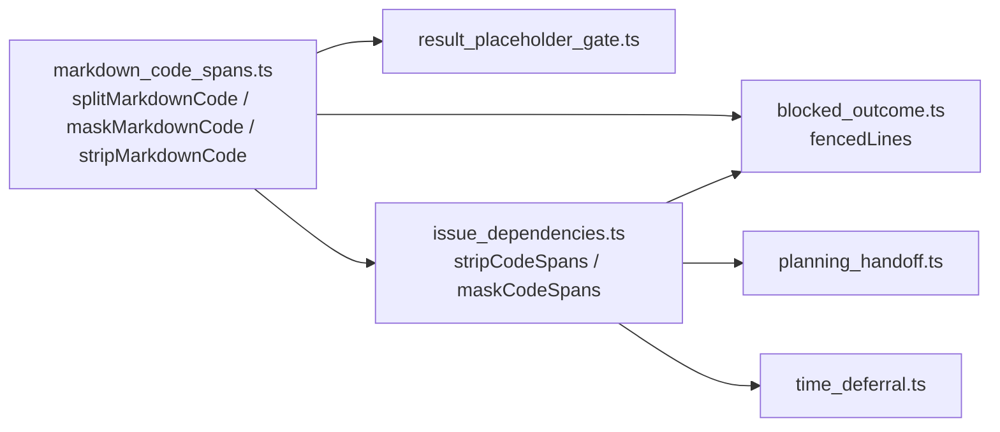

## Summary

Moved the paragraph-aware Markdown code splitter out of
`result_placeholder_gate.ts` into a new shared, exported module,
`worker/deno/lib/markdown_code_spans.ts`. It provides `splitMarkdownCode`
(split), `maskMarkdownCode` (a same-length mask) and `stripMarkdownCode`. The
splitter handles fences, and inline spans that cross lines within a paragraph
and reset at a blank line, an ATX heading, a list-item marker, a GFM table
row, or a setext underline / thematic break — each matched at any
indentation, not CommonMark's 0-3-space limit (PR #3351 review, round 2).
A block-quote marker is different: consecutive `>` lines at the same quote
depth stay one quoted paragraph — the paragraph flushes where the quote
starts, ends or changes depth (a nested `> >` quote opening inside a `>`
quote), and also where the quoted content itself is a blank line, list item,
heading, table row or break, not on every plain `>` line — so a span may
still wrap across consecutive quoted lines that are themselves one paragraph,
matching the base `result_placeholder_gate` splitter's behaviour for that
case (PR #3351 review, rounds 2–4).
`result_placeholder_gate.ts`, `stripCodeSpans` / `maskCodeSpans` in
`issue_dependencies.ts`, and `fencedLines` in `blocked_outcome.ts` now call
it. No per-line `` /`[^`\n]*`/g `` regex is left in `worker/deno/lib` code.
CODING-STANDARDS.md **Writing a gate over text** now names the shared
helper. Closes #3313.

`branch_outcomes_gate.ts` is only partly covered. The per-line
`blankLineCitationNames` the issue cites exists only on the unmerged PR #3312
(Issue #3288). At this head, `branch_outcomes_gate.ts` pairs no backticks, so
there is nothing in it to repoint. Once this lands, #3312 should call
`maskMarkdownCode` instead of pairing backticks itself.

## Spec

### Intent and Rationale

- Every new Markdown gate re-derived "which characters are inside code?". The only correct answer was private, so authors fell back to the easy per-line regex, which is wrong for hard-wrapped spans. Exporting the owner fixes the DRY gap at its root. Prose in the standards alone had already failed once.

### Essential Design Decisions

- The mask keeps the text's length and every `\n` in place, so a match index in the masked text is the same index in the original (`execMarkerOutsideCode` relies on this).
- `stripCodeSpans` / `maskCodeSpans` keep their names and signatures, so their callers (`blocked_outcome.ts`, `planning_handoff.ts`, `time_deferral.ts`, the dependency extractors) are unchanged.
- Fences now follow one rule everywhere: a closer uses the opener's character, is at least as long, and has no info string. An unclosed fence still runs to the end of the text (fail safe). `blocked_outcome.ts`'s `fencedLines` uses the same `parseFenceLine` / `isClosingFence`, so its section scan and `stripCodeSpans` still agree.
- `splitInlineSpans` finds each run's closer through a precomputed next-run-of-the-same-length index, so it is linear. The old forward scan from each opener was quadratic on hostile input, and the helper now runs on untrusted issue bodies on the claim path.
- (Round 2) `ATX_HEADING_RE` / `LIST_ITEM_RE` / `BLOCK_QUOTE_RE` widened from `^ {0,3}` to `^[ \t]*`, matching `parseFenceLine`'s own indentation rule: a nested or tab-indented list item still ends a paragraph. The new `TABLE_ROW_RE` (`^[ \t]*\|`) and `SETEXT_OR_THEMATIC_BREAK_RE` (`^[ \t]*([=*_-])\1*[ \t]*(?:\r?\n)?$`) do the same for a GFM table row and a setext underline / thematic break. The trailing `(?:\r?\n)?` is needed because `splitMarkdownCode`'s lines keep their own line terminator — `$` alone never matched a line still carrying one, which the first version of this fix missed and the growth/correctness tests below caught before push.
- (Round 2) Block-quote handling moved out of `startsNewBlock` into its own `inQuote` transition check in `splitMarkdownCode`: the paragraph flushes when a line's quoted state differs from the previous line's, not on every `>` line, so consecutive quoted lines stay one paragraph and a wrapped span still pairs inside one — restoring parity with the base `result_placeholder_gate` splitter for quoted text. (Round 3) That alone let a stray backtick hide a real dependency declared later in the same quote, because the blank-line and `startsNewBlock` checks still tested the raw `>`-prefixed line: the paragraph now also flushes on quoted content that itself opens a new block, by stripping the quote prefix (`stripQuotePrefix`) before those checks run, so a quoted blank line, list item, heading, table row or break still ends the paragraph inside the quote. (Round 4) The boolean `inQuote` still kept a nested quote (`> > ...` after `> ...`) in the outer quote's paragraph, so a stray backtick could hide a real `Depends on #N` / `Parent: #N` in the nested quote. The check now tracks quote *depth* (`quoteDepth`, a linear count of `>` in the `QUOTE_PREFIX_RE` match) and flushes on any change of depth; same-depth lines still join. A shallower line could be a CommonMark lazy continuation, but flushing there is the safe direction — it can only stop a span pairing, never hide prose. `BLOCK_QUOTE_RE` is gone; `quoteDepth` replaces it.

### Undiscoverable Facts

- PR #3312 (`blankLineCitationNames`) is still open and unmerged, so `branch_outcomes_gate.ts` at this head has no span-pairing code to repoint.
- `prompts/coding_guidelines/prompt.md` does not carry the **Writing a gate over text** section, so its twin needed no change.

## Evidence

Backend-only change. No UI files.



- Corpus run over `docs/archive/pr-summaries/` (907 files), comparing the base branch's per-line `maskCodeSpans` with `maskMarkdownCode`: 451 files mask differently, i.e. the per-line rule mis-reads about half the corpus (the issue measured 417 of 834). The shared mask kept every file's length unchanged (0 length mismatches).
- Red against base: with `lib/blocked_outcome.ts` and `lib/issue_dependencies.ts` restored from `origin/main`, `deno test tests/blocked_outcome_test.ts` gave `FAILED | 19 passed | 3 failed` (the three new tests). The executor's run against the old `stripCodeSpans` / `maskCodeSpans` bodies turned all 10 new caller tests red. The growth test failed against the old forward scan (150384 → 2401547 chars took 14 ms → 1008 ms against a 435 ms allowance). A later push (PR #3351 review, round 1) added 4 more caller tests — 1 in `blocked_outcome_test.ts`, 3 in `issue_dependencies_test.ts` — for the heading/list/quote boundary fix, bringing the caller-test count to 14.
- Red against round-1 (PR #3351 review, round 2): `git stash push -- worker/deno/lib/markdown_code_spans.ts` (test files kept), then `deno test tests/issue_dependencies_test.ts tests/blocked_outcome_test.ts tests/result_placeholder_gate_test.ts tests/markdown_code_spans_test.ts` gave `FAILED | 196 passed | 13 failed` — exactly the 13 new tests for the nested-list/tab/table/setext/thematic-break widening and the quote-continuation fix. `git stash pop` restored the fix; the same run then gave `0 failed`.
- Red against round-3 (PR #3351 review, round 4): with `worker/deno/lib/markdown_code_spans.ts` restored from the round-3 head (test files kept), `markdown_code_spans_test.ts` gave `FAILED | 40 passed | 2 failed` and `issue_dependencies_test.ts` gave `FAILED | 106 passed | 2 failed` — exactly the 4 new nested-quote evasion tests (nested-quote open and close through `splitMarkdownCode`, and through `extractDependencyReferences` and `hasBackReference`). The 3 new same-depth look-alike tests pass on both, as they should. Restoring the fix gave `0 failed`.
- `grep -rn '`[^`\n]*`' worker/deno/lib` hits only the doc comment in `markdown_code_spans.ts` that describes the old defect.

**Docs sweep** — grep: `splitOutsideCode`, `stripCodeSpans`, `maskCodeSpans`, `maskCode`, `splitInlineSpans`, "fence rule", "one line at a time"; section: `CODING-STANDARDS.md#writing-a-gate-over-text`; updated: `CODING-STANDARDS.md`, the doc comments on `stripCodeSpans` / `maskCodeSpans` (`worker/deno/lib/issue_dependencies.ts`) and `fencedLines` (`worker/deno/lib/blocked_outcome.ts`); `CODING-STANDARDS.md:678` — still true because it records the #3132 history ("paired inline code spans one line at a time"); `worker/deno/lib/issue_dependencies.ts:315` — still true because `stripCodeSpans` still preserves whitespace runs verbatim; no hits in README.md, `docs/` (excluding archive) or prompts.

Related existing rules checked: CODING-STANDARDS.md **Writing a gate over text** (items 1–4) and the issue prompt's "A gate over text catches the variants…" step. The new sentence agrees with both: it narrows the evasion-table item to the shared helper. I applied the rule to this PR's own diff. The only per-line backtick regex left in the diff is the doc comment that quotes the old pattern, and no new code pairs backticks itself.

Issue numbers the diff adds as provenance: #3313: Markdown gates keep pairing inline code spans one line at a time: the correct cross-line splitter is private (VibeCoder#3132, #3312).

## Acceptance Criteria

<!-- vibe-spec-review inputs="diff+issue-body" -->

- **met** — Move the paragraph-aware splitter (fences plus inline spans that may cross lines within a paragraph and reset at a blank line) from `result_placeholder_gate.ts` into a shared, exported module, e.g. `worker/deno/lib/markdown_code_spans.ts`. Give it a split API and a same-length mask API — evidence: `worker/deno/lib/markdown_code_spans.ts`, `worker/deno/tests/markdown_code_spans_test.ts::maskMarkdownCode keeps the same length and newline positions` — reviewer: met
- **partial** — Point `result_placeholder_gate.ts`, `branch_outcomes_gate.ts` and the `issue_dependencies.ts` helpers at it — evidence: `worker/deno/lib/result_placeholder_gate.ts`, `worker/deno/lib/issue_dependencies.ts` — reviewer: missing — reason: the reviewer judged `branch_outcomes_gate.ts` untouched; the per-line `blankLineCitationNames` exists only on unmerged PR #3312, and at this head `branch_outcomes_gate.ts` pairs no backticks, so there is nothing to repoint; #3312 adopts `maskMarkdownCode`
- **partial** — Keep their existing tests green, and add a wrapped-span evasion test and a look-alike test for each caller — evidence: `worker/deno/tests/issue_dependencies_test.ts::extractDependencyReferences - a reference inside a span wrapped across two lines is not a dependency (evasion)`, `worker/deno/tests/blocked_outcome_test.ts::detectBlockedOutcome: a real dependency after a wrapped span is still taken (look-alike)`, existing `worker/deno/tests/result_placeholder_gate_test.ts` wrapped-span tests; full gate passed — reviewer: partial — reason: no `branch_outcomes_gate.ts` tests, for the same reason as above
- **met** — In CODING-STANDARDS.md **Writing a gate over text** (and its injected twin in `prompts/coding_guidelines/prompt.md`, if it carries the section), add one sentence — evidence: `worker/deno/tests/text_gate_matcher_3149_test.ts::CODING-STANDARDS.md Writing a gate over text points at the shared Markdown code-span helper (Issue #3313)` — reviewer: met
- **met** — `grep -rn` finds no per-line span regex outside the shared module — evidence: grep output above (only the shared module's own doc comment) — reviewer: met
- **partial** — Future review-fleet-prs rounds on new Markdown gates no longer report "pairs backticks one line at a time" findings — evidence: `CODING-STANDARDS.md` sentence plus exported helper — reviewer: partial — reason: only future review rounds can show this, and #3312 still has to adopt the helper
- **unrequested** — `splitInlineSpans` made linear, with a growth test — reviewer: unrequested — reason: the helper now runs on untrusted issue bodies on the claim path, where the old forward scan was measurably quadratic
- **unrequested** — evasion/look-alike tests for `planning_handoff.ts` and `time_deferral.ts`, and `fencedLines` moved onto the shared fence rule — reviewer: unrequested — reason: they call `maskCodeSpans` / `stripCodeSpans` indirectly and change behaviour with them; `fencedLines` had to follow the shared fence rule or it would disagree with `stripCodeSpans`

## Standards Review

<!-- vibe-standards-review inputs="diff+CODING-STANDARDS.md" -->

- **violation** — a wall-clock growth test was not registered in `PARALLEL_UNSAFE_TEST_FILES` — evidence: `worker/deno/tests/markdown_code_spans_test.ts:181` — reason: fixed in this diff (added to `WALL_CLOCK_TEST_FILES` in `worker/deno/lib/parallel_unsafe_test_manifest.ts`)
- **clean** — review-enforced rules checked: evasion table run both ways, no silent pass on unread input, compare like with like, documentation-drift test scoping, named tests exist, no in-repo helper re-implemented, stub/fake mirroring (not applicable), workflow validator (not applicable); no existing assertion removed

## Test Plan

- `worker/deno/tests/markdown_code_spans_test.ts` — 42 tests (23 round 1 + 10 round 2 + 6 round 3 + 3 round 4): round-trips, wrapped span, blank-line/heading/list/quote reset, look-alike, fence variants including the lone-CR and growth cases, mask/strip, unmatched run, linear growth, plus (round 2) a 4-space nested list item, a tab-indented list item, a table row, a setext underline, a thematic break, a span pairing across two consecutive block-quote lines, a quote-entry/exit reset, and three growth tests (long non-matching indent, long leading-whitespace-before-quote run, long dash run rejected by a trailing character); plus (round 3) a quoted blank line, a quoted list item, an HTML comment line, a multi-line HTML comment, a stray backtick before an HTML comment, and a growth test on a long block-quote-prefix run; plus (round 4) a nested quote opening, a nested quote closing, and a span pairing across two lines at the same nested depth.
- Added wrapped-span evasion and look-alike tests in `worker/deno/tests/issue_dependencies_test.ts`, `worker/deno/tests/blocked_outcome_test.ts` (plus the "```md closer" fence test), `worker/deno/tests/planning_handoff_test.ts` and `worker/deno/tests/time_deferral_test.ts`. All 10 went red against the base branch's per-line helpers. PR #3351 review round 1 added 4 more — 1 in `blocked_outcome_test.ts`, 3 in `issue_dependencies_test.ts` — bringing the caller-test count to 14. PR #3351 review round 2 added 7 more: a nested-list, table-row, setext and quote-wrap evasion test plus a combined look-alike test in `issue_dependencies_test.ts`, a nested-list `declaredHeadingOnly` test in `blocked_outcome_test.ts`, and a quote-wrap look-alike test in `result_placeholder_gate_test.ts` — bringing the caller-test count to 21. PR #3351 review round 3 added 5 more: a quoted-blank-line evasion test through `hasBackReference`, a quoted-blank-line, a quoted-list-item and an HTML-comment evasion test through `extractDependencyReferences` (all in `issue_dependencies_test.ts`), and a stray-backtick-before-an-HTML-comment-marker evasion test through `hasPlanningRequestMarker` in `planning_handoff_test.ts` — bringing the caller-test count to 26. PR #3351 review round 4 added 4 more in `issue_dependencies_test.ts`: a nested-quote evasion test and a same-depth nested-quote look-alike test through each of `extractDependencyReferences` and `hasBackReference` — bringing the caller-test count to 30.
- Added a drift test in `worker/deno/tests/text_gate_matcher_3149_test.ts`. `deno task drift-pins-on-base origin/main CODING-STANDARDS.md "Writing a gate over text" ...` reported `absent on base` for both pinned phrases (`markdown_code_spans.ts`, `never pairs backticks with a per-line regex`). Removing the sentence turned the test red.
- Registered the module in `docs/audits/lib-sweep-coverage/top-up-3313.json`.
- No existing test assertion was removed.
- Current per-file counts: `markdown_code_spans_test.ts` 42 passed, `issue_dependencies_test.ts` 108 passed, `blocked_outcome_test.ts` 24 passed, `result_placeholder_gate_test.ts` 52 passed, `planning_handoff_test.ts` 19 passed, `time_deferral_test.ts` 27 passed — all 0 failed.
- `./quality.sh < /dev/null` was not run in round 4: the session that made the round-4 fix could not reach `jsr.io` or `deno.land`. The six suites above ran against local stand-ins for `@std/assert` / `@std/crypto` / `@std/yaml`, and `deno fmt --check` and `deno lint` passed on the three changed files; CI runs the full gate.

**Branch outcomes:**

- `worker/deno/lib/markdown_code_spans.ts:110` — no later run of the same length (`-1`) — `worker/deno/tests/markdown_code_spans_test.ts::splitMarkdownCode: an unmatched run is literal prose` — always returning `-1` turned the wrapped-span tests red (no span is ever paired)
- `worker/deno/lib/markdown_code_spans.ts:123` — opener with no closer is literal text — `worker/deno/tests/markdown_code_spans_test.ts::splitMarkdownCode resets an unclosed span at a blank line` — moved code, behaviour unchanged from `result_placeholder_gate.ts`, covered as before by `worker/deno/tests/result_placeholder_gate_test.ts`
- `worker/deno/lib/blocked_outcome.ts:150` / `:159` — fence opened / closed only by a same-character, at-least-as-long closer with no info string — `worker/deno/tests/blocked_outcome_test.ts::detectBlockedOutcome: a fence 'closed' by a '```md' line keeps the following heading fenced` — the base branch's any-same-character close rule turned it red
- `worker/deno/lib/issue_dependencies.ts` `stripCodeSpans` / `maskCodeSpans` delegation — `worker/deno/tests/issue_dependencies_test.ts::extractDependencyReferences - a real dependency after a wrapped span is still found (look-alike)`, `worker/deno/tests/planning_handoff_test.ts::hasPlanningRequestMarker - a real marker between a wrapped span's close and a later span on the same line is honoured` — restoring the per-line bodies turned all 10 caller tests red

- `worker/deno/lib/markdown_code_spans.ts` `startsNewBlock` (table row / setext-or-thematic-break arms) — a 4-space nested list item, a table row, a setext underline and a thematic break each end the paragraph — `worker/deno/tests/markdown_code_spans_test.ts::splitMarkdownCode resets an unclosed span at a 4-space nested list item` (and the table-row / setext-underline / thematic-break siblings); reverting the widened `ATX_HEADING_RE` / `LIST_ITEM_RE` / `BLOCK_QUOTE_RE` and removing `TABLE_ROW_RE` / `SETEXT_OR_THEMATIC_BREAK_RE` (via `git stash` on the lib file) turned all of these red
- `worker/deno/lib/markdown_code_spans.ts` quote-depth check (`lineQuoteDepth !== currentQuoteDepth`, round 4; was the boolean `isQuoteLine !== inQuote`) — consecutive `>` lines at the same depth stay one paragraph; entering/leaving a quote, or changing depth, flushes — `worker/deno/tests/markdown_code_spans_test.ts::splitMarkdownCode resets an unclosed span where a nested quote opens` (and `::...where a nested quote closes`) went red against the boolean check; the remaining tests on this line — `worker/deno/tests/markdown_code_spans_test.ts::splitMarkdownCode: a span still pairs across two consecutive block-quote lines` (pairs) and `::splitMarkdownCode still resets an unclosed span where a quote begins or ends` (flushes); the same stash turned both red

Callers checked for the changed helpers: `blocked_outcome.ts`, `planning_handoff.ts`, `time_deferral.ts`, and `extractSubIssueReferences` / `extractDependencyReferences` / `hasBackReference` in `issue_dependencies.ts`. Each still receives a string of the same shape: stripped prose, or a mask the same length as the input.

🤖 Generated with [Claude Code](https://claude.com/claude-code)
