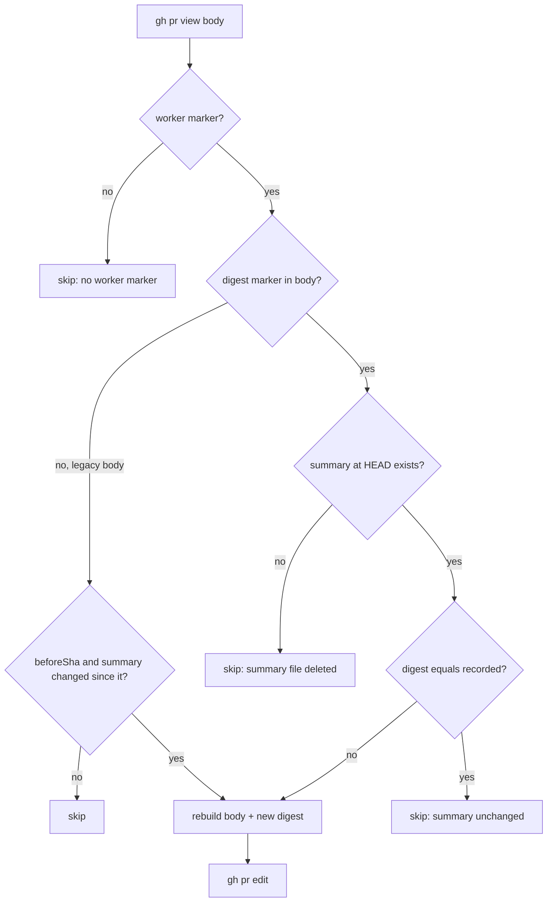

# PR Summary — Issue #3315

## Summary

On stSoftwareAU/GRQ#5175 the PR body kept describing the first iteration even though later pushes had rewritten `pr-summary-5167.md`. The PR body sync only rebuilt the body when *the current run's own push* changed the summary file (a `git diff <beforeSha> HEAD` check). Once a summary change landed without a sync, every later run reported "summary unchanged", and the review sent the PR back over the same body finding each round.

This PR records a SHA-256 digest of the summary in the body as `<!-- vibe-pr-summary sha256="…" -->`. The sync rebuilds the body whenever the summary at HEAD differs from that digest, whichever push changed it. A PR-feedback run now also syncs when it pushed nothing and has no commits left unpushed, so a run that answers a description finding without a push still refreshes the body. The pr_feedback prompt now says how to stop a PR closing its issue: writing `Refs #N` is not enough; mark each unmet criterion `missing`.

Closes #3315.

## Spec

### Intent and Rationale

- Recording a digest makes staleness a property of the body itself, not of one run. Any later sync heals a body that was missed by a human push, by a run that ended on a path with no sync, or by a processor with no sync call. Diffing against one pre-push SHA can only catch a change made by the run doing the diff.
- An unconditional rebuild was rejected because it would overwrite the body on every fix run, even when the summary is unchanged.

### Essential Design Decisions

- The marker sits directly after `<!-- vibe-worker-issue-N -->`. `summaryDigestFromBody` reads the **last** valid marker, because the summary opens the body and could quote an earlier one.
- Persisted-shape choice: **read the old shape**. A body without the digest marker (any PR raised before this change) keeps the old `beforeSha` diff rule exactly. The existing `baseBody()` sync tests are those old-shape tests.
- The feedback processor syncs after a no-push run only when `finalUnpushedCount === 0`. With unpushed commits or an unmeasured count, the local summary may not be on the remote.
- The marker follows the canonical `vibe-*` grammar (`key="value"`), so `marker_grammar_test.ts` (Issue #842) accepts it without a declared deviation.

### Undiscoverable Facts

- From the GRQ#5175 history on GitHub: `a6df76b4` was committed from a human laptop (committer `Nigel@Laptop`), so no worker run existed that could sync. `40ea1419` came from worker run `vibe-muwnll3g-735ee6` and was followed by no worker reply. The next fleet push, `2dc0719f`, came from the spelling processor, which has no sync call. The GRQ host's worker log was not reachable from this host, so the exact exit path of the `40ea1419` run is undiagnosed. The digest gate heals the body whatever that path was.
- Bodies raised before this change heal only once a run whose push changes the summary syncs them and so writes the digest.
- A separate cause of the same loop on GRQ#5175 was filed as #3350: the leading "Degraded run" banner is copied forward unconditionally and cannot be edited from the summary.

## Evidence

Backend/CLI change; no UI files touched.

- Issue numbers cited in the diff: #3089: the original PR body re-sync issue (cited as before); #3315: this issue; #3177: missing-criterion close guard (existing behaviour the prompt now explains).
- The prompt claim that `Closes #N` is appended unless a closing keyword is present is backed by `ensurePrReferencesIssue` (`worker/deno/lib/pr_body.ts`). The `Part of #N` / `## Not closing #N` behaviour is backed by `assemblePrBody`, `withholdIssueClose` and `buildMissingCriteriaPrNote` (`worker/deno/lib/missing_criterion_close_guard.ts`).
- Related rules checked: the "Keep the PR summary true to the head" rule in `prompts/pr_feedback/prompt.md` (its rebuild sentence was edited to agree); the rebuild sentences in `prompts/ci_fix/prompt.md` and `prompts/merge_conflict/prompt.md` ("After your push the worker rebuilds…") are still true and were left alone. I applied the new prompt rule to this PR's own diff: this PR closes its issue, so no criterion needed `missing`, and nothing it would flag was found.
- **Docs sweep** — grep: `rebuil\w* the (PR|pull request) description`, `re-sync\w*`, `resync\w*`, `pr_body_sync`, "when that push changed"; section: `docs/workflows/pr-feedback.md#every-finding-ends-fixed-or-rebutted-issue-2917`; updated: `docs/USAGE.md`, `docs/workflows/pr-feedback.md`, `docs/workflows/ci-fix.md`, `docs/workflows/merge-conflicts.md`, `docs/INTERNALS.md`, `prompts/pr_feedback/prompt.md`; `prompts/ci_fix/prompt.md:96` and `prompts/ci_fix/prompt.md:112` — still true because a verified CI-fix push still triggers a rebuild; `prompts/merge_conflict/prompt.md:123` — still true for the same reason; `docs/workflows/issue-processing.md:1051` — still true because it describes what the assembly does during a re-sync, not when one runs

## Test Plan

- `worker/deno/tests/pr_body_sync_test.ts` — added:
  - `assemblePrBody - records the summary digest marker right after the worker marker`
  - three `prSummaryDigest - …` tests
  - three `summaryDigestFromBody - …` tests (no marker, malformed marker, last occurrence wins)
  - `sync - recorded digest of an OLDER summary, no before-push SHA, git stub reports unchanged: still updates` (GRQ#5175 regression; asserts no `git diff` call)
  - `sync - recorded digest equals the current summary's digest: skips even though the git stub reports changed`
  - `sync - round trip: a body produced by one sync is skipped as unchanged by the next`
  - `sync - recorded digest present and summary file deleted: skips without editing`
- `worker/deno/tests/pr_feedback_processor_test.ts` — added `processPrFeedback - does not sync the PR body when commits are left unpushed` and `processPrFeedback - does not sync the PR body when the final commit-and-push failed`. Renamed `processPrFeedback - does not sync the PR body when nothing was pushed` to `processPrFeedback - syncs the PR body when nothing was pushed and nothing is left unpushed (Issue #3315)`.
- `worker/deno/tests/missing_criterion_close_guard_3177_test.ts` — only adds the new required `summaryDigest` input to its three `assemblePrBody` calls.
- Removed assertions:
  - `assertEquals(syncCalled, false);` in the renamed feedback test. It is now `assertEquals(syncCallCount, 1);`, because #3315 names "`hasChanges` being false" as a path the sync must cover.
  - `reason: "body already current",` in `sync - keeps a leading degraded-run section (Issue #2562)`. It is now `reason: "summary unchanged"`, because the second sync stops at the new digest check (#3315) before the body comparison. The test still asserts a skip with no edit.
- Red runs: an executor reverted each change on purpose and confirmed the tests went red, then restored it. With the digest branch ignored, the older-digest regression test and the digest-present/deleted test failed. With the old feedback condition, the renamed test failed. Dropping `finalUnpushedCount === 0` made both no-sync tests fail.
- `deno test -A tests/pr_body_sync_test.ts tests/marker_grammar_test.ts tests/missing_criterion_close_guard_3177_test.ts` — 39 passed. `deno test -A tests/pr_feedback_processor_test.ts` — 41 passed.
- `./quality.sh` on the final code head — `Result: PASSED (with skipped checks)` (config integration skipped: no `.config.json` on this host).

**Branch outcomes:**

- `worker/deno/lib/pr_body_sync.ts:371`, no digest marker (legacy body): the old `beforeSha` gate applies. Reached by the existing `sync - no before-push SHA: skips without editing` and `sync - summary unchanged: skips without editing`. Ignoring the digest makes the older-digest test go red.
- `worker/deno/lib/pr_body_sync.ts:371`, digest marker present: `git diff` is skipped. Reached by `sync - recorded digest of an OLDER summary, no before-push SHA, git stub reports unchanged: still updates`. Forcing the legacy path turned it red.
- `worker/deno/lib/pr_body_sync.ts:420`, digest equal: skip "summary unchanged". Reached by `sync - recorded digest equals the current summary's digest: skips even though the git stub reports changed` and the round-trip test.
- `worker/deno/lib/pr_body_sync.ts:420`, digest differs: rebuild. Reached by the older-digest regression test.
- Digest present but summary deleted: skip. Reached by `sync - recorded digest present and summary file deleted: skips without editing`. Forcing the legacy path turned it red.
- `worker/deno/lib/pr_feedback_processor.ts:1359`, nothing pushed and nothing unpushed: sync runs. Reached by `processPrFeedback - syncs the PR body when nothing was pushed and nothing is left unpushed (Issue #3315)`. Restoring the old condition turned it red.
- Commits left unpushed: no sync. Reached by `processPrFeedback - does not sync the PR body when commits are left unpushed`. Dropping `finalUnpushedCount === 0` turned it red.
- Commit-and-push failed (count unmeasured): no sync. Reached by `processPrFeedback - does not sync the PR body when the final commit-and-push failed`. Dropping `finalUnpushedCount === 0` turned it red.
- A verified push still syncs, and a gated-head fix branch still does not. Covered by the existing `processPrFeedback - syncs the PR body once after a verified push` and `processPrFeedback - does not sync the PR body on a gated-head fix branch`.

Callers checked for the new required `summaryDigest` input of `assemblePrBody`: `completion_phase.ts` (PR creation) passes the digest of its summary content, and `syncPrBodyFromSummary` passes the digest of the summary at HEAD. The CI and merge-conflict processors pick up the digest gate through `syncPrBodyFromSummary`, and their call conditions are unchanged. The spelling processor still has no sync call; with this change, the next sync-calling run heals what it leaves stale.

🤖 Generated with [Claude Code](https://claude.com/claude-code)
