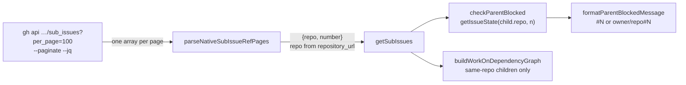

# PR Summary — Issue #3319: resolve every native sub-issue, each in its own repo

## Summary

Closes #3319

`uncachedIssueFetcher().getSubIssues` read `repos/<repo>/issues/<n>/sub_issues`
without pagination. It therefore saw only the first 30 children. It also kept
only `.number`, so a cross-repo child was checked against the parent repo's
issue with the same number. As a result, `checkParentBlocked` could clear a
parent that still had open children.

- [x] `fetchNativeSubIssueRefs` (`worker/deno/lib/native_sub_issues.ts`) reads every page with `per_page=100 --paginate`. It keeps each child's repo, taken from `repository_url`, and falls back to the parent repo when the URL is absent or malformed. It parses one array per line and throws on a malformed page.
- [x] `getSubIssues` now returns `SubIssueRef {repo, number}`. `checkParentBlocked` resolves each child in its own repo, and only a same-repo child may use the open-state map.
- [x] `buildWorkOnDependencyGraph` links only same-repo children. `isDependencyBlocked` records the child's own repo.
- [x] `formatParentBlockedMessage` renders a cross-repo child as `owner/repo#N`.
- [x] `check_parent_dependencies` and `diagnose_issue` were adapted to `SubIssueRef`.
- [x] Tests and the docs update in `docs/GH-API-OPTIMISATION.md`.

## Evidence

Real `gh` behaviour this PR relies on, observed on 2026-10-06:

- `gh api --paginate "repos/stSoftwareAU/VibeCoder/issues/3013/sub_issues?per_page=4"` returned all 6 children (#3031–#3036).
  - With `--slurp`, the page sizes were `[4, 2]`, which proves pagination crosses the page boundary.
- `gh api --paginate --slurp --jq …` is refused with "the `--slurp` option is not supported with `--jq` or `--template`".
  - `--paginate --jq '[…]'` prints one JSON array per page, one per line. The parser therefore reads line by line, just as `parseMarkerCommentPages` does.
- Each sub-issue carries `repository_url: "https://api.github.com/repos/stSoftwareAU/VibeCoder"`. That field is the source of the child's repo.
- `gh_timeout.ts` gives an argv that contains `--paginate` the 300 s timeout.

**Callers checked** (the `getSubIssues` return type changed from `number[]` to `SubIssueRef[]`):

- `checkParentBlocked`, `buildWorkOnDependencyGraph` and `isDependencyBlocked` were updated as described above.
- `commands/check_parent_dependencies.ts` and `lib/diagnose_issue.ts` were adapted. The cached fetcher in `issue_finder_common.ts` passes the refs through.
- `formatParentBlockedMessage` is called only from `checkParentBlocked`.
- `fetchNativeSubIssueNumbers` is unchanged, as are its callers `planning_processor.ts` and `failure_detection_resume.ts`.

**Fakes:** the fetcher fakes in the touched tests now return `SubIssueRef[]`. They stand in for `uncachedIssueFetcher().getSubIssues`, and the property relied on is "returns `{repo, number}` for every child across every page". The argv test runs `fetchNativeSubIssueRefs`, the production path, against a stubbed `gh` that prints two page lines.

**Docs sweep:**

- `docs/GH-API-OPTIMISATION.md` (~L287–297) was updated. The bullet that banned `--paginate` with `--jq` now describes the one-array-per-page parse and cites `parseMarkerCommentPages` and `parseNativeSubIssueRefPages`.
- `DESIGN-PRINCIPLES.md` L1121–1141 is still true. It describes `fetchNativeSubIssueNumbers`, which is unchanged.
- `docs/audits/security-sweep-1218-commands-cli.md` is a historical audit and is left as written.
- The `has_open_sub_issues` reference in `docs/INTERNALS.md` describes legacy bash and does not touch this path.

**Overlapping rules checked:**

- The GH-API-OPTIMISATION rule "never combine `--paginate` with `--jq`" conflicted with the existing `parseMarkerCommentPages` pattern and with this change. It was reworded in this diff to allow the `--jq` path when the payload is parsed one array per line and a malformed line throws.
- I applied that rule to this PR's own diff. `fetchNativeSubIssueRefs` parses per line and throws on a malformed line, and nothing in the diff parses the whole payload as one array.

## Test Plan

- `deno task test:unit` on the touched test files: 221 passed, 0 failed.
- `./quality.sh < /dev/null` passes.
- Regression: `worker/deno/tests/issue_fetcher_sub_issues_test.ts` "checkParentBlocked - a parent with more than 30 children is not truncated, across paginated pages (Issue #3319)" fails against the base single-page read. The open #135 sits on page 2.

Branch outcomes:

- `worker/deno/lib/issue_dependencies.ts:528`: the child is resolved via `getIssueState(child.repo, …)`.
  - Tests: "checkParentBlocked resolves a cross-repo child against its own repo, not the parent's same-numbered issue" and "checkParentBlocked blocks on an open cross-repo child, and the message names its own repo" in `worker/deno/tests/cross_repo_dependency_gate_test.ts`.
  - Flipping the call to `repo` turned 4 tests red.
- `worker/deno/lib/issue_dependencies.ts:523`: the open-state map answers only for a same-repo child.
  - Test: "checkParentBlocked's same-repo open-state map never answers for a cross-repo child" in `worker/deno/tests/cross_repo_dependency_gate_test.ts`.
  - Dropping the `sameRepo &&` guard turned it red.
- `worker/deno/lib/issue_dependencies.ts:903`: a cross-repo child is skipped in the work-on graph.
  - Test: "buildWorkOnDependencyGraph - a cross-repo child with the same number as a set member is not linked (Issue #3319)" in `worker/deno/tests/issue_dependency_cycles_test.ts`.
  - Removing the guard turned it red.
- `worker/deno/lib/issue_dependencies.ts:938`: `refLabel` renders `#N` for a same-repo child and `owner/repo#N` for a cross-repo child, matching case-insensitively.
  - Tests: the three `formatParentBlockedMessage … (Issue #3319)` tests in `worker/deno/tests/issue_dependencies_test.ts`.
  - Always returning `#N` turned them red.
- `worker/deno/lib/issue_finder_common.ts:834`: the blocker records `child.repo`.
  - Test: "isDependencyBlocked records a cross-repo child blocker with the child's own repo" in `worker/deno/tests/cross_repo_dependency_gate_test.ts`.
  - Pushing `repo` instead turned it red.
- `worker/deno/lib/native_sub_issues.ts:124` and `:126`: the repo falls back to `parentRepo` when `repository_url` is not a string or does not match.
  - Test: the fallback test (L56) in `worker/deno/tests/native_sub_issue_refs_test.ts`.
  - The case where the URL matches is covered by the L48 test.
- Malformed page line: the parser throws.
  - Test: the L82 test in `worker/deno/tests/native_sub_issue_refs_test.ts`.
- Duplicate child across pages, matched case-insensitively: the duplicate is dropped.
  - Test: the L70 test in `worker/deno/tests/native_sub_issue_refs_test.ts`.
- `--paginate` and `per_page=100` are in the argv (`native_sub_issues.ts:208`).
  - Tests: "fetchNativeSubIssueRefs - queries the paginated sub_issues endpoint with a jq filter" and the >30-children test.
  - Dropping `--paginate` turned both red.
- An invalid slug or issue number returns `[]` without calling `gh`.
  - Test: "fetchNativeSubIssueRefs - issue number 0 returns [] without calling gh" and the L129 slug test.
- A `gh` failure propagates out of `fetchNativeSubIssueRefs`.
  - Test: "fetchNativeSubIssueRefs - a throwing gh propagates the throw".
- Regex on untrusted `repository_url`: the hostile-input test (L86) uses `assertLinearGrowth`.
  - Swapping in a backtracking pattern turned it red.

## Security self-check

- [x] Input validation: the repo slug and issue number are validated before `gh` is called. A `repository_url` that does not match the anchored pattern falls back to the parent repo.
- [x] No secrets or hidden files are staged.
- [x] Injection surface: `gh` is called with an argv array, with no shell string.
- [x] Error handling: a `gh` failure or a malformed page throws from `fetchNativeSubIssueRefs`.
- [x] No new dependencies.

## Follow-ups (not in scope)

- `fetchNativeSubIssueNumbers` still reads a single page, capped at 100 children. Its callers are `planning_processor.ts` and `failure_detection_resume.ts`.
- `getSubIssues` keeps its existing fail-open behaviour: a fetch error returns `[]`.

🤖 Generated with [Claude Code](https://claude.com/claude-code)
