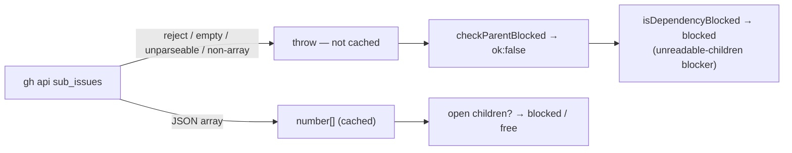

# PR Summary — Issue #3321

## Summary

Closes #3321.

If the native sub-issues lookup failed, the claim scan's parent/child gate used
to fail open. `getSubIssues` read a failed `gh api …/sub_issues` call, empty
output or unparseable output as `[]`, and also cached that `[]`. A parent whose
children could not be read therefore looked childless and could be claimed
before its children. The gate now fails closed:

- `getSubIssues` **rejects** on a failed call, empty or whitespace-only output,
  unparseable JSON, or a non-array response. The error names `repo#issue`.
- A rejected lookup is never written to the cache, because `cached()` writes
  only after `read()` resolves.
- A genuine `[]` still returns `[]`.
- `isDependencyBlocked` treats `checkParentBlocked` returning `{ ok: false }`
  as **blocked**. When it collects blockers, it records a new
  `unreadable-children` blocker, which `describeDependencyBlockers` renders as
  "sub-issues of #N could not be read (treated as blocked)".
- `diagnose-repo` now summarises through a pure, tested
  `summariseDependencyBlockers` helper, which puts an `unreadable-children`
  blocker under "Unmet dependencies" instead of dropping it through the old
  `kind === "depends-on"` filter. `diagnose-repo` itself reads sub-issues
  through `createDiagnosticIssueFetcher` (`worker/deno/lib/diagnose_issue.ts`),
  whose body-based `getSubIssues` still answers `[]` on a failure and is not
  changed here, so today that command does not produce the blocker on a live
  lookup failure.

Pagination and cross-repo children remain out of scope; #3319 covers them.

- [x] `getSubIssues` throws on every lookup failure and never caches one
- [x] `isDependencyBlocked` fails closed on `ok:false`, and diagnostics name the
  hold
- [x] Regression tests are red on base and green on head
- [x] Docs updated
- [x] `./quality.sh` passed (config integration SKIPPED, as on every local run)

## Spec

### Problem

`getSubIssues` (`worker/deno/lib/issue_finder_common.ts`) returned `[]` in
several cases: when `gh` threw, when the output was empty, and when parsing
failed. `checkParentBlocked` then reported the parent as unblocked, and
`isDependencyBlocked` ignored an `ok:false` result entirely. A transient API
failure therefore let a parent be claimed ahead of its open children, and the
cached `[]` kept that wrong answer alive for the cache TTL.

### Change

- `getSubIssues` throws a contextual error for each failure shape and keeps
  answering `[]` only for a genuine empty array.
- `isDependencyBlocked` returns `true` on `ok:false`. With a `blockers` array,
  it pushes `{ kind: "unreadable-children", number: <the parent> }` instead,
  and the forward-dependency check still runs.
- `DependencyBlocker.kind` gains `"unreadable-children"`.
  `describeDependencyBlockers` renders it.
- `summariseDependencyBlockers` (`worker/deno/lib/diagnose_repo.ts`) builds the
  diagnose-repo "Open sub-issues" and "Unmet dependencies" fields. It is called
  from `worker/deno/commands/diagnose_repo.ts`.

### Out of scope

- Sub-issue pagination and cross-repo children are tracked in #3319.
- The `subCache` per-scan memo in `issue_finder_common.ts` memoises a rejected
  promise for the rest of that scan. This is intended: the candidate stays
  consistently blocked within the scan, and the next scan re-fetches.

## Evidence

- Red on base: the new `worker/deno/tests/issue_fetcher_sub_issues_test.ts`
  was run against base `2329d46d` production code with `--no-check`. Result: 9
  failed, 6 passed. The failures were the rejection, not-cached and fail-closed
  tests.
- Green on head: `./quality.sh < /dev/null` gave `Result: PASSED (with skipped
  checks)`. The deno tests passed; config integration was SKIPPED.

**Docs sweep** — grep: `sub_issues`, `getSubIssues`, `checkParentBlocked`, `isDependencyBlocked`, `buildWorkOnDependencyGraph`, `describeDependencyBlockers`, `diagnose-repo`, "Unmet dependencies", "Open sub-issues", `returns? \[\]`, `fail\w* open`; section: `docs/workflows/issue-processing.md#suppression-rules--what-can-knock-out-a-higher-priority-candidate` (item 4, "Dependency blocking"); updated: `docs/workflows/issue-processing.md` (item 4 said the gate "Fails open on API errors", which this change makes false), `docs/INTERNALS.md` (`#-filtering-criteria`, "Parent blocking" row), `docs/CUSTOM-PROMPTS.md` (`#-when-a-labelled-issue-is-dispatched`, "Dependency" row), `docs/GH-API-OPTIMISATION.md` (`#one-cache-key-one-limit-issue-1486`, sub-issues cache note), and the doc comments on `IssueFetcher.getSubIssues`, `DependencyBlocker.kind` and `checkParentBlocked` (`worker/deno/lib/issue_dependencies.ts`) and on `describeDependencyBlockers` and `isDependencyBlocked` (`worker/deno/lib/issue_finder_common.ts`)

Other hits, read and left alone because they stay true:
`docs/INTERNALS.md` `checkParentBlocked()` bullet ("Fails closed");
`docs/INTERNALS.md#-repository-diagnostic-tool-diagnose-repo-deno-command` and
`docs/TROUBLESHOOTING.md` (list "dependencies, sub-issues" generically);
`docs/IDLE-TASK-FRAMEWORK.md:948-953` (forward-dependency fail-safe);
`docs/workflows/planning-and-questions.md:778` (planning's own sub-issue
count, a different reader); `docs/audits/*` (dated audit records). The
`docs/archive/pr-summaries/pr-summary-1218.md` and `pr-summary-1697.md` hits
are historical records of earlier PRs and still describe what those PRs did.

## Test Plan

New tests:

- `worker/deno/tests/issue_fetcher_sub_issues_test.ts`:
  - `getSubIssues` rejections, naming `owner/repo#100`–`#104`, for a `gh`
    throw, `""`, whitespace, `not json` and `{"message":"Not Found"}`;
  - a genuine `[]` still returns `[]`;
  - a failed lookup is not cached, so `gh` is called twice;
  - `isDependencyBlocked` is true on a throw and on empty output;
  - a `[]` control that is not blocked;
  - an `unreadable-children` blocker plus its `describeDependencyBlockers`
    text.
- `worker/deno/tests/diagnose_repo_test.ts`: three `summariseDependencyBlockers`
  tests, covering unreadable-children, the child/depends-on split, and empty
  input.

**Branch outcomes:**
- `worker/deno/lib/issue_finder_common.ts:598` — error (`gh` call rejects → throws, naming `repo#issue`) — `worker/deno/tests/issue_fetcher_sub_issues_test.ts::getSubIssues - rejects naming the repo#issue when the API call fails (Issue #3321)` — flipped to `return []`, test went red (with 3 others)
- `worker/deno/lib/issue_finder_common.ts:605` — error (empty or whitespace-only output → throws) — `worker/deno/tests/issue_fetcher_sub_issues_test.ts::getSubIssues - rejects naming the repo#issue on empty output` and `::getSubIssues - rejects naming the repo#issue on whitespace-only output` — flipped to `return []`, tests went red
- `worker/deno/lib/issue_finder_common.ts:613` — error (unparseable output → throws) — `worker/deno/tests/issue_fetcher_sub_issues_test.ts::getSubIssues - rejects naming the repo#issue on unparseable output` — flipped to `return []`, test went red
- `worker/deno/lib/issue_finder_common.ts:620` — error (non-array JSON → throws) — `worker/deno/tests/issue_fetcher_sub_issues_test.ts::getSubIssues - rejects naming the repo#issue on a non-array JSON response` — flipped to `return []`, test went red
- `worker/deno/lib/issue_finder_common.ts:625` — success (genuine array → its numbers) — `worker/deno/tests/issue_fetcher_sub_issues_test.ts::getSubIssues - returns the numbers reported by the native sub-issues API` — flipped to map an empty array, test went red
- `worker/deno/lib/issue_finder_common.ts:625` — absent (genuine `[]` → `[]`) — `worker/deno/tests/issue_fetcher_sub_issues_test.ts::getSubIssues - a genuine [] response still returns []` — green on base and head (unchanged outcome)
- `worker/deno/lib/issue_finder_common.ts:598` — error not cached (a rejection is not written by `cached()`) — `worker/deno/tests/issue_fetcher_sub_issues_test.ts::getSubIssues - a failed lookup is not cached; the next call re-fetches (Issue #3321)` — flipped `:598` to `return []` (cacheable), test went red
- `worker/deno/lib/issue_finder_common.ts:882` — fail-closed default (`ok:false`, no `blockers` → `true`) — `worker/deno/tests/issue_fetcher_sub_issues_test.ts::isDependencyBlocked - reports blocked when the parent's sub-issues call throws (Issue #3321)` and `::isDependencyBlocked - reports blocked when the parent's sub-issues call returns empty output (Issue #3321)` — flipped to `return false`, both tests went red
- `worker/deno/lib/issue_finder_common.ts:876` — fail-closed with `blockers` (pushes `unreadable-children`) — `worker/deno/tests/issue_fetcher_sub_issues_test.ts::isDependencyBlocked - collects an 'unreadable-children' blocker when blockers[] is supplied, and describeDependencyBlockers names it (Issue #3321)` — dropped the push, test went red
- `worker/deno/lib/issue_finder_common.ts:884` — success (`ok:true`, not blocked) — `worker/deno/tests/issue_fetcher_sub_issues_test.ts::isDependencyBlocked - a genuine [] sub-issues response with no dependencies is NOT blocked (control for the regression above)` — control, green on base and head
- `worker/deno/lib/issue_finder_common.ts:812` — `unreadable-children` rendering in `describeDependencyBlockers` — `worker/deno/tests/issue_fetcher_sub_issues_test.ts::isDependencyBlocked - collects an 'unreadable-children' blocker when blockers[] is supplied, and describeDependencyBlockers names it (Issue #3321)` and `worker/deno/tests/diagnose_repo_test.ts::summariseDependencyBlockers - an unreadable-children blocker reads as unmet dependencies, not open sub-issues (Issue #3321)` — dropped the push, both tests went red
- `worker/deno/lib/diagnose_repo.ts:236` — non-`child` blockers go to `unmetDependencies` — `worker/deno/tests/diagnose_repo_test.ts::summariseDependencyBlockers - an unreadable-children blocker reads as unmet dependencies, not open sub-issues (Issue #3321)` — restored the old `kind === "depends-on"` filter, test went red
- `worker/deno/lib/diagnose_repo.ts:231` — present (`child` blockers → `openSubIssues`) and absent (none → `undefined`) — `worker/deno/tests/diagnose_repo_test.ts::summariseDependencyBlockers - a child blocker and a depends-on blocker split between the two fields` and `worker/deno/tests/diagnose_repo_test.ts::summariseDependencyBlockers - no blockers leaves both fields undefined` — flipped the guard to `>= 0`, the absent test went red
- `worker/deno/lib/diagnose_repo.ts:238` — absent (no non-`child` blockers → `unmetDependencies` stays `undefined`) — `worker/deno/tests/diagnose_repo_test.ts::summariseDependencyBlockers - no blockers leaves both fields undefined` — flipped the guard to `>= 0`, test went red

Each flip was re-run on 2026-10-06 against the current head in a scratch
worktree with `deno test --no-check -A` over the two test files above
(baseline: 52 passed, 0 failed).

`worker/deno/commands/diagnose_repo.ts` and
`worker/deno/lib/issue_dependencies.ts` add no branch: the command replaces
its inline filters with one call to `summariseDependencyBlockers`, and
`issue_dependencies.ts` changes only the `DependencyBlocker.kind` type and doc
comments. The command's call has no test of its own; the behaviour it
delegates is covered by the `summariseDependencyBlockers` tests above.

Changed test fakes (no assertion was removed or weakened):

- `worker/deno/tests/collect_low_priority_candidates_test.ts` and
  `worker/deno/tests/find_oldest_issue_low_priority_test.ts`.
  - Before: the catch-all `api repos/` branch answered the `sub_issues` call
    with an object (`{ body: … }`), which base silently read as "no children".
  - Now: the fakes return a genuine `"[]"` for `/sub_issues`, matching what
    those tests intended ("no sub-issues"). Without that change, 3 tests failed
    because the parent was now held as unreadable-children. That is the new
    fail-closed behaviour, not a regression.

### Callers checked (narrowed shared helper `getSubIssues`)

The shared fetcher's `getSubIssues` (`worker/deno/lib/issue_finder_common.ts`)
is wrapped by the per-scan `subCache` memo and the TTL `cached()` wrapper in
the same file. Both pass a rejection through unchanged. It has two readers:

- `checkParentBlocked` (`worker/deno/lib/issue_dependencies.ts:471`) calls it
  inside a `try` and returns `{ ok: false }` on a rejection.
  `isDependencyBlocked` (`worker/deno/lib/issue_finder_common.ts`) now fails
  closed on that. `isDependencyBlocked` is called from:
  - `worker/deno/commands/diagnose_repo.ts`
  - `worker/deno/lib/collect_self_diagnostic_candidates.ts`
  - `worker/deno/lib/collect_work_on_candidates.ts`
  - `worker/deno/lib/collect_low_priority_candidates.ts`
  - `worker/deno/lib/collect_idle_task_candidates.ts`
  - `worker/deno/lib/collect_label_candidates.ts`
  - `worker/deno/lib/diagnose_issue.ts`
  - `worker/deno/lib/new_work_eligibility.ts`

  In each scan collector, a blocked result skips the candidate, which is the
  intended hold.
- `buildWorkOnDependencyGraph` (`worker/deno/lib/issue_dependencies.ts:891`)
  calls `fetcher.getSubIssues` itself, inside its own `try`/`catch`, without
  going through `checkParentBlocked`. On a rejection it skips that node's
  parent edges. Before this change the same failure answered `[]`, which also
  added no edges, so the cycle detection reached from
  `worker/deno/lib/collect_work_on_candidates.ts:720` behaves as before.

Separate fetchers, not changed by this diff:

- `worker/deno/commands/check_parent_dependencies.ts` has its own
  `getSubIssues` and already handles `ok:false`.
- `createDiagnosticIssueFetcher` (`worker/deno/lib/diagnose_issue.ts`), used
  by `diagnose-issue` and `diagnose-repo`, has a body-based `getSubIssues` that
  still answers `[]` on a failure, so those diagnostics do not report the
  `unreadable-children` hold for a live lookup failure.

`worker/deno/lib/dependency_chain_promotion.ts`: an `unreadable-children`
blocker names the candidate itself. The visited set is seeded with the
candidate, so chain promotion cannot loop or promote it.

### Guards kept

The fail-closed branch adds no new path to claiming. It only stops one that
used to be reachable. The `blockers` collection path still runs the
forward-dependency check after recording the hold. The early-return path
returns `true` before any claim, so every downstream guard (milestone,
cooldown, needs-human, TOCTOU re-check) still applies to unblocked candidates
as before.

### Related rules checked

- `CODING-STANDARDS.md`: "Never Fail Silently — Fail Loud"; "Narrowing a shared
  helper changes every caller"; "Every outcome of a branch you add needs a
  test"; "A new test must go red without its change"; "A fake mirrors the
  production implementation". The changed fakes now return the real API's
  array shape.
- This PR adds or changes no prompt rule or coding standard. I applied the
  rules above to this PR's own diff and found only the two fakes. They answered
  `sub_issues` with a shape the real API never returns for a success, and both
  are corrected above.

## Reviewer verdicts

- **Spec reviewer:** all three acceptance criteria met. It called the
  `summariseDependencyBlockers` / diagnose-repo wiring borderline scope. It is
  kept because, without it, diagnose-repo's old `kind === "depends-on"` filter
  would silently drop the new `unreadable-children` blocker.
- **Standards reviewer:** no violations. It suggested renaming the local
  `forward` to `unmet` in `summariseDependencyBlockers`. This is optional and
  was not applied.

## Security self-check

- [x] No new input surface; the `gh` arguments are unchanged.
- [x] No secrets or hidden files staged.
- [x] Error messages name `repo#issue` and the parse error only, with no
  tokens.
