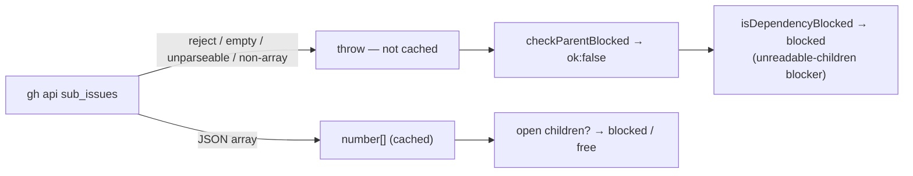

# PR Summary — Issue #3321

## Summary

Closes #3321.

If the native sub-issues lookup failed, the claim scan's parent/child gate used
to fail open. `getSubIssues` read a failed `gh api …/sub_issues` call, empty
output or unparseable output as `[]`, and also cached that `[]`. A parent whose
children could not be read therefore looked childless and could be claimed
before its children. The gate now fails closed:

- `getSubIssues` **rejects** on a failed call, empty or whitespace-only output,
  unparseable JSON, or a non-array response. The error names `repo#issue`.
- A rejected lookup is never written to the cache, because `cached()` writes
  only after `read()` resolves.
- A genuine `[]` still returns `[]`.
- `isDependencyBlocked` treats `checkParentBlocked` returning `{ ok: false }`
  as **blocked**. When it collects blockers, it records a new
  `unreadable-children` blocker, which `describeDependencyBlockers` renders as
  "sub-issues of #N could not be read (treated as blocked)".
- `diagnose-repo` now summarises through a pure, tested
  `summariseDependencyBlockers` helper. The hold appears under "Unmet
  dependencies" and is no longer dropped by the old `kind === "depends-on"`
  filter.

Pagination and cross-repo children remain out of scope; #3319 covers them.

- [x] `getSubIssues` throws on every lookup failure and never caches one
- [x] `isDependencyBlocked` fails closed on `ok:false`, and diagnostics name the
  hold
- [x] Regression tests are red on base and green on head
- [x] Docs updated
- [x] `./quality.sh` passed (config integration SKIPPED, as on every local run)

## Spec

### Problem

`getSubIssues` (`worker/deno/lib/issue_finder_common.ts`) returned `[]` in
several cases: when `gh` threw, when the output was empty, and when parsing
failed. `checkParentBlocked` then reported the parent as unblocked, and
`isDependencyBlocked` ignored an `ok:false` result entirely. A transient API
failure therefore let a parent be claimed ahead of its open children, and the
cached `[]` kept that wrong answer alive for the cache TTL.

### Change

- `getSubIssues` throws a contextual error for each failure shape and keeps
  answering `[]` only for a genuine empty array.
- `isDependencyBlocked` returns `true` on `ok:false`. With a `blockers` array,
  it pushes `{ kind: "unreadable-children", number: <the parent> }` instead,
  and the forward-dependency check still runs.
- `DependencyBlocker.kind` gains `"unreadable-children"`.
  `describeDependencyBlockers` renders it.
- `summariseDependencyBlockers` (`worker/deno/lib/diagnose_repo.ts`) builds the
  diagnose-repo "Open sub-issues" and "Unmet dependencies" fields. It is called
  from `worker/deno/commands/diagnose_repo.ts`.

### Out of scope

- Sub-issue pagination and cross-repo children are tracked in #3319.
- The `subCache` per-scan memo in `issue_finder_common.ts` memoises a rejected
  promise for the rest of that scan. This is intended: the candidate stays
  consistently blocked within the scan, and the next scan re-fetches.

## Evidence

- Red on base: the new `worker/deno/tests/issue_fetcher_sub_issues_test.ts`
  was run against base `2329d46d` production code with `--no-check`. Result: 9
  failed, 6 passed. The failures were the rejection, not-cached and fail-closed
  tests.
- Green on head: `./quality.sh < /dev/null` gave `Result: PASSED (with skipped
  checks)`. The deno tests passed; config integration was SKIPPED.
- Docs sweep: grep run for `sub_issues`, `getSubIssues`, `checkParentBlocked`,
  `returns? \[\]` and `fail\w* open`. Updated:
  - `docs/CUSTOM-PROMPTS.md:374` (Dependency row);
  - `docs/INTERNALS.md:1675` (Parent blocking row);
  - `docs/GH-API-OPTIMISATION.md:219` (sub-issues cache note);
  - the doc comments on `IssueFetcher.getSubIssues`, `DependencyBlocker.kind`
    and `checkParentBlocked` `@returns` (`worker/deno/lib/issue_dependencies.ts`);
  - the doc comments on `describeDependencyBlockers` and `isDependencyBlocked`
    (`worker/deno/lib/issue_finder_common.ts`).

  Remaining hits are `docs/archive/pr-summaries/pr-summary-1218.md` and
  `pr-summary-1697.md`. Both are immutable historical records of earlier PRs
  and still describe what those PRs did, so they are left alone.

## Test Plan

New tests:

- `worker/deno/tests/issue_fetcher_sub_issues_test.ts`:
  - `getSubIssues` rejections, naming `owner/repo#100`–`#104`, for a `gh`
    throw, `""`, whitespace, `not json` and `{"message":"Not Found"}`;
  - a genuine `[]` still returns `[]`;
  - a failed lookup is not cached, so `gh` is called twice;
  - `isDependencyBlocked` is true on a throw and on empty output;
  - a `[]` control that is not blocked;
  - an `unreadable-children` blocker plus its `describeDependencyBlockers`
    text.
- `worker/deno/tests/diagnose_repo_test.ts`: three `summariseDependencyBlockers`
  tests, covering unreadable-children, the child/depends-on split, and empty
  input.

Branch outcomes (each was flipped in a scratch worktree, and the suite went
red):

- `worker/deno/lib/issue_finder_common.ts:598`: the `gh` call rejects and
  `getSubIssues` throws. Reached by "rejects naming the repo#issue when the API
  call fails". The flip to `return []` turned 4 tests red.
- `worker/deno/lib/issue_finder_common.ts:606`: empty or whitespace output
  throws. Reached by "rejects … on empty output" and "… whitespace-only
  output". The flip to `return []` turned 3 tests red.
- `worker/deno/lib/issue_finder_common.ts:614`: unparseable output throws.
  Reached by "rejects … on unparseable output". The flip to `return []` turned
  1 test red.
- `worker/deno/lib/issue_finder_common.ts:621`: a non-array response throws.
  Reached by "rejects … on a non-array JSON response". The flip to `return []`
  turned 1 test red.
- A genuine array returns numbers. Reached by "a genuine [] response still
  returns []" and "returns the numbers reported by the native sub-issues API".
  These existing outcomes are green on base and head.
- Not cached on failure: reached by "a failed lookup is not cached; the next
  call re-fetches". Base cached the `[]` answer, so this test was red on base.
- `worker/deno/lib/issue_finder_common.ts:871`: `ok:false` with no `blockers`
  returns `true`. Reached by "isDependencyBlocked - reports blocked when the
  parent's sub-issues call throws" and "… returns empty output". The flip to
  `false` turned 2 tests red.
- `worker/deno/lib/issue_finder_common.ts:876`: `ok:false` with `blockers`
  pushes `unreadable-children`. Reached by "collects an 'unreadable-children'
  blocker …". Dropping the push turned 1 test red.
- `worker/deno/lib/issue_finder_common.ts:812`: the `describeDependencyBlockers`
  rendering. Reached by the same test and by the diagnose-repo test (a).
  Dropping the loop turned 2 tests red.
- `worker/deno/lib/diagnose_repo.ts:236`: non-child blockers go to
  `unmetDependencies`. Reached by "summariseDependencyBlockers - an
  unreadable-children blocker reads as unmet dependencies". Restoring the old
  `kind === "depends-on"` filter turned 1 test red.
- `worker/deno/lib/diagnose_repo.ts:230` and `:237`, the absent cases (no
  children, no forward blockers): reached by "no blockers leaves both fields
  undefined".

Entry points checked:

- `worker/deno/commands/diagnose_repo.ts` now calls
  `summariseDependencyBlockers`. Reverting the filter inside it went red,
  through test (a) above.

Changed test fakes (no assertion was removed or weakened):

- `worker/deno/tests/collect_low_priority_candidates_test.ts` and
  `worker/deno/tests/find_oldest_issue_low_priority_test.ts`.
  - Before: the catch-all `api repos/` branch answered the `sub_issues` call
    with an object (`{ body: … }`), which base silently read as "no children".
  - Now: the fakes return a genuine `"[]"` for `/sub_issues`, matching what
    those tests intended ("no sub-issues"). Without that change, 3 tests failed
    because the parent was now held as unreadable-children. That is the new
    fail-closed behaviour, not a regression.

### Callers checked (narrowed shared helper `getSubIssues`)

Every reader of `getSubIssues` passes through `checkParentBlocked`, which
already wraps the call in a `Result` and returns `{ ok: false }` on a
rejection:

- `isDependencyBlocked` in `worker/deno/lib/issue_finder_common.ts` now fails
  closed. It is reached from:
  - `worker/deno/commands/diagnose_repo.ts`
  - `worker/deno/commands/collect_self_diagnostic_candidates.ts`
  - `worker/deno/commands/collect_work_on_candidates.ts`
  - `worker/deno/commands/collect_low_priority_candidates.ts`
  - `worker/deno/commands/collect_idle_task_candidates.ts`
  - `worker/deno/commands/collect_label_candidates.ts`
  - `worker/deno/commands/diagnose_issue.ts`
  - `worker/deno/lib/new_work_eligibility.ts`

  In each of them, a blocked result skips the candidate, which is the intended
  hold.
- `worker/deno/commands/check_parent_dependencies.ts` uses its own fetcher and
  already handles `ok:false`.
- `worker/deno/lib/dependency_chain_promotion.ts`: an `unreadable-children`
  blocker names the candidate itself. The visited set is seeded with the
  candidate, so chain promotion cannot loop or promote it.

### Guards kept

The fail-closed branch adds no new path to claiming. It only stops one that
used to be reachable. The `blockers` collection path still runs the
forward-dependency check after recording the hold. The early-return path
returns `true` before any claim, so every downstream guard (milestone,
cooldown, needs-human, TOCTOU re-check) still applies to unblocked candidates
as before.

### Related rules checked

- `CODING-STANDARDS.md`: "Never Fail Silently — Fail Loud"; "Narrowing a shared
  helper changes every caller"; "Every outcome of a branch you add needs a
  test"; "A new test must go red without its change"; "A fake mirrors the
  production implementation". The changed fakes now return the real API's
  array shape.
- This PR adds or changes no prompt rule or coding standard. I applied the
  rules above to this PR's own diff and found only the two fakes. They answered
  `sub_issues` with a shape the real API never returns for a success, and both
  are corrected above.

## Reviewer verdicts

- **Spec reviewer:** all three acceptance criteria met. It called the
  `summariseDependencyBlockers` / diagnose-repo wiring borderline scope. It is
  kept because, without it, diagnose-repo's old `kind === "depends-on"` filter
  would silently drop the new `unreadable-children` blocker.
- **Standards reviewer:** no violations. It suggested renaming the local
  `forward` to `unmet` in `summariseDependencyBlockers`. This is optional and
  was not applied.

## Security self-check

- [x] No new input surface; the `gh` arguments are unchanged.
- [x] No secrets or hidden files staged.
- [x] Error messages name `repo#issue` and the parse error only, with no
  tokens.
