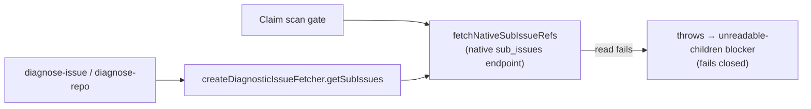

# PR Summary — Issue #3329

## Summary

Closes #3329

`diagnose-issue` and `diagnose-repo` now take an issue's sub-issues from the
native GitHub `sub_issues` endpoint. This is the same read the claim scan's
parent/child gate makes (`fetchNativeSubIssueRefs`). When that read fails,
both commands now report the issue as blocked, as the scan does. Before
this change they parsed task-list checkboxes from the issue body and turned
a failed read into "no sub-issues". So they could call an issue pickable
when the scan was holding it.

- [x] `getSubIssues` delegates to `fetchNativeSubIssueRefs`, and a read error propagates.
- [x] The check 8 suggestion names the gh-access fix when the blocker is `unreadable-children`.
- [x] Tests: the native read, a rejected read, the fail-closed check, and that body checkboxes are ignored.
- [x] Full quality gate passed.

## Spec

### Intent and Rationale

Use one source of truth for "does this parent have open children?". Since
#2470/#3321, the scan reads native sub-issues and fails closed. The
diagnostics must give the same verdict, or operators get a misleading
report.

### Essential Design Decisions

- **Reuse, not copy.** `getSubIssues` calls the scan's own
  `fetchNativeSubIssueRefs` (`worker/deno/lib/native_sub_issues.ts`). Both
  callers therefore share its pagination, parsing and error contract.
- **Fail closed through the existing machinery.** A throwing `getSubIssues`
  is already turned into an `unreadable-children` blocker by
  `isDependencyBlocked` (#3321). The diagnostic only needed to stop
  swallowing the error.
- **`diagnose_repo.ts` is unchanged.** It already builds its fetcher with
  `createDiagnosticIssueFetcher` (L166) and calls `isDependencyBlocked` →
  `summariseDependencyBlockers` (L210-230), so it inherits the fix.
- **Body checkboxes are no longer sub-issues.** The scan ignores them, so
  the diagnostics must too.

### Undiscoverable Facts

These are observed outputs of the real endpoint, made with
`gh api 'repos/stSoftwareAU/VibeCoder/issues/<N>/sub_issues?per_page=100' --paginate --jq '[.[] | {number: .number, repository_url: .repository_url}]'`:

- #938 → `[{"number":1008,"repository_url":"https://api.github.com/repos/stSoftwareAU/VibeCoder"},…1012]`, exit 0.
- #912 → 940–944.
- #3265 → `[]`, although its body lists task-list children. They are not
  native links, which is why body parsing disagreed with the scan.
- #3329 → `[]`.
- #999999 → `gh: Not Found (HTTP 404)`, exit 1. This is the failure that now
  propagates.

The mock in `createMockGh` returns the same one-line JSON array shape.

## Evidence

- `worker/deno/tests/diagnose_issue_test.ts`: 32 passed, 0 failed.
- `worker/deno/tests/diagnose_repo_test.ts`: 37 passed, 0 failed.
- `deno fmt --check`, `deno lint` and `deno check` are clean.
- `./quality.sh`: PASSED, exit 0. The config integration check was SKIPPED;
  every other check passed, including deno tests, lint, type check, fmt,
  markdownlint, mermaid and semgrep.
- **Docs sweep** — grep: `createDiagnosticIssueFetcher`, `getSubIssues`, `extractSubIssueReferences`, `diagnose-issue`, `diagnose-repo`, `diagnose_issue`, `diagnose_repo`; section: `docs/INTERNALS.md#-diagnose-issue-command`, `docs/INTERNALS.md#-repository-diagnostic-tool-diagnose-repo-deno-command`, `docs/TROUBLESHOOTING.md#-worker-not-picking-up-issues`; updated: none — every hit was read and is still true
- Docs sweep notes:
  - No README, `docs/` page, prompt or agent instruction describes how the
    diagnose commands read sub-issues.
  - `docs/audits/security-sweep-2756-commands-setup-delta.md:112` names
    `createDiagnosticIssueFetcher`. It is still true: it describes the
    fetcher's validated reads, not where sub-issues come from.
  - The check 9 comment at `worker/deno/lib/diagnose_issue.ts:486-489` is
    still true, because the outer catch still assumes "not blocked".
- Cited issues:
  - #2470: fix: the week-pace guard parks the backlog even while a fallback
    provider sits idle. Cited by the scan's native-read comment
    (`issue_finder_common.ts:588`), which this code comment points back to.
  - #2533: Apply the cross-milestone dependency hold in the idle-detect
    audit and the diagnose commands.
  - #3321: Claim scan's parent/child gate fails open when the native
    sub-issues lookup errors, so a parent can be claimed before its children.
  - #3329: diagnose-issue / diagnose-repo read sub-issues from the issue body
    and swallow failures, so they disagree with the claim scan's
    parent/child gate.
  - #3333: check-parent-deps reports a parent as having no sub-issues when
    the sub-issues read fails.

## Test Plan

New tests in `worker/deno/tests/diagnose_issue_test.ts`:

- L447 "diagnose_issue - an unreadable sub-issue list fails the dependency
  check closed (Issue #3329)".
- L473 "diagnose_issue - an open native sub-issue blocks the parent (Issue
  #3329)".
- L511 "diagnose_issue - a body checkbox without a native link does not
  block (Issue #3329)".
- L877 "createDiagnosticIssueFetcher - a failed sub-issue read rejects
  (Issue #3329)".
- L885 "createDiagnosticIssueFetcher - sub-issues come from the native
  endpoint (Issue #3329)". It pins the args and `--paginate`.
- L911 "createDiagnosticIssueFetcher - a body task-list checkbox is not a
  sub-issue (Issue #3329)".

**Red on base:** with the base `getSubIssues` restored, all 6 new tests
fail.

**Removed assertions:**

- Removed from `worker/deno/tests/diagnose_issue_test.ts`: `assertEquals(await fetcher.getSubIssues("owner/repo", 7), []);` — #3329 makes a failed sub-issue read reject instead of returning no sub-issues, so the old value is untrue. The replacement is `createDiagnosticIssueFetcher - a failed sub-issue read rejects (Issue #3329)`.
- Removed from `worker/deno/tests/diagnose_issue_test.ts`: `assertEquals( [...subs].sort((a, b) => a.number - b.number), [{ repo: "owner/repo", number: 11 }, { repo: "owner/repo", number: 12 }], );` — #3329 reads sub-issues from the native endpoint, so body task-list checkboxes are no longer sub-issues and the old value is untrue. The replacements are `createDiagnosticIssueFetcher - sub-issues come from the native endpoint (Issue #3329)` and `createDiagnosticIssueFetcher - a body task-list checkbox is not a sub-issue (Issue #3329)`.

Branch outcomes:

- `worker/deno/lib/diagnose_issue.ts:471`, `unreadable-children` blocker
  present → gh-access suggestion. Reached by the L447 test; dropping the
  branch turned it red.
- `worker/deno/lib/diagnose_issue.ts:471`, blocker absent → the existing
  sub-issue and dependency suggestions. Reached by the L473 test.
- `worker/deno/lib/diagnose_issue.ts:177`, `getSubIssues` read fails →
  rejects. Reached by the L877 and L447 tests; red on base.
- `worker/deno/lib/diagnose_issue.ts:177`, read succeeds → native refs.
  Reached by the L885 test; red on base.

**Callers checked:**

- `diagnose_issue` check 8 (`isDependencyBlocked` with this fetcher).
- `worker/deno/commands/diagnose_repo.ts` L166 and L210-230. Its outer
  `catch` ("Dependency check failed — skip") is not reached by a sub-issue
  read failure, because `isDependencyBlocked` converts the read failure into
  a blocker.

**Fakes mirror production:** `createMockGh`'s `/sub_issues` branch stands in
for the gh call that `fetchNativeSubIssueRefs` makes. It always returns the
observed one-line JSON array built from `opts.subIssues`; it has no failure
path. The failing reads come from test-local gh functions instead: the L447
test's wrapper throws `gh: Not Found (HTTP 404)` on `/sub_issues`, and the
L877 test's function rejects every call.

**Follow-up:** the same swallowed failure in
`worker/deno/commands/check_parent_dependencies.ts` (`catch { return []; }`)
is out of scope. Open issue #3333 tracks it.

**Rules applied to this PR's own diff:** I checked the diff against the
fail-loud, docs-sweep, branch-outcome and named-test rules and found
nothing. Every named test path is tracked at the head.

## Security self-check

- No new external input, shell string or path handling. The gh call goes
  through the existing `fetchNativeSubIssueRefs` argv builder.
- No secrets or hidden files are staged.

🤖 Generated with [Claude Code](https://claude.com/claude-code)
