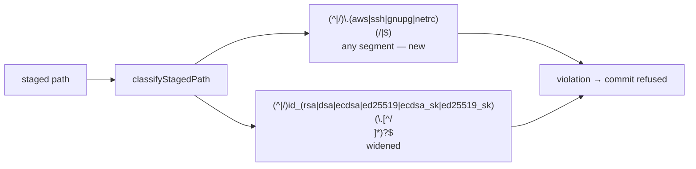

# PR Summary — Issue #3336

## Summary

Closes #3336

The pre-commit safety gate now refuses credential stores at any depth:
`.ssh/`, `.aws/`, `.gnupg/` and `.netrc`. Before this change,
`deploy/.ssh/id_ed25519` and `services/api/.aws/credentials` were
classified as safe. The gate also refuses every OpenSSH default private-key
name, not only `id_rsa`. Those names are `id_dsa`, `id_ecdsa`, `id_ed25519`,
`id_ecdsa_sk` and `id_ed25519_sk`, plus their dotted variants. The shell
hook `hooks/pre-commit` is updated to match.

- [x] A credential-store pattern is added to `FORBIDDEN_STAGED_PATTERNS`, matched as any path segment.
- [x] The key-name pattern is widened to all OpenSSH default names. Its suffix stays bounded (#3323).
- [x] `hooks/pre-commit` uses the same key-name list.
- [x] Classifier tests, look-alike tests, linear-growth tests, a real-repo integration test and hook tests are added.
- [x] CODING-STANDARDS.md, SECURITY.md and the coding_guidelines prompt are updated.
- [x] Full quality gate passed.

## Spec

### Intent and Rationale

These directories and files hold credentials. A nested copy, such as one
committed under `deploy/` or `services/api/`, is as dangerous as one at the
repo root. #3311 already made the dotenv, config and `.secrets/` patterns
match any path segment. This change brings the credential stores into line
with them, and closes the same gap for SSH keys that are not RSA.

### Essential Design Decisions

- **Matched as a whole segment, like #3311.** Each name must be a complete
  segment preceded by `/` or the start of the path. So `docs/ssh/`,
  `my.ssh/`, `x.aws/`, `deploy/.sshrc` and `pkg/.netrc.md` stay safe.
- **Bounded suffix kept.** The key-name pattern keeps `(\.[^/\n]*)?`. The
  form `\..*` backtracks quadratically (#3323). A linear-growth test pins
  this.
- **`.pub` files are refused too.** `id_ed25519.pub` is a violation. That is
  how the base already treated `id_rsa.pub` (`id_rsa.*`), so all key names
  now behave the same. Public keys are rarely meant to be committed. A repo
  that genuinely needs one can rename it.
- **The hook is kept in sync.** `hooks/pre-commit` matches the basename with
  the same name list. The `(\..*)?` there runs in bash's `[[ =~ ]]` on a
  single basename, so the #3323 backtracking concern does not apply.
- **`.gitignore` and `REQUIRED_GITIGNORE_PATTERNS` are unchanged.** The
  issue asks for the gate change only. The enforcer still writes just
  `id_rsa` and `id_rsa.*`. Adding the other key names there would be a
  separate change.

### Undiscoverable Facts

- OpenSSH's `ssh-keygen` writes these default private-key filenames:
  `id_rsa`, `id_dsa`, `id_ecdsa`, `id_ed25519`, `id_ecdsa_sk` and
  `id_ed25519_sk`. The FIDO types use the `_sk` names. Each public key adds
  `.pub` to the name. Source: the FILES section of `ssh-keygen(1)`.
- No path tracked in this repo matches either new pattern. I checked with
  `git ls-files | grep -E …` and got no hits, exit 1. So the wider gate
  refuses nothing that is already committed.

## Evidence

- `worker/deno/tests/pre_commit_safety_test.ts`: 61 passed, 0 failed.
- `worker/deno/tests/hidden_files_safety_integration_test.ts`: 4 passed.
- `worker/deno/tests/hooks_pre_commit_test.ts`: 9 passed.
- `worker/deno/tests/hidden_allowlist_drift_test.ts`: 5 passed.
- coding_guidelines and coding_standards drift tests: 59 passed.
- `bash -n hooks/pre-commit` and shellcheck are clean.
- `./quality.sh`: PASSED, exit 0. The config integration check was SKIPPED.
  Every other check passed, including deno tests, lint, type check, fmt,
  markdownlint, mermaid and semgrep.
- **Docs sweep** — grep: `id_rsa`, `\.ssh`, `\.aws`, `\.gnupg`, `\.netrc`, `credential store`, `FORBIDDEN_STAGED_PATTERNS`; section: `CODING-STANDARDS.md#commit-safety`, `SECURITY.md` hidden-file safeguards list, `prompts/coding_guidelines/prompt.md` Commit Safety; updated: `CODING-STANDARDS.md`, `SECURITY.md`, `prompts/coding_guidelines/prompt.md`, the module, pattern-list and `classifyStagedPath` doc comments in `worker/deno/lib/pre_commit_safety.ts`, and the `hooks/pre-commit` header comment
- Docs sweep notes. These hits were read and are still true, so they are
  unchanged:
  - `prompts/security_scan/prompt.md:920` lists example secret filenames. It
    does not describe the gate.
  - `docs/DEPLOYMENT.md:281`, `docs/CONFIGURATION.md:5078-5168` and
    `docs/SETUP.md:1610,1643` are operator instructions about `~/.ssh` on
    the host.
  - `docs/CONTAINMENT.md:161`, `docs/DEPLOYMENT.md:478,1013`,
    `docs/TROUBLESHOOTING.md:531` and `docs/SETUP.md:890` use "credential
    store" to mean the OS keychain.
  - `worker/deno/lib/gitignore_enforcer.ts` (`REQUIRED_GITIGNORE_PATTERNS`)
    still lists only `id_rsa` and `id_rsa.*`. That is true of the enforcer,
    which this PR does not change.
  - `docs/THREAT-MODEL.md` and `prompts/coding_guidelines_claude/` have no
    hits.
- Cited issues:
  - #3311: the dotenv, config and `.secrets/` patterns match any path
    segment. This PR follows the same precedent.
  - #3323: `id_rsa\..*` backtracked quadratically, so the suffix is bounded.
  - #3660: added the non-hidden private-key and credential filenames to the
    gate and the hook.

## Test Plan

New tests:

- `worker/deno/tests/pre_commit_safety_test.ts`:
  - L158 "classifyStagedPath - nested credential stores are violations
    (Issue #3336)".
  - L183 "classifyStagedPath - OpenSSH private-key names are violations at
    any depth (Issue #3336)".
  - L209 "classifyStagedPath - credential-store and key-name look-alikes
    stay safe (Issue #3336)". It covers `docs/ssh/setup.md`, `aws/config`,
    `my.ssh/x`, `deploy/.sshrc`, `pkg/.netrc.md`,
    `src/id_ed25519_helper.ts`, `my_id_ed25519` and others.
  - L299 "classifyStagedPath - credential-store pattern stays linear on
    hostile input (Issue #3336)".
  - L311 "classifyStagedPath - OpenSSH key-name pattern stays linear on
    hostile input (Issue #3336)".
- `worker/deno/tests/hidden_files_safety_integration_test.ts` L299
  "hidden-files safety - pre-commit gate refuses nested .ssh, .aws, .netrc
  and OpenSSH key files (Issue #3336)". This test uses a real git repo.
  `deploy/.ssh/id_ed25519`, `services/api/.aws/credentials`, `pkg/.netrc`
  and `keys/id_ecdsa` are force-added inside a temp repo.
  `assertSafeToCommit` refuses the commit and names all four paths, and no
  commit is created.
- `worker/deno/tests/hooks_pre_commit_test.ts`:
  - L124 "pre-commit hook - blocks other OpenSSH private key names, not just
    id_rsa (Issue #3336)".
  - L146 "pre-commit hook - allows source files merely named after OpenSSH
    keys (Issue #3336)". This over-match guard is green on base by design.

**Red on base:**

- The L158 and L183 tests fail against the base patterns.
- The integration test fails on base with "assertSafeToCommit should have
  refused the commit but returned Ok".
- The L124 hook test fails on base with "expected hook to block
  'id_ed25519'".
- The look-alike and linear-growth tests pin behaviour that is safe on base
  too, so they are green on base. The flips below show they can fail.

Branch outcomes:

- `worker/deno/lib/pre_commit_safety.ts:58`, credential-store segment
  present → violation. Reached by the L158 test and the integration test.
  Removing the pattern turned both red.
- `worker/deno/lib/pre_commit_safety.ts:58`, look-alike segment → safe.
  Reached by the L209 test.
- `worker/deno/lib/pre_commit_safety.ts:65`, non-RSA OpenSSH key name →
  violation. Reached by the L183 test. Restoring the id_rsa-only pattern
  turned it red.
- `worker/deno/lib/pre_commit_safety.ts:65`, bounded suffix. Reached by the
  L311 test. With the suffix changed to `(\..*)?`, it went red: 120002 chars
  took 740ms and 480002 chars took 11864ms.
- `hooks/pre-commit:52`, non-RSA key basename → blocked. Reached by the L124
  test. Reverting to `^id_rsa(\..*)?$` turned it red.
- `hooks/pre-commit:52`, look-alike basename → allowed. Reached by the L146
  test.

**Callers checked:**

- `inspectStagedFiles` in `worker/deno/lib/pre_commit_safety.ts` calls
  `classifyStagedPath` for each staged path, and `assertSafeToCommit` calls
  `inspectStagedFiles`.
- The worker's auto-commit path (`commitAndPushPending`) reaches the gate
  through `assertSafeToCommit`. The integration test drives
  `assertSafeToCommit` on a real repo.
- No caller needs a new argument. The change only widens the pattern list.

**Fakes mirror production:** no fakes. The integration and hook tests run
real `git` against temp repos.

**Follow-up:** `REQUIRED_GITIGNORE_PATTERNS` could also list the other
OpenSSH key names, so `.gitignore` stops them before staging. This is not
filed. The gate now refuses them either way.

**Overlap:** open PR #3308 also edits `worker/deno/lib/pre_commit_safety.ts`
and the Commit Safety docs. Whichever lands second may need a small rebase.

**Rules applied to this PR's own diff:** I checked the diff against the
Commit Safety, regex-vetting, docs-sweep, branch-outcome and named-test
rules and found nothing. Each new regex has its own hostile linear-growth
case, and every named test path is tracked at the head.

## Security self-check

- [x] No new external input, shell string or path join. The change widens
  a refusal list.
- [x] No secrets or hidden files are staged. Key-like fixtures exist only
  inside temp repos that the tests create.
- [x] Each new regex is linear on hostile input, as the growth tests show.

🤖 Generated with [Claude Code](https://claude.com/claude-code)
