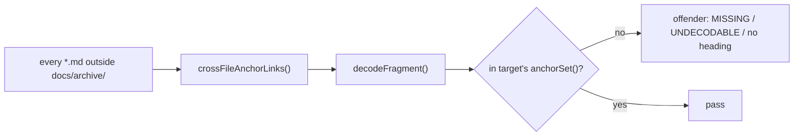

# PR Summary — Issue #3337: fix broken cross-file heading anchors; `githubSlug` keeps underscores

Closes #3337

## Summary

- `githubSlug` now keeps connector punctuation (`\p{Pc}`, e.g. `_`), as
  GitHub's `github-slugger` does (`worker/deno/lib/markdown_anchors.ts:41`).
- New `crossFileAnchorLinks()` and `decodeFragment()` helpers in the same
  module. They find every relative `*.md#fragment` link (inline links,
  the angle-bracket form, optional title, reference definitions) and skip
  fenced code blocks, inline code spans and URLs with a scheme.
- New repo-wide test `worker/deno/tests/cross_file_anchors_test.ts`. It
  checks every such link outside `docs/archive/` against its target's
  `anchorSet()`, using the decoded fragment.
- Every broken link is fixed: 56 at base → 46 after `\p{Pc}` → **0**.



## Evidence

GitHub's real rendered id, observed with:

```bash
gh api repos/stSoftwareAU/VibeCoder/contents/docs/CALLBACKS.md -H "Accept: application/vnd.github.html"
```

The output includes `id="user-content-host-level-failures--callbackshost_failure"`
and `id="user-content-migrating-from-fleet_health_dir--fleet_health_repo"`.
The underscore survives. The test
`githubSlug - connector punctuation (underscore) survives (Issue #3337)`
(`worker/deno/tests/markdown_anchors_test.ts:71`) pins that id.

Link fixes (old fragment → new fragment):

| File | Old | New |
|---|---|---|
| DESIGN-PRINCIPLES.md | `INTERNALS.md#1-worker-run-loop-and-process-lifecycle` | `#-1-worker-run-loop-and-process-lifecycle` |
| SECURITY.md | `CONFIGURATION.md#operational-defaults` | `#-internal-operational-constants` |
| SECURITY.md | `README.md#security` | `#-security` |
| docs/CONFIGURATION.md | `IDLE-TASK-FRAMEWORK.md#configuring-the-cadence--idle_task_cadence-issue-4011` | suffix `-issue-4011` dropped |
| docs/DEPLOYMENT.md | `#service-account-authentication-ssh--gh-auth` | leading `-` added |
| docs/HUMAN-PR-POLICY.md | LESSONS-LEARNT anchor | suffix `-issue-4074` dropped |
| docs/IDLE-TASK-FRAMEWORK.md | issue-processing tier-suppression anchor | `--a-suppressing…` |
| docs/IDLE-TASK-FRAMEWORK.md | `CONFIGURATION.md#%EF%B8%8F-idle-task-template-weights-issue-2401` | suffix `-issue-2401` dropped |
| docs/INTERNALS.md | workflows/README "one shared store" anchor | `#per-lane-worktrees-issue-394` |
| docs/OVERVIEW.md | `#clarification`, `../README.md#documentation` | leading `-` added |
| docs/PROMPTS.md, PROMPT-BEST-PRACTICES-CHECKLIST.md, PROMPT-HOUSE-VOCABULARY.md | `EXTENDING.md#prompt-templates` | `#-prompt-templates` |
| docs/SETUP.md | 9 `CONFIGURATION.md` anchors | leading `-` added |
| docs/SUPPLY-CHAIN-TRIAGE.md | tier-suppression anchor | `--` |
| docs/TROUBLESHOOTING.md | `milestones.md#decision-points-and-exceptions` | leading `-` added |
| docs/USAGE.md | `DEPLOYMENT.md#screenshot-support-setup` | leading `-` added |
| docs/workflows/README.md | `#documentation`, `pr-feedback.md#which-prs-are-monitored` | leading `-` added |
| docs/workflows/README.md | `projects-and-dependencies.md#workflow-labels` | `#%EF%B8%8F-workflow-labels` |
| docs/workflows/WORKED-EXAMPLE.md | pr-feedback priority anchors, `milestones.md#milestone-completion` | leading `-` added |
| docs/workflows/ci-fix.md | `CONFIGURATION.md#how-timeouts-interact` | `#%EF%B8%8F-how-timeouts-interact` |
| docs/workflows/issue-processing.md | `#clarification`, `#automatic-complexity…` | leading `-` added |
| docs/workflows/milestones.md | `#one-pr-per-target-branch-open-pr-blocking` | leading `-` added |
| docs/workflows/milestones.md | `#open-pr-blocking-does-not-apply-issue-500` | `#-open-pr-blocking-does-not-apply` |
| docs/workflows/resilience-and-concurrency.md | repository-scan-order, milestone-aware-repo-availability | leading `-` added |
| docs/workflows/projects-and-dependencies.md | same kind of fixes | leading `-` / `%EF%B8%8F` |

Docs sweep: grepped `githubSlug|anchorSet|headingSlugs|markdown_anchors` across
`*.md` (no hits outside `docs/archive/`) and across `worker/deno`. The callers
are `agents_md_pointer_anchors_test.ts`, `docs_provider_matrix_test.ts`,
`release_integrity_docs_test.ts`, `threat_model_docs_test.ts`,
`update_mode_docs_test.ts` and `markdown_anchors_test.ts`. None of them
describes the old underscore-stripping behaviour, and all pass. The module doc
in `worker/deno/lib/markdown_anchors.ts:10-31` was updated for `\p{Pc}`.
`docs/archive/` links were left as they are.

## Test Plan

- [x] `timeout 900 ./quality.sh < /dev/null` from the repo root: **PASSED**.
  Only `config integration` was skipped, because `.config.json` is absent.
- [x] Corpus: 455 cross-file fragment links in 274 files. Broken links went
  56 at base → 46 with `\p{Pc}` → 0 after the doc fixes.
- [x] Red checks. Each goal was removed on purpose and the named test went red:
  - Removing `\p{Pc}` fails the underscore test (`markdown_anchors_test.ts:71`).
  - Disabling the fence and code-span skips fails the skip table
    (`cross_file_anchors_test.ts:84`).
  - Restoring base `docs/SETUP.md` fails the sweep
    (`cross_file_anchors_test.ts:248`) with 9 offenders, e.g.
    `docs/SETUP.md:1597 CONFIGURATION.md#configuration-file (no heading produces this anchor)`.
  - Restoring the first INLINE link regex, which was quadratic on hostile
    input, fails the INLINE growth tests (`:128`, `:137`, `:146`). Measured
    157 ms → 2439 ms against an allowance of 1255 ms. The code-span and
    REF_DEF growth tests (`:155`, `:164`, `:173`) pass under both versions,
    because those patterns were already linear. They stay as guards.
- [x] `tests/cross_file_anchors_test.ts` uses `assertLinearGrowth`, so it is
  registered in `WALL_CLOCK_TEST_FILES`
  (`worker/deno/lib/parallel_unsafe_test_manifest.ts:196`). `check:manifests`
  passes.
- [x] No documentation-drift pins were added.

Branch outcomes:

- `worker/deno/lib/markdown_anchors.ts:162` scheme link → null: `crossFileAnchorLinks - skips…` (`cross_file_anchors_test.ts:84`). Flipping it went red.
- `markdown_anchors.ts:165` no `#` → null: same test, `:84`. Flipping it went red.
- `markdown_anchors.ts:169` non-`.md` target → null: same test, `:84`. Flipping it went red.
- `markdown_anchors.ts:170` empty fragment → null: same test, `:84`. Flipping it went red.
- `markdown_anchors.ts:159` angle-bracket destination unwrapped: `crossFileAnchorLinks - catches…` (`:34`). Flipping it went red.
- `markdown_anchors.ts:193-202` reference definition matched → recorded; then `continue`: `:34`. Flipping it went red.
- `markdown_anchors.ts:205` inline links: `:34`. Flipping it went red.
- `markdown_anchors.ts:72-78` fence toggle and skip: `:84`. Flipping it went red.
- `markdown_anchors.ts:147` code-span blanking: `:84`. Flipping it went red.
- `markdown_anchors.ts:227` decodes: `decodeFragment - decodes…` (`:107`). Flipping it went red.
- `markdown_anchors.ts:229` malformed → null: `decodeFragment - returns null…` (`:111`). Flipping it went red.
- `cross_file_anchors_test.ts` MISSING, UNDECODABLE and "no heading" offender
  arms: covered by the sweep's red run on base `docs/SETUP.md`
  (no-heading arm) and by `decodeFragment` (`:111`). MISSING and UNDECODABLE
  have no current corpus input. They are fail-loud reporting paths in the test
  itself, not production branches.

Callers checked (shared helper widened, not narrowed): `githubSlug`,
`headingSlugs` and `anchorSet` are used by `agents_md_pointer_anchors_test.ts`,
`docs_provider_matrix_test.ts`, `release_integrity_docs_test.ts`,
`threat_model_docs_test.ts`, `update_mode_docs_test.ts` and
`markdown_anchors_test.ts`. The change only *keeps* `_`, which no previously
passing heading slug relied on stripping. All of these pass in the gate.

Rule self-application: this PR adds no prompt or coding-standard rule. I read
the PR's own diff against the existing anchor and fence handling and found
nothing to change.

## Pre-PR Security Self-Check

- [x] Input validation: the new helpers take repository Markdown only.
  `decodeFragment` returns null for a malformed escape instead of throwing.
- [x] Every regex runs on Markdown text and was vetted for ReDoS. Each one has
  a hostile linear-growth case (`cross_file_anchors_test.ts:119-173`).
- [x] Secrets: no hidden or credential files are staged.
- [x] Injection surface: none. The code only reads files.
- [x] Path confinement: none added. Link targets resolve only to read docs in
  a test.
- [x] Dependencies: none added. `deno.lock` is unchanged.

🤖 Generated with [Claude Code](https://claude.com/claude-code)
